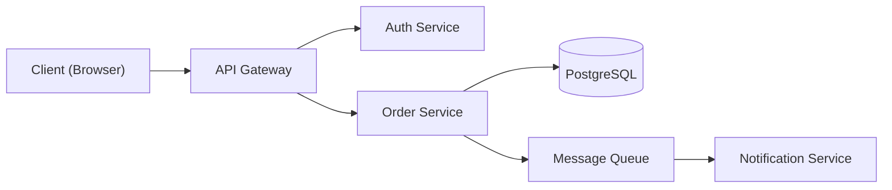

## Overview

System architecture design procedures including technical design documents,
API contract definition, database schema design, and architecture decision
records (ADRs). Provides step-by-step workflows for each deliverable.

---

# Architecture & Design

## When to Use

- Designing system architecture for new features or services
- Creating technical design documents (TDDs)
- Defining API contracts with OpenAPI
- Writing architecture decision records (ADRs)
- Designing database schemas and migration strategies

---

## 1. Procedure: Create a Technical Design Document

```
Step 1 — SCOPE: Define the problem statement and goals
   └─ What problem does this solve?
   └─ What are the non-goals (explicitly out of scope)?

Step 2 — CONTEXT: Document the current system state
   └─ Draw current architecture diagram (Mermaid)
   └─ List affected components and their ownership

Step 3 — PROPOSE: Design the solution
   └─ Draw proposed architecture diagram
   └─ Define component boundaries and responsibilities
   └─ Specify data flow between components
   └─ List new interfaces/contracts

Step 4 — ALTERNATIVES: Evaluate at least 2 alternatives
   └─ For each: describe approach, list pros/cons
   └─ State why the chosen solution wins

Step 5 — RISKS: Identify risks and mitigations
   └─ Performance, security, scalability, operational

Step 6 — PLAN: Define implementation milestones
   └─ Phase 1, Phase 2, etc. with acceptance criteria
```

### TDD Template

```markdown
# TDD: [Feature Name]
**Author:** [name] | **Date:** [ISO8601] | **Status:** Draft/Review/Approved

## 1. Problem Statement
[One paragraph describing the problem]

## 2. Goals / Non-Goals
| Goals | Non-Goals |
|-------|-----------|
| ... | ... |

## 3. Current Architecture
[Mermaid diagram of current state]

## 4. Proposed Design
[Mermaid diagram of proposed state]

### Component Responsibilities
| Component | Responsibility |
|-----------|---------------|
| ... | ... |

## 5. API Contracts
[OpenAPI snippet for new/changed endpoints]

## 6. Data Model Changes
[Schema changes, migrations]

## 7. Alternatives Considered
### Option A: [name]
- Pros: ...
- Cons: ...

### Option B: [name] (chosen)
- Pros: ...
- Cons: ...

## 8. Risks & Mitigations
| Risk | Likelihood | Impact | Mitigation |
|------|-----------|--------|------------|
| ... | ... | ... | ... |

## 9. Implementation Plan
| Phase | Deliverable | Acceptance Criteria |
|-------|------------|-------------------|
| 1 | ... | ... |
```

---

## 2. Procedure: Define an API Contract

```
Step 1 — List all endpoints (verb + path)
Step 2 — Define request schema (params, query, body) with Zod or JSON Schema
Step 3 — Define response schema for success (2xx) and errors (4xx, 5xx)
Step 4 — Specify authentication and authorization requirements
Step 5 — Document rate limits and pagination strategy
Step 6 — Write OpenAPI spec or TypeScript interface
```

### Example: API Contract

```typescript
// Endpoint: POST /api/v1/orders
// Auth: Bearer JWT (role: user)
// Rate limit: 10 req/min per user

interface CreateOrderRequest {
  items: Array<{
    productId: string;
    quantity: number;  // min: 1, max: 99
  }>;
  shippingAddress: {
    street: string;
    city: string;
    country: string;  // ISO 3166-1 alpha-2
    postalCode: string;
  };
}

interface CreateOrderResponse {
  id: string;
  status: 'pending';
  total: number;
  createdAt: string;  // ISO 8601
}

// Error responses:
// 400 — { error: string, details: ValidationIssue[] }
// 401 — { error: 'Unauthorized' }
// 429 — { error: 'Rate limit exceeded', retryAfter: number }
```

---

## 3. Procedure: Write an ADR

```
Step 1 — Identify the decision to record
   └─ "We need to choose between X and Y for Z"
Step 2 — Evaluate options with trade-off analysis
Step 3 — Record the decision using the template below
Step 4 — Save to docs/adr/ADR-{NNN}-{slug}.md
Step 5 — Link from the relevant TDD
```

### ADR Template

```markdown
# ADR-{NNN}: [Title]
**Date:** [ISO8601] | **Status:** Accepted | **Deciders:** [names]

## Context
[What prompted this decision?]

## Decision
[What was decided?]

## Consequences
### Positive
- ...

### Negative
- ...

### Neutral
- ...
```

---

## 4. Database Schema Design Checklist

| Check | Description |
|-------|-------------|
| Naming | snake_case for tables and columns |
| Primary keys | UUID v4 or ULID (not auto-increment for distributed) |
| Timestamps | `created_at` and `updated_at` on every table |
| Indexes | Index every foreign key and frequent query filter |
| Constraints | NOT NULL by default; explicit nullable with reason |
| Migrations | One migration per schema change; never modify existing |
| Soft deletes | Use `deleted_at` timestamp, not physical deletion |

---

## 5. Decision Tree: When to Create a TDD

```
Is the change >100 lines of code?
├─ YES → Write a TDD
└─ NO → Does it add a new API endpoint?
    ├─ YES → Write a TDD
    └─ NO → Does it change data models?
        ├─ YES → Write a TDD
        └─ NO → Does it cross module boundaries?
            ├─ YES → Write a TDD
            └─ NO → Skip TDD (document in PR description)
```

---

## 6. Architecture Diagram Conventions

Use Mermaid for all diagrams. Standard node types:



| Element | Mermaid Syntax |
|---------|---------------|
| Service | `ServiceName["Display Name"]` |
| Database | `DB[(Database Name)]` |
| Queue | `Queue{{"Queue Name"}}` |
| External | `Ext>"External System"]` |

---

## Resources

See the `references/` directory for:
- Technical design document templates (chunk-01 through chunk-04)
- API contract definition guide
- Database schema patterns

## Rules

- Follow the conventions defined in this skill
- Apply these patterns consistently across all relevant code
