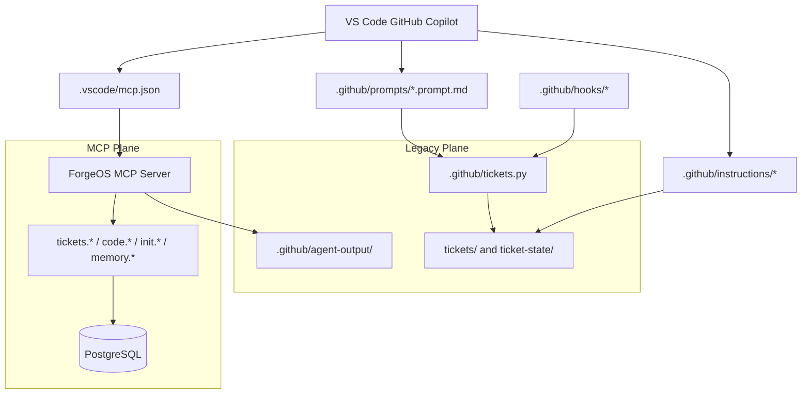

# Architecture Reconstruction

Date: 2026-04-14
Scope: Current control-plane reconstruction for ForgeOS MCP and Copilot orchestration

## Reconstructed Current Architecture

## What Exists Today

### Operator Entry Points

- VS Code connects to ForgeOS MCP through `.vscode/mcp.json`.
- Copilot prompt packs and repo instructions still route operators toward the filesystem/CLI model.

### Runtime Services

- `forgeos-server/src/server.ts` provides the HTTP MCP endpoint and surrounding REST and SSE services.
- `forgeos-server/src/tools/index.ts` defines the server’s actual tool contract.

### Data Stores

- PostgreSQL stores ticket lifecycle state for the MCP plane.
- Filesystem ticket JSON and stage directories still exist and are still named in the authoritative operator guidance.
- `.github/agent-output/` remains part of the active context path because `tickets.payload` reads from it.

## Architectural Contradictions

| Area | Intended Model | Actual Model | Impact |
|------|----------------|--------------|--------|
| Control plane | MCP + PostgreSQL | MCP + PostgreSQL + filesystem CLI | Operators can bypass MCP |
| Ticket context | `tickets.payload` | File-derived context remains authoritative in instructions | Copilot boot path is inconsistent |
| VS Code setup | Safe project or user config | Checked-in dev bearer config | Security and drift risk |
| Tool contract | Docs match code | README tool names drift from registered tool names | MCP feels unreliable |
| Summary handoff | Server-owned context | `tickets.payload` still reads `.github/agent-output` | Partial cutover only |
| Dispatch ownership | Single orchestrator | Server tools exist, legacy dispatch model remains | No enforceable “always MCP” rule |

## Control-Plane Ownership Reconstruction

### MCP Plane Owns

- Ticket lifecycle primitives
- Codebase orientation and search primitives
- Memory/lesson retrieval primitives
- Health/readiness and event streaming

### Legacy Plane Still Owns or Influences

- Default operator instructions
- Prompt behavior for `/start`, `/continue`, `/takeover`, `/stop`
- Session-start hook behavior
- Some fallback client behavior
- Upstream summary storage path

## Refactor Zones

### Zone A: Authoritative operator surfaces

- `.github/prompts/*.prompt.md`
- `.github/instructions/core.instructions.md`
- `.github/instructions/ticket-system.instructions.md`
- `.github/instructions/agent-behavior.instructions.md`
- `.github/instructions/git-protocol.instructions.md`

These files determine whether Copilot uses MCP or ignores it.

### Zone B: Identity and trust boundary

- `forgeos-server/src/tools/tickets-claim.ts`
- `forgeos-server/src/tools/tickets-complete.ts`
- other ticket mutation handlers
- `.vscode/mcp.json`

These files determine whether MCP is safe enough to require by default.

### Zone C: Contract drift

- `forgeos-server/src/tools/index.ts`
- `forgeos-server/README.md`
- SDK/client wrappers

These files determine whether MCP feels reliable to operators and Copilot.

### Zone D: Artifact ownership

- `forgeos-server/src/tools/tickets-payload.ts`
- `.github/agent-output/`

These files determine whether MCP fully owns agent context assembly.

## Recommendation

Do not do a full product rewrite.

Do a control-plane rewrite with narrow scope:

1. Make the MCP contract the only supported operator path
2. Move identity enforcement into the authenticated request path
3. Remove legacy fallbacks from default behavior
4. Keep `tickets.py` only as explicit migration/import-export tooling
5. Make docs and prompts generated from the actual registered tool inventory

## Evidence

- `forgeos-server/src/server.ts`
- `forgeos-server/src/tools/index.ts`
- `forgeos-server/src/tools/tickets-payload.ts`
- `.vscode/mcp.json`
- `.github/prompts/start.prompt.md`
- `.github/prompts/continue.prompt.md`
- `.github/prompts/takeover.prompt.md`
- `.github/instructions/core.instructions.md`
- `.github/instructions/agent-behavior.instructions.md`
- `docs/operations/mcp-cutover-guide.md`