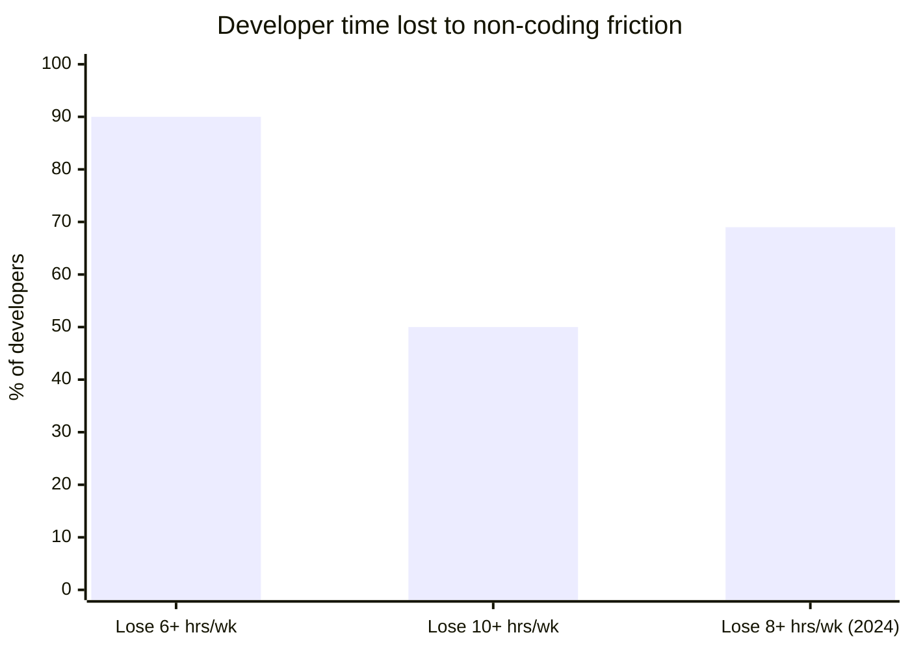
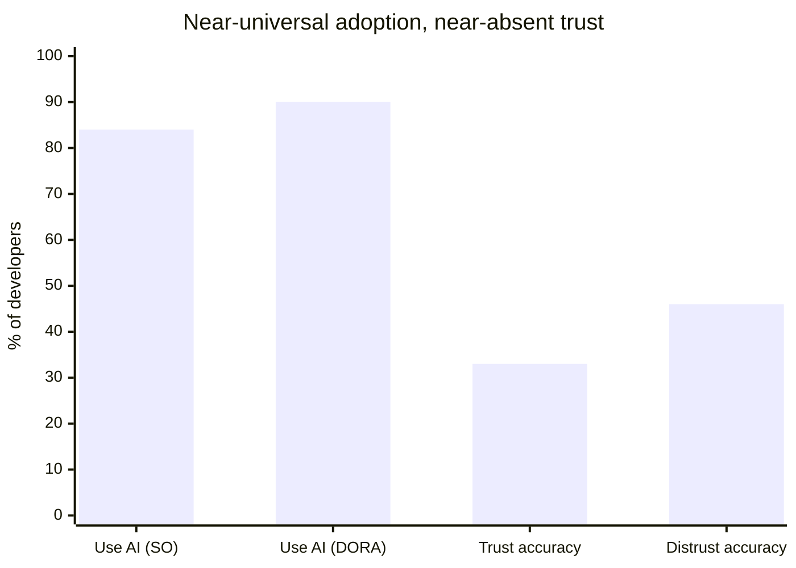
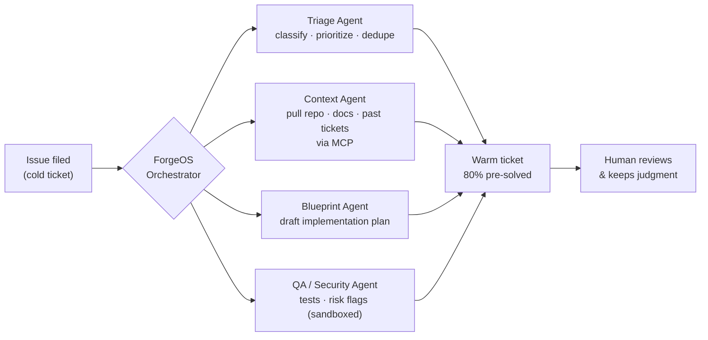
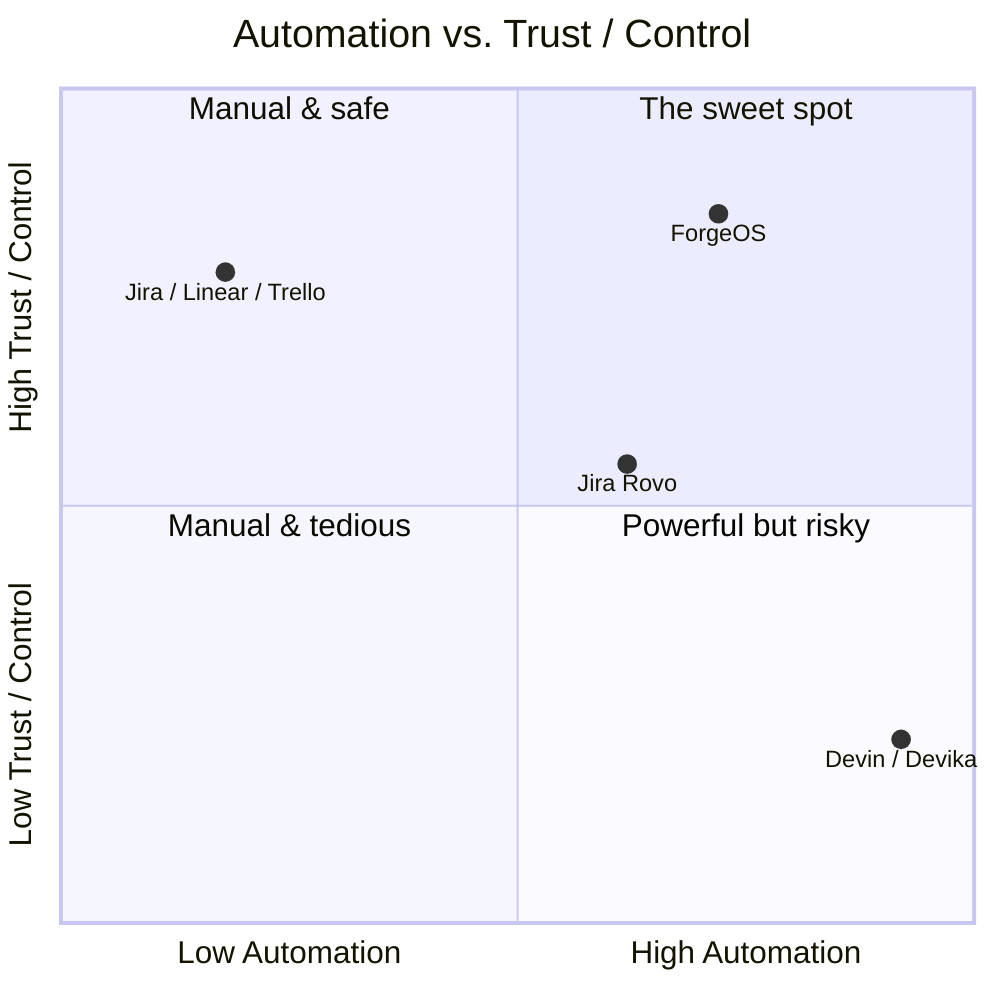
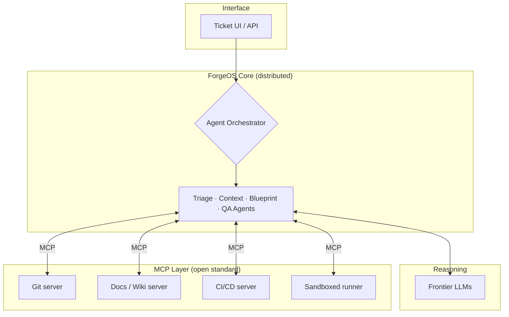

## Slide 1 — Title (Idea Name)

- **Idea Name:** **ForgeOS**
- **One-line description:**
  > _An AI-native ticketing system where autonomous agents triage, gather codebase
  > context, and draft the work — so engineers open tickets that are already 80%
  > solved, not blank._
- **Theme:** Developer Tools / AI Engineering Operations
- **Team Name:** _[your team name]_
- **Team Members:** _[names + roles]_

**Visual:** logo + the one-liner on the hero slide (template already styled).

---

## Slide 2 — Problem Description

### Engineers are paid to code. They spend a full day a week *not* coding.

**Who faces this?** Every software engineering team — from 5-person startups to
500-engineer orgs. Issues land "cold": no context, no repro steps, no codebase
links. The engineer becomes a manual archaeologist before writing line one.

**Why it matters:**

- **90% of developers lose 6+ hours every week** to organizational friction —
  *finding information* (docs, APIs, services), *context switching between tools*,
  and *cross-team coordination*. Half lose **10+ hours/week.**
  — [Atlassian State of Developer Experience 2025](https://www.atlassian.com/blog/developer/developer-experience-report-2025) (n=3,500, 6 countries)
- That overhead costs a **500-engineer org ~$6.9M per year.**
  — [Atlassian 2024](https://www.atlassian.com/blog/developer/developer-experience-report-2024)
- Today's AI doesn't fix it: gains **collapse to <10% on complex tasks**, because
  current tools help you *type code faster*, not *understand the problem faster.*
  — [McKinsey Digital, 2023](https://www.mckinsey.com/capabilities/tech-and-ai/our-insights/unleashing-developer-productivity-with-generative-ai)

**Visual — where the week goes (infographic):**

---

## Slide 3 — Research & Insights

### AI adoption is universal. AI *trust* is broken. That's the opening.

**Key statistics**

- AI dev tools are now near-universal:
  - **84%** of devs use or plan to use AI — [Stack Overflow Developer Survey 2025](https://survey.stackoverflow.co/2025/ai/) (n=49,000+)
  - **90%** use AI at work — [DORA 2025](https://dora.dev/dora-report-2025/) (n≈5,000)
  - **73%** of open-source devs use AI; free Copilot hit **1M+ users at 100% YoY growth** — [GitHub Octoverse 2024](https://github.blog/news-insights/octoverse/octoverse-2024/)
- **The trust paradox (our wedge):**
  - Only **33% trust AI accuracy** vs. **46% who actively distrust it**; just **3% highly trust** output — [Stack Overflow 2025](https://survey.stackoverflow.co/2025/ai/)
  - **#1 frustration: "AI that's almost right, but not quite" (66%)**; **45% say debugging AI code takes *longer*** — [Stack Overflow 2025](https://survey.stackoverflow.co/2025/ai/)
  - **30% have little/no trust in AI-generated code** — [DORA 2025](https://dora.dev/dora-report-2025/)

**Insight:** Developers don't want *more autonomy* — they want *verifiable,
in-context* AI. The winner does the grunt work invisibly while keeping a human in
control. **ForgeOS automates context-gathering and prep, not final judgment.**

**Visual — adoption vs. trust gap:**

---

## Slide 4 — Proposed Solution

### ForgeOS: every ticket arrives pre-investigated.

**Brief explanation:** The moment an issue is filed, a swarm of MCP-powered agents
runs *before a human opens the ticket* — turning a cold ticket into a warm,
evidence-backed starting point. The human reviews and keeps judgment.

**3 key features / capabilities**

1. **Autonomous Triage & Context** — agents classify, prioritize, de-duplicate, and
   auto-attach the relevant codebase, docs, and past tickets (killing the proven
   "finding information" tax).
2. **Code Blueprint Drafting** — an agent drafts an initial implementation plan /
   code blueprint — a *reviewable starting point*, not a black-box auto-merge.
3. **Pre-emptive QA & Security Checks** — sandboxed agents run automated tests and
   flag risks up front, so problems surface before human time is spent.

**Visual — agent orchestration flow:**

---

## Slide 5 — Users & Competition

### Trackers are too passive. Autonomous SWEs are too risky. We own the middle.

**Target users:** engineering teams (10–500 devs) drowning in ticket overhead —
startups to mid-size product orgs that feel the context-switching tax daily.

**What exists today & the gap:**

| Category | Examples | Why it falls short |
|---|---|---|
| **Passive trackers** | Jira, Linear, Trello | Smart databases — **100% manual**. They *store* the problem; the human does all the investigation. |
| **Autonomous AI SWEs** | Devin, Devika | End-to-end black boxes aiming to *replace* the engineer. On rigorous benchmarks top agents solve only **~23% of real tasks** ([SWE-Bench Pro, 2025](https://arxiv.org/html/2509.16941v1)); too opaque to merge unsupervised. |
| **Incumbent agentic** | Jira Rovo | Validates our category (Readiness Checker, ticket-to-code) — but **closed, single-vendor, bolted onto a legacy passive DB** ([Jira AI](https://www.atlassian.com/software/jira/ai)). |

**How ForgeOS differs — 3 bullets:**

1. **Orchestration, not replacement** — agents prep the work; the human keeps
   judgment. Solves the **46%-distrust** gap that sinks Devin.
2. **Open & MCP-native, not walled** — distributed agents over an open protocol
   (10,000+ MCP servers) vs. Rovo's vendor lock-in.
3. **Context-first, not code-first** — we attack the proven **$6.9M/yr
   information-finding cost**, not just autocomplete.

**Visual — market positioning (2×2):**

---

## Slide 6 — Technologies Used

### Built on open standards, not a closed black box.

- **Model Context Protocol (MCP)** — the open agent-to-tool standard our agents
  speak. **10,000+ active public servers, ~97M monthly SDK downloads** by Dec 2025;
  adopted across **ChatGPT, Cursor, Gemini, Microsoft Copilot & VS Code**; governance
  now under the Linux Foundation. — [Anthropic, 2025](https://www.anthropic.com/news/donating-the-model-context-protocol-and-establishing-of-the-agentic-ai-foundation)
- **Distributed multi-agent orchestration layer** — specialized agents
  (Triage / Context / Blueprint / QA) coordinated as a fault-tolerant distributed
  system; agents are swappable and decoupled.
- **Frontier LLMs** (Claude / GPT-class) for reasoning, retrieval, and code drafting.
- **MCP servers for retrieval** — Git, file systems, internal wikis, CI/CD — so
  agents pull real codebase context instead of guessing.
- **Sandboxed execution** for safe automated QA/security checks before anything
  reaches a human.

**Visual — system architecture:**

---

## Slide 7 — What We Need Feedback On

**Biggest assumption:** Teams will trust agent-prepared tickets *enough to act on
them* — i.e., warm tickets actually reduce rework and cycle time, instead of adding
a layer of AI output humans must re-verify (the "almost right" tax — 66% top
frustration).

**Biggest challenge:** **Multi-agent reliability & error-compounding.** On rigorous
benchmarks top agents solve only **~23% of real-world tasks (SWE-Bench Pro)**, and
errors compound across agent handoffs. Plus agents touching your codebase create a
real security surface (prompt injection, over-broad permissions) and hit
context-window limits on large repos.

**Questions for mentors / judges:**

1. **Where should the human-in-the-loop checkpoint sit** — at triage, at blueprint,
   or at QA — to stay trustworthy without becoming a rubber stamp?
2. **What guardrail / least-privilege model** would make you comfortable letting
   agents *read and act on* production code?
3. **Which feature do we lead with for an MVP** — autonomous context-gathering
   (lowest risk, clearest ROI) or code-blueprint drafting (highest wow factor)?

---

## Appendix — Verified sources (covers the final-round "3+ sources" requirement)

| # | Source | Used for |
|---|---|---|
| 1 | [Atlassian State of Developer Experience 2025](https://www.atlassian.com/blog/developer/developer-experience-report-2025) | Time lost to friction (90% / 50%) |
| 2 | [Atlassian 2024](https://www.atlassian.com/blog/developer/developer-experience-report-2024) | $6.9M/yr cost · 69% lose 8+ hrs |
| 3 | [McKinsey — Unleashing Developer Productivity with Gen AI](https://www.mckinsey.com/capabilities/tech-and-ai/our-insights/unleashing-developer-productivity-with-generative-ai) | Gains collapse on complex work |
| 4 | [Stack Overflow Developer Survey 2025](https://survey.stackoverflow.co/2025/ai/) | 84% adoption · trust paradox |
| 5 | [DORA 2025](https://dora.dev/dora-report-2025/) | 90% use AI · 30% distrust code |
| 6 | [GitHub Octoverse 2024](https://github.blog/news-insights/octoverse/octoverse-2024/) | 73% OSS adoption |
| 7 | [Atlassian Jira AI / Rovo](https://www.atlassian.com/software/jira/ai) | Competitor — agentic incumbent |
| 8 | [Anthropic — MCP to the Linux Foundation](https://www.anthropic.com/news/donating-the-model-context-protocol-and-establishing-of-the-agentic-ai-foundation) | MCP adoption (10k+ servers) |
| 9 | [SWE-Bench Pro (arXiv 2509.16941)](https://arxiv.org/html/2509.16941v1) | ~23% agent reliability |

> ⚠️ **Q&A caution:** the SWE-Bench Pro ~23% figures are Sept 2025; the leaderboard
> moved up substantially by mid-2026. Frame it as *"the reliability gap that
> justifies human-in-the-loop,"* not as current state-of-the-art.

---

## Rendering notes

- **Mermaid** diagrams render natively in Google Slides via add-ons (e.g.
  "Mermaid" / "Diagrams"), in Notion, GitHub, and [mermaid.live](https://mermaid.live)
  (export PNG/SVG → paste into the deck).
- The `xychart-beta` bar charts may not render in older Mermaid versions — if so,
  rebuild them as native Google Slides bar charts using the same numbers, or paste a
  PNG exported from mermaid.live.
