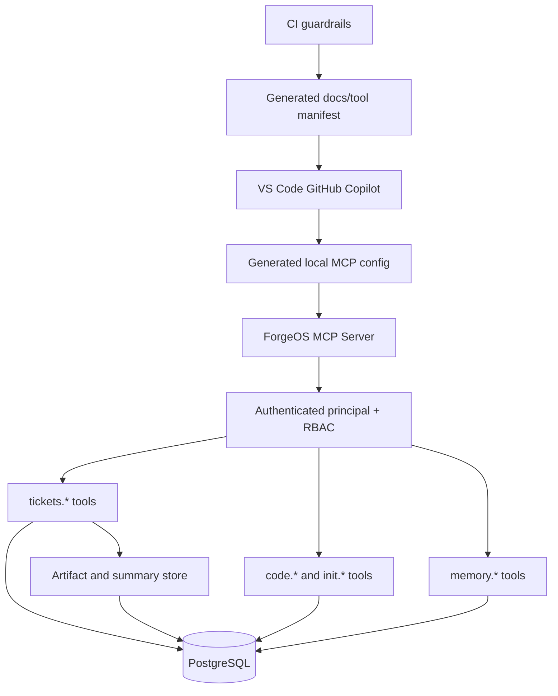

# Target Architecture

Date: 2026-04-14
Scope: MCP-first orchestration for VS Code GitHub Copilot

## Architecture Decision

ForgeOS MCP should be the sole operational control plane for ticket lifecycle, context retrieval, and operator workflows.

The filesystem ticket model should remain only as an explicit migration/import-export path during the cutover window.

## Target-State Principles

1. One source of truth for ticket lifecycle state
2. One operator path for Copilot-driven work
3. One authenticated identity model for mutation tools
4. One published tool contract generated from actual registration code
5. No silent fallback to filesystem state in normal operation

## Target Architecture

## Key Changes From Current State

### 1. VS Code config becomes generated, not hardcoded

- The repo should not commit a live admin bearer.
- Setup should generate or prompt for local MCP credentials.

### 2. Ticket mutations use authenticated principal only

- `agent_name` becomes descriptive metadata at most, not a trust anchor.
- Claim/update/complete/release all validate against authenticated caller identity.

### 3. `tickets.payload` becomes fully control-plane-owned

- Upstream summaries and agent artifacts move into a server-owned store.
- Agents stop reading `.github/agent-output` as part of normal runtime context assembly.

### 4. Prompt and instruction layer becomes MCP-only

- Active prompts call `tickets.next`, `tickets.claim`, `tickets.get`, `tickets.payload`, `tickets.complete`, `tickets.reject`, `tickets.extend`, and `tickets.release`.
- Legacy CLI references are moved to explicit migration or admin documentation only.

### 5. Contract generation becomes automatic

- README tool inventory is generated from `forgeos-server/src/tools/index.ts`.
- SDK wrappers are validated against the same generated manifest.

### 6. CI guards cutover integrity

- New changes fail if active prompts or authoritative instructions reintroduce `tickets.py` or `ticket-state` as the normal operator path.

## Phased Rollout

### Phase A: Stabilize operator path

- Rewrite prompts, hooks, and core instructions
- Add VS Code setup and doctor flow

### Phase B: Stabilize security model

- Principal-bound mutation handlers
- Remove checked-in admin bearer
- Add negative auth and impersonation tests

### Phase C: Stabilize contract ownership

- Generated tool manifest and aligned SDK wrappers
- CI enforcement against contract drift

### Phase D: Finish cutover

- Move summary storage into the control plane
- Disable default filesystem fallback
- Archive legacy guidance

## Acceptance Criteria

- Copilot operator prompts no longer reference repo-root `tickets.py`
- `tickets.payload` is documented and used as the standard context bootstrap
- Workspace setup no longer depends on a committed dev admin bearer
- Tool docs and tool registration match exactly
- CI prevents regression to legacy operational paths

## Evidence

- `.vscode/mcp.json`
- `forgeos-server/src/tools/index.ts`
- `forgeos-server/src/tools/tickets-payload.ts`
- `.github/prompts/start.prompt.md`
- `.github/prompts/continue.prompt.md`
- `.github/prompts/takeover.prompt.md`
- `docs/operations/mcp-cutover-guide.md`