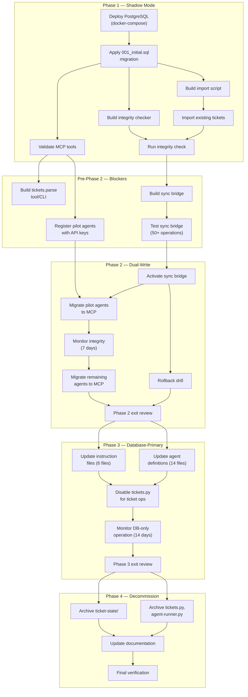

# ADR-003: Dual-Mode Migration Strategy

> **Ticket:** FORGEOS-ARCH004 | **Agent:** Architect | **Date:** 2026-03-07
> **Status:** PROPOSED
> **Confidence:** HIGH (89%)
> **Deciders:** Architecture team
> **Evidence Base:** FORGEOS-RES009 (System Gap Analysis), FORGEOS-RES012 (Migration Tooling Evaluation)

---

## Table of Contents

1. [Status](#1-status)
2. [Context](#2-context)
3. [Decision](#3-decision)
4. [Migration Phases](#4-migration-phases)
5. [Data Consistency Guarantees](#5-data-consistency-guarantees)
6. [Rollback Strategy](#6-rollback-strategy)
7. [Performance Impact Assessment](#7-performance-impact-assessment)
8. [Risk Assessment](#8-risk-assessment)
9. [Well-Architected Pillar Assessment](#9-well-architected-pillar-assessment)
10. [Fitness Functions](#10-fitness-functions)
11. [Consequences](#11-consequences)
12. [Context Map](#12-context-map)
13. [DAG Task Graph](#13-dag-task-graph)
14. [References](#14-references)
15. [Glossary](#15-glossary)

---

## 1. Status

**PROPOSED** — 2026-03-07

Related ADRs:
- [ADR-001: PostgreSQL as Primary State Store](adr-001-postgresql.md) (FORGEOS-ARCH002)
- [ADR-002: MCP as Agent Communication Protocol](adr-002-mcp-protocol.md) (FORGEOS-ARCH003)

Related Architecture:
- [Database Schema Architecture](../database-schema.md) (FORGEOS-ARCH005)
- [System Component Architecture](../system-components.md) (FORGEOS-ARCH001)

Related Product Requirements:
- [Non-Functional and Migration Requirements](../../product/nfr-migration-reqs.md) (FORGEOS-PM003)

---

## 2. Context

### 2.1 Problem Statement

ForgeOS must migrate from a file-based ticket state machine to a PostgreSQL-backed distributed system (per [ADR-001](adr-001-postgresql.md)) while the existing system continues operating. The migration cannot be performed as a big-bang cutover because:

1. **Self-hosting constraint:** The file-based system is currently building its own replacement. Tickets for the distributed platform are managed by `tickets.py` and `agent-runner.py`.
2. **Zero-downtime requirement:** 14 agents across multiple machines actively process tickets. Any interruption halts the SDLC pipeline.
3. **Correctness verification:** The new system must be proven equivalent to the old before decommissioning. Running both systems in parallel enables comparison.
4. **Rollback safety:** If the PostgreSQL system exhibits defects, the file-based system must remain available as a fallback.

### 2.2 Current State

| Component | Implementation | Role |
|-----------|---------------|------|
| `tickets.py` (999 lines) | Python CLI + JSON files | Ticket state machine, dependency resolution, integrity validation |
| `agent-runner.py` (673 lines) | Python CLI + Git operations | Two-commit protocol (CLAIM + WORK), distributed locking via `git push` |
| `todo_visual.py` (1010 lines) | Python CLI + HTML generation | Terminal dashboard, HTML dashboard, Mermaid dependency graph |
| `.github/ticket-state/` | 11 stage directories | File-based state machine (ticket state = directory location) |
| `.github/tickets/` | Master JSON files | Source of truth for ticket metadata |
| `.github/agent-output/` | Markdown summaries | Summary handoff chain between SDLC stages |

### 2.3 Target State

| Component | Implementation | Role |
|-----------|---------------|------|
| ForgeOS MCP Server | Node.js / Express / `@modelcontextprotocol/sdk` | 11 MCP tools for ticket lifecycle |
| PostgreSQL 17 | 7 tables, 10 stored functions, RLS, LISTEN/NOTIFY | ACID state management, distributed locking, audit trail |
| Web Dashboard | Express static serving + SSE | Real-time operator visibility |
| Agent Clients | MCP JSON-RPC over Streamable HTTP | Tool-based ticket operations |

### 2.4 Migration Complexity Summary

From [System Gap Analysis (FORGEOS-RES009)](../../research/system-gap-analysis.md):

| Complexity | Count | Examples |
|------------|-------|---------|
| Low | 22 capabilities | Ticket CRUD, claim/release, dependency resolution, SDLC flow enforcement |
| Medium | 7 capabilities | Summary handoff, terminal dashboard, HTML dashboard, DOT graph |
| High | 2 capabilities | L3 markdown parser, two-commit protocol migration |
| Critical | 1 capability | Two-commit protocol removal (fundamental workflow change for all 14 agents) |

### 2.5 Decision Drivers

| Driver | Priority | Description |
|--------|----------|-------------|
| Zero data loss | Critical | No ticket state may be lost during migration |
| Continuous operation | Critical | Agents must continue processing tickets throughout migration |
| Verifiable correctness | High | Both systems must produce identical results during parallel operation |
| Bounded rollback window | High | Rollback must be possible within 7 days of dual-mode activation |
| Minimal agent disruption | High | Agent workflow changes should be phased, not simultaneous |
| Performance parity or improvement | Medium | PostgreSQL operations must be no slower than file-based operations |

---

## 3. Decision

**Adopt a four-phase dual-mode migration strategy: Shadow Mode → Dual-Write → Database-Primary → File Decommission.**

During migration, both the file-based system and the PostgreSQL-backed system operate simultaneously. The migration progresses through defined phases, each with measurable entry/exit criteria and a rollback path. At no point does a phase transition occur without verification that all exit criteria are met.

### 3.1 Core Principles

1. **Strangler Fig pattern:** New functionality routes through the PostgreSQL system. Legacy components are incrementally replaced, never all at once.
2. **Read from new, write to both:** During dual-write phases, the database is the source of truth for reads. Writes propagate to both systems.
3. **Automated integrity verification:** A reconciliation process continuously compares file and database state, alerting on any divergence.
4. **Phase gates are human-approved:** No automated promotion from one phase to the next. Each phase transition requires human review of exit criteria evidence.
5. **Rollback is always possible** until the point of no return (Phase 4 start).

### 3.2 Phase Summary

| Phase | Name | Duration | Primary System | File System Role | Rollback Cost |
|-------|------|----------|---------------|-----------------|---------------|
| 1 | Shadow Mode | 1–2 weeks | File-based | **Primary** (all operations) | Trivial (disable shadow reads) |
| 2 | Dual-Write | 1–2 weeks | Transitioning | **Co-primary** (writes to both) | Low (stop dual-write, revert to files) |
| 3 | Database-Primary | 1–2 weeks | PostgreSQL | **Backup** (read-only sync) | Medium (export DB to files, re-enable file ops) |
| 4 | File Decommission | 1 week | PostgreSQL | **Removed** | High (requires full DB export + file regeneration) |

---

## 4. Migration Phases

### 4.1 Phase 1: Shadow Mode

**Objective:** Deploy and validate the PostgreSQL system without affecting production ticket operations.

#### 4.1.1 Description

The file-based system remains the sole production system. The PostgreSQL database is deployed alongside it, populated with a one-time import of all existing ticket data. Agent operations continue through `tickets.py` and `agent-runner.py` exclusively.

A shadow read process periodically compares the database snapshot against the file state to validate data import accuracy and schema correctness.

#### 4.1.2 Entry Criteria

| Criterion | Verification |
|-----------|-------------|
| PostgreSQL 17 deployed via `docker-compose.yml` | `docker compose ps` shows healthy postgres container |
| Schema migration (`001_initial.sql`) applied successfully | `npm run migrate` exits 0; all 7 tables, 10 functions created |
| ForgeOS MCP Server starts and passes health check | `GET /health` returns 200 with `{"status":"ok"}` |
| All 11 MCP tools respond to valid and invalid inputs | Integration test suite for each tool passes |
| Import script created and tested in dev environment | Script converts `.github/tickets/*.json` → `INSERT INTO tickets` |

#### 4.1.3 Operations During Phase

| Operation | System Used | Details |
|-----------|------------|---------|
| Ticket claiming | `agent-runner.py` (file + git push) | No change |
| Ticket advancing | `tickets.py --advance` / `agent-runner.py` | No change |
| Dependency resolution | `tickets.py --sync` | No change |
| Dashboard | `todo_visual.py` | No change |
| Database population | Import script (one-time) | Bulk import all ticket JSON to PostgreSQL |
| Comparison | Integrity check script (daily) | Compare file state vs database state, report discrepancies |
| MCP tool validation | Development/staging only | Test MCP tools against the populated database |

#### 4.1.4 Data Flow

```
┌─────────────────────────────────────────────────────────┐
│                  PRODUCTION (unchanged)                  │
│                                                         │
│  Agent ──► agent-runner.py ──► git push ──► ticket JSON │
│                                    │                    │
│                           tickets.py --sync             │
│                                    │                    │
│                              ticket-state/              │
└──────────────────────────┬──────────────────────────────┘
                           │ (one-time import + periodic compare)
┌──────────────────────────▼──────────────────────────────┐
│                 SHADOW (read-only)                       │
│                                                         │
│  Import Script ──► PostgreSQL ◄── Integrity Checker     │
│                        │                                │
│                   MCP Server (dev/test only)             │
└─────────────────────────────────────────────────────────┘
```

#### 4.1.5 Exit Criteria

| Criterion | Measurement | Threshold |
|-----------|-------------|-----------|
| Import accuracy | Field-by-field comparison of all tickets | Zero discrepancies across all fields listed in NFR MIG-03 |
| MCP tool correctness | Each tool produces expected results for ≥10 test scenarios | 100% pass rate |
| Database performance | MCP tool response times under simulated load | P95 ≤ 200 ms for write operations (NFR-P07) |
| Schema integrity | `001_initial.sql` applies cleanly in a fresh database | Idempotent re-run exits 0 |
| Import script reliability | Re-import produces identical database state | Checksum comparison of all rows matches |
| Operational readiness | Docker compose starts all services without manual intervention | `docker compose up -d` completes in ≤ 60 seconds |

#### 4.1.6 Phase 1 Rollback

**Cost:** Trivial.
**Procedure:** Stop PostgreSQL and MCP server containers. Delete the database. No production impact — the file-based system was never modified.

```bash
docker compose down -v   # Remove containers and volumes
# Production continues unchanged via tickets.py + agent-runner.py
```

---

### 4.2 Phase 2: Dual-Write

**Objective:** Route ticket operations through the MCP server while maintaining file-based state as a synchronized backup.

#### 4.2.1 Description

Agents begin using MCP tools (`tickets.claim`, `tickets.complete`, `tickets.reject`, etc.) for ticket lifecycle operations. A **synchronization bridge** propagates every database state change back to the file system, keeping `tickets.py` and the `ticket-state/` directories current. Both systems are co-primary: the database handles operations, the files mirror the results.

Git operations continue for code delivery only — `git add`, `git commit`, `git push` are used exclusively for source code, not ticket state.

#### 4.2.2 Entry Criteria

| Criterion | Verification |
|-----------|-------------|
| Phase 1 exit criteria all met | Documented evidence for each criterion |
| Sync bridge implemented and tested | Bridge converts DB events → file JSON updates; tested with ≥50 operations |
| Agent authentication deployed | At least 2 agents registered with API keys in the `agents` table |
| Human approval for Phase 2 activation | Explicit sign-off recorded in `.github/memory-bank/decisionLog.md` |
| Integrity check automation deployed | Cron job runs every 6 hours, alerts on discrepancy > 0 |

#### 4.2.3 The Synchronization Bridge

The sync bridge is the critical component of Phase 2. It ensures that every ticket state change in the database is reflected in the file system.

**Architecture:**

```
┌────────────────────────────────────────────────────────────────┐
│                     DUAL-WRITE FLOW                            │
│                                                                │
│  Agent ──► MCP Server ──► PostgreSQL (primary)                 │
│                               │                                │
│                          pg_notify()                           │
│                               │                                │
│                     ┌─────────▼──────────┐                     │
│                     │   Sync Bridge      │                     │
│                     │  (Event Listener)  │                     │
│                     └─────────┬──────────┘                     │
│                               │                                │
│               ┌───────────────┼───────────────┐                │
│               ▼               ▼               ▼                │
│     .github/tickets/   ticket-state/    git add + commit       │
│     (master JSON)      (stage dirs)     (state sync commit)    │
│                                                                │
│  ◄── Integrity Checker (every 6 hours) ──►                     │
└────────────────────────────────────────────────────────────────┘
```

**Sync Bridge Behavior:**

| Event | Bridge Action |
|-------|--------------|
| `CREATED` | Write new JSON to `.github/tickets/{ticket_id}.json` and `.github/ticket-state/READY/{ticket_id}.json` |
| `CLAIMED` | Update master JSON with `claimed_by`, `machine_id`, `operator`, `lease_expiry` |
| `STAGE_ADVANCED` | Move JSON from old `ticket-state/{old_stage}/` to `ticket-state/{new_stage}/`. Update master JSON. |
| `STAGE_REJECTED` | Move JSON back to implementation stage directory. Update `rework_count` in master JSON. |
| `RELEASED` | Clear claim fields in master JSON and state JSON. |
| `LEASE_EXTENDED` | Update `lease_expiry` in master JSON and state JSON. |
| `SPAWNED` | Write new ticket JSON to master and appropriate state directory. |

**Sync Bridge Constraints:**

1. The bridge writes files atomically (write to temp file, then rename).
2. The bridge commits file changes via scoped `git add` + `git commit` (never `git add .`).
3. Commit message format: `[SYNC] {event_type} for {ticket_id} — bridge sync`.
4. If a bridge write fails, the bridge logs the failure at ERROR level and retries up to 3 times with exponential backoff.
5. If retries are exhausted, the bridge alerts via structured log and the integrity checker will detect the divergence.

#### 4.2.4 Agent Workflow Changes

| Current Workflow | Phase 2 Workflow | Change Required |
|------------------|------------------|-----------------|
| `agent-runner.py --claim-only` (git CLAIM commit) | `tickets.claim` via MCP | Agent calls MCP tool instead of git commit |
| `agent-runner.py --complete` (git WORK commit) | `tickets.complete` via MCP + `git commit` (code only) | Split: MCP for state, git for code |
| `tickets.py --advance` | `tickets.complete` via MCP | CLI command replaced by MCP tool |
| `tickets.py --rework` | `tickets.reject` via MCP | CLI command replaced by MCP tool |
| `tickets.py --sync` | Automatic (DB triggers) | No manual sync needed |
| `tickets.py --status` | `tickets.stats` via MCP or web dashboard | CLI replaced by MCP tool / web |
| Summary handoff via `.github/agent-output/` files | Hybrid: files continue + evidence stored in `metadata` JSONB | Both work; gradual shift to DB |

#### 4.2.5 Operations During Phase

| Operation | Primary System | Backup System | Notes |
|-----------|---------------|---------------|-------|
| Ticket claiming | MCP (`tickets.claim`) | File sync via bridge | Database `SKIP LOCKED` replaces git-push locking |
| Ticket advancing | MCP (`tickets.complete`) | File sync via bridge | Database stored function replaces git WORK commit |
| Code delivery | Git (`git add`, `git commit`, `git push`) | N/A | Git remains for code — no change |
| Dependency resolution | Automatic (DB `resolve_dependencies()`) | Bridge triggers `tickets.py --sync` on DONE | Both resolve; DB is truth |
| Dashboard | Web dashboard (preferred) + `todo_visual.py` (available) | Both operational | Web dashboard adds SSE real-time updates |
| Integrity check | Automated every 6 hours | Manual `tickets.py --validate` on demand | Alert on any discrepancy |

#### 4.2.6 Exit Criteria

| Criterion | Measurement | Threshold |
|-----------|-------------|-----------|
| Agent adoption | Count of agents using MCP tools vs file-based | ≥12 of 14 agents using MCP tools |
| Sync bridge reliability | Successful sync events / total events | ≥ 99.5% success rate over 7 days |
| Data integrity | Integrity check discrepancy count | Zero discrepancies for 7 consecutive days |
| Claim contention rate | Failed claims / total claim attempts | ≤ 5% failure rate (NFR trigger) |
| Performance | MCP tool response times | P50 ≤ 50 ms, P95 ≤ 200 ms, P99 ≤ 500 ms (NFR-P01–P03) |
| Rollback drill | Timed rollback execution | Completes in ≤ 30 minutes |
| Operational stability | Days without critical incidents | ≥ 7 consecutive days |
| Human approval | Phase 3 sign-off | Recorded in `.github/memory-bank/decisionLog.md` |

#### 4.2.7 Phase 2 Rollback

**Cost:** Low.
**Procedure:**

1. Write `STOP` to `.github/guardian/STOP_ALL`.
2. Wait for all active claims to complete or expire (≤ 30 min lease).
3. Run integrity check — resolve any discrepancies (DB → files).
4. Stop MCP server and sync bridge.
5. Reconfigure agents to use `agent-runner.py` and `tickets.py`.
6. Run `tickets.py --sync` to re-resolve all dependencies.
7. Run `tickets.py --validate` to confirm file state integrity.
8. Clear `STOP` from guardian file.
9. Resume agents with file-based workflow.

**Estimated time:** 15–30 minutes.

---

### 4.3 Phase 3: Database-Primary

**Objective:** Promote PostgreSQL to sole operational system. File system becomes a read-only backup.

#### 4.3.1 Description

The database is the single source of truth for all ticket operations. The sync bridge continues to write file state for backup and rollback capability, but the file system is no longer read by agents or `tickets.py` for operational purposes. All agent definitions and instruction files are updated to reference MCP tools instead of the two-commit protocol.

#### 4.3.2 Entry Criteria

| Criterion | Verification |
|-----------|-------------|
| Phase 2 exit criteria all met | Documented evidence for each criterion |
| All 14 agents using MCP tools exclusively | Agent configuration audit confirms no agent uses `agent-runner.py` for ticket ops |
| Instruction files updated (draft) | All 6 instruction files have draft revisions removing two-commit protocol references |
| Agent definition files updated (draft) | All 14 `.agent.md` files have draft revisions referencing MCP tools |
| Sync bridge stable for ≥ 7 days | Bridge log review shows no failures or retries in 7 days |
| Human approval for Phase 3 activation | Explicit sign-off recorded |

#### 4.3.3 Operations During Phase

| Operation | Primary System | Backup | Notes |
|-----------|---------------|--------|-------|
| All ticket lifecycle operations | MCP tools (PostgreSQL) | File sync (write-only backup) | Files are not read for decisions |
| Code delivery | Git | N/A | Unchanged |
| Dashboard | Web dashboard | N/A | `todo_visual.py` no longer used |
| Dependency resolution | DB `resolve_dependencies()` trigger | N/A | `tickets.py --sync` disabled |
| Integrity check | Every 24 hours (reduced frequency) | N/A | Files are backup, not co-primary |

#### 4.3.4 Agent Definition Changes

The two-commit protocol references in agent definitions and instruction files are replaced:

| Current Reference | New Reference |
|------------------|--------------|
| "Commit 1 (CLAIM) by dispatcher" | "Dispatcher calls `tickets.claim` MCP tool" |
| "Commit 2 (WORK) by subagent" | "Subagent calls `tickets.complete` with evidence, then `git commit` for code only" |
| "`git push` = distributed lock" | "Database `SELECT FOR UPDATE SKIP LOCKED` = atomic lock" |
| "`tickets.py --advance`" | "`tickets.complete` MCP tool" |
| "State = directory location" | "State = `stage` column in `tickets` table" |
| "Summary handoff via agent-output files" | "Evidence stored in ticket `metadata` JSONB (file summaries optional)" |

#### 4.3.5 Exit Criteria

| Criterion | Measurement | Threshold |
|-----------|-------------|-----------|
| Database-only operation | Days without file-system reads for ticket operations | ≥ 14 consecutive days |
| Updated instruction files merged | All 6 instruction files updated | 100% updated |
| Updated agent definitions merged | All 14 `.agent.md` files updated | 100% updated |
| `tickets.py` unused | No invocations of `tickets.py` for ticket operations in logs | Zero invocations for 7 days |
| `agent-runner.py` unused | No invocations for ticket lifecycle (code commits still allowed) | Zero ticket-lifecycle invocations for 7 days |
| Performance sustained | Continue meeting NFR-P01 through NFR-P09 | All targets met |
| Human approval for Phase 4 | Explicit sign-off recorded | Recorded |

#### 4.3.6 Phase 3 Rollback

**Cost:** Medium.
**Procedure:**

1. Write `STOP` to `.github/guardian/STOP_ALL`.
2. Export current database state to JSON:
   ```bash
   psql -h localhost -U forgeos -d forgeos -c \
     "SELECT row_to_json(t) FROM tickets t" > /tmp/db-export.json
   ```
3. Run reconciliation script: compare DB export against `.github/tickets/` files.
4. For tickets with DB-only changes, update file JSON and place in correct `ticket-state/` directory.
5. Revert instruction files and agent definitions to pre-Phase-3 versions.
6. Stop MCP server and sync bridge.
7. Run `tickets.py --sync` and `tickets.py --validate`.
8. Clear `STOP` from guardian file.
9. Resume agents with file-based + dual-mode workflow (return to Phase 2).

**Estimated time:** 30–60 minutes.

---

### 4.4 Phase 4: File Decommission

**Objective:** Remove file-based ticket state management entirely. PostgreSQL is the sole system.

#### 4.4.1 Description

The sync bridge is disabled. File-based state directories (`ticket-state/`) are archived and removed from the working tree. `tickets.py` and `agent-runner.py` are archived (retained in git history) but removed from active use. This is the **point of no return** — rollback after this phase requires full database export and file regeneration.

#### 4.4.2 Entry Criteria

| Criterion | Verification |
|-----------|-------------|
| Phase 3 exit criteria all met | Documented evidence |
| Full database backup taken | `pg_dump` completed and verified |
| WAL archiving enabled | WAL segments shipping to backup storage |
| All agent definitions finalized | No references to file-based state in any `.agent.md` |
| All instruction files finalized | No references to `ticket-state/`, `tickets.py` (for ticket ops), or two-commit protocol |
| Human approval for Phase 4 (point of no return) | Explicit sign-off from project owner |

#### 4.4.3 Decommission Steps

1. Disable the sync bridge process.
2. Archive `ticket-state/` directories:
   ```bash
   tar -czf ticket-state-archive-$(date +%Y%m%d).tar.gz .github/ticket-state/
   git rm -r .github/ticket-state/
   ```
3. Archive legacy scripts:
   ```bash
   git rm .github/tickets.py .github/agent-runner.py
   # Retained in git history for reference
   ```
4. Remove legacy references from `agents.md`, `README.md`, and other documentation.
5. Update `.github/copilot-instructions.md` to reflect the new architecture.
6. Commit and push all changes.

#### 4.4.4 Exit Criteria

| Criterion | Measurement | Threshold |
|-----------|-------------|-----------|
| No file-based state directories | `ls .github/ticket-state/` returns error | Directories removed |
| Legacy scripts archived | `tickets.py`, `agent-runner.py` not in working tree | Absent from `git ls-files` |
| All documentation updated | Grep for `ticket-state/`, `tickets.py` in docs | Zero references to legacy operations |
| Database is sole state store | All agents operate via MCP for ≥ 7 days post-decommission | Zero operational issues |
| Backup procedures validated | Database backup + restore tested | Restore produces identical state |

#### 4.4.5 Phase 4 Rollback

**Cost:** High.
**Procedure:**

1. Export all database state to JSON matching the legacy file format.
2. Regenerate `ticket-state/` directories from exported data.
3. Restore `tickets.py` and `agent-runner.py` from git history.
4. Revert instruction files and agent definitions from git history.
5. Run `tickets.py --sync` and `tickets.py --validate`.

**Estimated time:** 60–120 minutes. This procedure is significantly more complex and error-prone than earlier phase rollbacks. It should only be executed as a last resort.

---

## 5. Data Consistency Guarantees

### 5.1 Consistency Model Per Phase

| Phase | Consistency Model | Source of Truth | Lag Budget |
|-------|-------------------|-----------------|------------|
| Phase 1 (Shadow) | Eventual (one-time import) | File system | Import is a snapshot; lag grows until Phase 2 |
| Phase 2 (Dual-Write) | Near-real-time synchronization | Database (writes) → Files (sync bridge) | ≤ 5 seconds per event |
| Phase 3 (DB-Primary) | Database authoritative; files are stale backup | Database | Files may lag by up to 24 hours |
| Phase 4 (Decommissioned) | Single-system consistency | Database | N/A (no files) |

### 5.2 Dual-Write Consistency Protocol (Phase 2)

During Phase 2, consistency is maintained through the following protocol:

**Write Path:**
1. Agent calls MCP tool (e.g., `tickets.claim`).
2. PostgreSQL stored function executes atomically within a transaction.
3. `pg_notify('ticket_changes', ...)` fires on commit.
4. Sync bridge receives notification event.
5. Bridge writes updated ticket JSON to file system.
6. Bridge commits file changes to git with scoped `git add`.

**Consistency Invariants:**
- **INV-1:** Every successful database write MUST produce a corresponding file write within 5 seconds. Violation triggers an integrity alert.
- **INV-2:** The database is authoritative. If a file and database disagree, the database wins.
- **INV-3:** No agent reads file state for operational decisions during Phase 2. File state is informational/backup only.
- **INV-4:** The integrity checker compares all fields listed in [NFR §8.1](../../product/nfr-migration-reqs.md#81-verification-criteria).

**Conflict Resolution:**
Conflicts are impossible by design because:
- Only the database receives writes (agents use MCP tools).
- The sync bridge is the sole writer to files.
- No agent writes ticket state via `tickets.py` or `agent-runner.py` during Phase 2.

If a conflict does occur (indicating a protocol violation), the integrity checker flags it and the database version is considered authoritative.

### 5.3 Integrity Verification Schedule

| Phase | Frequency | Method | Alert Threshold |
|-------|-----------|--------|-----------------|
| Phase 1 | Daily | Full comparison (import snapshot vs files) | Any discrepancy |
| Phase 2 | Every 6 hours | Full field-by-field comparison (NFR MIG-03) | Any discrepancy > 0 |
| Phase 3 | Every 24 hours | Spot-check of 10% of tickets | Any critical field mismatch |
| Phase 4 | N/A | Database-internal integrity (constraints, FK checks) | N/A |

### 5.4 Event Ordering Guarantees

PostgreSQL's `LISTEN/NOTIFY` delivers events in commit order within a single channel. The sync bridge processes events sequentially from the `ticket_changes` channel, preserving the total order of state transitions.

If the bridge restarts, it replays unprocessed events by querying the `events` table for entries with `created_at >` the bridge's last processed timestamp. This ensures no event is lost during bridge restarts.

---

## 6. Rollback Strategy

### 6.1 Rollback Decision Matrix

| Trigger Condition | Severity | Phase 1 Action | Phase 2 Action | Phase 3 Action | Phase 4 Action |
|-------------------|----------|----------------|----------------|----------------|----------------|
| Database unreachable > 5 min | Critical | Ignore (shadow) | Rollback to Phase 1 | Rollback to Phase 2 | Restore DB from backup |
| Data integrity discrepancy | High | Investigate only | Fix or rollback to Phase 1 | Fix or rollback to Phase 2 | Fix DB directly |
| Claim failure rate > 5% | High | N/A | Rollback to Phase 1 | Rollback to Phase 2 | Fix DB directly |
| Agent unable to complete lifecycle | High | N/A | Rollback to Phase 1 | Rollback to Phase 2 | Fix or restore |
| P99 latency > 500 ms sustained | Medium | Investigate | Monitor; rollback if > 10 min | Monitor; rollback if > 10 min | Performance tuning |
| Sync bridge failure (1 event) | Low | N/A | Retry; integrity check | Retry; log warning | N/A |
| Sync bridge failure (> 10 events) | Medium | N/A | Investigate; consider rollback | Reduce sync to daily | N/A |

### 6.2 Rollback Summary

| Phase | Rollback Target | Cost | Time | Data Loss Risk |
|-------|----------------|------|------|----------------|
| Phase 1 → None | Disable shadow DB | Trivial | < 5 min | None |
| Phase 2 → Phase 1 | Stop MCP, re-enable file-based ops | Low | 15–30 min | None (files are current) |
| Phase 3 → Phase 2 | Export DB state, reconcile files, re-enable dual-write | Medium | 30–60 min | Low (files may be slightly stale) |
| Phase 4 → Phase 3 | Full DB export, regenerate files, restore scripts | High | 60–120 min | Low (DB is authoritative) |

### 6.3 Rollback Window

| Metric | Value | Rationale |
|--------|-------|-----------|
| Maximum rollback to file-based | 7 days from Phase 2 start | After 7 days, file-system state diverges too far for confident reconciliation |
| Recommended rollback decision | Within 48 hours of issue detection | Faster rollback = less divergence |
| Point of no return | Phase 4 start | File-based state is archived; rollback requires regeneration |
| Rollback drill required | Once during Phase 2 | Verify procedure works before it is needed |

---

## 7. Performance Impact Assessment

### 7.1 Expected Performance Changes

| Operation | File-Based Latency | Database Latency | Change | Basis |
|-----------|-------------------|------------------|--------|-------|
| Ticket claim | 500–2000 ms (git push RTT) | ≤ 50 ms P50 (NFR-P01) | **10–40x faster** | `SELECT FOR UPDATE SKIP LOCKED` on LAN |
| Ticket advance | 500–2000 ms (git push) | ≤ 50 ms P50 (NFR-P06) | **10–40x faster** | Single SQL function call |
| Dependency resolution | 1–5 seconds (file scan O(n)) | ≤ 30 ms P50 (NFR-P04) | **30–170x faster** | Indexed SQL query + trigger-based auto-resolve |
| Status dashboard | 2–8 seconds (file scan + render) | ≤ 100 ms P50 (NFR-P05) | **20–80x faster** | SQL aggregation with GROUP BY |
| Integrity check | N/A (periodic `--validate`) | Continuous (DB constraints) | **Eliminated** | FK, CHECK, UNIQUE constraints always active |

### 7.2 Performance Overhead During Dual-Write

Phase 2 introduces write amplification: every database write triggers a sync bridge file write + git commit. This impacts:

| Impact Area | Overhead | Mitigation |
|-------------|----------|-----------|
| Sync bridge latency | 1–3 seconds per event (file write + git commit) | Bridge is asynchronous; does not block MCP response |
| Git history size | ~1 KB per sync commit | Squash sync commits weekly; or use a separate sync branch |
| Disk I/O | Additional file writes | Negligible on modern SSDs |
| Git push contention | Sync bridge pushes may conflict with agent code pushes | Bridge retries with pull --rebase; separate branch if needed |

### 7.3 Resource Overhead

| Resource | Phase 1 | Phase 2 | Phase 3 | Phase 4 |
|----------|---------|---------|---------|---------|
| CPU | +5% (MCP server idle) | +10% (MCP server + bridge) | +5% (MCP server, no bridge) | +5% (MCP server only) |
| Memory | +256 MB (PostgreSQL + Node.js) | +300 MB (+ bridge process) | +256 MB | +256 MB |
| Disk | +100 MB (database) | +150 MB (DB + duplicate file state) | +100 MB | +100 MB (files removed) |
| Network | Negligible | +10% (MCP traffic + DB traffic) | +5% | +5% |

---

## 8. Risk Assessment

### 8.1 Migration Risks

| Risk | Severity | Likelihood | Impact | Mitigation |
|------|----------|-----------|--------|-----------|
| **Sync bridge data loss** — Bridge drops events during restart | High | Unlikely | File state diverges from DB | Bridge replays from `events` table on restart; integrity checker catches gaps |
| **Agent protocol confusion** — Agents mix file-based and MCP ops | High | Likely (during Phase 2 transition) | Inconsistent state | Clear phase communication; agent config flag; `agent-runner.py` disabled in Phase 2 for ticket ops |
| **Git push contention** — Sync bridge conflicts with agent code pushes | Medium | Possible | Temporary sync delay | Bridge uses retry with `--rebase`; consider dedicated sync branch |
| **Performance regression** — Dual-write overhead exceeds expectations | Medium | Unlikely | Slower ticket operations | Bridge is async; monitor latency; skip sync for non-critical events if needed |
| **Schema migration failure** — `001_initial.sql` fails on production data | Medium | Unlikely | Phase 1 blocked | Tested extensively in shadow mode; migration is idempotent |
| **L3 parser gap** — TODO agent cannot create tickets via MCP | High | Certain | TODO agent workflow blocked | Build `tickets.parse` MCP tool or standalone import CLI before Phase 2 |
| **Summary handoff disruption** — Agents expect file summaries that bridge doesn't create | Medium | Possible | Broken agent context chain | Hybrid approach: files continue alongside DB metadata during Phase 2–3 |
| **Rollback data divergence** — Files drift too far from DB after 7 days | Medium | Possible | Rollback unreliable | Enforce 7-day rollback window; integrity check every 6 hours |

### 8.2 Blocking Prerequisites

These must be resolved before Phase 2 begins:

1. **L3 markdown parser tool** — TODO agent depends on L3 parsing. A `tickets.parse` MCP tool or standalone CLI must exist.
2. **Agent authentication** — MCP tools require API key auth. At least 2 agents must be registered.
3. **Sync bridge implementation** — The bridge must be tested with ≥ 50 operations before production use.
4. **Integrity check script** — Automated comparison tool must be functional and tested.

---

## 9. Well-Architected Pillar Assessment

| Pillar | Score | Assessment |
|--------|-------|-----------|
| **Operational Excellence** | 8/10 | Phased migration enables incremental validation. Integrity checks provide continuous verification. Rollback procedures documented for every phase. Deduction: sync bridge adds operational complexity during Phase 2. |
| **Security** | 8/10 | MCP authentication + RLS replaces convention-based security. API keys + bcrypt hashing. No new attack surface — MCP server runs on same network. Deduction: bridge git commits may expose ticket metadata in git history during Phase 2. |
| **Reliability** | 9/10 | Every phase has a rollback path. Dual-write ensures no single point of failure during transition. DB constraints provide always-on integrity vs periodic `--validate`. Deduction: sync bridge is a SPOF during Phase 2 (mitigated by integrity checker). |
| **Performance** | 9/10 | Database operations are 10–40x faster than git-push-based operations. Dual-write overhead is asynchronous and bounded. P99 targets defined and measurable. Deduction: Phase 2 write amplification adds minor latency to file system operations. |
| **Cost Optimization** | 8/10 | PostgreSQL + Node.js MCP server adds ~256 MB memory. No external services or paid tooling required. Migration tooling is TypeScript-native per [FORGEOS-RES012](../../research/migration-tooling.md). Deduction: developer time for sync bridge and integrity tools. |
| **Sustainability** | 8/10 | Migration eliminates technical debt (file-based state machine). Final state is a well-documented, ACID-compliant system. TypeScript-native tooling aligns with team skills. Deduction: 4–6 week migration period requires sustained attention. |

**Total:** 50/60 (83%)

---

## 10. Fitness Functions

Measurable thresholds that must hold throughout the migration and after completion:

| Fitness Function | Target | Measurement | Phase |
|-----------------|--------|-------------|-------|
| Claim latency P99 | ≤ 500 ms | Load test (50 concurrent agents) | Phase 2+ |
| Data integrity discrepancies | 0 | Automated integrity check | Phase 1–3 |
| Sync bridge event success rate | ≥ 99.5% | Bridge metrics log | Phase 2–3 |
| Agent adoption rate | 100% (14/14) on MCP | Agent configuration audit | Phase 2 exit |
| Rollback execution time | ≤ 30 minutes (Phase 2), ≤ 60 min (Phase 3) | Timed rollback drill | Phase 2–3 |
| Zero ticket-state directory reads | 0 file reads for operational decisions | Code audit + monitoring | Phase 3+ |
| MCP tool availability | 99.5% uptime | Health check monitoring | Phase 2+ |
| Database backup freshness | ≤ 5 minutes (WAL), ≤ 24 hours (pg_dump) | Backup monitoring | Phase 1+ |

---

## 11. Consequences

### 11.1 Positive Consequences

| Consequence | Impact |
|-------------|--------|
| **Continuous operation** | Agents never experience downtime; migration is invisible to the SDLC pipeline. |
| **Verified correctness** | Running both systems in parallel proves the new system produces identical results before decommissioning the old one. |
| **Bounded risk** | Each phase has a defined rollback path. Risk escalates gradually, never all at once. |
| **Performance improvement** | Claim latency improves 10–40x immediately upon Phase 2 activation. |
| **Eliminates technical debt** | Post-migration, the file-based state machine, git-push locking, and periodic sync are all eliminated. |
| **Enables new capabilities** | File-level mutex, real-time SSE, agent authentication, and multi-project support become available. |

### 11.2 Negative Consequences

| Consequence | Impact | Mitigation |
|-------------|--------|-----------|
| **4–6 week migration timeline** | Extended period of dual-system operation requires sustained attention. | Clear phase gates prevent scope creep; each phase is 1–2 weeks. |
| **Sync bridge complexity** | A new component that must be implemented, tested, and operated during Phase 2. | Bridge is temporary; decommissioned in Phase 4. Keep it simple — event listener + file writer. |
| **Documentation churn** | All 6 instruction files and 14 agent definitions must be updated. | Phase 3 includes documentation update as an exit criterion. |
| **Learning curve** | Operators must learn MCP tool semantics and database operations. | MCP tools mirror existing CLI command semantics (by design). |
| **Git history pollution** | Sync bridge commits add noise to git log during Phase 2. | Use squash strategy or dedicated sync branch. |

### 11.3 Risks Accepted

| Risk | Acceptance Rationale |
|------|---------------------|
| 7-day rollback window may be insufficient | 7 days provides one full sprint for evaluation. Integrity checks every 6 hours catch issues early. |
| Sync bridge as single point of failure during Phase 2 | Bridge failure does not affect database operations; only file backup is delayed. Integrity checker detects gaps. |
| Point of no return at Phase 4 | By Phase 4, the system will have operated on PostgreSQL for 3–5 weeks with ≥ 14 days of database-primary operation. This provides high confidence. |

---

## 12. Context Map

### 12.1 Primary Files (Directly Affected by This ADR)

| File | Role | Phase Affected |
|------|------|---------------|
| `.github/tickets.py` | Legacy ticket state machine (being replaced) | Phase 2–4 |
| `.github/agent-runner.py` | Legacy two-commit protocol (being replaced) | Phase 2–4 |
| `todo_visual.py` | Legacy dashboard (being replaced) | Phase 3–4 |
| `.github/ticket-state/` (11 directories) | File-based state machine | Phase 3–4 (archived) |
| `.github/tickets/*.json` | Master ticket files | Phase 2–3 (sync bridge writes) |
| `forgeos-server/src/tools/` | MCP tool handlers | Phase 1 (validation target) |
| `forgeos-server/src/db/migrations/001_initial.sql` | Schema DDL | Phase 1 (deployment target) |
| `.github/instructions/*.instructions.md` (6 files) | System rules | Phase 3 (update two-commit references) |
| `.github/agents/*.agent.md` (14 files) | Agent definitions | Phase 3 (update workflow references) |
| `docs/architecture/adr/adr-003-migration-strategy.md` | This document | All phases |

### 12.2 Secondary Files (Indirectly Affected)

| File | Role | Relevance |
|------|------|-----------|
| `forgeos-server/src/server.ts` | Express app factory | SSE endpoint consumed by dashboard |
| `forgeos-server/src/config.ts` | Environment configuration | Database connection settings |
| `forgeos-server/docker-compose.yml` | Container orchestration | PostgreSQL deployment |
| `.github/guardian/STOP_ALL` | Emergency halt | Used in rollback procedures |
| `.github/memory-bank/activeContext.md` | Cross-session memory | Migration progress tracking |
| `.github/memory-bank/decisionLog.md` | Decision log | Phase transition approvals |

### 12.3 New Components Required

| Component | Purpose | Effort | Phase |
|-----------|---------|--------|-------|
| Import script | Bulk-import ticket JSON to PostgreSQL | 1–2 days | Phase 1 |
| Sync bridge | Propagate DB events → file system | 2–3 days | Phase 2 |
| Integrity checker | Automated file-vs-DB comparison | 1–2 days | Phase 1 |
| `tickets.parse` MCP tool (or CLI) | L3 markdown batch parsing → DB ticket creation | 2–3 days | Pre-Phase 2 |
| Reconciliation script | DB export → file regeneration for rollback | 1 day | Phase 2 |

### 12.4 Established Patterns

| Pattern | Evidence | Impact |
|---------|----------|--------|
| Stored function encapsulation | All 10 business logic functions in PL/pgSQL | Migration maintains this — no change |
| Scoped git add (no `git add .`) | All instruction files mandate this | Sync bridge follows same convention |
| Guardian halt mechanism | `STOP_ALL` file controls agent activity | Used in rollback procedures |
| Memory gate (activeContext.md) | Required before DONE | Migration progress tracked here |
| Event sourcing (append-only events) | Events table is INSERT-only | Sync bridge replays from events on restart |

---

## 13. DAG Task Graph

### 13.1 Implementation Ordering



### 13.2 Critical Path

```
T1 → T2 → T3 → T5 → T7 → T10 → T11 → T12 → T13 → T14 → T15 → T17 → T18/T19 → T20 → T21 → T22 → T23/T24 → T25 → T26
```

**Critical path length:** 19 steps across 4–6 weeks.

### 13.3 Parallelizable Work

| Group | Tasks | Dependencies |
|-------|-------|-------------|
| Phase 1 parallel | T3 (import script) ∥ T4 (integrity checker) ∥ T6 (MCP validation) | All depend on T2 only |
| Pre-Phase 2 parallel | T8 (tickets.parse) ∥ T9 (agent registration) | Both depend on T6 |
| Phase 2 parallel | T16 (rollback drill) ∥ T14 (integrity monitoring) | Both start at T12 |
| Phase 3 parallel | T18 (instruction files) ∥ T19 (agent defs) | Both start at T17 |
| Phase 4 parallel | T23 (archive dirs) ∥ T24 (archive scripts) | Both start at T22 |

---

## 14. References

| Document | Ticket | Relevance |
|----------|--------|-----------|
| [System Gap Analysis](../../research/system-gap-analysis.md) | FORGEOS-RES009 | 32 capabilities mapped, migration complexity rated, 4-phase strategy defined |
| [Migration Tooling Evaluation](../../research/migration-tooling.md) | FORGEOS-RES012 | TypeScript-native migration tooling recommended; custom runner enhancement path |
| [ADR-001: PostgreSQL as Primary State Store](adr-001-postgresql.md) | FORGEOS-ARCH002 | Decision to use PostgreSQL with stored functions, `SKIP LOCKED`, RLS |
| [ADR-002: MCP as Agent Communication Protocol](adr-002-mcp-protocol.md) | FORGEOS-ARCH003 | Decision to use MCP JSON-RPC for agent-server communication |
| [Database Schema Architecture](../database-schema.md) | FORGEOS-ARCH005 | Full schema design: 7 tables, 10 functions, RLS, triggers |
| [System Component Architecture](../system-components.md) | FORGEOS-ARCH001 | Modular monolith architecture, MCP tool layer, deployment topology |
| [Non-Functional and Migration Requirements](../../product/nfr-migration-reqs.md) | FORGEOS-PM003 | Performance targets, migration acceptance criteria, rollback plan, integrity verification |
| [PG Distributed Locking](../../research/pg-distributed-locking.md) | FORGEOS-RES005 | `SELECT FOR UPDATE SKIP LOCKED` semantics and benchmarks |
| [PG Connection Pooling](../../research/pg-connection-pooling.md) | FORGEOS-RES006 | Pool sizing guidance for concurrent agent load |
| [PG Transaction Isolation](../../research/pg-transaction-isolation.md) | FORGEOS-RES007 | READ COMMITTED sufficiency for ForgeOS operations |

---

## 15. Glossary

| Term | Definition |
|------|-----------|
| **Dual-mode operation** | Running file-based and database-backed systems simultaneously during migration |
| **Shadow mode** | Phase where the new system runs alongside the old but does not serve production traffic |
| **Dual-write** | Phase where writes go to both database and file system simultaneously |
| **Sync bridge** | Component that propagates database state changes to the file system during dual-write |
| **Strangler Fig pattern** | Migration pattern where new system incrementally replaces old system at the boundary |
| **Point of no return** | Phase 4 start; after which rollback to file-based system requires full reconstruction |
| **Integrity checker** | Automated tool that compares file-based and database ticket state field-by-field |
| **Write amplification** | Additional writes caused by dual-write strategy (one logical write becomes two physical writes) |
| **SKIP LOCKED** | PostgreSQL `SELECT FOR UPDATE` modifier enabling non-blocking work-stealing queues |
| **Lease** | Time-limited claim on a ticket; expired leases make tickets reclaimable |
| **RLS** | Row-Level Security; PostgreSQL feature restricting row access based on session policies |
| **MCP** | Model Context Protocol; JSON-RPC-based agent communication protocol used by ForgeOS |
