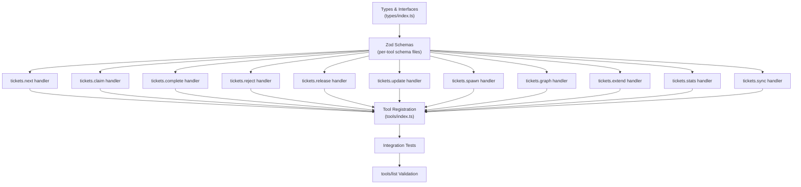

# ForgeOS MCP Tool Definition Schemas

> **Ticket:** FORGEOS-ARCH009 | **Agent:** Architect | **Date:** 2026-03-07
> **Confidence:** HIGH (92%) | **Status:** APPROVED

---

## Table of Contents

0. [Related Documents](#related-documents)
1. [Overview](#1-overview)
2. [Context Map](#2-context-map)
3. [MCP Tool Registration Pattern](#3-mcp-tool-registration-pattern)
4. [Tool Definitions](#4-tool-definitions)
   - 4.1 [tickets.next](#41-ticketsnext)
   - 4.2 [tickets.claim](#42-ticketsclaim)
   - 4.3 [tickets.complete](#43-ticketscomplete)
   - 4.4 [tickets.reject](#44-ticketsreject)
   - 4.5 [tickets.release](#45-ticketsrelease)
   - 4.6 [tickets.update](#46-ticketsupdate)
   - 4.7 [tickets.spawn](#47-ticketsspawn)
   - 4.8 [tickets.graph](#48-ticketsgraph)
   - 4.9 [tickets.extend](#49-ticketsextend)
   - 4.10 [tickets.stats](#410-ticketsstats)
   - 4.11 [tickets.sync](#411-ticketssync)
5. [Error Response Schema](#5-error-response-schema)
6. [ForgeOS Error Codes](#6-forgeos-error-codes)
7. [Tool Annotations](#7-tool-annotations)
8. [Well-Architected Assessment](#8-well-architected-assessment)
9. [ADR-ARCH009-01: Tool Naming Convention](#9-adr-arch009-01-tool-naming-convention)
10. [ADR-ARCH009-02: Error Propagation Strategy](#10-adr-arch009-02-error-propagation-strategy)
11. [DAG Task Graph](#11-dag-task-graph)
12. [Fitness Functions](#12-fitness-functions)

---

## Related Documents

| Document | Relationship |
|----------|-------------|
| [System Component Architecture](../system-components.md) | Defines the MCP Server component that hosts these tools |
| [Database Schema Architecture](../database-schema.md) | Defines stored functions invoked by tool handlers |
| [ADR-001: PostgreSQL as Primary State Store](../adr/adr-001-postgresql.md) | Explains why tools use PostgreSQL stored functions |
| [ADR-002: MCP as Agent Communication Protocol](../adr/adr-002-mcp-protocol.md) | Justifies MCP as the protocol for tool invocation |
| [OpenAPI REST Specification](./openapi-spec.yaml) | Complementary REST API for operators (non-MCP) |
| [MCP Protocol Specification](../../research/mcp-protocol-spec.md) | Protocol research informing tool wire format |
| [MCP SDK Evaluation](../../research/mcp-sdk-evaluation.md) | SDK comparison behind TypeScript SDK choice |

---

## 1. Overview

ForgeOS exposes **11 MCP tools** for ticket lifecycle management via the Model Context Protocol (MCP). These tools are the sole interface for AI agent clients to interact with the ticket state machine. All tools are registered on the `McpServer` instance using `server.tool()` from `@modelcontextprotocol/sdk ^1.27.1`.

### Design Principles

1. **Schema-first**: Every tool input is defined as a JSON Schema (generated from Zod schemas at registration time). Agents discover schemas via `tools/list`.
2. **Atomic operations**: Each tool call maps to a single PostgreSQL stored function call inside a transaction. No multi-step tool orchestration required.
3. **Structured responses**: All tool results are JSON-serialized text content blocks. Success responses carry domain objects; error responses carry `ForgeOSErrorCode` + message.
4. **MCP protocol compliance**: Tools follow MCP spec revision 2025-03-26 — `name`, `description`, `inputSchema` fields. Responses use `{ content: [{type: "text", text: "..."}], isError?: boolean }`.
5. **Idempotency where safe**: Read-only tools (next, graph, stats) are idempotent. Mutation tools (claim, complete, reject) are atomic but not idempotent.

### Tool Inventory

| # | Tool Name | Category | Read/Write | Stored Function |
|---|-----------|----------|------------|-----------------|
| 1 | `tickets.next` | Discovery | Read | Direct SQL query |
| 2 | `tickets.claim` | Lifecycle | Write | `claim_ticket_by_id()` |
| 3 | `tickets.complete` | Lifecycle | Write | `advance_ticket()` |
| 4 | `tickets.reject` | Lifecycle | Write | `reject_ticket()` |
| 5 | `tickets.release` | Lifecycle | Write | `release_ticket()` |
| 6 | `tickets.update` | Metadata | Write | Direct SQL update |
| 7 | `tickets.spawn` | Creation | Write | Direct SQL insert |
| 8 | `tickets.graph` | Visualization | Read | Direct SQL query |
| 9 | `tickets.extend` | Lease | Write | `extend_lease()` |
| 10 | `tickets.stats` | Dashboard | Read | Aggregate SQL query |
| 11 | `tickets.sync` | System | Write | `resolve_dependencies()` + `release_expired_claims()` |

---

## 2. Context Map

### 2.1 Primary Files (Directly Affected)

| File | Role |
|------|------|
| `docs/architecture/api/mcp-tool-definitions.md` | This document — tool schema definitions |
| `forgeos-server/src/tools/index.ts` | MCP tool registration hub |
| `forgeos-server/src/tools/tickets-next.ts` | Reference implementation (tickets.next) |
| `forgeos-server/src/types/index.ts` | 835-line canonical type definitions |

### 2.2 Secondary Files (Indirectly Affected)

| File | Role |
|------|------|
| `forgeos-server/src/server.ts` | Express app factory; MCP endpoint |
| `forgeos-server/src/db/pool.ts` | pg Pool singleton |
| `forgeos-server/src/db/migrations/001_initial.sql` | DDL with stored functions |
| `docs/architecture/system-components.md` | System architecture reference |
| `docs/architecture/api/openapi-spec.yaml` | REST API spec (complement to MCP) |
| `docs/research/mcp-protocol-spec.md` | MCP protocol research |
| `docs/research/mcp-sdk-evaluation.md` | SDK evaluation (Python + TypeScript) |

### 2.3 Established Patterns

| Pattern | Evidence |
|---------|----------|
| `server.tool(name, description, zodSchema.shape, handler)` | `forgeos-server/src/tools/index.ts` |
| Zod schemas for input validation | `tickets-next.ts` exports `ticketsNextSchema` |
| `CallToolResult` return type: `{ content: [{type: "text", text: JSON.stringify(result)}] }` | `tickets-next.ts` handler |
| `ForgeOSErrorCode` enum for error codes | `forgeos-server/src/types/index.ts` |
| TypeScript interfaces for Input/Output per tool | `TicketsClaimInput`, `TicketsClaimOutput`, etc. |
| Stored function encapsulation for mutations | `claim_ticket_by_id()`, `advance_ticket()`, etc. |

### 2.4 Dependencies

| Type | Dependencies |
|------|-------------|
| **Internal** | 10 tool modules, types/index.ts, db/pool.ts |
| **External** | `@modelcontextprotocol/sdk ^1.27.1`, `zod ^3.24` |

---

## 3. MCP Tool Registration Pattern

### 3.1 TypeScript SDK Registration

Every tool is registered using the McpServer's `tool()` method:

```typescript
import type { McpServer } from '@modelcontextprotocol/sdk/server/mcp.js';

server.tool(
  'tickets.next',                           // name (unique identifier)
  'Find the next available ticket...',       // description (human-readable)
  ticketsNextSchema.shape,                   // Zod schema → JSON Schema (auto-converted)
  async (params) => ticketsNextHandler(params), // handler → CallToolResult
);
```

### 3.2 MCP Wire Format (tools/list response)

When an agent calls `tools/list`, the server returns tool definitions in MCP format:

```json
{
  "jsonrpc": "2.0",
  "id": 1,
  "result": {
    "tools": [
      {
        "name": "tickets.next",
        "description": "Find the next available ticket for a given SDLC stage (peek, not claim)",
        "inputSchema": {
          "type": "object",
          "properties": {
            "stage": { "type": "string", "enum": ["READY", "RESEARCH", "ARCHITECT", ...] }
          },
          "required": ["stage"]
        }
      }
    ]
  }
}
```

### 3.3 MCP Wire Format (tools/call request)

```json
{
  "jsonrpc": "2.0",
  "id": 2,
  "method": "tools/call",
  "params": {
    "name": "tickets.claim",
    "arguments": {
      "ticket_id": "FORGEOS-ARCH009",
      "agent_name": "Architect",
      "machine_id": "ForgeOS-dev"
    }
  }
}
```

### 3.4 Response Format

**Success:**
```json
{
  "jsonrpc": "2.0",
  "id": 2,
  "result": {
    "content": [{ "type": "text", "text": "{\"ticket\": {...}, \"lease_expiry\": \"...\"}" }],
    "isError": false
  }
}
```

**Tool execution error:**
```json
{
  "jsonrpc": "2.0",
  "id": 2,
  "result": {
    "content": [{ "type": "text", "text": "{\"error\": \"ALREADY_CLAIMED\", \"message\": \"...\"}" }],
    "isError": true
  }
}
```

---

## 4. Tool Definitions

### 4.1 tickets.next

**Purpose:** Find the highest-priority unclaimed ticket for a given SDLC stage. Read-only peek — does NOT claim the ticket.

**MCP Registration:**
```typescript
server.tool(
  'tickets.next',
  'Find the next available ticket for a given SDLC stage (peek, not claim). Returns the highest-priority unclaimed ticket matching filters, or null if none available.',
  ticketsNextSchema.shape,
  async (params) => ticketsNextHandler(params),
);
```

**Input Schema (JSON Schema):**
```json
{
  "type": "object",
  "properties": {
    "stage": {
      "type": "string",
      "enum": [
        "READY", "RESEARCH", "ARCHITECT", "PRODUCT_MANAGER", "UI_DESIGN",
        "BACKEND", "FRONTEND", "QA", "SECURITY", "CI",
        "DOCUMENTATION", "VALIDATOR", "DONE"
      ],
      "description": "SDLC stage to search for available tickets"
    },
    "type": {
      "type": "string",
      "enum": [
        "backend", "frontend", "fullstack", "infra", "security",
        "docs", "research", "architecture", "product", "design"
      ],
      "description": "Optional filter by ticket type"
    },
    "priority": {
      "type": "string",
      "enum": ["critical", "high", "medium", "low"],
      "description": "Optional minimum priority filter (uses enum ordering)"
    }
  },
  "required": ["stage"],
  "additionalProperties": false
}
```

**Zod Schema (TypeScript):**
```typescript
export const ticketsNextSchema = z.object({
  stage: z.enum(TICKET_STAGES).describe('SDLC stage to search for available tickets'),
  type: z.enum(TICKET_TYPES).optional().describe('Optional filter by ticket type'),
  priority: z.enum(TICKET_PRIORITIES).optional().describe('Optional minimum priority filter'),
});
```

**Output Schema:**
```json
{
  "type": "object",
  "properties": {
    "ticket": {
      "oneOf": [
        { "$ref": "#/$defs/Ticket" },
        { "type": "null" }
      ],
      "description": "The next available ticket, or null if queue is empty"
    },
    "message": {
      "type": "string",
      "description": "Human-readable status message ('OK' or 'No tickets available')"
    }
  },
  "required": ["ticket", "message"]
}
```

**SQL Query Pattern:**
```sql
SELECT * FROM tickets
WHERE stage = $1
  AND status = 'READY'
  AND (claimed_by IS NULL OR lease_expiry < NOW())
  [AND type = $2]
  [AND priority >= $3]
ORDER BY priority DESC, created_at ASC
LIMIT 1
```

**Error Codes:**

| Error Code | Condition | HTTP Analogy |
|------------|-----------|-------------|
| `INTERNAL_ERROR` | Database query failure | 500 |
| `DB_UNAVAILABLE` | PostgreSQL unreachable | 503 |

**Annotations:**
```json
{
  "readOnlyHint": true,
  "destructiveHint": false,
  "idempotentHint": true,
  "openWorldHint": false
}
```

**Example Call:**
```json
{
  "name": "tickets.next",
  "arguments": {
    "stage": "BACKEND",
    "type": "backend",
    "priority": "high"
  }
}
```

**Example Response (success):**
```json
{
  "ticket": {
    "ticket_id": "FORGEOS-BE003",
    "title": "Implement Connection Pool Module",
    "type": "backend",
    "priority": "high",
    "status": "READY",
    "stage": "BACKEND",
    "claimed_by": null,
    "lease_expiry": null
  },
  "message": "OK"
}
```

**Example Response (empty):**
```json
{
  "ticket": null,
  "message": "No tickets available"
}
```

---

### 4.2 tickets.claim

**Purpose:** Atomically claim a specific ticket by ID, acquiring file locks and setting a lease expiry. This is the MCP equivalent of the CLAIM commit in the two-commit protocol.

**MCP Registration:**
```typescript
server.tool(
  'tickets.claim',
  'Atomically claim a specific ticket by ID with file-lock conflict detection. Acquires an exclusive lease and locks all files in the ticket scope. Returns the claimed ticket with lease details.',
  ticketsClaimSchema.shape,
  async (params) => ticketsClaimHandler(params),
);
```

**Input Schema (JSON Schema):**
```json
{
  "type": "object",
  "properties": {
    "ticket_id": {
      "type": "string",
      "pattern": "^[A-Z0-9\\-]+$",
      "description": "Human-readable ticket ID to claim (e.g., 'FORGEOS-BE003')"
    },
    "agent_name": {
      "type": "string",
      "minLength": 1,
      "description": "Name of the agent claiming the ticket (e.g., 'Backend Engineer')"
    },
    "machine_id": {
      "type": "string",
      "minLength": 1,
      "description": "Hostname of the machine the agent is running on"
    },
    "operator": {
      "type": "string",
      "description": "Human operator who initiated the claim (optional)"
    },
    "lease_minutes": {
      "type": "integer",
      "minimum": 1,
      "maximum": 480,
      "default": 30,
      "description": "Custom lease duration in minutes (overrides project default, max 8 hours)"
    }
  },
  "required": ["ticket_id", "agent_name", "machine_id"],
  "additionalProperties": false
}
```

**Zod Schema (TypeScript):**
```typescript
export const ticketsClaimSchema = z.object({
  ticket_id: z.string().min(1).describe('Human-readable ticket ID to claim'),
  agent_name: z.string().min(1).describe('Name of the agent claiming the ticket'),
  machine_id: z.string().min(1).describe('Hostname of the machine'),
  operator: z.string().optional().describe('Human operator who initiated the claim'),
  lease_minutes: z.number().int().min(1).max(480).optional()
    .describe('Custom lease duration in minutes (default: 30)'),
});
```

**Output Schema:**
```json
{
  "type": "object",
  "properties": {
    "ticket": {
      "$ref": "#/$defs/Ticket",
      "description": "The claimed ticket with updated status and metadata"
    },
    "lease_expiry": {
      "type": "string",
      "format": "date-time",
      "description": "ISO 8601 timestamp when the lease expires"
    },
    "file_locks": {
      "type": "array",
      "items": { "type": "string" },
      "description": "Workspace-relative file paths that were locked for this ticket"
    }
  },
  "required": ["ticket", "lease_expiry", "file_locks"]
}
```

**Stored Function:** `claim_ticket_by_id(p_ticket_id, p_agent_name, p_machine_id, p_operator, p_lease_minutes)`

**Error Codes:**

| Error Code | Condition | Description |
|------------|-----------|-------------|
| `TICKET_NOT_FOUND` | No ticket with given ID | Ticket does not exist in the system |
| `ALREADY_CLAIMED` | Ticket has an active claim | Another agent holds a valid (non-expired) lease |
| `FILE_CONFLICT` | File lock collision | A file in the ticket's `file_paths` is locked by another ticket |
| `LEASE_TOO_LONG` | Duration > project max | Requested `lease_minutes` exceeds `max_lease_minutes` |
| `INTERNAL_ERROR` | Database error | Unexpected stored function failure |
| `DB_UNAVAILABLE` | PostgreSQL unreachable | Connection pool exhausted or network error |

**Annotations:**
```json
{
  "readOnlyHint": false,
  "destructiveHint": false,
  "idempotentHint": false,
  "openWorldHint": false
}
```

**Example Call:**
```json
{
  "name": "tickets.claim",
  "arguments": {
    "ticket_id": "FORGEOS-BE003",
    "agent_name": "Backend Engineer",
    "machine_id": "dev-machine-01",
    "operator": "Owais",
    "lease_minutes": 30
  }
}
```

**Example Response (success):**
```json
{
  "ticket": {
    "ticket_id": "FORGEOS-BE003",
    "status": "CLAIMED",
    "claimed_by": "550e8400-...",
    "claimed_by_name": "Backend Engineer",
    "machine_id": "dev-machine-01",
    "lease_expiry": "2026-03-07T09:30:00.000Z"
  },
  "lease_expiry": "2026-03-07T09:30:00.000Z",
  "file_locks": ["forgeos-server/src/db/pool.ts", "forgeos-server/src/db/index.ts"]
}
```

**Example Response (error):**
```json
{
  "error": "ALREADY_CLAIMED",
  "message": "Ticket FORGEOS-BE003 is already claimed by QA Engineer (expires 2026-03-07T09:15:00Z)",
  "ticket_id": "FORGEOS-BE003",
  "details": {
    "claimed_by": "QA Engineer",
    "lease_expiry": "2026-03-07T09:15:00.000Z"
  },
  "timestamp": "2026-03-07T09:00:00.000Z"
}
```

---

### 4.3 tickets.complete

**Purpose:** Mark the current SDLC stage as complete and advance the ticket to the next stage. Requires structured evidence proving the work is done. This is the MCP equivalent of the WORK commit in the two-commit protocol.

> **Mapping note:** The delegation packet references this as `tickets.advance`. The codebase uses `tickets.complete` because it better describes the semantics — the agent is _completing_ their stage, not just _advancing_ the ticket. The stored function is `advance_ticket()`.

**MCP Registration:**
```typescript
server.tool(
  'tickets.complete',
  'Complete the current SDLC stage and advance the ticket to the next stage. Requires evidence payload documenting artifacts, test results, and confidence level. Automatically resolves downstream dependencies.',
  ticketsCompleteSchema.shape,
  async (params) => ticketsCompleteHandler(params),
);
```

**Input Schema (JSON Schema):**
```json
{
  "type": "object",
  "properties": {
    "ticket_id": {
      "type": "string",
      "description": "Human-readable ticket ID to complete"
    },
    "evidence": {
      "type": "object",
      "properties": {
        "artifacts": {
          "type": "array",
          "items": { "type": "string" },
          "minItems": 1,
          "description": "Workspace-relative paths of files created or modified"
        },
        "test_results": {
          "type": "string",
          "minLength": 1,
          "description": "Summary of test results, or 'N/A' with justification"
        },
        "confidence": {
          "type": "string",
          "enum": ["HIGH", "MEDIUM", "LOW"],
          "description": "Agent's self-assessed confidence in the deliverable"
        },
        "notes": {
          "type": "string",
          "description": "Optional free-text notes about the work performed"
        }
      },
      "required": ["artifacts", "test_results", "confidence"],
      "additionalProperties": false,
      "description": "Structured evidence proving the stage's work is done"
    }
  },
  "required": ["ticket_id", "evidence"],
  "additionalProperties": false
}
```

**Zod Schema (TypeScript):**
```typescript
export const ticketsCompleteSchema = z.object({
  ticket_id: z.string().min(1).describe('Human-readable ticket ID to complete'),
  evidence: z.object({
    artifacts: z.array(z.string()).min(1)
      .describe('Workspace-relative paths of files created or modified'),
    test_results: z.string().min(1)
      .describe("Summary of test results or 'N/A' with justification"),
    confidence: z.enum(['HIGH', 'MEDIUM', 'LOW'])
      .describe("Agent's self-assessed confidence in the deliverable"),
    notes: z.string().optional()
      .describe('Optional free-text notes'),
  }).describe('Structured evidence proving the stage work is done'),
});
```

**Output Schema:**
```json
{
  "type": "object",
  "properties": {
    "ticket": {
      "$ref": "#/$defs/Ticket",
      "description": "The ticket in its new stage"
    },
    "previous_stage": {
      "type": "string",
      "description": "The SDLC stage the ticket just left"
    },
    "new_stage": {
      "type": "string",
      "description": "The SDLC stage the ticket advanced to"
    },
    "dependencies_unblocked": {
      "type": "array",
      "items": { "type": "string" },
      "description": "ticket_id values whose dependencies are now fully resolved"
    }
  },
  "required": ["ticket", "previous_stage", "new_stage", "dependencies_unblocked"]
}
```

**Stored Function:** `advance_ticket(p_ticket_id, p_agent_id, p_agent_name, p_evidence)`

The handler resolves `p_agent_id` (UUID) and `p_agent_name` (string) from
the authenticated agent context before calling the stored function. Inside
PostgreSQL, `advance_ticket()` validates claim ownership, computes the next
SDLC stage from the ticket's `sdlc_flow` array, releases any held file
locks, merges the evidence JSONB into the ticket record, emits a
`STAGE_ADVANCED` audit event, and — when the new stage is `DONE` — calls
`resolve_dependencies()` to unblock downstream tickets.

**Error Codes:**

| Error Code | Condition | Description |
|------------|-----------|-------------|
| `TICKET_NOT_FOUND` | No ticket with given ID | Ticket does not exist |
| `NOT_CLAIM_OWNER` | Caller ≠ claim owner | RLS prevents non-owner advancement |
| `LEASE_EXPIRED` | Lease has lapsed | Agent's lease expired before completion |
| `INVALID_TRANSITION` | Stage violation | Ticket is not at an advanceable stage |
| `MISSING_EVIDENCE` | Empty or invalid evidence | Evidence payload fails validation |
| `INTERNAL_ERROR` | Database error | Unexpected failure |

**Annotations:**
```json
{
  "readOnlyHint": false,
  "destructiveHint": false,
  "idempotentHint": false,
  "openWorldHint": false
}
```

**Example Call:**
```json
{
  "name": "tickets.complete",
  "arguments": {
    "ticket_id": "FORGEOS-BE003",
    "evidence": {
      "artifacts": [
        "forgeos-server/src/db/pool.ts",
        "forgeos-server/src/__tests__/db/pool.test.ts"
      ],
      "test_results": "12 tests passed, 0 failed. Coverage: 94%",
      "confidence": "HIGH",
      "notes": "Implemented connection pool with health check and RLS helpers"
    }
  }
}
```

**Example Response (success):**
```json
{
  "ticket": {
    "ticket_id": "FORGEOS-BE003",
    "status": "READY",
    "stage": "QA"
  },
  "previous_stage": "BACKEND",
  "new_stage": "QA",
  "dependencies_unblocked": ["FORGEOS-BE004", "FORGEOS-BE005"]
}
```

---

### 4.4 tickets.reject

**Purpose:** Send a ticket back to its implementation stage for rework. If the rework count reaches `max_reworks` (default: 3), the ticket is automatically escalated to human intervention instead.

> **Mapping note:** The delegation packet references this as `tickets.rework`. The codebase uses `tickets.reject` because QA/Security/Validator agents _reject_ tickets, triggering a rework. The stored function is `reject_ticket()`.

**MCP Registration:**
```typescript
server.tool(
  'tickets.reject',
  'Reject a ticket and send it back to its implementation stage for rework. Requires a rejection reason. If rework count reaches max_reworks, the ticket is automatically escalated.',
  ticketsRejectSchema.shape,
  async (params) => ticketsRejectHandler(params),
);
```

**Input Schema (JSON Schema):**
```json
{
  "type": "object",
  "properties": {
    "ticket_id": {
      "type": "string",
      "description": "Human-readable ticket ID to reject"
    },
    "reason": {
      "type": "string",
      "minLength": 10,
      "description": "Human-readable explanation of why the ticket was rejected (min 10 chars)"
    },
    "evidence": {
      "type": "object",
      "additionalProperties": true,
      "description": "Optional structured evidence supporting the rejection (e.g., failing test names, security findings)"
    }
  },
  "required": ["ticket_id", "reason"],
  "additionalProperties": false
}
```

**Zod Schema (TypeScript):**
```typescript
export const ticketsRejectSchema = z.object({
  ticket_id: z.string().min(1).describe('Human-readable ticket ID to reject'),
  reason: z.string().min(10).describe('Why the ticket was rejected (min 10 chars)'),
  evidence: z.record(z.unknown()).optional()
    .describe('Optional structured evidence supporting the rejection'),
});
```

**Output Schema:**
```json
{
  "type": "object",
  "properties": {
    "ticket": {
      "$ref": "#/$defs/Ticket",
      "description": "The ticket with updated rework state"
    },
    "rework_count": {
      "type": "integer",
      "description": "Updated rework count after this rejection"
    },
    "escalated": {
      "type": "boolean",
      "description": "True if the ticket was escalated (rework limit reached)"
    },
    "returned_to_stage": {
      "type": "string",
      "description": "The SDLC stage the ticket was returned to (implementation stage)"
    }
  },
  "required": ["ticket", "rework_count", "escalated", "returned_to_stage"]
}
```

**Stored Function:** `reject_ticket(p_ticket_id, p_reason, p_evidence)`

**Error Codes:**

| Error Code | Condition | Description |
|------------|-----------|-------------|
| `TICKET_NOT_FOUND` | No ticket with given ID | Ticket does not exist |
| `NOT_CLAIM_OWNER` | Caller ≠ claim owner | Only the reviewing agent can reject |
| `INVALID_TRANSITION` | Not in a rejectable stage | Ticket is not in QA/SECURITY/CI/VALIDATOR stage |
| `LEASE_EXPIRED` | Lease has lapsed | Reviewer's lease expired |
| `INTERNAL_ERROR` | Database error | Unexpected failure |

**Annotations:**
```json
{
  "readOnlyHint": false,
  "destructiveHint": false,
  "idempotentHint": false,
  "openWorldHint": false
}
```

**Example Call:**
```json
{
  "name": "tickets.reject",
  "arguments": {
    "ticket_id": "FORGEOS-BE003",
    "reason": "Test coverage is 62%, below the 80% minimum. Missing tests for error paths in pool.ts.",
    "evidence": {
      "coverage_report": { "total": 62, "required": 80 },
      "missing_tests": ["pool.ts:handleDisconnect", "pool.ts:healthCheck"]
    }
  }
}
```

**Example Response (rework):**
```json
{
  "ticket": {
    "ticket_id": "FORGEOS-BE003",
    "status": "READY",
    "stage": "BACKEND",
    "rework_count": 1
  },
  "rework_count": 1,
  "escalated": false,
  "returned_to_stage": "BACKEND"
}
```

**Example Response (escalated):**
```json
{
  "ticket": {
    "ticket_id": "FORGEOS-BE003",
    "status": "ESCALATED",
    "stage": "BACKEND",
    "rework_count": 3
  },
  "rework_count": 3,
  "escalated": true,
  "returned_to_stage": "BACKEND"
}
```

---

### 4.5 tickets.release

**Purpose:** Release a claim on a ticket, freeing it for other agents. Supports
normal release (by the claim owner) and force-release (by an admin agent) for
expired or stuck claims. All file locks held by the ticket are released
automatically.

**MCP Registration:**
```typescript
server.tool(
  'tickets.release',
  'Release a claim on a ticket, freeing it for other agents. '
  + 'Supports force-release by admin for stuck claims. '
  + 'File locks are automatically released.',
  ticketsReleaseSchema.shape,
  async (params) => ticketsReleaseHandler(params),
);
```

**Input Schema (JSON Schema):**
```json
{
  "type": "object",
  "properties": {
    "ticket_id": {
      "type": "string",
      "minLength": 1,
      "description": "Human-readable ticket ID to release"
    },
    "agent_name": {
      "type": "string",
      "minLength": 1,
      "description": "Name of the agent requesting the release (used for ownership verification)"
    },
    "reason": {
      "type": "string",
      "description": "Optional reason for releasing the claim"
    },
    "force": {
      "type": "boolean",
      "default": false,
      "description": "If true, release even if the caller is not the claim owner (admin only)"
    }
  },
  "required": ["ticket_id", "agent_name"],
  "additionalProperties": false
}
```

**Zod Schema (TypeScript):**
```typescript
export const ticketsReleaseSchema = z.object({
  ticket_id: z.string().min(1).describe('Human-readable ticket ID to release'),
  agent_name: z.string().min(1).describe('Agent requesting the release'),
  reason: z.string().optional().describe('Reason for releasing the claim'),
  force: z.boolean().default(false).describe('Force-release (admin only)'),
});
```

**Output Schema:**
```json
{
  "type": "object",
  "properties": {
    "ticket": {
      "$ref": "#/$defs/Ticket",
      "description": "The ticket after claim release (claimed_by, machine_id, operator, lease_expiry cleared)"
    },
    "released_file_locks": {
      "type": "array",
      "items": { "type": "string" },
      "description": "List of file paths whose locks were released"
    }
  },
  "required": ["ticket", "released_file_locks"]
}
```

**Stored Function:**
```sql
release_ticket(
  p_ticket_id  TEXT,
  p_agent_id   UUID,
  p_agent_name TEXT,
  p_reason     TEXT DEFAULT NULL,
  p_force      BOOLEAN DEFAULT FALSE
) RETURNS JSONB
```

The function clears `claimed_by`, `machine_id`, `operator`, and `lease_expiry`.
It sets `released_at = NOW()` on all file locks held by the ticket. A
`RELEASED` or `FORCE_RELEASED` event is recorded in the ticket history with the
reason in the event payload.

**Handler Workflow:**

1. **Resolve agent** — look up `agent_id` (UUID) from `agent_name` via the
   `agents` table.
2. **Admin gate** — if `force=true`, verify the resolved agent has the `admin`
   role. Return `FORBIDDEN` if not.
3. **Snapshot locks** — query `file_locks` for the ticket's active (unreleased)
   locks before calling the SQL function.
4. **Call stored function** — invoke `release_ticket(p_ticket_id, p_agent_id,
   p_agent_name, p_reason, p_force)`. Returns the updated ticket row as JSONB.
5. **Build response** — return `{ ticket, released_file_locks }` where
   `released_file_locks` is the list of file paths from step 3.

**Error Codes:**

| Error Code | Condition | Description |
|------------|-----------|-------------|
| `TICKET_NOT_FOUND` | No ticket with the given ID | Ticket does not exist in the database |
| `NOT_CLAIM_OWNER` | Caller ≠ claim owner and `force=false` | Only the claim owner or an admin can release |
| `FORBIDDEN` | `force=true` but caller lacks admin role | Force-release is an admin-only operation |
| `INTERNAL_ERROR` | Unexpected database or handler error | Logged with timestamp and stack trace |

**Error Response Schema:**
```json
{
  "content": [
    {
      "type": "text",
      "text": "JSON string with error_code, message, ticket_id, and timestamp"
    }
  ],
  "isError": true
}
```

**Examples:**

*Normal release by the claim owner:*
```json
// Request
{ "ticket_id": "TASK-001", "agent_name": "Backend", "reason": "Switching to higher priority" }

// Response
{
  "content": [{ "type": "text", "text": "{\"ticket\":{...},\"released_file_locks\":[\"src/tools/tickets-claim.ts\"]}" }],
  "isError": false
}
```

*Force-release by an admin:*
```json
// Request
{ "ticket_id": "TASK-002", "agent_name": "ReaperOAK", "force": true, "reason": "Lease expired, agent unresponsive" }

// Response — same shape; released_file_locks may be empty if no locks were held
{
  "content": [{ "type": "text", "text": "{\"ticket\":{...},\"released_file_locks\":[]}" }],
  "isError": false
}
```

*Error — non-owner without force:*
```json
// Request
{ "ticket_id": "TASK-003", "agent_name": "Frontend" }

// Response
{
  "content": [{ "type": "text", "text": "{\"error_code\":\"NOT_CLAIM_OWNER\",\"message\":\"Only the claim owner or admin can release\",\"ticket_id\":\"TASK-003\",\"timestamp\":\"2026-03-10T12:00:00.000Z\"}" }],
  "isError": true
}
```

**Annotations:**
```json
{
  "readOnlyHint": false,
  "destructiveHint": false,
  "idempotentHint": true,
  "openWorldHint": false
}
```

---

### 4.6 tickets.update

**Purpose:** Update arbitrary metadata on a claimed ticket. The calling agent must own the claim.

**MCP Registration:**
```typescript
server.tool(
  'tickets.update',
  'Update metadata on a claimed ticket. Agent must own the active claim. Merges the provided metadata into the ticket JSONB metadata field.',
  ticketsUpdateSchema.shape,
  async (params) => ticketsUpdateHandler(params),
);
```

**Input Schema (JSON Schema):**
```json
{
  "type": "object",
  "properties": {
    "ticket_id": {
      "type": "string",
      "description": "Human-readable ticket ID to update"
    },
    "metadata": {
      "type": "object",
      "additionalProperties": true,
      "description": "Key-value metadata to merge into the ticket's metadata JSONB field"
    }
  },
  "required": ["ticket_id", "metadata"],
  "additionalProperties": false
}
```

**Zod Schema (TypeScript):**
```typescript
export const ticketsUpdateSchema = z.object({
  ticket_id: z.string().min(1).describe('Human-readable ticket ID to update'),
  metadata: z.record(z.unknown()).describe('Key-value metadata to merge into ticket'),
});
```

**Output Schema:**
```json
{
  "type": "object",
  "properties": {
    "ticket": {
      "$ref": "#/$defs/Ticket",
      "description": "The ticket with updated metadata"
    }
  },
  "required": ["ticket"]
}
```

**Error Codes:**

| Error Code | Condition |
|------------|-----------|
| `TICKET_NOT_FOUND` | No ticket with given ID |
| `NOT_CLAIM_OWNER` | Caller does not own the claim |
| `LEASE_EXPIRED` | Agent's lease has expired |
| `INTERNAL_ERROR` | Database error |

**Annotations:**
```json
{
  "readOnlyHint": false,
  "destructiveHint": false,
  "idempotentHint": false,
  "openWorldHint": false
}
```

---

### 4.7 tickets.spawn

**Purpose:** Create a child ticket under an existing parent. The child inherits
the parent's `project_id`, receives a generated `ticket_id` following the pattern
`{parent_id}-SUB-{sequential_number}`, and enters the SDLC flow for its own
ticket type. A `SPAWNED` event is recorded on the parent ticket.

**Child ID Generation:** The handler queries for existing children of the parent
and assigns an incremented suffix: `{parent_id}-SUB-1`, `{parent_id}-SUB-2`, etc.

**Initial Status Logic:**

| Condition | Initial Status |
|-----------|---------------|
| `depends_on` is non-empty | `BLOCKED` |
| `depends_on` is empty or omitted | `READY` |

**MCP Registration:**
```typescript
server.tool(
  'tickets.spawn',
  'Create a child ticket under an existing parent. The child inherits project context and enters the SDLC flow for its type. Supports decomposition of large tasks into subtasks.',
  ticketsSpawnSchema.shape,
  async (params) => ticketsSpawnHandler(params),
);
```

**Input Schema (JSON Schema):**
```json
{
  "type": "object",
  "properties": {
    "parent_id": {
      "type": "string",
      "minLength": 1,
      "description": "ticket_id of the parent ticket"
    },
    "title": {
      "type": "string",
      "minLength": 1,
      "maxLength": 200,
      "description": "Title for the child ticket (max 200 chars)"
    },
    "type": {
      "type": "string",
      "enum": [
        "backend", "frontend", "fullstack", "infra", "security",
        "docs", "research", "architecture", "product", "design"
      ],
      "description": "Classification type for the child (determines SDLC flow)"
    },
    "priority": {
      "type": "string",
      "enum": ["critical", "high", "medium", "low"],
      "default": "medium",
      "description": "Priority for the child ticket (defaults to medium)"
    },
    "acceptance_criteria": {
      "type": "array",
      "items": { "type": "string", "minLength": 1 },
      "minItems": 1,
      "description": "Acceptance criteria the child must satisfy (at least one required)"
    },
    "file_paths": {
      "type": "array",
      "items": { "type": "string" },
      "description": "Workspace-relative file paths within the child ticket write scope"
    },
    "description": {
      "type": "string",
      "description": "Detailed description of the child ticket"
    },
    "depends_on": {
      "type": "array",
      "items": { "type": "string" },
      "description": "ticket_id values the child depends on"
    }
  },
  "required": ["parent_id", "title", "type", "acceptance_criteria", "file_paths"],
  "additionalProperties": false
}
```

**Zod Schema (TypeScript):**
```typescript
export const ticketsSpawnSchema = z.object({
  parent_id: z.string().min(1).describe('ticket_id of the parent ticket'),
  title: z.string().min(1).max(200).describe('Title for the child ticket (max 200 chars)'),
  type: z.enum(TICKET_TYPES).describe('Classification type for the child ticket (determines SDLC flow)'),
  priority: z.enum(TICKET_PRIORITIES).default('medium').describe('Priority for the child ticket (defaults to medium)'),
  acceptance_criteria: z.array(z.string().min(1)).min(1)
    .describe('Acceptance criteria the child ticket must satisfy (at least one required)'),
  file_paths: z.array(z.string()).describe('Workspace-relative file paths within the child ticket write scope'),
  description: z.string().optional().describe('Detailed description of the child ticket'),
  depends_on: z.array(z.string()).optional().describe('Array of ticket_id values the child depends on'),
});
```

**Output Schema:**
```json
{
  "type": "object",
  "properties": {
    "ticket": {
      "$ref": "#/$defs/Ticket",
      "description": "The newly created child ticket"
    },
    "parent_ticket_id": {
      "type": "string",
      "description": "ticket_id of the parent that spawned this child"
    }
  },
  "required": ["ticket", "parent_ticket_id"]
}
```

**Events Recorded:**

| Event | Target | Payload |
|-------|--------|---------|
| `SPAWNED` | Parent ticket | `{ child_ticket_id }` |
| `CREATED` | Child ticket | Initial ticket data |

**Error Codes:**

| Error Code | Condition |
|------------|-----------|
| `INVALID_SUBTASK` | Title, type, or acceptance_criteria are missing or empty |
| `TICKET_NOT_FOUND` | Parent ticket does not exist in the database |
| `INTERNAL_ERROR` | Unexpected database or runtime error |

> **Note:** The implementation does not enforce `NOT_CLAIM_OWNER` or
> `FILE_CONFLICT` checks. Any caller may spawn a child on any parent
> regardless of claim ownership or file-path overlap.

**Implementation:** [`forgeos-server/src/tools/tickets-spawn.ts`](../../../forgeos-server/src/tools/tickets-spawn.ts)

**Annotations:**
```json
{
  "readOnlyHint": false,
  "destructiveHint": false,
  "idempotentHint": false,
  "openWorldHint": false
}
```

---

### 4.8 tickets.graph

**Purpose:** Retrieve the dependency graph for tickets as a directed acyclic graph (DAG). Used by the dashboard for Mermaid.js rendering and by agents for dependency analysis.

**MCP Registration:**
```typescript
server.tool(
  'tickets.graph',
  'Get the ticket dependency graph as a DAG (nodes + edges). Optional filters narrow by stage, type, or status. Used for dashboard visualization and dependency analysis.',
  ticketsGraphSchema.shape,
  async (params) => ticketsGraphHandler(params),
);
```

**Input Schema (JSON Schema):**
```json
{
  "type": "object",
  "properties": {
    "filter": {
      "type": "object",
      "properties": {
        "stage": {
          "type": "string",
          "enum": [
            "READY", "RESEARCH", "ARCHITECT", "PRODUCT_MANAGER", "UI_DESIGN",
            "BACKEND", "FRONTEND", "QA", "SECURITY", "CI",
            "DOCUMENTATION", "VALIDATOR", "DONE"
          ],
          "description": "Filter nodes by SDLC stage"
        },
        "type": {
          "type": "string",
          "enum": [
            "backend", "frontend", "fullstack", "infra", "security",
            "docs", "research", "architecture", "product", "design"
          ],
          "description": "Filter nodes by ticket type"
        },
        "status": {
          "type": "string",
          "enum": ["READY", "BLOCKED", "CLAIMED", "IN_PROGRESS", "DONE", "FAILED", "ESCALATED"],
          "description": "Filter nodes by operational status"
        }
      },
      "additionalProperties": false,
      "description": "Optional filters to narrow the graph"
    }
  },
  "additionalProperties": false
}
```

**Zod Schema (TypeScript):**
```typescript
export const ticketsGraphSchema = z.object({
  filter: z.object({
    stage: z.enum(TICKET_STAGES).optional().describe('Filter nodes by SDLC stage'),
    type: z.enum(TICKET_TYPES).optional().describe('Filter nodes by ticket type'),
    status: z.enum(TICKET_STATUSES).optional().describe('Filter nodes by status'),
  }).optional().describe('Optional filters to narrow the graph'),
});
```

**Output Schema:**
```json
{
  "type": "object",
  "properties": {
    "nodes": {
      "type": "array",
      "items": {
        "type": "object",
        "properties": {
          "ticket_id": { "type": "string" },
          "title": { "type": "string" },
          "type": { "type": "string" },
          "status": { "type": "string" },
          "stage": { "type": "string" },
          "priority": { "type": "string" },
          "claimed_by_name": { "type": ["string", "null"] }
        }
      },
      "description": "Ticket nodes in the dependency graph"
    },
    "edges": {
      "type": "array",
      "items": {
        "type": "object",
        "properties": {
          "from": { "type": "string", "description": "Source ticket_id (depender)" },
          "to": { "type": "string", "description": "Target ticket_id (dependency)" }
        },
        "required": ["from", "to"]
      },
      "description": "Dependency edges (from depends_on to)"
    },
    "total_tickets": {
      "type": "integer",
      "description": "Total number of tickets in the filtered graph"
    }
  },
  "required": ["nodes", "edges", "total_tickets"]
}
```

**Error Codes:**

| Error Code | Condition |
|------------|-----------|
| `INTERNAL_ERROR` | Database query failure |
| `DB_UNAVAILABLE` | PostgreSQL unreachable |

**Annotations:**
```json
{
  "readOnlyHint": true,
  "destructiveHint": false,
  "idempotentHint": true,
  "openWorldHint": false
}
```

---

### 4.9 tickets.extend

**Purpose:** Extend the lease on a claimed ticket to prevent expiry during long-running work.

**MCP Registration:**
```typescript
server.tool(
  'tickets.extend',
  'Extend the lease on a claimed ticket to prevent expiry. Agent must own the active claim. Duration is capped by the project maximum.',
  ticketsExtendSchema.shape,
  async (params) => ticketsExtendHandler(params),
);
```

**Input Schema (JSON Schema):**
```json
{
  "type": "object",
  "properties": {
    "ticket_id": {
      "type": "string",
      "description": "Human-readable ticket ID whose lease to extend"
    },
    "duration_minutes": {
      "type": "integer",
      "minimum": 1,
      "maximum": 480,
      "description": "Additional minutes to add to the current lease (defaults to project setting)"
    }
  },
  "required": ["ticket_id"],
  "additionalProperties": false
}
```

**Zod Schema (TypeScript):**
```typescript
export const ticketsExtendSchema = z.object({
  ticket_id: z.string().min(1).describe('Ticket ID whose lease to extend'),
  duration_minutes: z.number().int().min(1).max(480).optional()
    .describe('Additional minutes to add to current lease'),
});
```

**Output Schema:**
```json
{
  "type": "object",
  "properties": {
    "ticket": {
      "$ref": "#/$defs/Ticket",
      "description": "The ticket with updated lease metadata"
    },
    "new_lease_expiry": {
      "type": "string",
      "format": "date-time",
      "description": "The new ISO 8601 lease expiry timestamp"
    }
  },
  "required": ["ticket", "new_lease_expiry"]
}
```

**Stored Function:** `extend_lease(p_ticket_id, p_duration_minutes)`

**Error Codes:**

| Error Code | Condition |
|------------|-----------|
| `TICKET_NOT_FOUND` | No ticket with given ID |
| `NOT_CLAIM_OWNER` | Caller does not own the claim |
| `LEASE_EXPIRED` | Lease already expired (cannot extend an expired lease) |
| `LEASE_TOO_LONG` | Extension would exceed project `max_lease_minutes` |
| `INTERNAL_ERROR` | Database error |

**Annotations:**
```json
{
  "readOnlyHint": false,
  "destructiveHint": false,
  "idempotentHint": false,
  "openWorldHint": false
}
```

---

### 4.10 tickets.stats

**Purpose:** Get aggregate dashboard statistics for the entire ticket system. No input parameters — always returns system-wide metrics.

> **Mapping note:** The delegation packet references this as both `tickets.status` and `tickets.stats`. The codebase uses `tickets.stats` as the tool name. The tool returns aggregate statistics, not individual ticket status (use `tickets.next` or `tickets.graph` for per-ticket queries).

**MCP Registration:**
```typescript
server.tool(
  'tickets.stats',
  'Get aggregate dashboard statistics: ticket counts by stage/status/type, rework metrics, active agents, blocked tickets, and recent events. No input required.',
  ticketsStatsSchema.shape,
  async (params) => ticketsStatsHandler(params),
);
```

**Input Schema (JSON Schema):**
```json
{
  "type": "object",
  "properties": {
    "time_range": {
      "type": "object",
      "properties": {
        "from": {
          "type": "string",
          "format": "date-time",
          "description": "Start of time range for recent_events filter (ISO 8601)"
        },
        "to": {
          "type": "string",
          "format": "date-time",
          "description": "End of time range for recent_events filter (ISO 8601)"
        }
      },
      "description": "Optional time range filter for recent events"
    },
    "project_id": {
      "type": "string",
      "format": "uuid",
      "description": "Optional project UUID to scope statistics"
    }
  },
  "additionalProperties": false
}
```

**Zod Schema (TypeScript):**
```typescript
export const ticketsStatsSchema = z.object({
  time_range: z.object({
    from: z.string().datetime().optional().describe('Start of time range (ISO 8601)'),
    to: z.string().datetime().optional().describe('End of time range (ISO 8601)'),
  }).optional().describe('Optional time range filter for recent events'),
  project_id: z.string().uuid().optional().describe('Optional project UUID to scope statistics'),
});
```

**Output Schema:**
```json
{
  "type": "object",
  "properties": {
    "total_tickets": {
      "type": "integer",
      "description": "Total number of tickets in the system"
    },
    "by_stage": {
      "type": "object",
      "additionalProperties": { "type": "integer" },
      "description": "Count of tickets grouped by SDLC stage"
    },
    "by_status": {
      "type": "object",
      "additionalProperties": { "type": "integer" },
      "description": "Count of tickets grouped by operational status"
    },
    "by_type": {
      "type": "object",
      "additionalProperties": { "type": "integer" },
      "description": "Count of tickets grouped by classification type"
    },
    "rework_metrics": {
      "type": "object",
      "properties": {
        "total_reworks": { "type": "integer", "description": "Total rework events system-wide" },
        "avg_reworks": { "type": "number", "description": "Average rework count per ticket" },
        "max_reworks": { "type": "integer", "description": "Highest rework count on any ticket" }
      },
      "required": ["total_reworks", "avg_reworks", "max_reworks"]
    },
    "active_agents": {
      "type": "array",
      "items": {
        "type": "object",
        "properties": {
          "agent": { "type": "string" },
          "active_tickets": { "type": "integer" }
        },
        "required": ["agent", "active_tickets"]
      },
      "description": "Agents with currently claimed tickets"
    },
    "blocked_tickets": {
      "type": "integer",
      "description": "Number of tickets in BLOCKED status"
    },
    "recent_events": {
      "type": "array",
      "items": {
        "type": "object",
        "properties": {
          "event_type": { "type": "string" },
          "ticket_id": { "type": "string" },
          "created_at": { "type": "string", "format": "date-time" }
        }
      },
      "description": "Most recent audit events for the activity feed"
    }
  },
  "required": [
    "total_tickets", "by_stage", "by_status", "by_type",
    "rework_metrics", "active_agents", "blocked_tickets", "recent_events"
  ]
}
```

**Error Codes:**

| Error Code | Condition |
|------------|-----------|
| `INTERNAL_ERROR` | Database query failure |
| `DB_UNAVAILABLE` | PostgreSQL unreachable |

**Annotations:**
```json
{
  "readOnlyHint": true,
  "destructiveHint": false,
  "idempotentHint": true,
  "openWorldHint": false
}
```

---

### 4.11 tickets.sync

**Purpose:** Trigger dependency resolution and expired-lease cleanup. Evaluates the dependency graph, moves newly unblocked tickets to READY, and releases all expired claims. This is the MCP equivalent of `tickets.py --sync`.

**MCP Registration:**
```typescript
server.tool(
  'tickets.sync',
  'Trigger dependency resolution and expired-lease cleanup. Evaluates dependency graph, moves unblocked tickets to READY, releases expired claims, and validates integrity. Returns sync results.',
  ticketsSyncSchema.shape,
  async (params) => ticketsSyncHandler(params),
);
```

**Input Schema (JSON Schema):**
```json
{
  "type": "object",
  "properties": {
    "dry_run": {
      "type": "boolean",
      "default": false,
      "description": "If true, compute sync results without applying changes"
    },
    "project_id": {
      "type": "string",
      "format": "uuid",
      "description": "Optional project UUID to scope the sync operation"
    }
  },
  "additionalProperties": false
}
```

**Zod Schema (TypeScript):**
```typescript
export const ticketsSyncSchema = z.object({
  dry_run: z.boolean().default(false)
    .describe('If true, compute results without applying changes'),
  project_id: z.string().uuid().optional()
    .describe('Optional project UUID to scope the sync operation'),
});
```

**Output Schema:**
```json
{
  "type": "object",
  "properties": {
    "tickets_unblocked": {
      "type": "array",
      "items": { "type": "string" },
      "description": "ticket_id values of tickets moved from BLOCKED to READY"
    },
    "claims_released": {
      "type": "array",
      "items": {
        "type": "object",
        "properties": {
          "ticket_id": { "type": "string" },
          "previously_claimed_by": { "type": "string" },
          "lease_expired_at": { "type": "string", "format": "date-time" }
        }
      },
      "description": "Claims that were released due to expired leases"
    },
    "integrity_issues": {
      "type": "array",
      "items": { "type": "string" },
      "description": "Any integrity issues detected during sync (e.g., orphaned locks)"
    },
    "dry_run": {
      "type": "boolean",
      "description": "Whether this was a dry run (no changes applied)"
    },
    "timestamp": {
      "type": "string",
      "format": "date-time",
      "description": "ISO 8601 timestamp when the sync was performed"
    }
  },
  "required": ["tickets_unblocked", "claims_released", "integrity_issues", "dry_run", "timestamp"]
}
```

**Stored Functions:** `resolve_dependencies()` + `release_expired_claims()`

**Error Codes:**

| Error Code | Condition |
|------------|-----------|
| `FORBIDDEN` | Caller lacks admin or system permissions |
| `INTERNAL_ERROR` | Database error during resolution |
| `DB_UNAVAILABLE` | PostgreSQL unreachable |

**Annotations:**
```json
{
  "readOnlyHint": false,
  "destructiveHint": false,
  "idempotentHint": true,
  "openWorldHint": false
}
```

**Example Call:**
```json
{
  "name": "tickets.sync",
  "arguments": {
    "dry_run": false
  }
}
```

**Example Response:**
```json
{
  "tickets_unblocked": ["FORGEOS-BE004", "FORGEOS-FE002"],
  "claims_released": [
    {
      "ticket_id": "FORGEOS-RES005",
      "previously_claimed_by": "Research Analyst",
      "lease_expired_at": "2026-03-07T08:00:00.000Z"
    }
  ],
  "integrity_issues": [],
  "dry_run": false,
  "timestamp": "2026-03-07T09:00:00.000Z"
}
```

---

## 5. Error Response Schema

All ForgeOS MCP tools return errors using a consistent structured format. Errors are signaled via `isError: true` in the MCP result and the text content contains a JSON-serialized `ErrorResponse` object.

### 5.1 ErrorResponse Schema (JSON Schema)

```json
{
  "$id": "ForgeOSErrorResponse",
  "type": "object",
  "properties": {
    "error": {
      "type": "string",
      "enum": [
        "TICKET_NOT_FOUND", "ALREADY_CLAIMED", "NOT_CLAIM_OWNER",
        "FILE_CONFLICT", "INVALID_TRANSITION", "MISSING_EVIDENCE",
        "INVALID_SUBTASK", "LEASE_EXPIRED", "LEASE_TOO_LONG",
        "RATE_LIMITED", "UNAUTHORIZED", "FORBIDDEN",
        "INTERNAL_ERROR", "DB_UNAVAILABLE"
      ],
      "description": "Machine-readable ForgeOS error code"
    },
    "message": {
      "type": "string",
      "description": "Human-readable error description"
    },
    "details": {
      "type": "object",
      "additionalProperties": true,
      "description": "Optional additional context (e.g., conflicting files, current owner)"
    },
    "ticket_id": {
      "type": "string",
      "description": "The ticket involved in the error, if applicable"
    },
    "timestamp": {
      "type": "string",
      "format": "date-time",
      "description": "ISO 8601 timestamp when the error occurred"
    }
  },
  "required": ["error", "message", "timestamp"]
}
```

### 5.2 TypeScript Interface

```typescript
export interface ErrorResponse {
  error: ForgeOSErrorCode;
  message: string;
  details?: Record<string, unknown>;
  ticket_id?: string;
  timestamp: string;
}
```

### 5.3 MCP Wire Format

Tool execution errors are returned with `isError: true`:

```json
{
  "jsonrpc": "2.0",
  "id": 5,
  "result": {
    "content": [
      {
        "type": "text",
        "text": "{\"error\":\"ALREADY_CLAIMED\",\"message\":\"Ticket is claimed by QA Engineer\",\"ticket_id\":\"FORGEOS-BE003\",\"timestamp\":\"2026-03-07T09:00:00Z\"}"
      }
    ],
    "isError": true
  }
}
```

Protocol-level errors (invalid tool name, malformed JSON-RPC) use standard JSON-RPC error responses:

```json
{
  "jsonrpc": "2.0",
  "id": 5,
  "error": {
    "code": -32601,
    "message": "Unknown tool: tickets.invalid"
  }
}
```

---

## 6. ForgeOS Error Codes

### 6.1 Error Code Reference

| Code | Category | Description | Applicable Tools |
|------|----------|-------------|-----------------|
| `TICKET_NOT_FOUND` | Domain | Requested ticket does not exist | claim, complete, reject, release, update, extend |
| `ALREADY_CLAIMED` | Domain | Ticket has active claim by another agent | claim |
| `NOT_CLAIM_OWNER` | Auth | Caller does not own the claim | complete, reject, release, update, extend, spawn |
| `FILE_CONFLICT` | Domain | File in ticket scope locked by another ticket | claim, spawn |
| `INVALID_TRANSITION` | Flow | Stage transition violates SDLC flow rules | complete, reject |
| `MISSING_EVIDENCE` | Validation | Completion without required evidence payload | complete |
| `INVALID_SUBTASK` | Validation | Spawned child violates parent constraints | spawn |
| `LEASE_EXPIRED` | Lease | Agent's lease expired before operation | complete, reject, update, extend |
| `LEASE_TOO_LONG` | Lease | Requested duration exceeds project maximum | claim, extend |
| `RATE_LIMITED` | System | API rate limit exceeded | All tools |
| `UNAUTHORIZED` | Auth | Missing or invalid credentials | All tools (via middleware) |
| `FORBIDDEN` | Auth | Insufficient permissions for operation | release (force), sync |
| `INTERNAL_ERROR` | System | Unexpected server error | All tools |
| `DB_UNAVAILABLE` | Infra | PostgreSQL database unreachable | All tools |

### 6.2 Error Code to JSON-RPC Mapping

When errors can be represented as standard JSON-RPC errors (e.g., input validation failures), the server uses the appropriate JSON-RPC error code:

| JSON-RPC Code | Meaning | Maps From |
|---------------|---------|-----------|
| `-32700` | Parse error | Malformed JSON body |
| `-32600` | Invalid request | Missing required JSON-RPC fields |
| `-32601` | Method not found | Unknown tool name |
| `-32602` | Invalid params | Zod schema validation failure |
| `-32603` | Internal error | `INTERNAL_ERROR`, `DB_UNAVAILABLE` |

---

## 7. Tool Annotations

MCP tool annotations provide behavioral metadata that clients use to optimize tool invocation (e.g., skipping confirmation for read-only tools).

### 7.1 Annotation Reference

| Tool | `readOnlyHint` | `destructiveHint` | `idempotentHint` | `openWorldHint` |
|------|:-:|:-:|:-:|:-:|
| `tickets.next` | ✅ | ❌ | ✅ | ❌ |
| `tickets.claim` | ❌ | ❌ | ❌ | ❌ |
| `tickets.complete` | ❌ | ❌ | ❌ | ❌ |
| `tickets.reject` | ❌ | ❌ | ❌ | ❌ |
| `tickets.release` | ❌ | ❌ | ✅ | ❌ |
| `tickets.update` | ❌ | ❌ | ❌ | ❌ |
| `tickets.spawn` | ❌ | ❌ | ❌ | ❌ |
| `tickets.graph` | ✅ | ❌ | ✅ | ❌ |
| `tickets.extend` | ❌ | ❌ | ❌ | ❌ |
| `tickets.stats` | ✅ | ❌ | ✅ | ❌ |
| `tickets.sync` | ❌ | ❌ | ✅ | ❌ |

### 7.2 Annotation Semantics

- **readOnlyHint:** Tool does not modify server state. Clients may skip confirmation prompts.
- **destructiveHint:** Tool performs irreversible actions. Clients should require explicit user confirmation. **None of ForgeOS's tools are destructive** — rejected tickets can be reworked, released tickets can be reclaimed.
- **idempotentHint:** Calling the tool multiple times with the same input produces the same result. Safe for retry logic.
- **openWorldHint:** Tool accesses external systems beyond the MCP server. All ForgeOS tools operate within the PostgreSQL boundary.

---

## 8. Well-Architected Assessment

| Pillar | Score | Assessment |
|--------|:-----:|------------|
| **Operational Excellence** | 9/10 | Comprehensive tool inventory with structured error codes. Dashboard stats tool provides observability. Sync tool enables operational maintenance. Every mutation emits audit events. |
| **Security** | 8/10 | RLS enforces per-agent access. API key + bearer token auth via middleware. Force-release requires admin permission. Zod validation prevents injection. No destructive tools. |
| **Reliability** | 9/10 | Atomic stored functions prevent partial state. Lease mechanism prevents stuck tickets. Sync tool recovers from expired claims. All errors are structured and recoverable. |
| **Performance** | 8/10 | `tickets.next` uses composite partial index for <50ms queries. Stats tool uses aggregate queries. Graph tool scales with ticket count; potential concern at >10K tickets. |
| **Cost Optimization** | 9/10 | Single MCP endpoint serves all 11 tools. No per-tool infrastructure. Connection pooling minimizes DB connections. Stateless server enables horizontal scaling. |
| **Sustainability** | 9/10 | Consistent registration pattern (`server.tool()`) makes adding new tools trivial. Zod → JSON Schema auto-conversion eliminates schema drift. TypeScript interfaces provide compile-time safety. |

---

## 9. ADR-ARCH009-01: Tool Naming Convention

### Status
ACCEPTED

### Context
The ticket acceptance criteria refer to tools as `tickets.advance` and `tickets.rework`, while the existing codebase uses `tickets.complete` and `tickets.reject`. A naming decision is needed.

### Options Considered

| Option | Pro | Con |
|--------|-----|-----|
| A. Use delegation names (`advance`, `rework`) | Matches AC language | Requires renaming existing implementation |
| B. Use codebase names (`complete`, `reject`) | Matches existing TypeScript types and stored functions | Diverges from AC naming |
| C. Support aliases | Both names work | Complexity; tools/list returns duplicates |

### Decision
**Option B** — Use the codebase-established names `tickets.complete` and `tickets.reject`.

### Rationale
1. The TypeScript types (`TicketsCompleteInput/Output`, `TicketsRejectInput/Output`) and stored functions (`advance_ticket`, `reject_ticket`) already use these names.
2. `complete` better describes the agent's action semantics — they are completing _their_ stage work, not merely advancing a ticket.
3. `reject` is more precise than `rework` — QA/Security/Validator agents _reject_ work, which _triggers_ a rework cycle.
4. No existing external consumers to migrate.

### Consequences
- Documentation maps: `tickets.advance` (AC) → `tickets.complete` (implementation)
- Documentation maps: `tickets.rework` (AC) → `tickets.reject` (implementation)
- The delegation packet's naming is treated as conceptual; implementation names are canonical.

---

## 10. ADR-ARCH009-02: Error Propagation Strategy

### Status
ACCEPTED

### Context
MCP provides two error mechanisms: JSON-RPC protocol errors (e.g., `-32602 Invalid params`) and tool execution errors (`isError: true` in result content). A decision is needed on when to use each.

### Options Considered

| Option | Pro | Con |
|--------|-----|-----|
| A. All errors as tool execution errors | Simple; one error format | Loses JSON-RPC semantics for protocol violations |
| B. All errors as JSON-RPC errors | Standard | Cannot include rich domain error payloads |
| C. Layered: protocol errors for protocol violations, tool errors for domain errors | Clean separation | Two error paths to handle |

### Decision
**Option C** — Layered error propagation.

### Rationale
1. **Protocol errors** (`-32602 Invalid params`) should be used when the MCP SDK's Zod validation rejects input _before_ the handler runs. The SDK handles this automatically.
2. **Tool execution errors** (`isError: true`) should be used for domain-specific failures _inside_ the handler (e.g., `ALREADY_CLAIMED`, `FILE_CONFLICT`). These carry the `ForgeOSErrorCode` + `message` + `details` payload.
3. This provides the cleanest client experience: protocol errors mean "fix your call", domain errors mean "handle the business case".

### Consequences
- Zod validation failures produce standard JSON-RPC `-32602` errors automatically (SDK behavior).
- Handler-thrown errors produce `isError: true` results with `ForgeOSErrorCode` payloads.
- Clients process two distinct error types but with clear semantics.

---

## 11. DAG Task Graph

### 11.1 Implementation Ordering



### 11.2 Critical Path

`Types → Zod Schemas → Handler Implementation → Registration → Integration Tests`

### 11.3 Parallel Groups

| Group | Items | Can Run In Parallel? |
|-------|-------|:---:|
| Type definitions | `TicketsSyncInput/Output` (only new type needed) | N/A (single item) |
| Handler implementation | All 11 tool handlers | ✅ Yes (independent modules) |
| Integration tests | Per-tool test suites | ✅ Yes (independent test files) |

---

## 12. Fitness Functions

| Metric | Threshold | Measurement |
|--------|-----------|-------------|
| `tools/list` response time | < 50ms | Time to serialize 11 tool definitions |
| `tickets.next` query time | < 50ms p99 | SQL query with composite partial index |
| `tickets.claim` transaction time | < 100ms p99 | Stored function + file lock acquisition |
| `tickets.complete` transaction time | < 100ms p99 | Stored function + dependency resolution |
| Zod schema validation time | < 5ms per tool call | Input validation overhead |
| Error response consistency | 100% | All tool errors include `ForgeOSErrorCode` |
| Tool count in `tools/list` | ≥ 11 | Automated test assertion |
| JSON Schema validity | 100% | All `inputSchema` fields validate as JSON Schema Draft 2020-12 |
| Test coverage per tool handler | ≥ 80% | Unit test coverage report |

---

## Appendix A: Ticket Type Reference ($defs/Ticket)

The `Ticket` object returned in tool outputs contains 28 fields. See [`forgeos-server/src/types/index.ts`](../../../forgeos-server/src/types/index.ts) for the canonical TypeScript interface and [`docs/architecture/api/openapi-spec.yaml`](./openapi-spec.yaml) `components/schemas/Ticket` for the JSON Schema definition.

Key fields relevant to tool responses:

| Field | Type | Description |
|-------|------|-------------|
| `ticket_id` | string | Human-readable ID (e.g., `FORGEOS-BE003`) |
| `type` | TicketType | Classification determining SDLC flow |
| `priority` | TicketPriority | Queue ordering (`critical` > `high` > `medium` > `low`) |
| `status` | TicketStatus | Current operational state |
| `stage` | TicketStage | Current position in SDLC pipeline |
| `claimed_by` | UUID \| null | Agent holding the claim |
| `claimed_by_name` | string \| null | Human-readable agent name |
| `lease_expiry` | datetime \| null | When the lease expires |
| `depends_on` | string[] | Blocking dependencies |
| `file_paths` | string[] | Write scope for file locking |
| `rework_count` | integer | Times sent back for rework |
| `metadata` | object | Arbitrary JSONB data |

## Appendix B: MCP SDK Compatibility Notes

### TypeScript SDK (`@modelcontextprotocol/sdk ^1.27.1`)

- Tool registration via `server.tool(name, description, zodSchema.shape, handler)`
- Zod schemas auto-convert to JSON Schema at registration time
- Handler returns `CallToolResult: { content: ContentBlock[], isError?: boolean }`
- Tool annotations supported via optional 5th parameter

### Python SDK (`mcp ^1.25`)

- Tool registration via `@mcp.tool()` decorator
- Input schema auto-generated from Python type hints / Pydantic models
- Structured output via `outputSchema` + decorated return type
- Tool annotations via `ToolAnnotations` dataclass

### Cross-SDK Compatibility

Both SDKs produce identical `tools/list` responses. An agent built with either SDK can consume ForgeOS's tool definitions. The JSON Schema `inputSchema` is the interoperability contract.
