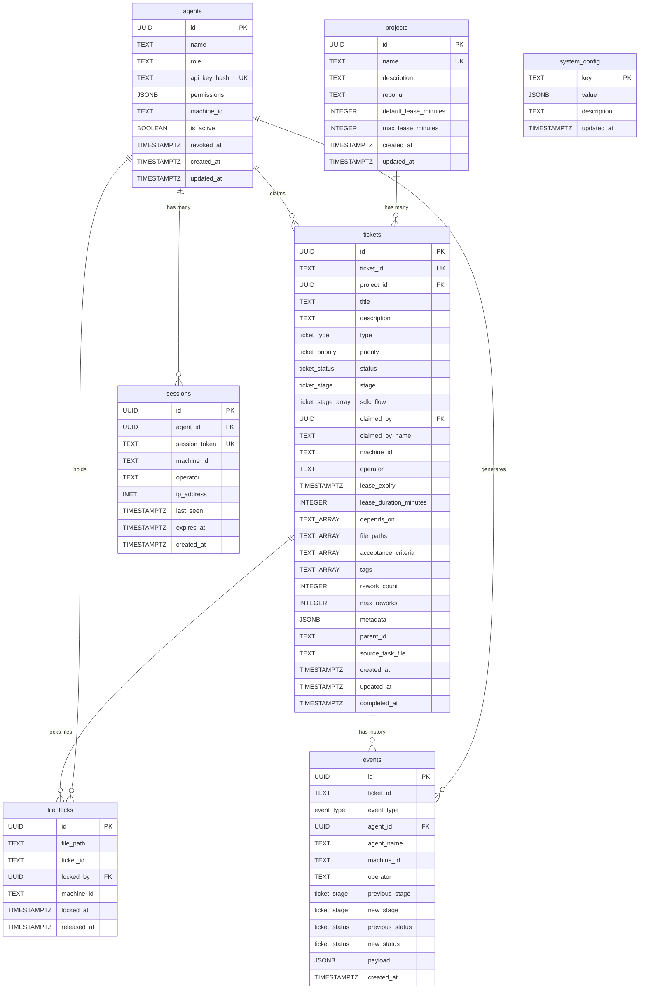
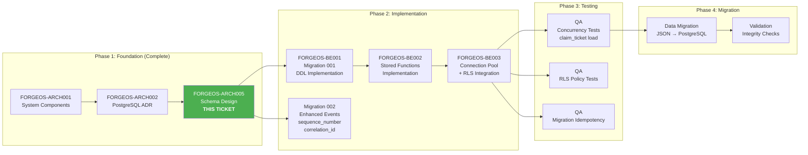

# ForgeOS Core Database Schema Architecture

> **Ticket:** FORGEOS-ARCH005 | **Agent:** Architect | **Date:** 2026-03-06
> **Confidence:** HIGH (91%) | **Status:** APPROVED

---

## Table of Contents

1. [Executive Summary](#1-executive-summary)
2. [Context Map](#2-context-map)
3. [Design Principles](#3-design-principles)
4. [Data Type Rationale](#4-data-type-rationale)
5. [Enum Types](#5-enum-types)
6. [Table Definitions](#6-table-definitions)
   - 6.1 [projects](#61-projects)
   - 6.2 [agents](#62-agents)
   - 6.3 [sessions](#63-sessions)
   - 6.4 [tickets](#64-tickets)
   - 6.5 [file_locks](#65-file_locks)
   - 6.6 [events](#66-events)
   - 6.7 [system_config](#67-system_config)
7. [Entity-Relationship Diagram](#7-entity-relationship-diagram)
8. [Constraint Design](#8-constraint-design)
9. [Index Strategy](#9-index-strategy)
10. [Row-Level Security Policies](#10-row-level-security-policies)
11. [Stored Functions — Business Logic Layer](#11-stored-functions--business-logic-layer)
12. [Triggers](#12-triggers)
13. [SDLC Operation Support Matrix](#13-sdlc-operation-support-matrix)
14. [Migration Path: JSON to Relational](#14-migration-path-json-to-relational)
15. [Well-Architected Pillar Assessment](#15-well-architected-pillar-assessment)
16. [ADR-003: Schema Design Decisions](#16-adr-003-schema-design-decisions)
17. [Fitness Functions](#17-fitness-functions)
18. [DAG Task Graph](#18-dag-task-graph)

---

## 1. Executive Summary

This document defines the complete PostgreSQL schema architecture for the ForgeOS distributed multi-agent orchestration platform. The schema replaces the file-based state machine (`.github/ticket-state/` directories + `tickets.py`) with a PostgreSQL-backed system that provides ACID-guaranteed state transitions, distributed locking, and a full audit trail.

The schema consists of **7 tables**, **5 enum types**, **10 stored functions**, **4 triggers**, **6 RLS policies**, and **15+ indexes**. It is implemented in a single migration file ([001_initial.sql](../../forgeos-server/src/db/migrations/001_initial.sql)) with 1011 lines of DDL.

### Key Design Decisions

| Decision | Rationale |
|----------|-----------|
| UUID primary keys | Avoid sequential ID leaks; support multi-machine inserts without coordination |
| TIMESTAMPTZ everywhere | Timezone-aware timestamps for distributed operators across time zones |
| JSONB for flexible fields | Schema-free extensibility without ALTER TABLE migrations |
| 3NF minimum normalization | Tickets are the mutable core; events are the append-only audit trail |
| Stored function encapsulation | All business logic in PL/pgSQL for atomicity regardless of app-layer failures |
| `SELECT FOR UPDATE SKIP LOCKED` | Zero-contention work-stealing queue for ticket claiming |
| Row-Level Security (RLS) | Database-enforced authorization independent of application middleware |
| TEXT over VARCHAR | No artificial length limits; PostgreSQL stores both identically |
| Partial indexes | Targeted indexing for hot paths (claimable tickets, expired leases, active locks) |

### Schema Summary

| Category | Count | Items |
|----------|-------|-------|
| Tables | 7 | `projects`, `agents`, `sessions`, `tickets`, `file_locks`, `events`, `system_config` |
| Enums | 5 | `ticket_status`, `ticket_stage`, `ticket_type`, `ticket_priority`, `event_type` |
| Stored Functions | 10 | `claim_ticket`, `claim_ticket_by_id`, `advance_ticket`, `reject_ticket`, `release_ticket`, `extend_lease`, `resolve_dependencies`, `release_expired_claims`, `update_updated_at`, `notify_ticket_change` |
| Triggers | 4 | `trg_tickets_updated_at`, `trg_agents_updated_at`, `trg_projects_updated_at`, `trg_ticket_notify` |
| RLS Policies | 6 | On `tickets`, `events`, `file_locks` |
| B-tree Indexes | 8 | Primary query paths |
| GIN Indexes | 4 | Array/JSONB containment queries |
| Partial Indexes | 3 | Hot-path optimization |
| Event Indexes | 5 | Timeline and filtering |

---

## 2. Context Map

### 2.1 Primary Files (Directly Affected)

| File | Role |
|------|------|
| [forgeos-server/src/db/migrations/001_initial.sql](../../forgeos-server/src/db/migrations/001_initial.sql) | 1011-line DDL implementing the schema |
| [forgeos-server/src/types/index.ts](../../forgeos-server/src/types/index.ts) | 835-line TypeScript types mirroring the schema |
| [forgeos-server/src/db/pool.ts](../../forgeos-server/src/db/pool.ts) | Connection pool with RLS session variable injection |
| [forgeos-server/src/db/migrate.ts](../../forgeos-server/src/db/migrate.ts) | Sequential migration runner with SHA-256 checksums |
| [docs/database/schema-reference.md](../database/schema-reference.md) | Schema reference documentation |

### 2.2 Secondary Files (Indirectly Affected)

| File | Role |
|------|------|
| [forgeos-server/src/server.ts](../../forgeos-server/src/server.ts) | Express app factory consuming DB layer |
| [forgeos-server/src/middleware/auth.ts](../../forgeos-server/src/middleware/auth.ts) | Auth middleware setting RLS session variables |
| [.github/tickets.py](../../.github/tickets.py) | Legacy file-based state machine (being replaced) |

### 2.3 Established Patterns

| Pattern | Evidence | Upheld |
|---------|----------|--------|
| UUID primary keys | All 7 tables use `uuid_generate_v4()` | ✅ |
| TIMESTAMPTZ timestamps | All date columns | ✅ |
| JSONB for flexible data | `metadata`, `payload`, `permissions` | ✅ |
| Stored function encapsulation | All 10 business logic functions | ✅ |
| RLS via session variables | `SET LOCAL app.agent_role/name` | ✅ |
| Append-only events | INSERT-only stored function pattern | ✅ |
| snake_case naming | All tables, columns, functions | ✅ |

### 2.4 Research Dependencies

| Research Report | Ticket | Key Insight Applied |
|----------------|--------|---------------------|
| [PG Distributed Locking](../research/pg-distributed-locking.md) | FORGEOS-RES005 | `SELECT FOR UPDATE SKIP LOCKED` for claim queues; advisory locks for file mutex |
| [PG Transaction Isolation](../research/pg-transaction-isolation.md) | FORGEOS-RES007 | READ COMMITTED sufficient; explicit locks provide row-level serializability |
| [PG Event Sourcing](../research/pg-event-sourcing.md) | FORGEOS-RES008 | Enhanced hybrid model (mutable state + append-only audit) over full ES |

---

## 3. Design Principles

### 3.1 Single Source of Truth

All mutable state lives in PostgreSQL. No dual-write to files and database. The `tickets` table is the authoritative record of every ticket's current state. The `events` table provides a complete, append-only audit trail enabling state reconstruction.

### 3.2 Stored Function Encapsulation

Business logic is encoded in PL/pgSQL stored functions (`claim_ticket`, `advance_ticket`, `reject_ticket`, etc.), ensuring atomicity regardless of application-layer failures. The Node.js MCP Server is a thin transport bridge — it translates MCP JSON-RPC calls into stored function invocations and returns results.

### 3.3 Defense in Depth

Three authorization layers:
1. **Application layer** — API key / bearer token authentication (middleware)
2. **RLS layer** — Database-enforced per-agent access using `SET LOCAL` session variables
3. **Stored function layer** — Ownership checks within each function (`claimed_by = p_agent_id`)

### 3.4 Normalization Strategy

The schema follows **Third Normal Form (3NF)** with deliberate denormalization for performance:

| Denormalization | Rationale |
|-----------------|-----------|
| `claimed_by_name` on `tickets` | Avoids JOIN for dashboard display of claimer name |
| `agent_name` on `events` | Avoids JOIN for audit trail rendering; events are immutable so the name at event time is preserved |
| `machine_id` on `events` | Same as above; captures state at event time |

These are **intentional** — the denormalized values are display-only copies frozen at write time, preventing the need for JOINs on high-read tables.

### 3.5 Extensibility via JSONB

Three columns use JSONB for schema-free extensibility:

| Column | Table | Purpose | Examples |
|--------|-------|---------|----------|
| `metadata` | `tickets` | Arbitrary ticket metadata; merged with stage evidence on advance | `{"architecture_adr": "ADR-005", "coverage": 85}` |
| `payload` | `events` | Event-specific details that vary by event type | `{"reason": "lease_expired"}`, `{"lease_expiry": "2026-03-06T12:00:00Z"}` |
| `permissions` | `agents` | Granted capability array per agent | `["tickets.claim", "tickets.advance", "tickets.reject"]` |
| `value` | `system_config` | Runtime config values of heterogeneous types | `30`, `"production"`, `{"retry_count": 3}` |

---

## 4. Data Type Rationale

### 4.1 TEXT vs VARCHAR

**Decision:** Use `TEXT` for all string columns.

| Criterion | TEXT | VARCHAR(n) |
|-----------|------|-----------|
| Storage | Identical in PostgreSQL (both use varlena) | Identical |
| Performance | Identical | Identical |
| Max length enforcement | No (unlimited) | Yes (n characters) |
| Schema flexibility | No ALTER TABLE needed to accept longer strings | Requires migration to change limit |
| PostgreSQL recommendation | Preferred unless business rule mandates max length | Use only for true business constraints |

**Rationale:** PostgreSQL stores TEXT and VARCHAR identically. VARCHAR(n) adds a CHECK constraint that generates ALTER TABLE migration churn when limits prove too small. For ForgeOS, no string column has a meaningful maximum length — ticket IDs, file paths, agent names, and descriptions are all variable-length with no business-rule upper bound.

### 4.2 TIMESTAMPTZ vs TIMESTAMP

**Decision:** Use `TIMESTAMPTZ` for all timestamp columns.

| Criterion | TIMESTAMPTZ | TIMESTAMP |
|-----------|-------------|-----------|
| Storage | 8 bytes | 8 bytes |
| Time zone awareness | ✅ Converts to UTC on storage, renders in session TZ | ❌ No time zone; ambiguous |
| Distributed operators | ✅ Correct across time zones | ❌ Breaks when operators are in different TZs |
| DST transitions | ✅ Handles correctly | ❌ Ambiguous during spring-forward/fall-back |
| PostgreSQL recommendation | Default choice for timestamps | Only for "wall clock" display times |

**Rationale:** ForgeOS operators and agents run on machines across time zones. `TIMESTAMPTZ` ensures `lease_expiry` comparisons (`lease_expiry < NOW()`) are always correct regardless of the session's `timezone` setting.

### 4.3 UUID vs SERIAL/BIGSERIAL

**Decision:** Use UUID v4 primary keys (`uuid_generate_v4()`) for all tables.

| Criterion | UUID | SERIAL/BIGSERIAL |
|-----------|------|------------------|
| Multi-machine inserts | ✅ No coordination needed | ❌ Requires sequence synchronization |
| Information leakage | ✅ Non-guessable | ❌ Sequential; reveals count and order |
| Storage | 16 bytes | 4/8 bytes |
| Index performance | Slightly slower (larger key) | Slightly faster (smaller key, sequential) |
| Merge conflicts | ✅ Impossible (random) | ⚠️ Possible with concurrent sequences |

**Rationale:** ForgeOS is a distributed system where multiple machines insert tickets, agents, and events concurrently. UUIDs eliminate the need for centralized sequence coordination. The 16-byte overhead per row is negligible at ForgeOS's scale (≤100K tickets).

### 4.4 PostgreSQL Arrays (TEXT[]) vs Junction Tables

**Decision:** Use native PostgreSQL arrays for `depends_on`, `file_paths`, `acceptance_criteria`, `sdlc_flow`, and `tags`.

| Criterion | TEXT[] with GIN | Junction Table |
|-----------|----------------|---------------|
| Query: "does ticket X depend on Y?" | `'Y' = ANY(depends_on)` — GIN indexed | `SELECT 1 FROM ticket_deps WHERE ticket_id = X AND dep_id = Y` |
| Query: "all tickets depending on Y" | `SELECT * FROM tickets WHERE 'Y' = ANY(depends_on)` | `JOIN ticket_deps` |
| Schema complexity | Single column | Extra table + FK constraints |
| Referential integrity | ❌ No FK to other tickets | ✅ FK enforced |
| Write performance | ✅ Single row UPDATE | Requires multi-row INSERT/DELETE |
| ForgeOS scale | ≤20 dependencies per ticket | Same |

**Rationale:** ForgeOS tickets have small arrays (typically 0–5 dependencies, 1–10 file paths). PostgreSQL arrays with GIN indexes provide efficient containment queries (`@>`, `&&`, `= ANY()`) without the schema overhead of junction tables. The tradeoff is no FK enforcement on `depends_on` — this is acceptable because `resolve_dependencies()` handles dangling references gracefully by checking `EXISTS`.

### 4.5 JSONB vs JSON

**Decision:** Use `JSONB` for all JSON columns.

| Criterion | JSONB | JSON |
|-----------|-------|------|
| Storage | Parsed binary; 10–20% larger | Raw text |
| Query operators | ✅ `->`, `->>`, `@>`, `?`, `?&`, `?|` with index support | ✅ `->`, `->>` only; no index support |
| GIN indexable | ✅ | ❌ |
| Modification | ✅ `jsonb_set()`, `||` merge | ❌ Must rewrite entire value |
| Key ordering | Not preserved | Preserved |
| Duplicate handling | Last value wins | All duplicates preserved |

**Rationale:** JSONB enables indexed queries on `metadata` and `payload` columns via GIN indexes, and supports `||` merge for accumulating stage evidence in `advance_ticket()`. The minor storage overhead is negligible.

---

## 5. Enum Types

PostgreSQL enums encode the domain vocabulary as database-level constraints. They provide type safety (invalid values rejected at INSERT/UPDATE time), storage efficiency (4-byte integers internally), and readability (human-readable values in queries).

### 5.1 ticket_status — Lifecycle State

```sql
CREATE TYPE ticket_status AS ENUM (
    'READY',        -- Unblocked, available for claim
    'BLOCKED',      -- Waiting on dependency tickets
    'CLAIMED',      -- Locked by an agent with active lease
    'IN_PROGRESS',  -- Agent actively working
    'DONE',         -- Completed successfully
    'FAILED',       -- Terminal failure
    'ESCALATED'     -- Exceeded max reworks; requires human review
);
```

**State transitions:**

```
BLOCKED ──(deps resolved)──► READY ──(claimed)──► CLAIMED ──(working)──► IN_PROGRESS
    ▲                          ▲                                              │
    │                          │                                              │
    │                     (released/                                     (advanced)
    │                      expired)                                          │
    │                          │                                              ▼
    │                     ◄────┘                                            DONE
    │                                                                         │
    │                     (rejected,                                    (resolve_deps)
    │                      rework < max)                                      │
    │                          ▲                                              ▼
    │                          │                                         Unblock
    │                     ◄────┘                                         BLOCKED
    │                                                                    tickets
    └──────── (rejected, rework >= max) ──────────────────► ESCALATED
```

### 5.2 ticket_stage — SDLC Pipeline Position

```sql
CREATE TYPE ticket_stage AS ENUM (
    'READY',            -- Entry point
    'RESEARCH',         -- Evidence research (Research Analyst)
    'ARCHITECT',        -- System design (Architect)
    'PRODUCT_MANAGER',  -- Requirements (Product Manager)
    'UI_DESIGN',        -- Mockups (UIDesigner)
    'BACKEND',          -- Server-side implementation (Backend Engineer)
    'FRONTEND',         -- UI implementation (Frontend Engineer)
    'QA',               -- Test verification (QA Engineer)
    'SECURITY',         -- Vulnerability review (Security Engineer)
    'CI',               -- Lint/type/complexity (CI Reviewer)
    'DOCUMENTATION',    -- Technical docs (Documentation Specialist)
    'VALIDATOR',        -- DoD review (Validator)
    'DONE'              -- Lifecycle complete
);
```

**SDLC flows per ticket type:**

| Type | Stage Sequence |
|------|---------------|
| `backend` | READY → BACKEND → QA → SECURITY → CI → DOCUMENTATION → VALIDATOR → DONE |
| `frontend` | READY → FRONTEND → QA → SECURITY → CI → DOCUMENTATION → VALIDATOR → DONE |
| `fullstack` | READY → BACKEND → FRONTEND → QA → SECURITY → CI → DOCUMENTATION → VALIDATOR → DONE |
| `infra` | READY → BACKEND → QA → SECURITY → CI → DOCUMENTATION → VALIDATOR → DONE |
| `security` | READY → SECURITY → QA → CI → DOCUMENTATION → VALIDATOR → DONE |
| `docs` | READY → DOCUMENTATION → VALIDATOR → DONE |
| `research` | READY → RESEARCH → DOCUMENTATION → VALIDATOR → DONE |
| `architecture` | READY → ARCHITECT → DOCUMENTATION → VALIDATOR → DONE |
| `product` | READY → PRODUCT_MANAGER → DOCUMENTATION → VALIDATOR → DONE |
| `design` | READY → UI_DESIGN → DOCUMENTATION → VALIDATOR → DONE |

### 5.3 ticket_type — SDLC Flow Selector

```sql
CREATE TYPE ticket_type AS ENUM (
    'backend', 'frontend', 'fullstack', 'infra', 'security',
    'docs', 'research', 'architecture', 'product', 'design'
);
```

### 5.4 ticket_priority — Claim Queue Order

```sql
CREATE TYPE ticket_priority AS ENUM (
    'critical',  -- Blocking other work; claimed first
    'high',      -- Important but not blocking
    'medium',    -- Default priority
    'low'        -- Background or optional
);
```

### 5.5 event_type — Audit Trail Classification

```sql
CREATE TYPE event_type AS ENUM (
    'CREATED',         -- Ticket created
    'CLAIMED',         -- Agent acquired a claim
    'RELEASED',        -- Voluntary claim release
    'STAGE_ADVANCED',  -- Ticket moved to next stage
    'STAGE_REJECTED',  -- Ticket sent back for rework
    'UPDATED',         -- Metadata or field update
    'SPAWNED',         -- Sub-ticket created
    'ESCALATED',       -- Rework limit exceeded
    'LEASE_EXTENDED',  -- Claim lease extended
    'FORCE_RELEASED',  -- Admin forced a claim release
    'RECONCILED',      -- State reconciliation applied
    'FILE_LOCKED',     -- File lock acquired
    'FILE_UNLOCKED'    -- File lock released
);
```

---

## 6. Table Definitions

### 6.1 projects

**Purpose:** Top-level organizational unit. Each project maps to one Git repository. Provides project-scoped configuration (lease defaults).

**Bounded Context:** Project management and configuration.

```sql
CREATE TABLE projects (
    id                    UUID PRIMARY KEY DEFAULT uuid_generate_v4(),
    name                  TEXT NOT NULL UNIQUE,
    description           TEXT,
    repo_url              TEXT,
    default_lease_minutes INTEGER NOT NULL DEFAULT 30,
    max_lease_minutes     INTEGER NOT NULL DEFAULT 120,
    created_at            TIMESTAMPTZ NOT NULL DEFAULT NOW(),
    updated_at            TIMESTAMPTZ NOT NULL DEFAULT NOW()
);
```

| Column | Type | Nullable | Default | Constraint | Purpose |
|--------|------|----------|---------|------------|---------|
| `id` | UUID | NO | `uuid_generate_v4()` | PK | Internal identifier |
| `name` | TEXT | NO | — | UNIQUE | Human-readable project name |
| `description` | TEXT | YES | — | — | Project description |
| `repo_url` | TEXT | YES | — | — | Git repository URL |
| `default_lease_minutes` | INTEGER | NO | `30` | — | Default claim lease duration |
| `max_lease_minutes` | INTEGER | NO | `120` | — | Maximum allowed lease extension |
| `created_at` | TIMESTAMPTZ | NO | `NOW()` | — | Row creation time |
| `updated_at` | TIMESTAMPTZ | NO | `NOW()` | auto-trigger | Last modification time |

**Relationships:**
- 1:M → `tickets.project_id`

**Auto-update trigger:** `trg_projects_updated_at` fires `update_updated_at()` on every UPDATE.

---

### 6.2 agents

**Purpose:** Agent identity management. Each row represents a named agent with a specific role. Provides API key authentication and permission control.

**Bounded Context:** Identity and authentication.

```sql
CREATE TABLE agents (
    id              UUID PRIMARY KEY DEFAULT uuid_generate_v4(),
    name            TEXT NOT NULL,
    role            TEXT NOT NULL,
    api_key_hash    TEXT UNIQUE,
    permissions     JSONB NOT NULL DEFAULT '[]'::JSONB,
    machine_id      TEXT,
    is_active       BOOLEAN NOT NULL DEFAULT TRUE,
    revoked_at      TIMESTAMPTZ,
    created_at      TIMESTAMPTZ NOT NULL DEFAULT NOW(),
    updated_at      TIMESTAMPTZ NOT NULL DEFAULT NOW(),
    CONSTRAINT agent_name_role_unique UNIQUE (name, role)
);
```

| Column | Type | Nullable | Default | Constraint | Purpose |
|--------|------|----------|---------|------------|---------|
| `id` | UUID | NO | `uuid_generate_v4()` | PK | Internal identifier |
| `name` | TEXT | NO | — | UNIQUE(name,role) | Agent display name (e.g., "Backend-1") |
| `role` | TEXT | NO | — | UNIQUE(name,role) | Agent role (e.g., "Backend", "QA") |
| `api_key_hash` | TEXT | YES | — | UNIQUE | SHA-256 hash of API key |
| `permissions` | JSONB | NO | `'[]'` | — | Granted capabilities array |
| `machine_id` | TEXT | YES | — | — | Last known machine hostname |
| `is_active` | BOOLEAN | NO | `TRUE` | — | Whether agent can claim tickets |
| `revoked_at` | TIMESTAMPTZ | YES | — | — | Soft-delete timestamp |
| `created_at` | TIMESTAMPTZ | NO | `NOW()` | — | Row creation time |
| `updated_at` | TIMESTAMPTZ | NO | `NOW()` | auto-trigger | Last modification time |

**Relationships:**
- 1:M → `sessions.agent_id` (CASCADE delete)
- 1:M → `tickets.claimed_by` (SET NULL on delete)
- 1:M → `file_locks.locked_by` (SET NULL on delete)
- 1:M → `events.agent_id` (SET NULL on delete)

**Authorization model:**
- `api_key_hash` stores SHA-256 of the plain-text API key. The plain-text key is never stored.
- `permissions` is a JSONB array of capability strings (e.g., `["tickets.claim", "tickets.advance"]`).
- `is_active` + `revoked_at` implement soft-delete: revoked agents cannot claim new tickets but their historical data (events, past claims) is preserved.

**Auto-update trigger:** `trg_agents_updated_at` fires `update_updated_at()` on every UPDATE.

---

### 6.3 sessions

**Purpose:** Tracks active agent sessions for distributed execution. Binds an agent to a machine and operator. Sessions expire and must be refreshed.

**Bounded Context:** Session management.

```sql
CREATE TABLE sessions (
    id              UUID PRIMARY KEY DEFAULT uuid_generate_v4(),
    agent_id        UUID NOT NULL REFERENCES agents(id) ON DELETE CASCADE,
    session_token   TEXT NOT NULL UNIQUE,
    machine_id      TEXT NOT NULL,
    operator        TEXT,
    ip_address      INET,
    last_seen       TIMESTAMPTZ NOT NULL DEFAULT NOW(),
    expires_at      TIMESTAMPTZ NOT NULL,
    created_at      TIMESTAMPTZ NOT NULL DEFAULT NOW()
);
```

| Column | Type | Nullable | Default | Constraint | Purpose |
|--------|------|----------|---------|------------|---------|
| `id` | UUID | NO | `uuid_generate_v4()` | PK | Internal identifier |
| `agent_id` | UUID | NO | — | FK → agents(id) CASCADE | Owning agent |
| `session_token` | TEXT | NO | — | UNIQUE | Session authentication token |
| `machine_id` | TEXT | NO | — | — | Machine hostname |
| `operator` | TEXT | YES | — | — | Human operator name |
| `ip_address` | INET | YES | — | — | Client IP address |
| `last_seen` | TIMESTAMPTZ | NO | `NOW()` | — | Last heartbeat timestamp |
| `expires_at` | TIMESTAMPTZ | NO | — | — | Session expiry time |
| `created_at` | TIMESTAMPTZ | NO | `NOW()` | — | Row creation time |

**Relationships:**
- M:1 → `agents.id` (CASCADE: agent deletion removes all sessions)

**Session lifecycle:**
1. Agent connects → new session row inserted with `expires_at` = now + TTL
2. Each request updates `last_seen` for liveness tracking
3. Expired sessions are candidates for cleanup
4. Agent disconnect → session row deleted (or left for audit)

---

### 6.4 tickets

**Purpose:** Central entity of the ForgeOS state machine. Each row represents one unit of work (a ticket) with its full lifecycle state.

**Bounded Context:** Ticket lifecycle orchestration — the core aggregate root.

```sql
CREATE TABLE tickets (
    -- Identity
    id                     UUID PRIMARY KEY DEFAULT uuid_generate_v4(),
    ticket_id              TEXT NOT NULL UNIQUE,
    project_id             UUID REFERENCES projects(id) ON DELETE SET NULL,
    title                  TEXT NOT NULL,
    description            TEXT,

    -- Classification
    type                   ticket_type NOT NULL,
    priority               ticket_priority NOT NULL DEFAULT 'medium',

    -- State machine
    status                 ticket_status NOT NULL DEFAULT 'BLOCKED',
    stage                  ticket_stage NOT NULL DEFAULT 'READY',
    sdlc_flow              ticket_stage[] NOT NULL,

    -- Distributed claim (lease-based locking)
    claimed_by             UUID REFERENCES agents(id) ON DELETE SET NULL,
    claimed_by_name        TEXT,            -- Denormalized for display
    machine_id             TEXT,
    operator               TEXT,
    lease_expiry           TIMESTAMPTZ,
    lease_duration_minutes INTEGER NOT NULL DEFAULT 30,

    -- Dependency & scope (JSONB-equivalent arrays)
    depends_on             TEXT[] NOT NULL DEFAULT '{}',
    file_paths             TEXT[] NOT NULL DEFAULT '{}',
    acceptance_criteria    TEXT[] NOT NULL DEFAULT '{}',
    tags                   TEXT[] NOT NULL DEFAULT '{}',

    -- Rework tracking
    rework_count           INTEGER NOT NULL DEFAULT 0 CHECK (rework_count >= 0),
    max_reworks            INTEGER NOT NULL DEFAULT 3,

    -- Extensible metadata (JSONB)
    metadata               JSONB NOT NULL DEFAULT '{}'::JSONB,

    -- Hierarchy
    parent_id              TEXT,
    source_task_file       TEXT,

    -- Timestamps
    created_at             TIMESTAMPTZ NOT NULL DEFAULT NOW(),
    updated_at             TIMESTAMPTZ NOT NULL DEFAULT NOW(),
    completed_at           TIMESTAMPTZ,

    -- Constraints
    CONSTRAINT valid_lease CHECK (
        (claimed_by IS NULL AND lease_expiry IS NULL) OR
        (claimed_by IS NOT NULL AND lease_expiry IS NOT NULL)
    ),
    CONSTRAINT valid_rework CHECK (rework_count <= max_reworks + 1)
);
```

**Column groups explained:**

| Group | Columns | Purpose |
|-------|---------|---------|
| **Identity** | `id`, `ticket_id`, `project_id`, `title`, `description` | Row identity and human-readable naming. `ticket_id` is the external key (e.g., `TASK-FOS-01-001`); `id` is the internal UUID PK. |
| **Classification** | `type`, `priority` | Determines SDLC flow and claim queue ordering |
| **State Machine** | `status`, `stage`, `sdlc_flow` | Current lifecycle state; `sdlc_flow` encodes the valid stage sequence as an ordered array |
| **Claim Fields** | `claimed_by`, `claimed_by_name`, `machine_id`, `operator`, `lease_expiry`, `lease_duration_minutes` | Distributed locking via lease-based claims. All-or-nothing constraint ensures consistency. |
| **Scope Arrays** | `depends_on`, `file_paths`, `acceptance_criteria`, `tags` | GIN-indexed native arrays for dependency resolution, file conflict detection, filtering |
| **Rework** | `rework_count`, `max_reworks` | Rejection cycle tracking; exceeding `max_reworks` escalates to human |
| **Metadata** | `metadata` | JSONB bag for extensible per-ticket data; accumulated via `||` merge on `advance_ticket()` |
| **Hierarchy** | `parent_id`, `source_task_file` | Sub-ticket tree and provenance tracking |
| **Timestamps** | `created_at`, `updated_at`, `completed_at` | Lifecycle timing; `updated_at` auto-maintained by trigger |

**Relationships:**
- M:1 → `projects.id` (SET NULL on delete)
- M:1 → `agents.id` via `claimed_by` (SET NULL on delete)
- 1:M → `events.ticket_id` (via TEXT join, not FK — events reference ticket_id for immutability)
- 1:M → `file_locks.ticket_id` (via TEXT join)

**CHECK constraints:**
- `valid_lease`: Claim fields are all-or-nothing. Either both `claimed_by` and `lease_expiry` are NULL (unclaimed), or both are set (claimed). Prevents partially-claimed state.
- `valid_rework`: `rework_count` cannot exceed `max_reworks + 1`. The `+1` allows the escalation event to record the final increment.

---

### 6.5 file_locks

**Purpose:** File-level mutual exclusion. Prevents two agents from modifying the same source file concurrently. Implements a database-backed mutex via a partial unique index.

**Bounded Context:** Distributed file locking.

```sql
CREATE TABLE file_locks (
    id              UUID PRIMARY KEY DEFAULT uuid_generate_v4(),
    file_path       TEXT NOT NULL,
    ticket_id       TEXT NOT NULL,
    locked_by       UUID REFERENCES agents(id) ON DELETE SET NULL,
    machine_id      TEXT,
    locked_at       TIMESTAMPTZ NOT NULL DEFAULT NOW(),
    released_at     TIMESTAMPTZ
);
```

| Column | Type | Nullable | Default | Constraint | Purpose |
|--------|------|----------|---------|------------|---------|
| `id` | UUID | NO | `uuid_generate_v4()` | PK | Internal identifier |
| `file_path` | TEXT | NO | — | Partial UNIQUE (active) | Locked file path |
| `ticket_id` | TEXT | NO | — | — | Ticket holding the lock |
| `locked_by` | UUID | YES | — | FK → agents(id) SET NULL | Agent holding the lock |
| `machine_id` | TEXT | YES | — | — | Machine hostname |
| `locked_at` | TIMESTAMPTZ | NO | `NOW()` | — | Lock acquisition time |
| `released_at` | TIMESTAMPTZ | YES | — | — | Lock release time (NULL = active) |

**Mutex mechanism:**

The partial unique index `idx_file_locks_active` enforces at most one active lock per file:

```sql
CREATE UNIQUE INDEX idx_file_locks_active ON file_locks(file_path)
    WHERE released_at IS NULL;
```

- **Acquiring a lock:** INSERT succeeds if no active lock exists for the file path. Fails with unique constraint violation if another agent holds an active lock.
- **Releasing a lock:** UPDATE sets `released_at = NOW()`. The released row exits the partial index, freeing the file path for new locks.
- **Audit retention:** Released locks are preserved (not deleted) for audit trail purposes.

**Lock lifecycle in stored functions:**
1. `claim_ticket_by_id()` — Acquires file locks on all `file_paths` of the claimed ticket
2. `advance_ticket()` — Releases all file locks for the ticket on stage completion
3. `reject_ticket()` — Releases all file locks on rejection
4. `release_ticket()` — Releases all file locks on voluntary release
5. `release_expired_claims()` — Releases orphaned file locks for expired tickets

---

### 6.6 events

**Purpose:** Append-only audit trail. Captures every state change in the system. Enables full lifecycle reconstruction, debugging, and compliance reporting.

**Bounded Context:** Audit and event sourcing (hybrid model).

```sql
CREATE TABLE events (
    id              UUID PRIMARY KEY DEFAULT uuid_generate_v4(),
    ticket_id       TEXT NOT NULL,
    event_type      event_type NOT NULL,
    agent_id        UUID REFERENCES agents(id) ON DELETE SET NULL,
    agent_name      TEXT,
    machine_id      TEXT,
    operator        TEXT,
    previous_stage  ticket_stage,
    new_stage       ticket_stage,
    previous_status ticket_status,
    new_status      ticket_status,
    payload         JSONB NOT NULL DEFAULT '{}'::JSONB,
    created_at      TIMESTAMPTZ NOT NULL DEFAULT NOW()
);
```

| Column | Type | Nullable | Default | Constraint | Purpose |
|--------|------|----------|---------|------------|---------|
| `id` | UUID | NO | `uuid_generate_v4()` | PK | Internal identifier |
| `ticket_id` | TEXT | NO | — | — | Associated ticket (by human-readable ID) |
| `event_type` | event_type | NO | — | ENUM | Event classification |
| `agent_id` | UUID | YES | — | FK → agents(id) SET NULL | Acting agent |
| `agent_name` | TEXT | YES | — | — | Agent name (denormalized, frozen at event time) |
| `machine_id` | TEXT | YES | — | — | Machine hostname (frozen at event time) |
| `operator` | TEXT | YES | — | — | Human operator name |
| `previous_stage` | ticket_stage | YES | — | ENUM | Stage before transition |
| `new_stage` | ticket_stage | YES | — | ENUM | Stage after transition |
| `previous_status` | ticket_status | YES | — | ENUM | Status before change |
| `new_status` | ticket_status | YES | — | ENUM | Status after change |
| `payload` | JSONB | NO | `'{}'` | — | Event-specific details |
| `created_at` | TIMESTAMPTZ | NO | `NOW()` | — | Event timestamp |

**Immutability enforcement:**
- All stored functions only INSERT into `events` — no UPDATE or DELETE
- RLS policies grant INSERT + SELECT only — no UPDATE or DELETE policies
- Recommended future enhancement: database RULE to reject UPDATE/DELETE (per FORGEOS-RES008)

**Event payload examples by type:**

| Event Type | Payload Fields |
|-----------|---------------|
| `CLAIMED` | `lease_expiry`, `lease_minutes` |
| `STAGE_ADVANCED` | Stage evidence JSONB (test results, coverage, etc.) |
| `STAGE_REJECTED` | `reason`, `evidence`, `rework_count` |
| `RELEASED` | `reason`, `forced` (boolean) |
| `ESCALATED` | `reason`, `evidence`, `rework_count` |
| `LEASE_EXTENDED` | `new_expiry`, `extension_minutes` |
| `UPDATED` | `action` (e.g., `"dependency_resolved"`), `resolved_by` |

**Enhanced event sourcing columns (recommended for Migration 002):**

Per FORGEOS-RES008, the following columns would enhance the audit model:

| Column | Type | Purpose |
|--------|------|---------|
| `sequence_number` | BIGSERIAL | Global monotonic ordering for total event ordering |
| `aggregate_version` | INTEGER | Per-ticket event count for optimistic concurrency |
| `correlation_id` | UUID | Links related events across tickets (e.g., dependency chains) |
| `causation_id` | UUID | The event that caused this event |
| `schema_version` | INTEGER | Payload schema version for evolution |

---

### 6.7 system_config

**Purpose:** Key-value store for runtime configuration parameters. Avoids hardcoding operational parameters in application code.

**Bounded Context:** System configuration.

```sql
CREATE TABLE system_config (
    key             TEXT PRIMARY KEY,
    value           JSONB NOT NULL,
    description     TEXT,
    updated_at      TIMESTAMPTZ NOT NULL DEFAULT NOW()
);
```

| Column | Type | Nullable | Default | Constraint | Purpose |
|--------|------|----------|---------|------------|---------|
| `key` | TEXT | NO | — | PK | Configuration key |
| `value` | JSONB | NO | — | — | Configuration value (heterogeneous types) |
| `description` | TEXT | YES | — | — | Human-readable description |
| `updated_at` | TIMESTAMPTZ | NO | `NOW()` | — | Last modification time |

**Seed data:**

| Key | Value | Description |
|-----|-------|-------------|
| `default_lease_minutes` | `30` | Default claim lease duration |
| `max_lease_minutes` | `120` | Maximum lease extension allowed |
| `rate_limit_per_minute` | `100` | API rate limit per agent per minute |
| `reconciliation_interval_seconds` | `300` | Periodic reconciliation interval |
| `stale_machine_hours` | `24` | Hours before a machine is marked stale |

---

## 7. Entity-Relationship Diagram

### 7.1 Mermaid ER Diagram



### 7.2 ASCII ER Diagram

```
┌──────────────┐                    ┌──────────────────────────────────────┐
│   projects   │──────1:M──────────►│              tickets                 │
│              │   (project_id)     │                                      │
│  id (PK)     │                    │  id (PK)                             │
│  name (UK)   │                    │  ticket_id (UK)                      │
│  description │                    │  project_id (FK → projects)          │
│  repo_url    │                    │  type, priority, status, stage       │
│  lease config│                    │  sdlc_flow[]                         │
│  timestamps  │                    │  claimed_by (FK → agents)            │
└──────────────┘                    │  depends_on[], file_paths[]          │
                                    │  acceptance_criteria[], tags[]        │
┌──────────────┐                    │  metadata (JSONB)                    │
│    agents    │──────1:M──────────►│  rework_count, max_reworks           │
│              │   (claimed_by)     │  timestamps                          │
│  id (PK)     │                    └───────────┬──────────────┬───────────┘
│  name        │                                │              │
│  role        │                                │ 1:M          │ 1:M
│  api_key_hash│                                ▼              ▼
│  permissions │                    ┌───────────────┐  ┌──────────────┐
│  is_active   │──────1:M─────────►│    events      │  │  file_locks  │
│  timestamps  │   (agent_id)      │                │  │              │
└──────┬───────┘                    │  id (PK)       │  │  id (PK)     │
       │                            │  ticket_id     │  │  file_path   │
       │ 1:M                        │  event_type    │  │  ticket_id   │
       ▼                            │  agent_id (FK) │  │  locked_by   │
┌──────────────┐                    │  payload       │  │   (FK→agents)│
│   sessions   │                    │  stage changes │  │  timestamps  │
│              │                    │  created_at    │  └──────────────┘
│  id (PK)     │                    └────────────────┘
│  agent_id    │
│   (FK→agents)│                    ┌──────────────┐
│  session_tkn │                    │ system_config │
│  machine_id  │                    │              │
│  operator    │                    │  key (PK)    │
│  expires_at  │                    │  value (JSONB│)
└──────────────┘                    │  description │
                                    └──────────────┘
```

### 7.3 Relationship Summary

| Relationship | Cardinality | FK Column | ON DELETE |
|-------------|-------------|-----------|-----------|
| projects → tickets | 1:M | `tickets.project_id` | SET NULL |
| agents → sessions | 1:M | `sessions.agent_id` | CASCADE |
| agents → tickets | 1:M | `tickets.claimed_by` | SET NULL |
| agents → file_locks | 1:M | `file_locks.locked_by` | SET NULL |
| agents → events | 1:M | `events.agent_id` | SET NULL |
| tickets → events | 1:M | `events.ticket_id` (TEXT) | No FK (immutable audit) |
| tickets → file_locks | 1:M | `file_locks.ticket_id` (TEXT) | No FK (audit retention) |

**Why `events.ticket_id` and `file_locks.ticket_id` are TEXT, not FK:**
- Events are immutable audit records. If a ticket were deleted (unlikely but possible), events must survive to preserve the audit trail.
- File lock history provides forensic data for debugging file conflicts across ticket lifecycles.

---

## 8. Constraint Design

### 8.1 Primary Key Constraints

All 7 tables use UUID v4 primary keys generated by `uuid_generate_v4()`.

### 8.2 Unique Constraints

| Table | Column(s) | Type | Purpose |
|-------|-----------|------|---------|
| `projects` | `name` | Column UNIQUE | One project per name |
| `agents` | `(name, role)` | Named UNIQUE | One agent per name+role combo |
| `agents` | `api_key_hash` | Column UNIQUE | One API key per agent |
| `sessions` | `session_token` | Column UNIQUE | One session per token |
| `tickets` | `ticket_id` | Column UNIQUE | One ticket per human-readable ID |
| `file_locks` | `file_path` WHERE `released_at IS NULL` | Partial UNIQUE index | At most one active lock per file |

### 8.3 Foreign Key Constraints

| Source Table | Column | Target | ON DELETE |
|-------------|--------|--------|-----------|
| `sessions` | `agent_id` | `agents.id` | CASCADE |
| `tickets` | `project_id` | `projects.id` | SET NULL |
| `tickets` | `claimed_by` | `agents.id` | SET NULL |
| `file_locks` | `locked_by` | `agents.id` | SET NULL |
| `events` | `agent_id` | `agents.id` | SET NULL |

**ON DELETE rationale:**
- **CASCADE** on `sessions.agent_id`: Deleting an agent should remove all its sessions (they're meaningless without the agent).
- **SET NULL** everywhere else: Preserves tickets, events, and lock history when an agent is deleted. Historical records remain intact with `claimed_by = NULL` indicating a deleted agent.

### 8.4 CHECK Constraints

| Table | Constraint | Rule | Purpose |
|-------|-----------|------|---------|
| `tickets` | `valid_lease` | `(claimed_by IS NULL AND lease_expiry IS NULL) OR (claimed_by IS NOT NULL AND lease_expiry IS NOT NULL)` | All-or-nothing claim fields |
| `tickets` | `valid_rework` | `rework_count <= max_reworks + 1` | Cap rework cycles |
| `tickets` | (implicit) | `rework_count >= 0` | No negative rework counts |

### 8.5 NOT NULL Constraints

Columns that are always required:

| Table | NOT NULL Columns |
|-------|-----------------|
| `projects` | `id`, `name`, `default_lease_minutes`, `max_lease_minutes`, `created_at`, `updated_at` |
| `agents` | `id`, `name`, `role`, `permissions`, `is_active`, `created_at`, `updated_at` |
| `sessions` | `id`, `agent_id`, `session_token`, `machine_id`, `last_seen`, `expires_at`, `created_at` |
| `tickets` | `id`, `ticket_id`, `title`, `type`, `priority`, `status`, `stage`, `sdlc_flow`, `lease_duration_minutes`, `depends_on`, `file_paths`, `acceptance_criteria`, `tags`, `rework_count`, `max_reworks`, `metadata`, `created_at`, `updated_at` |
| `file_locks` | `id`, `file_path`, `ticket_id`, `locked_at` |
| `events` | `id`, `ticket_id`, `event_type`, `payload`, `created_at` |
| `system_config` | `key`, `value`, `updated_at` |

---

## 9. Index Strategy

### 9.1 Design Philosophy

Indexes are designed around ForgeOS's query patterns:

1. **Dashboard queries** — Filter by status + stage for pipeline visualization
2. **Claim queries** — Find the next available ticket by stage, priority, and age
3. **Dependency resolution** — Array containment checks on `depends_on`
4. **File conflict detection** — Array overlap checks on `file_paths`
5. **Expired lease cleanup** — Find tickets with expired leases
6. **Audit trail** — Per-ticket event timeline

### 9.2 B-tree Indexes (Primary Query Paths)

| Index Name | Table | Columns | Query Pattern |
|-----------|-------|---------|--------------|
| `idx_tickets_status_stage` | tickets | `(status, stage)` | Dashboard: "show all CLAIMED tickets in BACKEND stage" |
| `idx_tickets_stage` | tickets | `(stage)` | Stage listing: "all tickets in QA" |
| `idx_tickets_claimed_by` | tickets | `(claimed_by)` | Agent workload: "what is agent X working on?" |
| `idx_tickets_priority` | tickets | `(priority)` | Priority sorting for claim queues |
| `idx_tickets_project_id` | tickets | `(project_id)` | Project-scoped queries |
| `idx_tickets_parent_id` | tickets | `(parent_id)` | Sub-ticket tree traversal |
| `idx_sessions_agent_id` | sessions | `(agent_id)` | Session lookup by agent |
| `idx_sessions_expires_at` | sessions | `(expires_at)` | Expired session cleanup |

### 9.3 GIN Indexes (Array/JSONB Containment)

| Index Name | Table | Column | Operator Support | Query Pattern |
|-----------|-------|--------|-----------------|--------------|
| `idx_tickets_depends_on` | tickets | `depends_on` | `@>`, `&&`, `= ANY()` | "Which tickets depend on TASK-001?" |
| `idx_tickets_file_paths` | tickets | `file_paths` | `@>`, `&&`, `= ANY()` | "Is any ticket modifying `src/server.ts`?" |
| `idx_tickets_tags` | tickets | `tags` | `@>`, `&&`, `= ANY()` | "All tickets tagged `phase1`" |
| `idx_tickets_metadata` | tickets | `metadata` | `@>`, `?`, `?&` | "Tickets with metadata key `coverage`" |

### 9.4 Partial Indexes (Hot-Path Optimization)

Partial indexes only index rows matching a WHERE clause, dramatically reducing index size and improving performance for targeted queries.

| Index Name | Table | Columns | WHERE Clause | Purpose |
|-----------|-------|---------|-------------|---------|
| `idx_tickets_claimable` | tickets | `(stage, priority DESC, created_at ASC)` | `status = 'READY' AND claimed_by IS NULL` | `claim_ticket()` fast path. Only indexes unclaimed READY tickets. With 1000 total tickets and 50 claimable, this index is ~50 rows vs 1000. |
| `idx_tickets_expired_leases` | tickets | `(lease_expiry)` | `claimed_by IS NOT NULL AND lease_expiry IS NOT NULL` | `release_expired_claims()`. Only indexes claimed tickets with set expiry. |
| `idx_file_locks_active` | file_locks | `(file_path)` UNIQUE | `released_at IS NULL` | File mutex enforcement. Only active (unreleased) locks. |

### 9.5 Event Indexes

| Index Name | Table | Columns | Purpose |
|-----------|-------|---------|---------|
| `idx_events_ticket_id` | events | `(ticket_id)` | Per-ticket history retrieval |
| `idx_events_created_at` | events | `(created_at)` | Chronological queries |
| `idx_events_event_type` | events | `(event_type)` | Filter by event type |
| `idx_events_ticket_timeline` | events | `(ticket_id, created_at)` | Composite: ticket timeline display (covers both columns in one index scan) |
| `idx_file_locks_ticket_id` | file_locks | `(ticket_id)` | Ticket → lock join for lock release |

### 9.6 Index Size Estimates

At ForgeOS's projected scale (100K tickets, 50 events/ticket = 5M events):

| Index | Estimated Rows | Estimated Size |
|-------|---------------|---------------|
| `idx_tickets_claimable` | ~100 (READY unclaimed) | ~8 KB |
| `idx_tickets_expired_leases` | ~50 (active claims) | ~4 KB |
| `idx_file_locks_active` | ~200 (active locks) | ~16 KB |
| `idx_tickets_depends_on` (GIN) | ~100K | ~10 MB |
| `idx_events_ticket_timeline` | ~5M | ~200 MB |
| All other B-tree indexes | ~100K each | ~8 MB each |

---

## 10. Row-Level Security Policies

### 10.1 Strategy

RLS adds a database-enforced authorization layer using PostgreSQL session variables injected by the application layer on each request:

```sql
-- Set by auth middleware before executing any query
SET LOCAL app.agent_role = 'agent';  -- or 'admin'
SET LOCAL app.agent_name = 'Backend';
```

### 10.2 RLS-Enabled Tables

| Table | RLS Enabled | Rationale |
|-------|------------|-----------|
| `tickets` | ✅ | Core state — must enforce per-agent update restrictions |
| `events` | ✅ | Append-only — must prevent UPDATE/DELETE while allowing INSERT/SELECT |
| `file_locks` | ✅ | Permissive — operations mediated by stored functions |
| `projects` | ❌ | Admin-only table; application-level authorization sufficient |
| `agents` | ❌ | Admin-only table; application-level authorization sufficient |
| `sessions` | ❌ | Managed by auth middleware; not directly exposed to agents |
| `system_config` | ❌ | Admin-only table |

### 10.3 Policy Definitions

| Policy Name | Table | Operation | Rule | Purpose |
|------------|-------|-----------|------|---------|
| `admin_all_tickets` | tickets | ALL | `app.agent_role = 'admin'` | Admin full access |
| `agent_select_tickets` | tickets | SELECT | `TRUE` (all agents can read) | Agents need full visibility for dependency resolution |
| `agent_update_tickets` | tickets | UPDATE | `claimed_by_name = app.agent_name` OR admin | Agents can only UPDATE tickets they've claimed |
| `agent_insert_events` | events | INSERT | `TRUE` (all agents) | All agents can write audit events |
| `agent_select_events` | events | SELECT | `TRUE` (all agents) | All agents can read audit trail |
| `agent_file_locks` | file_locks | ALL | `TRUE` (permissive) | Lock operations mediated by stored functions |

### 10.4 Security Analysis

| Threat | Mitigation |
|--------|-----------|
| Agent modifies another agent's ticket | `agent_update_tickets` policy: UPDATE only if `claimed_by_name` matches |
| Agent deletes audit events | No DELETE policy exists on `events` → RLS denies |
| Agent updates audit events | No UPDATE policy exists on `events` → RLS denies |
| Admin impersonation | `app.agent_role` set by auth middleware from validated API key, not user input |
| Session variable bypass | Connection pooling uses `SET LOCAL` (transaction-scoped); cannot leak across requests |

---

## 11. Stored Functions — Business Logic Layer

All business logic is encapsulated in PL/pgSQL stored functions. This ensures atomicity (each function runs in a single transaction), prevents race conditions (via explicit row locks), and keeps the application layer thin.

### 11.1 Function Summary

| Function | Purpose | Locking | Events |
|----------|---------|---------|--------|
| `claim_ticket(stage, agent, ...)` | Claim next available ticket for a stage | `FOR UPDATE SKIP LOCKED` | CLAIMED |
| `claim_ticket_by_id(ticket_id, agent, ...)` | Claim a specific ticket by ID | `FOR UPDATE SKIP LOCKED` + file lock check | CLAIMED + FILE_LOCKED |
| `advance_ticket(ticket_id, agent, evidence)` | Move ticket to next SDLC stage | `FOR UPDATE` | STAGE_ADVANCED |
| `reject_ticket(ticket_id, agent, reason)` | Send ticket back for rework / escalate | `FOR UPDATE` | STAGE_REJECTED or ESCALATED |
| `release_ticket(ticket_id, agent, reason, force)` | Voluntarily release a claim | `FOR UPDATE` | RELEASED or FORCE_RELEASED |
| `extend_lease(ticket_id, agent, minutes)` | Extend claim lease duration | `FOR UPDATE` | LEASE_EXTENDED |
| `resolve_dependencies(completed_ticket_id)` | Unblock BLOCKED tickets after completion | No explicit lock (idempotent) | UPDATED |
| `release_expired_claims()` | Batch release expired leases | CTE-based batch UPDATE | RELEASED (per ticket) |
| `update_updated_at()` | Trigger: auto-set `updated_at` on UPDATE | N/A (trigger) | None |
| `notify_ticket_change()` | Trigger: fire NOTIFY on ticket change | N/A (trigger) | None |

### 11.2 Concurrency Model

```
Agent A (Machine 1)                    Agent B (Machine 2)
         │                                      │
         │  claim_ticket('BACKEND', ...)        │  claim_ticket('BACKEND', ...)
         │                                      │
         ▼                                      ▼
   ┌──────────────┐                      ┌──────────────┐
   │ SELECT ...   │                      │ SELECT ...   │
   │ FOR UPDATE   │                      │ FOR UPDATE   │
   │ SKIP LOCKED  │                      │ SKIP LOCKED  │
   └──────┬───────┘                      └──────┬───────┘
          │                                      │
          │ Locks Ticket A                       │ Skips Ticket A (locked)
          │                                      │ Locks Ticket B
          ▼                                      ▼
   ┌──────────────┐                      ┌──────────────┐
   │ UPDATE ticket│                      │ UPDATE ticket│
   │ SET claimed  │                      │ SET claimed  │
   │ COMMIT       │                      │ COMMIT       │
   └──────────────┘                      └──────────────┘
          │                                      │
     Gets Ticket A                          Gets Ticket B
     (zero contention)                      (zero contention)
```

### 11.3 Function Detail: claim_ticket

```sql
CREATE OR REPLACE FUNCTION claim_ticket(
    p_stage         ticket_stage,
    p_agent_id      UUID,
    p_agent_name    TEXT,
    p_machine_id    TEXT,
    p_operator      TEXT DEFAULT NULL,
    p_lease_minutes INTEGER DEFAULT 30
) RETURNS SETOF tickets
```

**Algorithm:**
1. `SELECT ... FOR UPDATE SKIP LOCKED` — atomically selects and locks the highest-priority unclaimed READY ticket for the given stage
2. If no ticket found → return empty set (not an error)
3. UPDATE claim fields (`claimed_by`, `machine_id`, `operator`, `lease_expiry`)
4. Set `status = 'CLAIMED'`
5. INSERT CLAIMED event into `events` table
6. Return the claimed ticket

**Index used:** `idx_tickets_claimable` (partial index on READY unclaimed tickets, sorted by priority DESC, created_at ASC)

### 11.4 Function Detail: claim_ticket_by_id

Additional behavior over `claim_ticket`:
- Checks file lock conflicts: queries `file_locks` for active locks on any of the ticket's `file_paths` held by other tickets
- Raises `FILE_CONFLICT` exception if any file is already locked
- Acquires file locks on all paths via bulk INSERT with `ON CONFLICT DO NOTHING`

### 11.5 Function Detail: advance_ticket

**Algorithm:**
1. `SELECT ... FOR UPDATE` — lock the ticket, verify `claimed_by = p_agent_id`
2. Look up current stage index in `sdlc_flow[]` via `unnest() WITH ORDINALITY`
3. Compute `v_next_stage = sdlc_flow[current_index + 1]`
4. If `v_next_stage = 'DONE'` → set `status = 'DONE'`, `completed_at = NOW()`
5. Else → set `status = 'READY'` (available for next agent)
6. Clear all claim fields (`claimed_by`, `machine_id`, `operator`, `lease_expiry`)
7. Release all file locks for this ticket
8. Merge evidence JSONB into `metadata` via `||` operator
9. INSERT STAGE_ADVANCED event
10. If reached DONE → call `resolve_dependencies()` to unblock waiting tickets

### 11.6 Function Detail: reject_ticket

**Algorithm:**
1. `SELECT ... FOR UPDATE` — lock ticket, verify claim ownership
2. Increment `rework_count`
3. If `rework_count >= max_reworks` → set `status = 'ESCALATED'`, INSERT ESCALATED event
4. Else → reset to first implementation stage (first stage after READY in `sdlc_flow`), set `status = 'READY'`
5. Clear claim fields, release file locks
6. INSERT STAGE_REJECTED event

### 11.7 Function Detail: resolve_dependencies

**Algorithm:**
1. Find all BLOCKED tickets where `p_completed_ticket_id = ANY(depends_on)`
2. For each candidate, verify ALL dependencies are DONE (not just the one that triggered resolution)
3. If all satisfied → UPDATE `status = 'READY'`, INSERT resolution event

**Idempotency:** Safe to call multiple times. Setting BLOCKED → READY on an already-READY ticket is a no-op (WHERE `status = 'BLOCKED'`).

---

## 12. Triggers

| Trigger | Table | Event | Function | Purpose |
|---------|-------|-------|----------|---------|
| `trg_tickets_updated_at` | tickets | BEFORE UPDATE | `update_updated_at()` | Auto-set `updated_at = NOW()` |
| `trg_agents_updated_at` | agents | BEFORE UPDATE | `update_updated_at()` | Auto-set `updated_at = NOW()` |
| `trg_projects_updated_at` | projects | BEFORE UPDATE | `update_updated_at()` | Auto-set `updated_at = NOW()` |
| `trg_ticket_notify` | tickets | AFTER INSERT OR UPDATE | `notify_ticket_change()` | Fire `pg_notify('ticket_changes', ...)` for SSE streaming |

**NOTIFY payload structure:**

```json
{
    "ticket_id": "TASK-FOS-01-001",
    "status": "CLAIMED",
    "stage": "BACKEND",
    "claimed_by": "Backend",
    "machine_id": "pop-os",
    "updated_at": "2026-03-06T12:00:00+00:00"
}
```

**NOTIFY channel:** `ticket_changes` — the application server LISTENs on this channel and pushes events to SSE-connected dashboard clients.

---

## 13. SDLC Operation Support Matrix

This matrix maps every SDLC operation to the schema objects that support it.

| Operation | Stored Function | Tables | Indexes | RLS Policies | Events |
|-----------|----------------|--------|---------|-------------|--------|
| **Claim** (next available) | `claim_ticket()` | tickets, events | `idx_tickets_claimable` | agent_select, agent_update | CLAIMED |
| **Claim** (by ID) | `claim_ticket_by_id()` | tickets, file_locks, events | `idx_file_locks_active` | agent_select, agent_update, agent_file_locks | CLAIMED |
| **Advance** (next stage) | `advance_ticket()` | tickets, file_locks, events | `idx_tickets_status_stage` | agent_update | STAGE_ADVANCED |
| **Reject** (rework) | `reject_ticket()` | tickets, file_locks, events | — | agent_update | STAGE_REJECTED |
| **Escalate** (max reworks) | `reject_ticket()` | tickets, file_locks, events | — | agent_update | ESCALATED |
| **Release** (voluntary) | `release_ticket()` | tickets, file_locks, events | — | agent_update | RELEASED |
| **Force Release** (admin) | `release_ticket(force=true)` | tickets, file_locks, events | — | admin_all | FORCE_RELEASED |
| **Extend Lease** | `extend_lease()` | tickets, system_config, events | — | agent_update | LEASE_EXTENDED |
| **Sync** (dependency resolve) | `resolve_dependencies()` | tickets, events | `idx_tickets_depends_on` | — | UPDATED |
| **Reconcile** (expired leases) | `release_expired_claims()` | tickets, file_locks, events | `idx_tickets_expired_leases` | — | RELEASED |
| **Validate** (integrity) | Application-level | tickets | All indexes | agent_select | — |
| **Spawn** (sub-ticket) | Application-level INSERT | tickets, events | — | admin_all | SPAWNED |
| **Stats** (dashboard) | Application-level SELECT | tickets, events | `idx_tickets_status_stage` | agent_select | — |

---

## 14. Migration Path: JSON to Relational

### 14.1 Source Structure

Current ticket JSON files (`.github/tickets/{ticket-id}.json`):

```json
{
    "ticket_id": "FORGEOS-ARCH005",
    "title": "Design Core Database Schema",
    "description": "...",
    "type": "architecture",
    "priority": "critical",
    "stage": "READY",
    "sdlc_flow": ["READY","ARCHITECT","DOCS","VALIDATION","DONE"],
    "created_at": "2026-03-05T17:51:09.800511+00:00",
    "created_by": "TODO",
    "dependencies": ["FORGEOS-ARCH001","FORGEOS-ARCH002"],
    "blocked_by": [],
    "file_paths": ["docs/architecture/database-schema.md"],
    "acceptance_criteria": ["..."],
    "rework_count": 0,
    "claimed_by": null,
    "machine_id": null,
    "operator": null,
    "lease_expiry": null,
    "lease_duration_minutes": 30,
    "history": [{"timestamp":"...","event":"CREATED","agent":"TODO",...}],
    "source_task_file": "TODO/tasks/phase1-architecture.md",
    "tags": ["architecture","database","schema","phase1"]
}
```

### 14.2 Field Mapping

| JSON Field | Column | Type Change | Notes |
|-----------|--------|------------|-------|
| `ticket_id` | `ticket_id` | TEXT → TEXT | Direct mapping |
| `title` | `title` | TEXT → TEXT | Direct mapping |
| `description` | `description` | TEXT → TEXT | Direct mapping |
| `type` | `type` | TEXT → `ticket_type` ENUM | Validate against enum values |
| `priority` | `priority` | TEXT → `ticket_priority` ENUM | Validate against enum values |
| `stage` | `stage` | TEXT → `ticket_stage` ENUM | Map legacy stages: `DOCS` → `DOCUMENTATION`, `VALIDATION` → `VALIDATOR` |
| `sdlc_flow` | `sdlc_flow` | TEXT[] → `ticket_stage[]` | Map each stage name to enum |
| `created_at` | `created_at` | TEXT → TIMESTAMPTZ | Parse ISO 8601 |
| `created_by` | (events) | — | Becomes a CREATED event, not a ticket column |
| `dependencies` | `depends_on` | TEXT[] → TEXT[] | Rename field |
| `blocked_by` | (derived) | — | Not stored; computed by `resolve_dependencies()` |
| `file_paths` | `file_paths` | TEXT[] → TEXT[] | Direct mapping |
| `acceptance_criteria` | `acceptance_criteria` | TEXT[] → TEXT[] | Direct mapping |
| `rework_count` | `rework_count` | NUMBER → INTEGER | Direct mapping |
| `claimed_by` | `claimed_by` + `claimed_by_name` | TEXT → UUID (FK) + TEXT | Agent name maps to `agents` table; ID resolved on insert |
| `machine_id` | `machine_id` | TEXT → TEXT | Direct mapping |
| `operator` | `operator` | TEXT → TEXT | Direct mapping |
| `lease_expiry` | `lease_expiry` | TEXT → TIMESTAMPTZ | Parse ISO 8601 |
| `lease_duration_minutes` | `lease_duration_minutes` | NUMBER → INTEGER | Direct mapping |
| `history` | `events` table | JSON[] → rows | Each history entry becomes an `events` row |
| `source_task_file` | `source_task_file` | TEXT → TEXT | Direct mapping |
| `tags` | `tags` | TEXT[] → TEXT[] | Direct mapping |

### 14.3 Stage Name Mapping

The JSON-based system uses slightly different stage names than the database enum:

| JSON Stage | Database Enum | Reason |
|-----------|--------------|--------|
| `READY` | `READY` | Same |
| `ARCHITECT` | `ARCHITECT` | Same |
| `RESEARCH` | `RESEARCH` | Same |
| `BACKEND` | `BACKEND` | Same |
| `FRONTEND` | `FRONTEND` | Same |
| `QA` | `QA` | Same |
| `SECURITY` | `SECURITY` | Same |
| `CI` | `CI` | Same |
| `DOCS` | `DOCUMENTATION` | Expanded for clarity |
| `VALIDATION` | `VALIDATOR` | Reflects the agent role, not the action |
| `DONE` | `DONE` | Same |

### 14.4 Migration Script Outline

```sql
-- Step 1: Create agents from unique (claimed_by, role) pairs in JSON data
INSERT INTO agents (name, role)
SELECT DISTINCT claimed_by, claimed_by AS role
FROM json_import
WHERE claimed_by IS NOT NULL
ON CONFLICT (name, role) DO NOTHING;

-- Step 2: Insert tickets with field mapping
INSERT INTO tickets (
    ticket_id, title, description, type, priority,
    status, stage, sdlc_flow,
    depends_on, file_paths, acceptance_criteria, tags,
    rework_count, source_task_file,
    created_at, metadata
)
SELECT
    j.ticket_id, j.title, j.description,
    j.type::ticket_type, j.priority::ticket_priority,
    CASE WHEN j.claimed_by IS NOT NULL THEN 'CLAIMED'
         WHEN j.stage = 'DONE' THEN 'DONE'
         WHEN array_length(j.dependencies, 1) > 0 THEN 'BLOCKED'
         ELSE 'READY' END::ticket_status,
    map_stage(j.stage)::ticket_stage,
    array_agg(map_stage(s))::ticket_stage[] FROM unnest(j.sdlc_flow) s,
    j.dependencies, j.file_paths, j.acceptance_criteria, j.tags,
    j.rework_count, j.source_task_file,
    j.created_at::TIMESTAMPTZ,
    '{}'::JSONB
FROM json_import j;

-- Step 3: Migrate history entries to events
INSERT INTO events (ticket_id, event_type, agent_name, machine_id, payload, created_at)
SELECT
    h.ticket_id,
    h.event::event_type,
    h.agent,
    h.machine_id,
    h.details::JSONB,
    h.timestamp::TIMESTAMPTZ
FROM json_history_import h;

-- Step 4: Run resolve_dependencies for all DONE tickets
-- to correctly set BLOCKED/READY status
SELECT resolve_dependencies(ticket_id)
FROM tickets WHERE status = 'DONE';
```

### 14.5 Migration Validation Checklist

- [ ] All tickets present in database (count match)
- [ ] All ticket_ids unique
- [ ] Stage names correctly mapped (DOCS → DOCUMENTATION, VALIDATION → VALIDATOR)
- [ ] Dependencies match source JSON
- [ ] BLOCKED/READY status correctly computed
- [ ] All history events migrated to `events` table
- [ ] Event count per ticket matches source `history` array length
- [ ] Timestamps preserved in TIMESTAMPTZ (timezone-aware)

---

## 15. Well-Architected Pillar Assessment

### 15.1 Operational Excellence — 9/10

| Aspect | Score | Rationale |
|--------|-------|-----------|
| Monitoring | 9 | LISTEN/NOTIFY enables real-time dashboard; events table provides full audit trail |
| Debugging | 9 | Events table captures before/after state for every transition; ticket timeline via `idx_events_ticket_timeline` |
| Deployment | 8 | Single migration file; idempotent DDL; SHA-256 checksum validation |
| Automation | 9 | `release_expired_claims()` runs periodically; `resolve_dependencies()` triggers automatically on DONE |

### 15.2 Security — 8/10

| Aspect | Score | Rationale |
|--------|-------|-----------|
| Authorization | 9 | Three-layer defense: app auth → RLS → stored function ownership checks |
| Data protection | 8 | API keys stored as SHA-256 hashes; no plaintext secrets in DB |
| Audit | 9 | Append-only events table; immutable audit trail |
| Attack surface | 7 | Stored functions reduce SQL injection risk; parameterized queries only |

### 15.3 Reliability — 9/10

| Aspect | Score | Rationale |
|--------|-------|-----------|
| ACID | 10 | PostgreSQL ACID guarantees for all operations |
| Failure modes | 9 | Lease expiry handles agent crashes; `release_expired_claims()` recovers stale locks |
| Data integrity | 9 | CHECK constraints, FK constraints, RLS, stored function validation |
| Recovery | 8 | Events table enables state reconstruction; timestamped audit trail |

### 15.4 Performance — 8/10

| Aspect | Score | Rationale |
|--------|-------|-----------|
| Claim latency | 9 | `SKIP LOCKED` provides sub-millisecond lock acquisition; partial index `idx_tickets_claimable` |
| Query efficiency | 8 | Targeted indexes for all hot paths; GIN for array queries |
| Scalability | 7 | Single PostgreSQL instance handles ForgeOS scale (≤100K tickets, ≤50 concurrent agents); PgBouncer-compatible for connection pooling |
| Storage | 9 | ~1.3GB for 100K tickets at 50 events/ticket (per RES008 projections) |

### 15.5 Cost Optimization — 9/10

| Aspect | Score | Rationale |
|--------|-------|-----------|
| Infrastructure | 9 | Single PostgreSQL instance; no additional services |
| Operational | 9 | No paid monitoring tools required; built-in EXPLAIN for query optimization |
| Scaling costs | 8 | Vertical scaling sufficient; table partitioning available for events when needed |

### 15.6 Sustainability — 9/10

| Aspect | Score | Rationale |
|--------|-------|-----------|
| Maintainability | 9 | Stored functions encapsulate business logic; snake_case naming; comprehensive documentation |
| Team skills | 9 | PostgreSQL is widely known; PL/pgSQL is standard |
| Documentation | 9 | This document + schema-reference.md + inline SQL comments |
| Evolution | 8 | JSONB metadata for extensibility; enum ALTERation for new types; migration runner for schema changes |

---

## 16. ADR-003: Schema Design Decisions

### Status

**ACCEPTED** — 2026-03-06

### Context

ForgeOS requires a database schema that supports distributed ticket orchestration with ACID guarantees, efficient distributed locking, and a complete audit trail. The schema must handle 10 ticket types, 13 SDLC stages, 13 event types, and support up to 100K tickets with 50 concurrent agents.

### Decisions

#### D1: TEXT[] Arrays Over Junction Tables for Dependencies

**Decision:** Use native PostgreSQL `TEXT[]` arrays with GIN indexes for `depends_on`, `file_paths`, `acceptance_criteria`, and `tags`.

**Alternatives considered:**
1. Junction tables (e.g., `ticket_dependencies(ticket_id, depends_on_id)`) — adds schema complexity, requires multi-row INSERT/DELETE for updates, but provides FK enforcement
2. JSONB arrays — same as TEXT[] but without native array operators and GIN efficiency

**Consequences:**
- (+) Simpler schema — no extra tables for small arrays
- (+) Single-row UPDATE for dependency changes
- (+) GIN indexes provide efficient containment queries
- (-) No FK enforcement on `depends_on` values. Mitigated by `resolve_dependencies()` gracefully handling dangling references.

#### D2: Denormalized Names on Events and Tickets

**Decision:** Store `claimed_by_name`, `agent_name`, `machine_id`, and `operator` as TEXT copies (denormalized) rather than requiring JOINs.

**Rationale:** Events are immutable audit records. The agent's name *at the time of the event* is the correct value to record — even if the agent is later renamed or deleted. Dashboard rendering of ticket claimer shouldn't require a JOIN to the agents table.

#### D3: Hybrid Event Model Over Full Event Sourcing

**Decision:** Maintain mutable `tickets` table (current state) + append-only `events` table (audit trail). Do NOT derive state from events.

**Evidence:** FORGEOS-RES008 concluded full event sourcing adds complexity (snapshots, eventual consistency, replay latency) without proportional benefit at ForgeOS's scale (≤100K tickets, ≤15 event types). The hybrid model provides 95% of ES benefits at 20% of the complexity.

#### D4: Partial Unique Index for File Mutex

**Decision:** Use `CREATE UNIQUE INDEX idx_file_locks_active ON file_locks(file_path) WHERE released_at IS NULL` instead of advisory locks for file-path mutex.

**Rationale:** The partial unique index provides a persistent, auditable, FK-backed file lock mechanism. Advisory locks are session/transaction-scoped and leave no audit trail. ForgeOS needs lock history for debugging file conflicts.

#### D5: PostgreSQL Enums Over CHECK Constraints

**Decision:** Use `CREATE TYPE ... AS ENUM` for `ticket_status`, `ticket_stage`, `ticket_type`, `ticket_priority`, and `event_type`.

**Rationale:** Enums provide type safety, 4-byte storage efficiency, and readable queries. CHECK constraints on TEXT columns provide no type safety and require longer strings in storage. Enum evolution (adding new values) is supported via `ALTER TYPE ... ADD VALUE`.

**Tradeoff:** Removing enum values requires a migration (create new type → ALTER COLUMN → drop old type). This is acceptable because status/stage/type removals should be rare and intentional.

---

## 17. Fitness Functions

Measurable thresholds that the schema must satisfy:

| # | Metric | Target | Measurement Method |
|---|--------|--------|-------------------|
| 1 | Claim latency (p99) | < 50ms | `EXPLAIN ANALYZE` on `claim_ticket()` with 100 concurrent connections |
| 2 | Events per ticket | ≤ 50 average | `SELECT AVG(cnt) FROM (SELECT COUNT(*) cnt FROM events GROUP BY ticket_id)` |
| 3 | Index hit ratio | > 99% | `SELECT idx_scan / (seq_scan + idx_scan) FROM pg_stat_user_tables` |
| 4 | Dead tuple ratio | < 10% | `SELECT n_dead_tup / n_live_tup FROM pg_stat_user_tables` |
| 5 | Connection pool utilization | < 80% peak | Application metrics |
| 6 | Events table growth | < 2GB/year at 100K tickets | `SELECT pg_total_relation_size('events')` |
| 7 | Partial index selectivity | < 5% of total rows | `idx_tickets_claimable` should index ~5% of tickets |
| 8 | Zero double-claims | 0 occurrences | `SELECT ticket_id, COUNT(*) FROM events WHERE event_type='CLAIMED' GROUP BY ticket_id HAVING COUNT(*) > 1` (concurrent claims within same stage) |

---

## 18. DAG Task Graph

Implementation ordering for the database schema work:



**Critical Path:** ARCH005 → BE001 → BE002 → BE003 → QA (concurrency) → Data Migration

**Parallel Groups:**
- Migration 002 (enhanced events) can be developed in parallel with BE002 (stored functions)
- RLS policy tests and migration idempotency tests can run in parallel

---

*Document generated by Architect agent for FORGEOS-ARCH005. Schema implementation reference: [001_initial.sql](../../forgeos-server/src/db/migrations/001_initial.sql). Full schema reference: [schema-reference.md](../database/schema-reference.md).*
