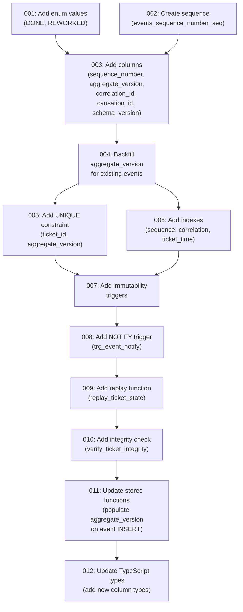

# Event Sourcing Audit Trail Schema

> **Ticket:** FORGEOS-ARCH007 | **Agent:** Architect | **Date:** 2026-03-07
> **Confidence:** HIGH (90%) | **Status:** REVIEWED

---

**Related Documents:**
- [Core Database Schema Architecture](database-schema.md) (FORGEOS-ARCH005)
- [ADR-001: PostgreSQL as Primary State Store](adr/adr-001-postgresql.md)
- [PG Event Sourcing Research](../research/pg-event-sourcing.md) (FORGEOS-RES008)
- [PG Distributed Locking](../research/pg-distributed-locking.md) (FORGEOS-RES005)
- [PG Transaction Isolation](../research/pg-transaction-isolation.md) (FORGEOS-RES007)

---

## Table of Contents

1. [Executive Summary](#1-executive-summary)
2. [Context Map](#2-context-map)
3. [Design Principles](#3-design-principles)
4. [Enhanced Event History Table](#4-enhanced-event-history-table)
5. [Event Type Catalog](#5-event-type-catalog)
6. [Payload Schema per Event Type](#6-payload-schema-per-event-type)
7. [Sequence Numbering Strategy](#7-sequence-numbering-strategy)
8. [State Reconstruction Pattern](#8-state-reconstruction-pattern)
9. [LISTEN/NOTIFY Integration](#9-listennotify-integration)
10. [Immutability Enforcement](#10-immutability-enforcement)
11. [Index Strategy](#11-index-strategy)
12. [Event Archival Strategy](#12-event-archival-strategy)
13. [Migration Path](#13-migration-path)
14. [Well-Architected Pillar Assessment](#14-well-architected-pillar-assessment)
15. [ADR-004: Enhanced Hybrid over Full Event Sourcing](#15-adr-004-enhanced-hybrid-over-full-event-sourcing)
16. [Fitness Functions](#16-fitness-functions)
17. [DAG Task Graph](#17-dag-task-graph)

---

## 1. Executive Summary

This document defines the event sourcing audit trail schema for ForgeOS, enhancing the existing `events` table (from FORGEOS-ARCH005) with monotonic sequencing, per-ticket versioning, immutability enforcement, and real-time event streaming via LISTEN/NOTIFY.

The design follows the **enhanced hybrid model** recommended by FORGEOS-RES008: the mutable `tickets` table remains the primary state source, while the `events` table provides a complete, append-only audit trail with replay capability for diagnostics.

### Key Design Decisions

| Decision | Rationale |
|----------|-----------|
| Enhanced hybrid over full ES | RES008 scored hybrid 8.65/10 vs full ES 5.35/10. ForgeOS's scale (≤100K tickets, ≤15 event types) doesn't justify full ES complexity. |
| `BIGSERIAL sequence_number` | Global monotonic ordering eliminates timestamp-collision ambiguity under concurrency. |
| `INTEGER aggregate_version` with UNIQUE constraint | Per-ticket ordering + optimistic concurrency control. Prevents duplicate events. |
| JSONB payload (keep current) | 13+ heterogeneous event types make normalization impractical (30+ mostly-NULL columns). |
| Trigger-based immutability | BEFORE UPDATE/DELETE triggers that raise exceptions — prevents silent data corruption. |
| Event-based NOTIFY trigger | Richer real-time streaming than ticket-only NOTIFY. Enables dashboard SSE and webhook processing. |
| Monthly range partitioning | Plan for >1M events. Partition by `created_at` for query pruning and efficient archival. |

### Schema Enhancement Summary

| Enhancement | Column/Object | Type | Purpose |
|-------------|---------------|------|---------|
| Global ordering | `sequence_number` | BIGSERIAL | Total ordering across all events |
| Per-ticket ordering | `aggregate_version` | INTEGER | Per-ticket monotonic sequence + optimistic concurrency |
| Event correlation | `correlation_id` | UUID | Links related events across tickets |
| Event causation | `causation_id` | UUID | The event that caused this event |
| Schema versioning | `schema_version` | INTEGER | Payload schema evolution tracking |
| Immutability | `trg_events_immutable_*` | TRIGGER | Prevents UPDATE/DELETE on events table |
| Event streaming | `trg_event_notify` | TRIGGER | NOTIFY on event INSERT for real-time consumers |
| Replay function | `replay_ticket_state()` | FUNCTION | Reconstruct ticket state at any point in time |
| Integrity check | `verify_ticket_integrity()` | FUNCTION | Compare mutable state vs. replayed state |

---

## 2. Context Map

### 2.1 Primary Files (Directly Affected)

| File | Role |
|------|------|
| `docs/architecture/event-sourcing-schema.md` | This document — event sourcing schema design |
| `forgeos-server/src/db/migrations/002_event_sourcing_enhancements.sql` | Migration DDL (to be implemented by Backend) |

### 2.2 Secondary Files (Indirectly Affected)

| File | Role |
|------|------|
| `forgeos-server/src/db/migrations/001_initial.sql` | Existing events table definition |
| `forgeos-server/src/types/index.ts` | TypeScript types — needs new column types added |
| `forgeos-server/src/tools/index.ts` | MCP tool handlers — stored functions to be updated |
| `docs/architecture/database-schema.md` | Cross-reference to events table documentation |
| `docs/database/schema-reference.md` | Schema reference needs updating |

### 2.3 Established Patterns (Upheld)

| Pattern | Evidence | Upheld |
|---------|----------|--------|
| UUID primary keys | All tables use `uuid_generate_v4()` | ✅ |
| TIMESTAMPTZ timestamps | All date columns | ✅ |
| JSONB for flexible data | `payload` column | ✅ |
| Stored function encapsulation | All business logic in PL/pgSQL | ✅ |
| Append-only events | INSERT-only in stored functions | ✅ Enhanced with trigger enforcement |
| snake_case naming | All tables, columns, functions | ✅ |
| TEXT over VARCHAR | No artificial length limits | ✅ |
| Enum-based classification | `event_type` enum | ✅ Extended |

### 2.4 Dependencies

| Dependency | Type | Status |
|------------|------|--------|
| FORGEOS-ARCH005 (Database Schema) | Upstream | DONE — provides base `events` table |
| FORGEOS-RES008 (Event Sourcing Research) | Upstream | DONE — recommends enhanced hybrid |
| FORGEOS-RES005 (Distributed Locking) | Research | DONE — FOR UPDATE SKIP LOCKED serializes mutations |
| FORGEOS-RES007 (Transaction Isolation) | Research | DONE — READ COMMITTED sufficient |

---

## 3. Design Principles

### 3.1 Enhanced Hybrid Model

The `tickets` table remains the **single source of truth** for current ticket state. The `events` table is the **complete audit trail** — every state mutation is recorded as an immutable event. This provides:

- **Full audit history** with causal ordering
- **Time-travel debugging** via replay function
- **Real-time streaming** via LISTEN/NOTIFY
- **Integrity verification** by comparing mutable state against replayed events
- **No snapshot management** — the mutable `tickets` table IS the snapshot

### 3.2 Ordering Guarantees

Two-level ordering:

1. **Global ordering** (`sequence_number BIGSERIAL`) — Total ordering across all events in the system. Useful for catch-up polling and global event replay.
2. **Per-ticket ordering** (`aggregate_version INTEGER`) — Monotonic sequence per ticket. Enables optimistic concurrency via UNIQUE constraint. Useful for single-ticket replay and conflict detection.

### 3.3 Immutability

Events are **append-only**. Once written, they cannot be modified or deleted. This is enforced at three levels:

1. **Application level** — Stored functions only INSERT into events
2. **RLS level** — Only INSERT and SELECT policies exist; no UPDATE/DELETE policies
3. **Trigger level** — BEFORE UPDATE/DELETE triggers raise exceptions

---

## 4. Enhanced Event History Table

### 4.1 Complete Table Definition

This is the enhanced `events` table, building on the base definition from FORGEOS-ARCH005:

```sql
-- Enhanced events table (Migration 002)
-- Base columns from 001_initial.sql are unchanged.
-- New columns are added via ALTER TABLE.

CREATE TABLE events (
    -- === Identity ===
    id                  UUID PRIMARY KEY DEFAULT uuid_generate_v4(),

    -- === Aggregate Reference ===
    ticket_id           TEXT NOT NULL,

    -- === Event Classification ===
    event_type          event_type NOT NULL,

    -- === Actor Information (frozen at event time) ===
    agent_id            UUID REFERENCES agents(id) ON DELETE SET NULL,
    agent_name          TEXT,                   -- Denormalized, frozen at event time
    machine_id          TEXT,                   -- Machine hostname at event time
    operator            TEXT,                   -- Human operator name

    -- === State Transition (normalized common fields) ===
    previous_stage      ticket_stage,           -- Stage before transition
    new_stage           ticket_stage,           -- Stage after transition
    previous_status     ticket_status,          -- Status before change
    new_status          ticket_status,          -- Status after change

    -- === Event-Specific Data ===
    payload             JSONB NOT NULL DEFAULT '{}'::JSONB,

    -- === Ordering & Sequencing (NEW in Migration 002) ===
    sequence_number     BIGINT NOT NULL DEFAULT nextval('events_sequence_number_seq'),
    aggregate_version   INTEGER NOT NULL,

    -- === Correlation & Causation (NEW in Migration 002) ===
    correlation_id      UUID,                   -- Links related events across tickets
    causation_id        UUID,                   -- The event that caused this event

    -- === Schema Evolution (NEW in Migration 002) ===
    schema_version      INTEGER NOT NULL DEFAULT 1,

    -- === Timestamp ===
    created_at          TIMESTAMPTZ NOT NULL DEFAULT NOW(),

    -- === Constraints ===
    CONSTRAINT unique_aggregate_version UNIQUE (ticket_id, aggregate_version)
);

-- Global sequence for monotonic ordering
CREATE SEQUENCE IF NOT EXISTS events_sequence_number_seq;
```

### 4.2 Column Reference

| Column | Type | Nullable | Default | Purpose | ES Pattern |
|--------|------|----------|---------|---------|------------|
| `id` | UUID | NO | `uuid_generate_v4()` | Row identity | Standard |
| `ticket_id` | TEXT | NO | — | Aggregate identifier — groups events by ticket | Aggregate root ID |
| `event_type` | event_type | NO | — | Event classification (ENUM) | Domain event type |
| `agent_id` | UUID | YES | — | Acting agent (FK) | Actor reference |
| `agent_name` | TEXT | YES | — | Agent name, frozen at event time | Denormalized actor |
| `machine_id` | TEXT | YES | — | Machine hostname, frozen at event time | Origin metadata |
| `operator` | TEXT | YES | — | Human operator name | Origin metadata |
| `previous_stage` | ticket_stage | YES | — | Stage before transition | Before-state |
| `new_stage` | ticket_stage | YES | — | Stage after transition | After-state |
| `previous_status` | ticket_status | YES | — | Status before change | Before-state |
| `new_status` | ticket_status | YES | — | Status after change | After-state |
| `payload` | JSONB | NO | `'{}'` | Event-specific data (see §6) | Event data |
| `sequence_number` | BIGINT | NO | `nextval(...)` | Global monotonic sequence | Global position |
| `aggregate_version` | INTEGER | NO | — | Per-ticket monotonic sequence | Stream version |
| `correlation_id` | UUID | YES | — | Links related events across tickets | Correlation ID |
| `causation_id` | UUID | YES | — | The event that caused this event | Causation ID |
| `schema_version` | INTEGER | NO | `1` | Payload schema version for evolution | Schema versioning |
| `created_at` | TIMESTAMPTZ | NO | `NOW()` | Wall-clock event timestamp | Event timestamp |

### 4.3 Per-Event Storage Size

| Component | Size |
|-----------|------|
| Row header (HeapTupleHeaderData) | 23 bytes |
| Null bitmap (20 columns) | 4 bytes |
| UUID `id` | 16 bytes |
| TEXT `ticket_id` (avg ~18 chars) | ~22 bytes |
| ENUM `event_type` | 4 bytes |
| UUID `agent_id` | 16 bytes |
| TEXT `agent_name` (avg ~20 chars) | ~24 bytes |
| TEXT `machine_id` (avg ~10 chars) | ~14 bytes |
| TEXT `operator` (avg ~10 chars) | ~14 bytes |
| ENUM `previous_stage` | 4 bytes |
| ENUM `new_stage` | 4 bytes |
| ENUM `previous_status` | 4 bytes |
| ENUM `new_status` | 4 bytes |
| JSONB `payload` (avg) | ~200 bytes |
| BIGINT `sequence_number` | 8 bytes |
| INTEGER `aggregate_version` | 4 bytes |
| UUID `correlation_id` | 16 bytes |
| UUID `causation_id` | 16 bytes |
| INTEGER `schema_version` | 4 bytes |
| TIMESTAMPTZ `created_at` | 8 bytes |
| **Total per row** | **~410 bytes** |
| With alignment/padding | **~440 bytes** |
| With indexes (B-tree + GIN overhead) | **~660 bytes effective** |

---

## 5. Event Type Catalog

### 5.1 Enhanced event_type Enum

The existing `event_type` enum from FORGEOS-ARCH005 covers 13 types. This design adds 2 additional types to satisfy the acceptance criteria requirement for `DONE` and explicit `REWORKED` events:

```sql
-- Enhanced event_type enum (Migration 002)
-- Existing types are preserved. New types appended.
ALTER TYPE event_type ADD VALUE IF NOT EXISTS 'DONE';
ALTER TYPE event_type ADD VALUE IF NOT EXISTS 'REWORKED';
```

### 5.2 Complete Event Type Catalog

| Event Type | Category | Description | Trigger |
|-----------|----------|-------------|---------|
| **CREATED** | Lifecycle | Ticket created and entered the system | `tickets.py --parse` or manual creation |
| **CLAIMED** | Claim | Agent acquired a claim lock on the ticket | `claim_ticket()` / `claim_ticket_by_id()` |
| **RELEASED** | Claim | Agent voluntarily released claim | `release_ticket()` |
| **FORCE_RELEASED** | Claim | Admin/system forced a claim release | `release_expired_claims()` or admin action |
| **STAGE_ADVANCED** | Lifecycle | Ticket moved to next SDLC stage | `advance_ticket()` |
| **STAGE_REJECTED** | Lifecycle | Ticket sent back to implementation stage for rework | `reject_ticket()` |
| **REWORKED** | Lifecycle | Ticket re-entered implementation after rejection (rework started) | Agent re-claims after rejection |
| **ESCALATED** | Lifecycle | Rework limit exceeded; requires human intervention | `reject_ticket()` when `rework_count >= max_reworks` |
| **DONE** | Lifecycle | Ticket completed final validation and entered DONE state | `advance_ticket()` to DONE stage |
| **UPDATED** | Metadata | Ticket metadata or fields updated (e.g., dependency resolution) | `resolve_dependencies()` or manual update |
| **SPAWNED** | Hierarchy | Sub-ticket created from this ticket | TODO agent decomposition |
| **LEASE_EXTENDED** | Claim | Agent extended their claim lease duration | `extend_lease()` |
| **RECONCILED** | System | State reconciliation applied to fix inconsistency | Reconciliation cron or admin action |
| **FILE_LOCKED** | File Ops | File lock acquired for this ticket | `claim_ticket_by_id()` |
| **FILE_UNLOCKED** | File Ops | File lock released | `advance_ticket()`, `reject_ticket()`, `release_ticket()` |

### 5.3 Event Type Lifecycle Flow

```
CREATED ──► CLAIMED ──► STAGE_ADVANCED ──► CLAIMED ──► STAGE_ADVANCED ──► ... ──► DONE
                │              │
                ▼              ▼
            RELEASED     STAGE_REJECTED ──► REWORKED ──► CLAIMED ──► STAGE_ADVANCED
                │                                                          │
                ▼                                                     (if rework_count
          FORCE_RELEASED                                              >= max_reworks)
                                                                          │
                                                                          ▼
                                                                      ESCALATED

Side events (may occur at any stage):
    LEASE_EXTENDED, FILE_LOCKED, FILE_UNLOCKED, UPDATED, SPAWNED, RECONCILED
```

### 5.4 Event Frequency Estimates

| Event Type | Frequency per Ticket | Notes |
|-----------|---------------------|-------|
| CREATED | 1 | Exactly once |
| CLAIMED | 6–10 | Once per SDLC stage + rework re-claims |
| RELEASED | 0–2 | Uncommon — voluntary release |
| FORCE_RELEASED | 0–1 | Rare — expired lease cleanup |
| STAGE_ADVANCED | 6–8 | Once per successful stage transition |
| STAGE_REJECTED | 0–3 | Up to max_reworks times |
| REWORKED | 0–3 | Matches STAGE_REJECTED count |
| ESCALATED | 0–1 | Rare — terminal state |
| DONE | 0–1 | Once if ticket completes successfully |
| UPDATED | 0–5 | Dependency resolution, metadata changes |
| SPAWNED | 0–3 | Sub-ticket creation |
| LEASE_EXTENDED | 0–3 | Agent requests more time |
| FILE_LOCKED | 1–10 | Per file in file_paths |
| FILE_UNLOCKED | 1–10 | Matches FILE_LOCKED |
| RECONCILED | 0–1 | Rare — integrity fix |
| **Total (happy path)** | **~20 events** | |
| **Total (with rework)** | **~35 events** | |
| **Total (worst case, 3 reworks)** | **~60 events** | |

---

## 6. Payload Schema per Event Type

Each event type carries specific data in the JSONB `payload` column. The schemas below define the expected structure for `schema_version = 1`.

### 6.1 CREATED

```jsonc
{
  // Ticket creation metadata
  "title": "string",                    // Ticket title
  "type": "string",                     // Ticket type (backend, frontend, etc.)
  "priority": "string",                 // Priority level
  "depends_on": ["string"],             // Dependency list at creation time
  "file_paths": ["string"],             // Scoped file paths
  "acceptance_criteria": ["string"],    // AC list
  "source_task_file": "string | null",  // Origin task file
  "tags": ["string"]                    // Classification tags
}
```

### 6.2 CLAIMED

```jsonc
{
  // Claim acquisition details
  "lease_expiry": "ISO8601 string",     // When the lease expires
  "lease_minutes": 30,                  // Lease duration in minutes
  "file_locks_acquired": ["string"]     // File paths locked (if any)
}
```

### 6.3 RELEASED

```jsonc
{
  // Voluntary claim release
  "reason": "string | null",           // Optional reason for release
  "file_locks_released": ["string"]    // File paths unlocked
}
```

### 6.4 FORCE_RELEASED

```jsonc
{
  // Forced release (lease expiry or admin action)
  "reason": "string",                  // "lease_expired" | "admin_release" | "agent_revoked"
  "original_agent": "string",          // Agent that held the claim
  "original_machine": "string",        // Machine that held the claim
  "lease_was_expired_at": "ISO8601 string",  // Original lease expiry
  "file_locks_released": ["string"]    // File paths unlocked
}
```

### 6.5 STAGE_ADVANCED

```jsonc
{
  // Stage advancement with evidence
  "evidence": {                         // Stage completion evidence (varies by stage)
    "test_results": "string | null",    // QA: test output summary
    "coverage": 85.2,                   // QA: coverage percentage
    "lint_errors": 0,                   // CI: lint error count
    "lint_warnings": 0,                 // CI: lint warning count
    "type_check_pass": true,            // CI: TypeScript type-check result
    "security_findings": [],            // Security: vulnerability list
    "doc_updated": true,                // Docs: documentation was updated
    "validator_verdict": "APPROVED"     // Validation: final review verdict
  },
  "summary_file": "string | null",     // Path to agent output summary
  "artifacts": ["string"],             // Files created/modified
  "file_locks_released": ["string"],   // File paths unlocked on advance
  "confidence": "string"               // HIGH | MEDIUM | LOW
}
```

### 6.6 STAGE_REJECTED

```jsonc
{
  // Stage rejection with evidence
  "reason": "string",                  // Human-readable rejection reason
  "evidence": {                        // Rejection evidence (varies by rejecting agent)
    "failing_tests": ["string"],       // QA: list of failing test names
    "coverage_gap": 12.5,              // QA: coverage shortfall
    "vulnerabilities": [],             // Security: found vulnerabilities
    "lint_errors": 3,                  // CI: error count
    "missing_docs": ["string"]         // Docs: undocumented items
  },
  "rework_count": 1,                   // Current rework count after rejection
  "max_reworks": 3,                    // Maximum allowed before escalation
  "return_to_stage": "string",         // Stage ticket returns to (e.g., "BACKEND")
  "file_locks_released": ["string"]    // File paths unlocked on rejection
}
```

### 6.7 REWORKED

```jsonc
{
  // Rework commencement
  "rework_number": 1,                  // Which rework iteration (1, 2, or 3)
  "rejection_event_id": "UUID",        // Reference to the STAGE_REJECTED event
  "rejection_reason": "string",        // Copied from rejection for convenience
  "addressing_criteria": ["string"]    // Specific rejection points being addressed
}
```

### 6.8 ESCALATED

```jsonc
{
  // Escalation to human (rework limit exceeded)
  "reason": "string",                  // "rework_limit_exceeded" | "manual_escalation"
  "rework_count": 3,                   // Final rework count
  "max_reworks": 3,                    // Maximum that was allowed
  "rejection_history": [               // Summary of all rejection reasons
    {
      "rework": 1,
      "reason": "string",
      "agent": "string"
    }
  ],
  "recommended_action": "string | null"  // Suggested resolution
}
```

### 6.9 DONE

```jsonc
{
  // Ticket completion
  "completed_at": "ISO8601 string",    // Completion timestamp
  "total_events": 25,                  // Total events in this ticket's history
  "total_reworks": 0,                  // Total rework cycles
  "elapsed_hours": 4.5,               // Total time from CREATED to DONE
  "stage_durations": {                 // Time spent in each stage (hours)
    "BACKEND": 1.2,
    "QA": 0.5,
    "SECURITY": 0.3,
    "CI": 0.1,
    "DOCUMENTATION": 0.4,
    "VALIDATOR": 0.2
  },
  "dependencies_resolved": ["string"]  // Downstream tickets unblocked by completion
}
```

### 6.10 UPDATED

```jsonc
{
  // Metadata or field update
  "action": "string",                  // "dependency_resolved" | "metadata_update" | "priority_change" | etc.
  "changes": {                         // Key-value of changed fields
    "field_name": {
      "old": "any",
      "new": "any"
    }
  },
  "resolved_by": "string | null"       // Ticket ID that resolved this dependency (if applicable)
}
```

### 6.11 SPAWNED

```jsonc
{
  // Sub-ticket creation
  "child_ticket_id": "string",         // The spawned ticket's ID
  "child_title": "string",             // Spawned ticket title
  "child_type": "string",              // Spawned ticket type
  "decomposition_level": "string"      // L1 | L2 | L3
}
```

### 6.12 LEASE_EXTENDED

```jsonc
{
  // Lease extension
  "previous_expiry": "ISO8601 string", // Old lease expiry
  "new_expiry": "ISO8601 string",      // New lease expiry
  "extension_minutes": 30,             // Minutes added
  "reason": "string | null"            // Reason for extension
}
```

### 6.13 RECONCILED

```jsonc
{
  // State reconciliation
  "reconciliation_type": "string",     // "state_mismatch" | "orphaned_lock" | "stale_claim"
  "before_state": {},                  // State before reconciliation
  "after_state": {},                   // State after reconciliation
  "discrepancies": ["string"]          // List of detected discrepancies
}
```

### 6.14 FILE_LOCKED

```jsonc
{
  // File lock acquisition
  "file_path": "string",              // Locked file path
  "lock_id": "UUID"                   // file_locks table row ID
}
```

### 6.15 FILE_UNLOCKED

```jsonc
{
  // File lock release
  "file_path": "string",              // Released file path
  "lock_id": "UUID",                  // file_locks table row ID
  "held_duration_seconds": 120        // How long the lock was held
}
```

### 6.16 Payload Schema Summary Table

| Event Type | Required Keys | Optional Keys | Avg Size |
|-----------|--------------|---------------|----------|
| CREATED | title, type, priority, depends_on, file_paths, acceptance_criteria | source_task_file, tags | ~500 bytes |
| CLAIMED | lease_expiry, lease_minutes | file_locks_acquired | ~150 bytes |
| RELEASED | — | reason, file_locks_released | ~100 bytes |
| FORCE_RELEASED | reason, original_agent, original_machine | lease_was_expired_at, file_locks_released | ~250 bytes |
| STAGE_ADVANCED | evidence | summary_file, artifacts, file_locks_released, confidence | ~400 bytes |
| STAGE_REJECTED | reason, evidence, rework_count, max_reworks, return_to_stage | file_locks_released | ~350 bytes |
| REWORKED | rework_number, rejection_event_id | rejection_reason, addressing_criteria | ~200 bytes |
| ESCALATED | reason, rework_count, max_reworks, rejection_history | recommended_action | ~500 bytes |
| DONE | completed_at, total_events, total_reworks, elapsed_hours | stage_durations, dependencies_resolved | ~350 bytes |
| UPDATED | action, changes | resolved_by | ~200 bytes |
| SPAWNED | child_ticket_id, child_title, child_type | decomposition_level | ~150 bytes |
| LEASE_EXTENDED | previous_expiry, new_expiry, extension_minutes | reason | ~150 bytes |
| RECONCILED | reconciliation_type, before_state, after_state | discrepancies | ~400 bytes |
| FILE_LOCKED | file_path, lock_id | — | ~100 bytes |
| FILE_UNLOCKED | file_path, lock_id | held_duration_seconds | ~120 bytes |

All payloads are well within the 8KB LISTEN/NOTIFY limit. Maximum realistic payload (ESCALATED with full rejection history): ~2KB.

---

## 7. Sequence Numbering Strategy

### 7.1 Two-Level Ordering

ForgeOS uses two complementary sequence numbers:

#### Global Sequence (`sequence_number`)

- **Type:** BIGINT backed by a PostgreSQL SEQUENCE (`events_sequence_number_seq`)
- **Scope:** All events across all tickets
- **Property:** Monotonically increasing, gap-tolerant (transaction rollbacks create gaps)
- **Purpose:** Total ordering for catch-up polling, global replay, system-wide event timeline
- **Assigned by:** `DEFAULT nextval('events_sequence_number_seq')` — automatic on INSERT

```sql
CREATE SEQUENCE events_sequence_number_seq;

ALTER TABLE events ADD COLUMN sequence_number BIGINT
    NOT NULL DEFAULT nextval('events_sequence_number_seq');

CREATE INDEX idx_events_sequence ON events(sequence_number);
```

**Gap tolerance:** PostgreSQL SEQUENCE guarantees monotonicity but NOT gaplessness. A rolled-back transaction consumes a sequence value without producing an event row. This is by design — consumers must handle gaps by treating `sequence_number` as an opaque ordering key, not a count.

#### Per-Ticket Version (`aggregate_version`)

- **Type:** INTEGER
- **Scope:** Per ticket (aggregate)
- **Property:** Monotonically increasing, gapless within a ticket, starts at 1
- **Purpose:** Per-ticket event ordering, optimistic concurrency control
- **Assigned by:** Stored functions compute `MAX(aggregate_version) + 1` for the ticket within the same transaction

```sql
ALTER TABLE events ADD COLUMN aggregate_version INTEGER NOT NULL;

-- Unique constraint: prevents duplicate versions per ticket
-- Also serves as optimistic concurrency control
CREATE UNIQUE INDEX idx_events_aggregate_version
    ON events(ticket_id, aggregate_version);
```

**Gapless guarantee:** Because `aggregate_version` is computed within the same transaction that holds the ticket lock (`SELECT ... FOR UPDATE`), it is gapless per ticket. Concurrent attempts to insert the same version fail with a unique constraint violation — the second inserter retries with the correct version.

### 7.2 Sequence Assignment in Stored Functions

Every stored function that inserts events must compute `aggregate_version`:

```sql
-- Pattern used in all event-emitting stored functions
INSERT INTO events (
    ticket_id, event_type, agent_id, agent_name, machine_id, operator,
    previous_stage, new_stage, previous_status, new_status,
    payload, aggregate_version, schema_version
)
VALUES (
    v_ticket.ticket_id, 'CLAIMED', p_agent_id, v_agent.name, p_machine_id, p_operator,
    v_ticket.stage, v_ticket.stage, v_ticket.status, 'CLAIMED',
    jsonb_build_object('lease_expiry', v_lease_expiry, 'lease_minutes', v_lease_minutes),
    -- Compute next aggregate_version for this ticket
    COALESCE(
        (SELECT MAX(aggregate_version) FROM events WHERE ticket_id = v_ticket.ticket_id),
        0
    ) + 1,
    1  -- schema_version
);
```

### 7.3 Ordering Queries

```sql
-- Global timeline (all events, ordered)
SELECT * FROM events ORDER BY sequence_number ASC;

-- Per-ticket history (ordered by aggregate_version)
SELECT * FROM events
WHERE ticket_id = 'FORGEOS-ARCH007'
ORDER BY aggregate_version ASC;

-- Catch-up polling (events since last processed)
SELECT * FROM events
WHERE sequence_number > $1  -- last_processed_sequence_number
ORDER BY sequence_number ASC
LIMIT 100;

-- Events in a time window
SELECT * FROM events
WHERE created_at BETWEEN '2026-03-01' AND '2026-03-07'
ORDER BY sequence_number ASC;
```

---

## 8. State Reconstruction Pattern

### 8.1 Overview

State reconstruction ("event replay") rebuilds a ticket's current state by processing its events in `aggregate_version` order. In the enhanced hybrid model, this is a **diagnostic function** — not the primary state source. Use cases:

1. **Time-travel debugging** — "What was this ticket's state at 3pm yesterday?"
2. **Audit verification** — "Does the mutable `tickets` row match the event stream?"
3. **Incident investigation** — "What sequence of events led to this invalid state?"
4. **Migration validation** — "After schema changes, does replay produce the same state?"

### 8.2 Replay Function

```sql
CREATE OR REPLACE FUNCTION replay_ticket_state(
    p_ticket_id TEXT,
    p_as_of TIMESTAMPTZ DEFAULT NOW()
)
RETURNS JSONB AS $$
DECLARE
    v_state JSONB := '{}'::JSONB;
    v_event RECORD;
    v_rework_count INTEGER := 0;
BEGIN
    FOR v_event IN
        SELECT event_type, agent_name, machine_id, operator,
               previous_stage, new_stage, previous_status, new_status,
               payload, created_at, aggregate_version
        FROM events
        WHERE ticket_id = p_ticket_id
          AND created_at <= p_as_of
        ORDER BY aggregate_version ASC
    LOOP
        CASE v_event.event_type
            WHEN 'CREATED' THEN
                v_state := jsonb_build_object(
                    'ticket_id', p_ticket_id,
                    'status', 'BLOCKED',
                    'stage', 'READY',
                    'claimed_by', NULL,
                    'machine_id', NULL,
                    'operator', NULL,
                    'rework_count', 0,
                    'created_at', v_event.created_at,
                    'version', v_event.aggregate_version
                ) || COALESCE(v_event.payload, '{}'::JSONB);

            WHEN 'CLAIMED' THEN
                v_state := v_state || jsonb_build_object(
                    'status', COALESCE(v_event.new_status::TEXT, 'CLAIMED'),
                    'claimed_by', v_event.agent_name,
                    'machine_id', v_event.machine_id,
                    'operator', v_event.operator,
                    'lease_expiry', v_event.payload->>'lease_expiry',
                    'version', v_event.aggregate_version
                );

            WHEN 'RELEASED', 'FORCE_RELEASED' THEN
                v_state := v_state || jsonb_build_object(
                    'status', 'READY',
                    'claimed_by', NULL,
                    'machine_id', NULL,
                    'operator', NULL,
                    'lease_expiry', NULL,
                    'version', v_event.aggregate_version
                );

            WHEN 'STAGE_ADVANCED' THEN
                v_state := v_state || jsonb_build_object(
                    'status', COALESCE(v_event.new_status::TEXT, 'READY'),
                    'stage', COALESCE(v_event.new_stage::TEXT, v_state->>'stage'),
                    'claimed_by', NULL,
                    'machine_id', NULL,
                    'operator', NULL,
                    'version', v_event.aggregate_version
                );

            WHEN 'STAGE_REJECTED', 'REWORKED' THEN
                v_rework_count := v_rework_count + 1;
                v_state := v_state || jsonb_build_object(
                    'status', 'READY',
                    'stage', COALESCE(v_event.new_stage::TEXT, v_state->>'stage'),
                    'claimed_by', NULL,
                    'machine_id', NULL,
                    'operator', NULL,
                    'rework_count', v_rework_count,
                    'rework_reason', v_event.payload->>'reason',
                    'version', v_event.aggregate_version
                );

            WHEN 'ESCALATED' THEN
                v_state := v_state || jsonb_build_object(
                    'status', 'ESCALATED',
                    'escalation_reason', v_event.payload->>'reason',
                    'rework_count', v_rework_count,
                    'version', v_event.aggregate_version
                );

            WHEN 'DONE' THEN
                v_state := v_state || jsonb_build_object(
                    'status', 'DONE',
                    'stage', 'DONE',
                    'completed_at', v_event.created_at,
                    'version', v_event.aggregate_version
                );

            WHEN 'LEASE_EXTENDED' THEN
                v_state := v_state || jsonb_build_object(
                    'lease_expiry', v_event.payload->>'new_expiry',
                    'version', v_event.aggregate_version
                );

            WHEN 'UPDATED' THEN
                -- Merge payload changes into state
                IF v_event.payload ? 'changes' THEN
                    v_state := v_state || jsonb_build_object(
                        'version', v_event.aggregate_version
                    );
                ELSE
                    v_state := v_state || v_event.payload || jsonb_build_object(
                        'version', v_event.aggregate_version
                    );
                END IF;

            ELSE
                -- Unknown or informational events: update version only
                v_state := v_state || jsonb_build_object(
                    'version', v_event.aggregate_version
                );
        END CASE;
    END LOOP;

    -- Return NULL if no events found
    IF v_state = '{}'::JSONB THEN
        RETURN NULL;
    END IF;

    RETURN v_state;
END;
$$ LANGUAGE plpgsql STABLE;
```

### 8.3 Integrity Verification Function

Compares the mutable `tickets` row against the replayed event state:

```sql
CREATE OR REPLACE FUNCTION verify_ticket_integrity(p_ticket_id TEXT)
RETURNS JSONB AS $$
DECLARE
    v_current JSONB;
    v_replayed JSONB;
    v_match BOOLEAN;
    v_discrepancies JSONB := '[]'::JSONB;
BEGIN
    -- Get current mutable state
    SELECT jsonb_build_object(
        'status', status::TEXT,
        'stage', stage::TEXT,
        'claimed_by', claimed_by_name,
        'rework_count', rework_count
    ) INTO v_current
    FROM tickets WHERE ticket_id = p_ticket_id;

    IF v_current IS NULL THEN
        RETURN jsonb_build_object(
            'ticket_id', p_ticket_id,
            'error', 'Ticket not found'
        );
    END IF;

    -- Replay state from events
    v_replayed := replay_ticket_state(p_ticket_id);

    IF v_replayed IS NULL THEN
        RETURN jsonb_build_object(
            'ticket_id', p_ticket_id,
            'error', 'No events found for ticket'
        );
    END IF;

    -- Compare key fields
    v_match := (
        v_current->>'status' = v_replayed->>'status' AND
        v_current->>'stage' = v_replayed->>'stage' AND
        COALESCE(v_current->>'claimed_by', '') = COALESCE(v_replayed->>'claimed_by', '') AND
        COALESCE((v_current->>'rework_count')::INTEGER, 0) =
            COALESCE((v_replayed->>'rework_count')::INTEGER, 0)
    );

    -- Build discrepancy list
    IF v_current->>'status' <> v_replayed->>'status' THEN
        v_discrepancies := v_discrepancies || jsonb_build_array(
            jsonb_build_object('field', 'status',
                'current', v_current->>'status',
                'replayed', v_replayed->>'status')
        );
    END IF;

    IF v_current->>'stage' <> v_replayed->>'stage' THEN
        v_discrepancies := v_discrepancies || jsonb_build_array(
            jsonb_build_object('field', 'stage',
                'current', v_current->>'stage',
                'replayed', v_replayed->>'stage')
        );
    END IF;

    RETURN jsonb_build_object(
        'ticket_id', p_ticket_id,
        'integrity_match', v_match,
        'current_state', v_current,
        'replayed_state', v_replayed,
        'discrepancies', v_discrepancies,
        'event_count', (SELECT COUNT(*) FROM events WHERE ticket_id = p_ticket_id),
        'checked_at', NOW()
    );
END;
$$ LANGUAGE plpgsql STABLE;
```

### 8.4 Replay Performance

| Scenario | Events | Estimated Latency | Use Case |
|----------|--------|-------------------|----------|
| Single ticket, 20 events (happy path) | 20 | <1ms | Debugging |
| Single ticket, 50 events (rework) | 50 | ~2ms | Audit |
| Single ticket, 200 events (extreme) | 200 | ~5ms | Investigation |
| Batch integrity check (100 tickets) | ~3,000 | ~200ms | Periodic verification |
| Full replay (1K tickets) | ~30,000 | ~2s | Migration validation |

All single-ticket replays complete under 10ms — fast enough for real-time diagnostic use.

---

## 9. LISTEN/NOTIFY Integration

### 9.1 Architecture

Two NOTIFY channels provide real-time event streaming:

| Channel | Trigger Source | Payload | Consumer |
|---------|---------------|---------|----------|
| `ticket_changes` | `trg_ticket_notify` on `tickets` table | Ticket state summary | Dashboard SSE |
| `ticket_events` | `trg_event_notify` on `events` table (NEW) | Full event metadata | Dashboard SSE, Webhook processor |

### 9.2 Event-Based NOTIFY Trigger

```sql
CREATE OR REPLACE FUNCTION notify_event_created()
RETURNS TRIGGER AS $$
DECLARE
    v_payload TEXT;
BEGIN
    -- Build compact JSON payload (<8000 bytes)
    v_payload := json_build_object(
        'event_id', NEW.id,
        'ticket_id', NEW.ticket_id,
        'event_type', NEW.event_type,
        'agent', NEW.agent_name,
        'machine', NEW.machine_id,
        'prev_stage', NEW.previous_stage,
        'new_stage', NEW.new_stage,
        'prev_status', NEW.previous_status,
        'new_status', NEW.new_status,
        'seq', NEW.sequence_number,
        'version', NEW.aggregate_version,
        'ts', NEW.created_at
    )::TEXT;

    -- Safety check: NOTIFY payload limit is 8000 bytes
    IF length(v_payload) <= 7500 THEN
        PERFORM pg_notify('ticket_events', v_payload);
    ELSE
        -- Truncated notification — consumer must fetch full event by ID
        PERFORM pg_notify('ticket_events', json_build_object(
            'event_id', NEW.id,
            'ticket_id', NEW.ticket_id,
            'event_type', NEW.event_type,
            'seq', NEW.sequence_number,
            'truncated', TRUE
        )::TEXT);
    END IF;

    RETURN NEW;
END;
$$ LANGUAGE plpgsql;

CREATE TRIGGER trg_event_notify
    AFTER INSERT ON events
    FOR EACH ROW EXECUTE FUNCTION notify_event_created();
```

### 9.3 Consumer Architecture

```
┌──────────────────┐    LISTEN ticket_events    ┌──────────────────────┐
│   PostgreSQL     │ ──────────────────────────► │   ForgeOS Server      │
│                  │                             │                        │
│   events INSERT  │    LISTEN ticket_changes    │   ┌── SSE Handler ──┐ │
│   + NOTIFY       │ ──────────────────────────► │   │  Push to         │ │
│                  │                             │   │  dashboard       │ │
│   tickets UPDATE │                             │   └─────────────────┘ │
│   + NOTIFY       │                             │                        │
└──────────────────┘                             │   ┌── Webhook Proc ─┐ │
                                                 │   │  Queue + HTTP    │ │
                                                 │   │  POST to hooks   │ │
                                                 │   └─────────────────┘ │
                                                 └────────────────────────┘
```

### 9.4 Connection Requirements

| Requirement | Detail |
|-------------|--------|
| Dedicated connection | LISTEN requires a persistent PostgreSQL connection, separate from the pooled connections used for queries |
| PgBouncer mode | Session mode required for LISTEN. Transaction mode does NOT support LISTEN. |
| Reconnection | On disconnect, consumer polls from last `sequence_number` to catch up on missed events |
| De-duplication | Consumer tracks `sequence_number` to prevent processing the same event twice |

### 9.5 Catch-Up Polling Pattern

When the LISTEN connection drops and reconnects, the consumer catches up via polling:

```sql
-- Catch-up: fetch events since last processed sequence_number
SELECT id, ticket_id, event_type, agent_name, machine_id,
       previous_stage, new_stage, previous_status, new_status,
       payload, sequence_number, aggregate_version, created_at
FROM events
WHERE sequence_number > $1  -- last_processed_sequence_number
ORDER BY sequence_number ASC
LIMIT 100;
```

This hybrid push/pull pattern provides **at-least-once delivery** without an external message queue:

1. **LISTEN** for real-time notifications (low latency, at-most-once)
2. **Poll** on reconnection from last `sequence_number` (guaranteed catch-up)
3. **De-duplicate** by `sequence_number` (idempotent processing)

---

## 10. Immutability Enforcement

### 10.1 Trigger-Based Prevention

```sql
-- Prevent UPDATE on events table
CREATE OR REPLACE FUNCTION prevent_event_mutation()
RETURNS TRIGGER AS $$
BEGIN
    RAISE EXCEPTION 'IMMUTABLE_TABLE: events table is append-only. % operations are prohibited.',
        TG_OP
        USING HINT = 'Events are immutable audit records. Create a new RECONCILED event instead.';
END;
$$ LANGUAGE plpgsql;

CREATE TRIGGER trg_events_immutable_update
    BEFORE UPDATE ON events FOR EACH ROW
    EXECUTE FUNCTION prevent_event_mutation();

CREATE TRIGGER trg_events_immutable_delete
    BEFORE DELETE ON events FOR EACH ROW
    EXECUTE FUNCTION prevent_event_mutation();
```

### 10.2 Three Layers of Immutability

| Layer | Mechanism | Purpose |
|-------|-----------|---------|
| Application | Stored functions only INSERT | Primary enforcement |
| RLS | No UPDATE/DELETE policies on events | Per-session enforcement |
| Trigger | BEFORE UPDATE/DELETE raises exception | Database-level enforcement, catches any bypass |

---

## 11. Index Strategy

### 11.1 Required Indexes

```sql
-- Global ordering (catch-up polling, system timeline)
CREATE INDEX idx_events_sequence ON events(sequence_number);

-- Per-ticket ordering (ticket history, replay)
CREATE UNIQUE INDEX idx_events_aggregate_version
    ON events(ticket_id, aggregate_version);

-- Ticket event lookup (most common query pattern)
CREATE INDEX idx_events_ticket_id ON events(ticket_id);

-- Event type filtering (audit queries by event type)
CREATE INDEX idx_events_event_type ON events(event_type);

-- Time-range queries (dashboards, reports)
CREATE INDEX idx_events_created_at ON events(created_at);

-- Composite: ticket + time (time-travel per ticket)
CREATE INDEX idx_events_ticket_time ON events(ticket_id, created_at);

-- Agent activity tracking
CREATE INDEX idx_events_agent ON events(agent_id)
    WHERE agent_id IS NOT NULL;

-- Correlation chain lookup
CREATE INDEX idx_events_correlation ON events(correlation_id)
    WHERE correlation_id IS NOT NULL;

-- JSONB payload containment queries (audit/search)
CREATE INDEX idx_events_payload ON events USING GIN (payload jsonb_path_ops);
```

### 11.2 Index Summary

| Index | Type | Columns | Purpose |
|-------|------|---------|---------|
| `idx_events_sequence` | B-tree | `sequence_number` | Global ordering, catch-up polling |
| `idx_events_aggregate_version` | B-tree UNIQUE | `(ticket_id, aggregate_version)` | Per-ticket ordering, optimistic concurrency |
| `idx_events_ticket_id` | B-tree | `ticket_id` | Ticket history lookup |
| `idx_events_event_type` | B-tree | `event_type` | Filter by event type |
| `idx_events_created_at` | B-tree | `created_at` | Time-range queries |
| `idx_events_ticket_time` | B-tree | `(ticket_id, created_at)` | Time-travel per ticket |
| `idx_events_agent` | B-tree (Partial) | `agent_id` WHERE NOT NULL | Agent activity |
| `idx_events_correlation` | B-tree (Partial) | `correlation_id` WHERE NOT NULL | Event chain tracing |
| `idx_events_payload` | GIN | `payload` | JSONB containment queries |

---

## 12. Event Archival Strategy

### 12.1 Approach: Monthly Range Partitioning

At scale (>1M events), partition the `events` table by `created_at` using PostgreSQL native range partitioning:

```sql
-- Convert events to range-partitioned table
-- This is a migration that creates a new partitioned table and migrates data
CREATE TABLE events_partitioned (
    LIKE events INCLUDING ALL
) PARTITION BY RANGE (created_at);

-- Create monthly partitions
CREATE TABLE events_y2026m01 PARTITION OF events_partitioned
    FOR VALUES FROM ('2026-01-01') TO ('2026-02-01');
CREATE TABLE events_y2026m02 PARTITION OF events_partitioned
    FOR VALUES FROM ('2026-02-01') TO ('2026-03-01');
CREATE TABLE events_y2026m03 PARTITION OF events_partitioned
    FOR VALUES FROM ('2026-03-01') TO ('2026-04-01');
-- ... future partitions created by pg_partman or scheduled function
```

### 12.2 Partition Management

| Operation | Mechanism | Frequency |
|-----------|-----------|-----------|
| Create future partitions | `pg_partman` extension or scheduled function | Monthly (create 3 months ahead) |
| Archive old partitions | Detach partition → move to archive schema | After retention period |
| Drop archived partitions | `DROP TABLE` on detached partition | Per retention policy |
| Re-attach for investigation | `ALTER TABLE ... ATTACH PARTITION` | On-demand |

### 12.3 Retention Policy

| Tier | Age | Action | Storage |
|------|-----|--------|---------|
| **Hot** | 0–3 months | Full access, all indexes active | Primary tablespace |
| **Warm** | 3–12 months | Read-only, indexes maintained | Primary tablespace |
| **Cold** | 12–24 months | Detached partition, queryable on demand | Archive tablespace or pg_dump |
| **Archived** | >24 months | Exported to compressed backup | Object storage / filesystem |

### 12.4 Archival Queries

```sql
-- Find events eligible for cold storage
SELECT DATE_TRUNC('month', created_at) AS month, COUNT(*) AS event_count
FROM events
WHERE created_at < NOW() - INTERVAL '12 months'
GROUP BY month
ORDER BY month;

-- Detach old partition (makes it a standalone table)
ALTER TABLE events_partitioned DETACH PARTITION events_y2025m01;

-- Export detached partition to compressed file
-- (run via pg_dump in CLI, not SQL)
-- pg_dump -t events_y2025m01 --format=custom -f /archive/events_y2025m01.dump

-- Drop after export
DROP TABLE events_y2025m01;
```

### 12.5 Growth Projections with Partitioning

| Scale | Tickets | Events | Partition Count (Monthly) | Largest Partition |
|-------|---------|--------|--------------------------|-------------------|
| Small (Year 1) | 5,000 | 150,000 | 12 | ~15 MB |
| Medium (Year 2) | 30,000 | 900,000 | 24 | ~30 MB |
| Large (Year 3) | 100,000 | 3,000,000 | 36 | ~60 MB |
| Very Large | 500,000 | 15,000,000 | 48+ | ~200 MB |

Individual partitions remain small (<200 MB), enabling fast VACUUM, efficient index maintenance, and instant archival via `DETACH PARTITION`.

### 12.6 When to Enable Partitioning

| Condition | Action |
|-----------|--------|
| Events < 1M rows | No partitioning needed. Single table with indexes is sufficient. |
| Events 1M–10M rows | Implement monthly range partitioning. |
| Events > 10M rows | Monthly partitioning + pg_partman automation + retention policy. |

**Current recommendation:** Do NOT partition now. The events table will not reach 1M rows until ForgeOS processes ~33K tickets. Plan the partition migration for implementation when approaching 500K events.

---

## 13. Migration Path

### 13.1 Migration 002: Event Sourcing Enhancements

> **Implementation status:** Migration 002 has been implemented as an Alembic
> (Python) migration at `mcp-server/alembic/versions/20260310_000000_002_event_tables.py`
> (ticket FORGEOS-BE003). The file name follows Alembic conventions rather than
> the SQL naming pattern described below. All tables, indexes, triggers, and enum
> extensions specified in this section are present in the implemented migration.
> See [Schema Reference](../../docs/database/schema-reference.md) for the full
> column-level documentation.

All schema changes are delivered as a single migration file: `002_event_sourcing_enhancements.sql`

```sql
-- Migration 002: Event Sourcing Enhancements
-- Ticket: FORGEOS-ARCH007
-- Dependencies: 001_initial.sql
-- Reversible: YES (down migration drops added columns/objects)

BEGIN;

-- ============================================================
-- 1. Add new event_type values
-- ============================================================
ALTER TYPE event_type ADD VALUE IF NOT EXISTS 'DONE';
ALTER TYPE event_type ADD VALUE IF NOT EXISTS 'REWORKED';

COMMIT;
-- Note: ALTER TYPE ADD VALUE cannot run inside a transaction block
-- in PostgreSQL < 12. For PG 12+, it can run inside a transaction
-- with IF NOT EXISTS. Split into separate transaction for safety.

BEGIN;

-- ============================================================
-- 2. Create global sequence for event ordering
-- ============================================================
CREATE SEQUENCE IF NOT EXISTS events_sequence_number_seq;

-- ============================================================
-- 3. Add new columns to events table
-- ============================================================

-- Global monotonic ordering
ALTER TABLE events ADD COLUMN IF NOT EXISTS
    sequence_number BIGINT NOT NULL
    DEFAULT nextval('events_sequence_number_seq');

-- Per-ticket ordering + optimistic concurrency
ALTER TABLE events ADD COLUMN IF NOT EXISTS
    aggregate_version INTEGER;

-- Event chain tracing
ALTER TABLE events ADD COLUMN IF NOT EXISTS
    correlation_id UUID;
ALTER TABLE events ADD COLUMN IF NOT EXISTS
    causation_id UUID;

-- Payload schema versioning
ALTER TABLE events ADD COLUMN IF NOT EXISTS
    schema_version INTEGER NOT NULL DEFAULT 1;

-- ============================================================
-- 4. Backfill aggregate_version for existing events
-- ============================================================
WITH numbered AS (
    SELECT id, ROW_NUMBER() OVER (
        PARTITION BY ticket_id
        ORDER BY created_at ASC, id ASC
    ) AS version
    FROM events
    WHERE aggregate_version IS NULL
)
UPDATE events SET aggregate_version = numbered.version
FROM numbered WHERE events.id = numbered.id;

-- Make aggregate_version NOT NULL after backfill
ALTER TABLE events ALTER COLUMN aggregate_version SET NOT NULL;

-- ============================================================
-- 5. Add indexes
-- ============================================================

-- Global ordering
CREATE INDEX IF NOT EXISTS idx_events_sequence
    ON events(sequence_number);

-- Per-ticket ordering (UNIQUE for optimistic concurrency)
CREATE UNIQUE INDEX IF NOT EXISTS idx_events_aggregate_version
    ON events(ticket_id, aggregate_version);

-- Correlation chain lookup
CREATE INDEX IF NOT EXISTS idx_events_correlation
    ON events(correlation_id) WHERE correlation_id IS NOT NULL;

-- Composite: ticket + time for time-travel queries
CREATE INDEX IF NOT EXISTS idx_events_ticket_time
    ON events(ticket_id, created_at);

-- ============================================================
-- 6. Immutability enforcement triggers
-- ============================================================
CREATE OR REPLACE FUNCTION prevent_event_mutation()
RETURNS TRIGGER AS $$
BEGIN
    RAISE EXCEPTION 'IMMUTABLE_TABLE: events table is append-only. % operations are prohibited.',
        TG_OP
        USING HINT = 'Events are immutable audit records. Create a new RECONCILED event instead.';
END;
$$ LANGUAGE plpgsql;

CREATE TRIGGER trg_events_immutable_update
    BEFORE UPDATE ON events FOR EACH ROW
    EXECUTE FUNCTION prevent_event_mutation();

CREATE TRIGGER trg_events_immutable_delete
    BEFORE DELETE ON events FOR EACH ROW
    EXECUTE FUNCTION prevent_event_mutation();

-- ============================================================
-- 7. Event-based NOTIFY trigger
-- ============================================================
CREATE OR REPLACE FUNCTION notify_event_created()
RETURNS TRIGGER AS $$
DECLARE
    v_payload TEXT;
BEGIN
    v_payload := json_build_object(
        'event_id', NEW.id,
        'ticket_id', NEW.ticket_id,
        'event_type', NEW.event_type,
        'agent', NEW.agent_name,
        'machine', NEW.machine_id,
        'prev_stage', NEW.previous_stage,
        'new_stage', NEW.new_stage,
        'prev_status', NEW.previous_status,
        'new_status', NEW.new_status,
        'seq', NEW.sequence_number,
        'version', NEW.aggregate_version,
        'ts', NEW.created_at
    )::TEXT;

    IF length(v_payload) <= 7500 THEN
        PERFORM pg_notify('ticket_events', v_payload);
    ELSE
        PERFORM pg_notify('ticket_events', json_build_object(
            'event_id', NEW.id,
            'ticket_id', NEW.ticket_id,
            'event_type', NEW.event_type,
            'seq', NEW.sequence_number,
            'truncated', TRUE
        )::TEXT);
    END IF;

    RETURN NEW;
END;
$$ LANGUAGE plpgsql;

CREATE TRIGGER trg_event_notify
    AFTER INSERT ON events
    FOR EACH ROW EXECUTE FUNCTION notify_event_created();

-- ============================================================
-- 8. State reconstruction function
-- ============================================================
-- See §8.2 for full replay_ticket_state() implementation
-- See §8.3 for full verify_ticket_integrity() implementation
-- (Implementations omitted here — defined in the architecture
--  document and to be implemented verbatim by Backend agent)

COMMIT;
```

### 13.2 Migration Checklist

| Step | Risk | Effort | Notes |
|------|------|--------|-------|
| Add enum values (DONE, REWORKED) | LOW | 15 min | Non-breaking, separate transaction |
| Create sequence | LOW | 5 min | No data affected |
| Add columns | LOW | 30 min | Non-blocking for existing reads |
| Backfill aggregate_version | MEDIUM | 1 hr | Requires scanning all existing events |
| Add indexes | LOW | 30 min | `CREATE INDEX CONCURRENTLY` for zero downtime |
| Add immutability triggers | LOW | 15 min | No functional change for correct code |
| Add NOTIFY trigger | LOW | 15 min | Additive — no existing behavior change |
| Add replay functions | LOW | 1 hr | Read-only, no schema impact |
| **Total** | **LOW-MEDIUM** | **~4 hours** | |

---

## 14. Well-Architected Pillar Assessment

### 14.1 Pillar Scores

| Pillar | Score | Assessment |
|--------|-------|------------|
| **Operational Excellence** | 9/10 | Replay function enables time-travel debugging; integrity check catches state divergence; NOTIFY enables real-time monitoring. |
| **Security** | 9/10 | Three-layer immutability prevents tampering; RLS restricts access per agent; append-only eliminates evidence destruction. |
| **Reliability** | 8/10 | UNIQUE constraint prevents duplicate events; sequence_number enables catch-up after failures; integrity verification detects corruption. Minor gap: no cross-region replication strategy. |
| **Performance** | 9/10 | Append-only INSERTs avoid contention; BIGSERIAL is O(1); indexes cover all query patterns; replay is sub-10ms per ticket. |
| **Cost Optimization** | 8/10 | ~660 bytes/event is efficient; partitioning enables archival of old data; no external event store required. Minor gap: index storage overhead for large volumes. |
| **Sustainability** | 9/10 | Standard PostgreSQL patterns; no exotic dependencies; JSONB payload with schema_version enables evolution without migrations. |

### 14.2 Overall: 8.7/10

---

## 15. ADR-004: Enhanced Hybrid over Full Event Sourcing

### Status

ACCEPTED

### Context

ForgeOS needs a reliable audit trail for all ticket state changes. Two approaches were evaluated:
1. **Full Event Sourcing** — derive all state from events; `tickets` table becomes a projection
2. **Enhanced Hybrid** — keep mutable `tickets` table as primary state; enrich `events` table with sequencing and replay

### Decision

Adopt the **Enhanced Hybrid** model.

### Options Considered

| Option | Weighted Score (RES008) | Complexity |
|--------|------------------------|------------|
| Full Event Sourcing | 5.35/10 | HIGH — requires snapshot management, projection rebuilds, eventual consistency handling |
| Enhanced Hybrid | 8.65/10 | LOW-MEDIUM — migration adds columns, triggers, and functions |
| Current Hybrid (no changes) | 7.45/10 | ZERO — but leaves ordering and immutability gaps |

### Consequences

**Positive:**
- Full audit trail with causal ordering
- Time-travel debugging via replay function
- Integrity verification catches bugs in stored functions
- Real-time streaming via LISTEN/NOTIFY
- No snapshot management overhead
- Standard PostgreSQL patterns — team familiarity

**Negative:**
- Theoretical divergence possible between mutable state and event stream (mitigated by integrity verification)
- Not suitable if ForgeOS scales beyond 500K tickets (full ES would be warranted)
- `aggregate_version` computation adds ~0.1ms to each event INSERT

**Risks:**
- Full ES advocates may view hybrid as "doing it wrong" — mitigated by documented ADR justification and RES008 evidence

---

## 16. Fitness Functions

| Metric | Threshold | Measurement |
|--------|-----------|-------------|
| Event INSERT latency (p99) | < 5ms | `EXPLAIN ANALYZE INSERT INTO events ...` |
| Replay latency per ticket (p99) | < 10ms | `EXPLAIN ANALYZE SELECT replay_ticket_state(...)` |
| Integrity check pass rate | 100% | `verify_ticket_integrity()` across all active tickets |
| NOTIFY payload size | < 7500 bytes | `length(v_payload)` in trigger function |
| Sequence gap ratio | < 5% | `(MAX(seq) - COUNT(*)) / MAX(seq)` |
| Events per ticket (avg) | < 50 | `SELECT AVG(cnt) FROM (SELECT COUNT(*) cnt FROM events GROUP BY ticket_id)` |
| Index bloat ratio | < 20% | `pg_stat_user_indexes` + `pgstattuple` |

---

## 17. DAG Task Graph

### 17.1 Implementation Order



### 17.2 Critical Path

```
A/B (parallel) → C → D → E/F (parallel) → G → H → I → J → K → L
```

**Critical path length:** 10 steps (A→C→D→E→G→H→I→J→K→L)

### 17.3 Parallelizable Groups

| Group | Tasks | Dependencies |
|-------|-------|-------------|
| Group 1 | Add enum values (A), Create sequence (B) | None — independent |
| Group 2 | Add UNIQUE constraint (E), Add indexes (F) | Both depend on backfill (D) |

### 17.4 Effort Estimates

| Task | Effort | Agent |
|------|--------|-------|
| 001–008 (Migration DDL) | 4 hours | Backend |
| 009–010 (Functions) | 2 hours | Backend |
| 011 (Update stored functions) | 3 hours | Backend |
| 012 (TypeScript types) | 1 hour | Backend |
| Tests | 4 hours | QA |
| **Total** | **~14 hours** | |

---

*Architecture designed by Architect for FORGEOS-ARCH007. Evidence base: FORGEOS-ARCH005 (database schema), FORGEOS-RES008 (event sourcing research), FORGEOS-RES005 (distributed locking), FORGEOS-RES007 (transaction isolation). Confidence: HIGH (90%).*
