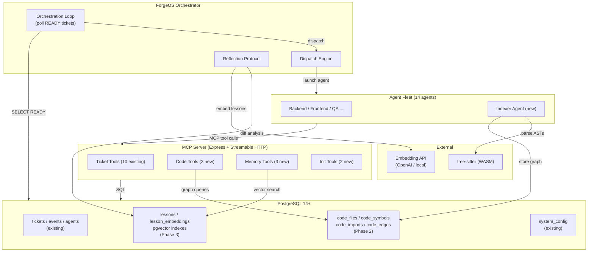
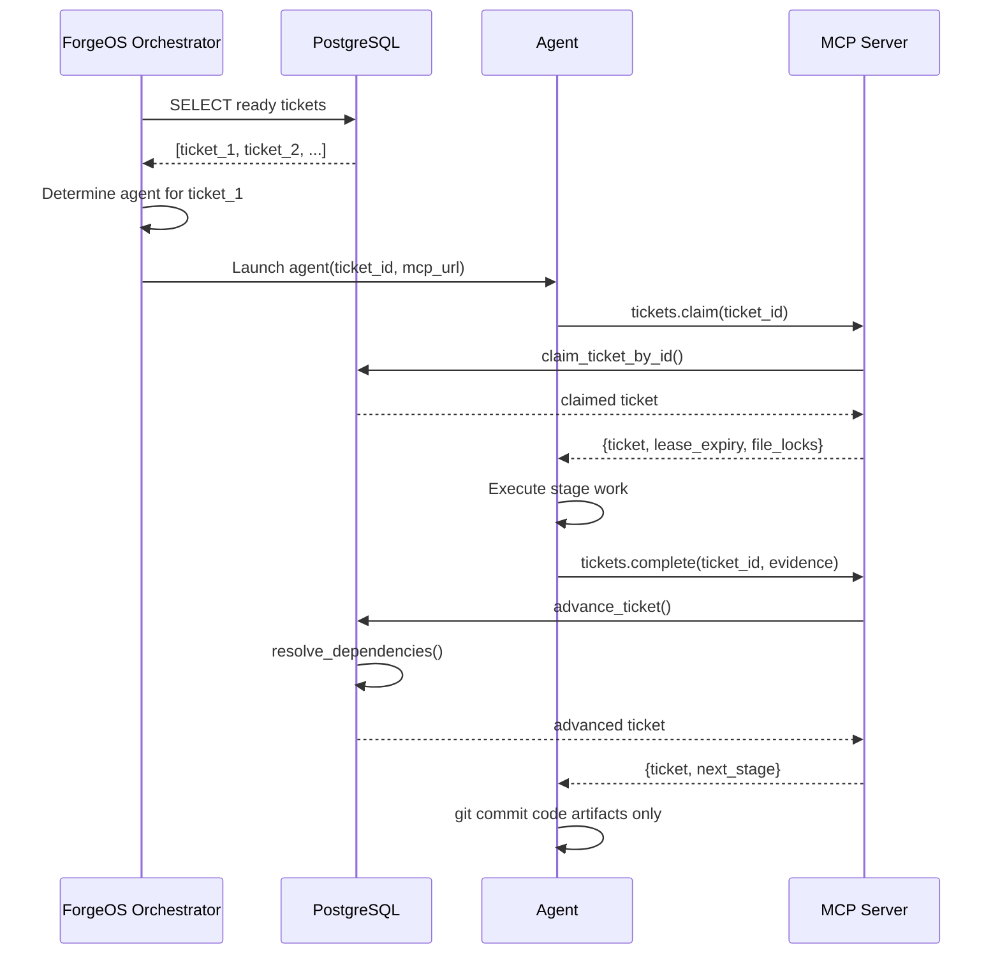
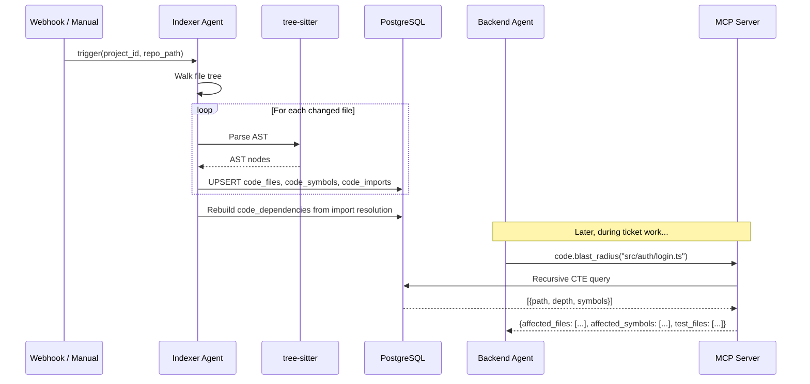
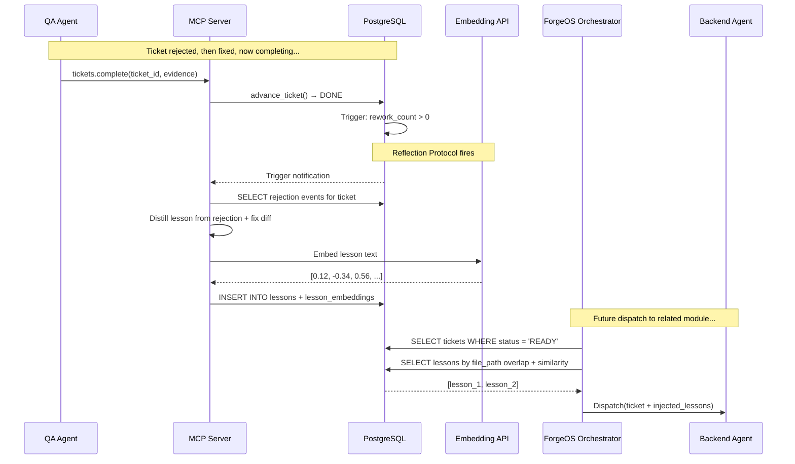
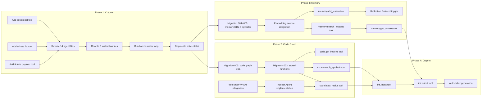

# ForgeOS Intelligence Architecture

> **Author:** Architect Agent  
> **Date:** 2026-03-12  
> **Status:** ALL PHASES IMPLEMENTED  
> **Confidence:** HIGH (95%)  
> **Scope:** Phases 1–4 of the Intelligence Plan  
> **Prerequisite:** Existing ForgeOS MCP Server + PostgreSQL schema (migration 001)  
> **Last Reviewed:** 2026-03-13

---

## Table of Contents

| # | Section |
|---|---------|
| 1 | [Overview](#1-overview) |
| 2 | [System Component Diagram](#2-system-component-diagram) |
| 3 | [Phase 1 — The Cutover](#3-phase-1--the-cutover) |
| 4 | [Phase 2 — The Cognition Engine](#4-phase-2--the-cognition-engine) |
| 5 | [Phase 3 — The Memory Engine](#5-phase-3--the-memory-engine) |
| 6 | [Phase 4 — Drop-In Initialization](#6-phase-4--drop-in-initialization) |
| 7 | [PostgreSQL Schema Extensions](#7-postgresql-schema-extensions) |
| 8 | [MCP Tool Specifications](#8-mcp-tool-specifications) |
| 9 | [API Contracts](#9-api-contracts) |
| 10 | [Migration Strategy](#10-migration-strategy) |
| 11 | [Fitness Functions](#11-fitness-functions) |
| 12 | [DAG Task Graph](#12-dag-task-graph) |
| 13 | [References](#13-references) |

---

## 1. Overview

ForgeOS evolves from a mechanical distributed scheduler into a cognitive, self-healing autonomous development platform. The architecture is structured in four phases, each building on the last:

| Phase | Name | Core Capability | Key Store |
|-------|------|----------------|-----------|
| 1 | Cutover | MCP-only workflow, filesystem severance | PostgreSQL `tickets` (existing) | **IMPLEMENTED** |
| 2 | Cognition Engine | AST-based code graph, blast radius | PostgreSQL `code_*` tables (new) | **IMPLEMENTED** |
| 3 | Memory Engine | Vector-based lessons, self-healing | pgvector `lesson_*` tables (new) | **IMPLEMENTED** |
| 4 | Drop-In Init | Zero-config repo orientation | Orchestrator loop (new) | **IMPLEMENTED** |

**Invariants:**
- PostgreSQL 14+ is the sole source of truth for all mutable state
- Existing 10 MCP tools remain backward-compatible
- All new tools follow the established pattern: Zod schema → handler → stored function → event
- All new tables use additive DDL — no ALTER on existing tables

---

## 2. System Component Diagram



---

## 3. Phase 1 — The Cutover

### 3.1 Problem

Agents and instruction files contain 26+ references to `.github/ticket-state/` directories. Agents read ticket JSON from the filesystem, move files between directories, and commit state changes via `git add`. This creates:
- Race conditions between machines
- Stale state from failed git pushes
- Dual source of truth (filesystem vs PostgreSQL)

### 3.2 Filesystem Reference Inventory

| File Category | Count | References |
|--------------|-------|------------|
| `.github/instructions/*.md` | 6 refs | `core`, `sdlc`, `ticket-system`, `git-protocol`, `agent-behavior` |
| `.github/agents/*.agent.md` | 20+ refs | All 14 agent files include ticket-state paths |
| `agents.md` | 2 refs | Boot sequence, dispatcher scan |
| `.github/tickets.py` | Multiple | Core state machine manager |

### 3.3 New Agent Boot Sequence (MCP-Only)

**Before (filesystem):**
```
1. Read .github/ticket-state/STAGE/{ticket-id}.json
2. Verify claim metadata in JSON
3. Execute work
4. Move JSON to next stage directory
5. git add + git commit + git push
```

**After (MCP-only):**
```
1. Agent receives ticket_id from ForgeOS orchestrator
2. Agent calls tickets.claim(ticket_id, agent_name, machine_id)
3. MCP returns full ticket payload (title, description, AC, file_paths, metadata)
4. Agent executes work
5. Agent calls tickets.complete(ticket_id, agent_name, evidence)
6. MCP atomically advances stage, releases locks, resolves deps
7. Agent commits ONLY code artifacts via git (no ticket JSON)
```

### 3.4 Missing MCP Tools for Cutover

The existing 10 tools cover the lifecycle but agents need read-access tools:

| Tool | Purpose | Gap Filled |
|------|---------|-----------|
| `tickets.get` | Read a specific ticket by ID | Replaces reading `.github/tickets/{id}.json` |
| `tickets.list` | List tickets with filters (stage, status, project) | Replaces scanning `.github/ticket-state/STAGE/` |
| `tickets.payload` | Get dispatch payload (ticket + upstream summary + context) | Replaces reading `.github/agent-output/{Agent}/{id}.md` |

### 3.5 ForgeOS Orchestrator Loop

The orchestrator replaces the stateless Ticketer dispatcher. It is a persistent process (not ephemeral):

```
LOOP every 10 seconds:
  1. SELECT release_expired_claims()
  2. SELECT * FROM tickets 
     WHERE status = 'READY' 
     ORDER BY priority DESC, created_at ASC
  3. FOR EACH ready_ticket:
     a. Determine target agent from ticket.stage + ticket.type
     b. Check agent availability (no active claim by same agent type)
     c. Inject context: ticket payload + upstream summary + memory lessons
     d. Dispatch agent subprocess with MCP connection URL
  4. NOTIFY ticket_changes for dashboard SSE
```

### 3.6 Data Flow — Phase 1



### 3.7 Instruction File Changes Required

| File | Change |
|------|--------|
| `core.instructions.md` | Replace boot step 6 (ticket JSON from filesystem) with `tickets.get` MCP call |
| `sdlc.instructions.md` | Remove "state determined by directory location" rule; replace with "state determined by PostgreSQL `status`+`stage` columns" |
| `ticket-system.instructions.md` | Remove State = Directory Location section; redefine as MCP queries; remove `.github/ticket-state/` directory listing |
| `git-protocol.instructions.md` | Remove CLAIM commit by dispatcher; CLAIM is now an MCP call. Simplify to single WORK commit for code artifacts only |
| `agent-behavior.instructions.md` | Remove "Scan `.github/ticket-state/READY/`" from Ticketer; replace with orchestrator loop |
| All 14 `agents/*.agent.md` | Replace filesystem ticket reads/writes with MCP tool calls |

### 3.8 Phase 1 Completion Status

> **Status:** IMPLEMENTED  
> **Completed:** 2026-03-12  
> **Operational Guide:** [docs/operations/mcp-cutover-guide.md](../operations/mcp-cutover-guide.md)

All Phase 1 deliverables are implemented and tested:

| Deliverable | Artifact | Status |
|-------------|----------|--------|
| 6 instruction files rewritten | `.github/instructions/*.instructions.md` | Done |
| 14 agent files rewritten | `.github/agents/*.agent.md` | Done |
| `tickets.get` MCP tool | `forgeos-server/src/tools/tickets-get.ts` | Done |
| `tickets.list` MCP tool | `forgeos-server/src/tools/tickets-list.ts` | Done |
| `tickets.payload` MCP tool | `forgeos-server/src/tools/tickets-payload.ts` | Done |
| ForgeOS orchestrator service | `forgeos-server/src/services/orchestrator.ts` | Done |
| Filesystem→PostgreSQL migration | `forgeos-server/scripts/migrate-filesystem.ts` | Done |
| Code graph schema (Phase 2 foundation) | Migration 002 DDL | Done |
| Agent SDK wrappers | `agent-sdk/src/forgeos_sdk/operations.py` | Done |
| Agent SDK models | `agent-sdk/src/forgeos_sdk/models.py` | Done |

Key design decisions made during implementation:

- **Orchestrator does not launch agents.** It claims tickets and records
  dispatch events. The external runner is responsible for agent launch.
- **`tickets.payload` reads upstream summaries from disk.** The
  `.github/agent-output/` handoff pattern is preserved; only ticket state
  moved to PostgreSQL.
- **Migration script is idempotent.** Re-running skips existing tickets,
  enabling incremental adoption.
- **Concurrent orchestrator instances are safe.** `SELECT FOR UPDATE SKIP
  LOCKED` prevents double-claiming at the database level.

---

## 4. Phase 2 — The Cognition Engine

### 4.1 Purpose

Provide every agent with instant architectural awareness: given a file or symbol, compute the blast radius (all affected files, symbols, and tests) before making changes.

### 4.2 Indexer Agent Design

The Indexer Agent is a new specialized agent (agent #15) that:

1. **Triggers on:** Project creation, git push webhook, manual invocation
2. **Input:** Project ID + repo root path
3. **Process:**
   - Walk the file tree, filter by supported extensions
   - For each file, compute SHA-256 hash
   - Skip unchanged files (incremental indexing)
   - Parse AST using tree-sitter WASM bindings
   - Extract: files, symbols (functions, classes, methods, variables), imports, exports
   - Store in PostgreSQL via batch INSERT
4. **Output:** Updated code graph in `code_files`, `code_symbols`, `code_imports`, `code_dependencies`

**Supported languages (initial):**
| Language | tree-sitter grammar | Extensions |
|----------|-------------------|------------|
| TypeScript | tree-sitter-typescript | `.ts`, `.tsx` |
| JavaScript | tree-sitter-javascript | `.js`, `.jsx` |
| Python | tree-sitter-python | `.py` |
| SQL | tree-sitter-sql | `.sql` |
| Markdown | tree-sitter-markdown | `.md` |

### 4.3 Incremental Indexing Strategy

```
FOR EACH file in repo:
  hash = SHA-256(file_content)
  existing = SELECT content_hash FROM code_files WHERE path = file.path AND project_id = project_id
  IF existing IS NULL:
    INSERT new file + parse symbols
  ELSE IF existing.content_hash != hash:
    DELETE old symbols for this file
    INSERT updated file + parse symbols
  ELSE:
    SKIP (no change)
```

**Performance target:** Full index of a 10K-file repo < 60 seconds. Incremental re-index < 5 seconds for 10 changed files.

### 4.4 Code Graph Schema (see Section 7 for actual DDL)

> **Note:** The ER diagram below shows the conceptual model. See Section 7
> for the actual production DDL, which uses `code_edges` instead of
> `code_dependencies` and omits `project_id`.

```mermaid
erDiagram
    code_files ||--o{ code_symbols : defines
    code_files ||--o{ code_imports : imports
    code_symbols ||--o{ code_edges : references
    code_symbols ||--o{ code_edges : "is referenced by"

    code_files {
        uuid id PK
        text file_path UNIQUE
        text language
        text content_hash
        int line_count
        timestamptz indexed_at
    }

    code_symbols {
        uuid id PK
        uuid file_id FK
        text name
        text kind
        int start_line
        int end_line
        text signature
        boolean exported
    }

    code_imports {
        uuid id PK
        uuid source_file_id FK
        text target_path
        uuid target_file_id FK
        text[] import_names
        boolean is_default_import
    }

    code_edges {
        uuid id PK
        uuid source_symbol_id FK
        uuid target_symbol_id FK
        text edge_type
        real weight
    }
```

### 4.5 Blast Radius Computation

Given a file path, the blast radius is computed via recursive graph traversal:

```sql
-- Step 1: Find all symbols in the changed file
-- Step 2: Find all symbols that reference those symbols (code_dependencies)
-- Step 3: Find all files containing those referencing symbols
-- Step 4: Find all test files that import any of the affected files
-- Step 5: Return the union with depth annotations
```

The algorithm uses a PostgreSQL recursive CTE:

```sql
WITH RECURSIVE blast AS (
    -- Base: symbols in the changed file
    SELECT cs.id AS symbol_id, cf.path AS file_path, 0 AS depth
    FROM code_symbols cs
    JOIN code_files cf ON cs.file_id = cf.id
    WHERE cf.path = $1 AND cf.project_id = $2

    UNION

    -- Recursive: symbols that depend on the blast set
    SELECT cd.source_symbol_id, cf.path, b.depth + 1
    FROM code_dependencies cd
    JOIN code_symbols cs ON cd.source_symbol_id = cs.id
    JOIN code_files cf ON cs.file_id = cf.id
    JOIN blast b ON cd.target_symbol_id = b.symbol_id
    WHERE b.depth < $3  -- max_depth parameter (default 5)
)
SELECT DISTINCT file_path, MIN(depth) as min_depth, COUNT(DISTINCT symbol_id) as affected_symbols
FROM blast
GROUP BY file_path
ORDER BY min_depth, affected_symbols DESC;
```

### 4.6 Data Flow — Phase 2



---

## 5. Phase 3 — The Memory Engine

### 5.1 Purpose

Build a procedural memory system that extracts lessons from failures, stores them as vector embeddings, and injects relevant context into future agent dispatches. The system becomes permanently immune to past mistakes.

### 5.2 Reflection Protocol

The Reflection Protocol triggers automatically when a ticket transitions from `QA` stage (with rework_count > 0) to `DONE`:

```
TRIGGER: events.event_type = 'STAGE_ADVANCED' AND events.new_stage = 'DONE' 
         AND tickets.rework_count > 0

PIPELINE:
  1. Extract rejection events for this ticket from the events table
  2. Extract the rejection reason + evidence (from events.payload)
  3. Extract the final fix evidence (from the completing stage's evidence)
  4. Generate a distilled lesson:
     - What went wrong (failure pattern)
     - What fixed it (solution pattern)
     - Which files/modules were involved
     - The underlying principle
  5. Embed the lesson text using the configured embedding model
  6. Store in lessons + lesson_embeddings tables
  7. Tag with: project_id, file_paths, agent_role, ticket_type
```

### 5.3 Embedding Model Selection

| Model | Dimensions | Cost | Latency | Quality |
|-------|-----------|------|---------|---------|
| OpenAI text-embedding-3-small | 1536 | $0.02/1M tokens | ~100ms | Good |
| OpenAI text-embedding-3-large | 3072 | $0.13/1M tokens | ~150ms | Excellent |
| Local: all-MiniLM-L6-v2 | 384 | Free | ~10ms | Adequate |

**ADR decision:** Use OpenAI `text-embedding-3-small` (1536 dimensions) as default with configurable fallback to local model. See ADR-005.

### 5.4 Memory Injection Protocol

When ForgeOS dispatches an agent to work on a ticket:

```
1. Extract file_paths from the ticket
2. Extract ticket type and agent role
3. Query lesson_embeddings for:
   a. Cosine similarity > 0.75 against embedded description of the ticket
   b. Overlapping file_paths (array intersection)
   c. Matching agent role
4. Rank by (similarity * 0.6 + recency * 0.2 + relevance_count * 0.2)
5. Inject top 5 lessons into the agent dispatch prompt as:
   "## Past Lessons (auto-injected)
    - [LESSON-001] When modifying auth/login.ts, always validate JWT expiry...
    - [LESSON-002] The billing module requires JSON input sanitization..."
```

### 5.5 Vector Index Strategy

Use pgvector's HNSW index for approximate nearest neighbor search:

```sql
CREATE INDEX idx_lesson_embeddings_hnsw 
ON lesson_embeddings 
USING hnsw (embedding vector_cosine_ops)
WITH (m = 16, ef_construction = 200);
```

**Why HNSW over IVFFlat:**
- HNSW has better recall at low latency (99% recall vs 95% for IVFFlat)
- No need to specify number of clusters upfront
- Better for incremental inserts (no re-training needed)
- Target: < 10ms for top-5 search across 100K embeddings

### 5.6 Data Flow — Phase 3



---

## 6. Phase 4 — Drop-In Initialization

### 6.1 Purpose

Enable ForgeOS to orient itself in any new repository without manual configuration. The system auto-discovers the tech stack, generates initial tickets, and begins autonomous development.

### 6.2 Orientation Loop

```
SEQUENCE (triggered on new project creation):

1. INDEX
   - Indexer Agent scans the entire repo
   - Populates code_files, code_symbols, code_imports, code_dependencies
   - Duration: < 60 seconds for 10K files

2. ANALYZE
   - Architect Agent reads the code graph
   - Detects:
     a. Tech stack (package.json → Node.js, pyproject.toml → Python, etc.)
     b. Entry points (main files, server files, CLI entry points)
     c. Frameworks (Express, Next.js, Django, FastAPI, etc.)
     d. Test frameworks (Jest, Vitest, Pytest, etc.)
     e. CI/CD config (.github/workflows/, Dockerfile, etc.)
   - Generates productContext document stored in the lessons table

3. GENERATE
   - TODO Agent reads the productContext
   - Identifies gaps: missing tests, missing docs, security issues, etc.
   - Auto-generates L3 tickets in READY status
   - Dependencies are auto-resolved by resolve_dependencies()
```

### 6.3 Auto-Discovery Heuristics

| Signal | Detection | Result |
|--------|-----------|--------|
| `package.json` | `dependencies` field | Node.js project; extract framework from deps |
| `tsconfig.json` | Exists | TypeScript project |
| `pyproject.toml` / `setup.py` | Exists | Python project |
| `go.mod` | Exists | Go project |
| `Cargo.toml` | Exists | Rust project |
| `Dockerfile` | Exists | Containerized deployment |
| `docker-compose.yml` | Exists | Multi-service architecture |
| `.github/workflows/` | Contains YAML | CI/CD configured |
| `src/` or `lib/` | Directory exists | Source code location |
| `test/` or `tests/` or `__tests__/` | Directory exists | Test location |
| `*.test.ts` / `*.spec.ts` | File pattern | Test file convention |

### 6.4 MCP Tools for Initialization

| Tool | Purpose |
|------|---------|
| `init.index` | Trigger full repo indexing for a project |
| `init.orient` | Run auto-discovery and generate productContext |

---

## 7. PostgreSQL Schema Extensions (Implemented)

> All DDL below is the **actual production schema** from the applied migrations.

### Migration 003 — Code Graph Tables (Phase 2)

Source: `forgeos-server/src/db/migrations/003-code-graph.sql`

```sql
-- code_files — indexed source files with content hashes
CREATE TABLE IF NOT EXISTS code_files (
  id              UUID PRIMARY KEY DEFAULT gen_random_uuid(),
  file_path       TEXT NOT NULL UNIQUE,
  language        TEXT NOT NULL,             -- 'typescript', 'javascript', 'python', 'sql'
  content_hash    TEXT NOT NULL,             -- SHA-256 for change detection
  line_count      INTEGER NOT NULL DEFAULT 0,
  last_indexed_at TIMESTAMPTZ NOT NULL DEFAULT NOW(),
  created_at      TIMESTAMPTZ NOT NULL DEFAULT NOW(),
  updated_at      TIMESTAMPTZ NOT NULL DEFAULT NOW()
);

-- code_symbols — AST-extracted symbols (functions, classes, methods, etc.)
CREATE TABLE IF NOT EXISTS code_symbols (
  id              UUID PRIMARY KEY DEFAULT gen_random_uuid(),
  file_id         UUID NOT NULL REFERENCES code_files(id) ON DELETE CASCADE,
  name            TEXT NOT NULL,
  qualified_name  TEXT NOT NULL,             -- e.g., 'MyClass.myMethod'
  kind            TEXT NOT NULL,             -- 'function', 'class', 'method', 'interface', 'variable', 'type'
  start_line      INTEGER NOT NULL,
  end_line        INTEGER NOT NULL,
  signature       TEXT,
  exported        BOOLEAN NOT NULL DEFAULT FALSE,
  created_at      TIMESTAMPTZ NOT NULL DEFAULT NOW()
);

-- code_imports — file-level import relationships
CREATE TABLE IF NOT EXISTS code_imports (
  id                UUID PRIMARY KEY DEFAULT gen_random_uuid(),
  source_file_id    UUID NOT NULL REFERENCES code_files(id) ON DELETE CASCADE,
  target_path       TEXT NOT NULL,
  target_file_id    UUID REFERENCES code_files(id) ON DELETE SET NULL,
  import_names      TEXT[] NOT NULL DEFAULT '{}',
  is_default_import BOOLEAN NOT NULL DEFAULT FALSE,
  created_at        TIMESTAMPTZ NOT NULL DEFAULT NOW()
);

-- code_edges — symbol-level call/reference/extension edges
CREATE TABLE IF NOT EXISTS code_edges (
  id                UUID PRIMARY KEY DEFAULT gen_random_uuid(),
  source_symbol_id  UUID NOT NULL REFERENCES code_symbols(id) ON DELETE CASCADE,
  target_symbol_id  UUID NOT NULL REFERENCES code_symbols(id) ON DELETE CASCADE,
  edge_type         TEXT NOT NULL,           -- 'calls', 'references', 'extends', 'implements', 'imports'
  weight            INTEGER NOT NULL DEFAULT 1,
  created_at        TIMESTAMPTZ NOT NULL DEFAULT NOW(),
  UNIQUE(source_symbol_id, target_symbol_id, edge_type)
);
```

#### Stored Functions (Migration 003)

```sql
-- blast_radius(p_file_path TEXT, p_max_depth INT DEFAULT 5) → JSONB
-- Computes the transitive closure of affected symbols via recursive CTE.
-- Returns: { file_path, max_depth, affected_files[], affected_symbols[], total_affected }

-- search_symbols(p_name_pattern TEXT, p_kind TEXT, p_file_path TEXT) → JSONB
-- Filtered ILIKE-based symbol search. All filters optional.
-- Returns: { pattern, kind, file_path, symbols[], total }

-- get_import_chain(p_file_path TEXT) → JSONB
-- Recursive import chain traversal (max depth 20, cycle-safe via UNION).
-- Returns: { file_path, imports[], total }
```

### Migration 004 — pgvector Extension & Code Embeddings (Phase 2)

Source: `forgeos-server/src/db/migrations/004-pgvector.sql`

```sql
CREATE EXTENSION IF NOT EXISTS vector;

-- code_embeddings — vector representations for code symbols and files
CREATE TABLE IF NOT EXISTS code_embeddings (
  id          UUID PRIMARY KEY DEFAULT gen_random_uuid(),
  symbol_id   UUID REFERENCES code_symbols(id) ON DELETE CASCADE,
  file_id     UUID REFERENCES code_files(id) ON DELETE CASCADE,
  embedding   vector(1536) NOT NULL,
  model_name  TEXT NOT NULL DEFAULT 'text-embedding-3-small',
  created_at  TIMESTAMPTZ NOT NULL DEFAULT NOW(),
  CONSTRAINT chk_embedding_target CHECK (symbol_id IS NOT NULL OR file_id IS NOT NULL)
);

-- HNSW index for cosine similarity search
CREATE INDEX IF NOT EXISTS idx_code_embeddings_hnsw
  ON code_embeddings USING hnsw (embedding vector_cosine_ops)
  WITH (m = 16, ef_construction = 200);
```

### Migration 005 — Memory Engine (Phase 3)

Source: `forgeos-server/src/db/migrations/005-memory-engine.sql`

```sql
-- lessons — extracted wisdom from rework cycles
CREATE TABLE IF NOT EXISTS lessons (
  id            UUID PRIMARY KEY DEFAULT gen_random_uuid(),
  ticket_id     TEXT NOT NULL,
  stage         TEXT NOT NULL,
  agent_role    TEXT NOT NULL,
  rework_count  INTEGER NOT NULL DEFAULT 0,
  lesson_text   TEXT NOT NULL,
  category      TEXT NOT NULL DEFAULT 'general',
  tags          TEXT[] NOT NULL DEFAULT '{}',
  context       JSONB DEFAULT '{}',
  created_at    TIMESTAMPTZ NOT NULL DEFAULT NOW(),
  updated_at    TIMESTAMPTZ NOT NULL DEFAULT NOW()
);

-- lesson_embeddings — vector representations for semantic lesson search
CREATE TABLE IF NOT EXISTS lesson_embeddings (
  id          UUID PRIMARY KEY DEFAULT gen_random_uuid(),
  lesson_id   UUID NOT NULL REFERENCES lessons(id) ON DELETE CASCADE,
  embedding   vector(1536) NOT NULL,
  model_name  TEXT NOT NULL DEFAULT 'text-embedding-3-small',
  created_at  TIMESTAMPTZ NOT NULL DEFAULT NOW()
);

-- HNSW index for cosine similarity search over lessons
CREATE INDEX IF NOT EXISTS idx_lesson_embeddings_hnsw
  ON lesson_embeddings USING hnsw (embedding vector_cosine_ops)
  WITH (m = 16, ef_construction = 200);
```

#### Stored Function (Migration 005)

```sql
-- search_similar_lessons(query_embedding, p_category, p_threshold, p_limit) → JSONB
-- Semantic search over lesson embeddings via cosine distance.
-- Parameters:
--   query_embedding  vector(1536)  — query vector
--   p_category       TEXT          — optional category filter (NULL = no filter)
--   p_threshold      FLOAT         — minimum similarity (default 0.7)
--   p_limit          INTEGER       — max results (default 10)
-- Returns: JSONB array of { id, ticket_id, stage, agent_role, rework_count,
--          lesson_text, category, tags, similarity, created_at }
```

---

## 8. MCP Tool Specifications (Implemented)

> All schemas below are the **actual Zod definitions** extracted from the handler source files.

### 8.1 Phase 1 Tools (Cutover)

Phase 1 tools (`tickets.get`, `tickets.list`, `tickets.payload`) are documented in
[MCP Tool Definition Schemas](api/mcp-tool-definitions.md).

### 8.2 Phase 2 Tools (Code Graph)

#### `code.blast_radius`

| Field | Value |
|-------|-------|
| **Name** | `code.blast_radius` |
| **Description** | Compute the transitive closure of files and symbols affected by changes to a given file. |
| **Handler** | `forgeos-server/src/tools/code-blast-radius.ts` |
| **Stored Function** | `blast_radius(p_file_path, p_max_depth)` → JSONB |

```typescript
export const codeBlastRadiusSchema = z.object({
  file_path: z.string().min(1).describe(
    'Path of the changed file to compute blast radius for',
  ),
  max_depth: z.number().int().min(1).max(20).optional().default(5).describe(
    'Maximum traversal depth for dependency graph (1–20, default 5)',
  ),
});

// Output shape:
interface BlastRadiusResult {
  file_path: string;
  max_depth: number;
  affected_files: string[];
  affected_symbols: Array<{
    name: string;
    qualified_name: string;
    kind: string;
    file_path: string;
    depth: number;
  }>;
  total_affected: number;
}
```

#### `code.search_symbols`

| Field | Value |
|-------|-------|
| **Name** | `code.search_symbols` |
| **Description** | Search for code symbols by name pattern with optional kind and file path filters. |
| **Handler** | `forgeos-server/src/tools/code-search-symbols.ts` |
| **Stored Function** | `search_symbols(p_name_pattern, p_kind, p_file_path)` → JSONB |

```typescript
export const codeSearchSymbolsSchema = z.object({
  name_pattern: z.string().min(1).describe(
    'ILIKE pattern for symbol name (e.g., "%Handler%")',
  ),
  kind: z.enum(['function', 'class', 'method', 'interface', 'type', 'variable'])
    .optional().describe('Optional symbol kind filter'),
  file_path: z.string().optional().describe(
    'Optional exact file path filter',
  ),
});

// Output shape:
interface SearchSymbolsResult {
  pattern: string;
  kind: string | null;
  file_path: string | null;
  symbols: SymbolMatch[];
  total: number;
}
```

#### `code.get_imports`

| Field | Value |
|-------|-------|
| **Name** | `code.get_imports` |
| **Description** | Retrieve the transitive import chain for a given file. |
| **Handler** | `forgeos-server/src/tools/code-get-imports.ts` |
| **Stored Function** | `get_import_chain(p_file_path)` → JSONB |

```typescript
export const codeGetImportsSchema = z.object({
  file_path: z.string().min(1).describe(
    'Path of the file to retrieve import chain for',
  ),
  max_depth: z.number().int().min(1).max(50).optional().default(10).describe(
    'Maximum traversal depth for import chain (1–50, default 10)',
  ),
});

// Output shape:
interface ImportChainResult {
  file_path: string;
  imports: Array<{
    target_path: string;
    resolved_path: string | null;
    language: string | null;
    depth: number;
    is_external: boolean;
  }>;
  total: number;
}
```

### 8.3 Phase 3 Tools (Memory Engine)

#### `memory.add_lesson`

| Field | Value |
|-------|-------|
| **Name** | `memory.add_lesson` |
| **Description** | Add a lesson to the memory engine. The text is embedded via OpenAI and stored for semantic retrieval. |
| **Handler** | `forgeos-server/src/tools/memory-add-lesson.ts` |
| **SQL** | `INSERT INTO lessons` + `EmbeddingService.embed()` + `INSERT INTO lesson_embeddings` |

```typescript
export const memoryAddLessonSchema = z.object({
  ticket_id: z.string().min(1).describe('Originating ticket identifier'),
  stage: z.string().min(1).describe('SDLC stage where the lesson was learned'),
  agent_role: z.string().min(1).describe('Role of the agent recording the lesson'),
  lesson_text: z.string().min(10).describe('The lesson content (min 10 characters)'),
  category: z.string().optional().default('general').describe(
    'Broad classification category (default: "general")',
  ),
  tags: z.array(z.string()).optional().default([]).describe(
    'Fine-grained labels for filtered retrieval',
  ),
});

// Output: { lesson_id: string, embedded: boolean }
```

#### `memory.search_lessons`

| Field | Value |
|-------|-------|
| **Name** | `memory.search_lessons` |
| **Description** | Search for relevant past lessons using semantic similarity via pgvector cosine distance. |
| **Handler** | `forgeos-server/src/tools/memory-search-lessons.ts` |
| **Stored Function** | `search_similar_lessons(query_embedding, p_category, p_threshold, p_limit)` → JSONB |

```typescript
export const memorySearchLessonsSchema = z.object({
  query: z.string().min(1).describe(
    'Natural language search query for finding relevant past lessons',
  ),
  category: z.string().optional().describe(
    'Optional category filter to narrow lesson results',
  ),
  threshold: z.number().min(0).max(1).optional().default(0.7).describe(
    'Minimum similarity score (0–1). Defaults to 0.7',
  ),
  limit: z.number().int().min(1).max(100).optional().default(10).describe(
    'Maximum number of results to return (1–100). Defaults to 10',
  ),
});

// Output shape:
interface SearchLessonsResult {
  query: string;
  category: string | null;
  threshold: number;
  limit: number;
  lessons: LessonMatch[];  // { id, ticket_id, stage, agent_role, rework_count, lesson_text, category, tags, similarity, created_at }
  total: number;
}
```

#### `memory.get_context`

| Field | Value |
|-------|-------|
| **Name** | `memory.get_context` |
| **Description** | Get unified contextual memory for a ticket dispatch. Combines blast radius analysis with semantic lesson search. |
| **Handler** | `forgeos-server/src/tools/memory-get-context.ts` |
| **Aggregates** | `blast_radius()` + `search_similar_lessons()` into a single response |

```typescript
export const memoryGetContextBaseSchema = z.object({
  file_path: z.string().min(1).optional().describe(
    'File path to compute blast radius and find file-relevant lessons',
  ),
  ticket_id: z.string().min(1).optional().describe(
    'Ticket ID to fetch description and find ticket-relevant lessons',
  ),
  max_lessons: z.number().int().min(1).max(50).optional().default(5).describe(
    'Maximum number of relevant lessons to return (1–50, default 5)',
  ),
});

// Refinement: at least one of file_path or ticket_id must be provided.
export const memoryGetContextSchema = memoryGetContextBaseSchema.refine(
  data => data.file_path !== undefined || data.ticket_id !== undefined,
  { message: 'Either file_path or ticket_id must be provided' },
);
```

### 8.4 Phase 4 Tools (Initialization)

#### `init.index`

| Field | Value |
|-------|-------|
| **Name** | `init.index` |
| **Description** | Trigger a full or incremental code index of a workspace. Uses tree-sitter WASM parsers for TypeScript, JavaScript, Python, and SQL. |
| **Handler** | `forgeos-server/src/tools/init-index.ts` |
| **Parsers** | web-tree-sitter@0.24.7 with regex fallback for unsupported languages |

```typescript
export const initIndexSchema = z.object({
  root_path: z.string().min(1).describe(
    'Absolute path to the workspace root directory to index',
  ),
  force: z.boolean().optional().default(false).describe(
    'Force re-index all files, ignoring content hash comparison',
  ),
});

// Output shape:
interface InitIndexResult {
  total_files: number;
  indexed: number;
  skipped: number;
  symbols_found: number;
  imports_found: number;
  edges_computed: number;
}
```

#### `init.orient`

| Field | Value |
|-------|-------|
| **Name** | `init.orient` |
| **Description** | Auto-discover project tech stack, frameworks, languages, and entry points from filesystem analysis. |
| **Handler** | `forgeos-server/src/tools/init-orient.ts` |

```typescript
export const initOrientSchema = z.object({
  root_path: z.string().min(1).describe(
    'Absolute path to the workspace root directory to orient',
  ),
});

// Output shape:
interface OrientationResult {
  project_name: string;
  package_manager: string | null;
  frameworks: string[];
  languages: string[];
  entry_points: string[];
  test_framework: string | null;
  build_system: string | null;
  key_directories: string[];
  config_files: string[];
}
---

## 9. API Contracts

### 9.1 New REST Endpoints

These complement the MCP tools for dashboard and admin access:

```
GET  /api/code/files                                       → List indexed files
GET  /api/code/symbols?query=name                          → Search symbols
GET  /api/code/blast-radius?path=file                      → Compute blast radius
GET  /api/memory/lessons                                   → List lessons
POST /api/memory/lessons                                   → Create a lesson
GET  /api/memory/search?query=text                         → Semantic search
POST /api/init/index                                       → Trigger indexing
GET  /api/init/orientation                                 → Get project context
```

### 9.2 SSE Event Extensions

Extend the existing `/events` SSE stream with new event types:

```typescript
// New event types to add to the event_type enum:
// 'INDEX_STARTED', 'INDEX_COMPLETED', 'LESSON_CREATED', 'ORIENTATION_COMPLETED'

// SSE payload shape:
interface IndexEvent {
  event: 'INDEX_COMPLETED';
  files_indexed: number;
  symbols_found: number;
  duration_ms: number;
}

interface LessonEvent {
  event: 'LESSON_CREATED';
  lesson_id: string;
  ticket_id: string;
}
```

---

## 10. Migration Strategy

### 10.1 Phase Ordering (Strict Sequential)

```
Phase 1 (Cutover)       → Foundation — must complete before Phase 2
Phase 2 (Code Graph)    → Can run in parallel with Phase 3 schema creation
Phase 3 (Memory Engine) → Requires Phase 1 (MCP-only workflow, event triggers)
Phase 4 (Drop-In)       → Requires Phase 2 + Phase 3
```

### 10.2 Cutover Migration Plan

1. **Add new MCP tools** (`tickets.get`, `tickets.list`, `tickets.payload`) — no breaking changes
2. **Update all 14 agent files** to use MCP tool calls instead of filesystem reads
3. **Update 6 instruction files** to remove filesystem references
4. **Build ForgeOS orchestrator loop** as a new server module
5. **Deprecate** `.github/ticket-state/` directory (keep read-only for 30 days)
6. **Remove** `tickets.py` from agent toolchain (keep for manual CLI use)

### 10.3 Backward Compatibility

| Component | Compatibility |
|-----------|--------------|
| Existing 10 MCP tools | Fully backward-compatible, no changes |
| PostgreSQL schema | Additive only — new tables, no ALTER on existing |
| Agent SDK | New methods added, existing methods unchanged |
| Dashboard | New panels for code graph + memory, existing Kanban unchanged |
| SSE events | New event types added, existing unchanged |

---

## 11. Fitness Functions

| Metric | Target | Measurement |
|--------|--------|-------------|
| Ticket claim latency | < 50ms p99 | MCP tool response time |
| Blast radius query | < 200ms p99 | Recursive CTE execution time |
| Symbol search | < 100ms p99 | ILIKE query on indexed table |
| Lesson similarity search | < 10ms p99 for 100K embeddings | HNSW index scan |
| Full index (10K files) | < 60s | End-to-end indexing time |
| Incremental index (10 files) | < 5s | Delta indexing time |
| Memory injection (5 lessons) | < 500ms | Embed + search + format |
| Orientation (new repo) | < 120s | Index + analyze + context generation |
| Zero filesystem reads for tickets | 0 | Grep count of ticket-state references |

---

## 12. DAG Task Graph



**Critical path:** P1A → P1D → P1E → P1F → P1G → P2A → P2B → P2D → P4A → P4B → P4C

**Parallelizable groups:**
- P1A, P1B, P1C (independent tool implementations)
- P2A and P3A (independent DDL migrations)
- P2D, P2E, P2F (independent tool implementations after P2B)
- P3C, P3D (independent tool implementations after P3B)

---

## 13. References

| Document | Path |
|----------|------|
| Intelligence Plan | `Intelligence_plan.md` |
| Existing schema | `forgeos-server/src/db/migrations/001_initial.sql` |
| Existing tools | `forgeos-server/src/tools/` |
| ADR-001 PostgreSQL | `docs/architecture/adr/adr-001-postgresql.md` |
| ADR-004 tree-sitter | `docs/architecture/adr/adr-004-tree-sitter-code-parsing.md` |
| ADR-005 pgvector | `docs/architecture/adr/adr-005-pgvector-embedding-model.md` |
| ADR-006 blast radius | `docs/architecture/adr/adr-006-blast-radius-computation.md` |
| ADR-007 MCP migration | `docs/architecture/adr/adr-007-agent-mcp-migration.md` |
| Agent SDK | `agent-sdk/src/forgeos_sdk/` |
| MCP Server | `forgeos-server/src/` |
