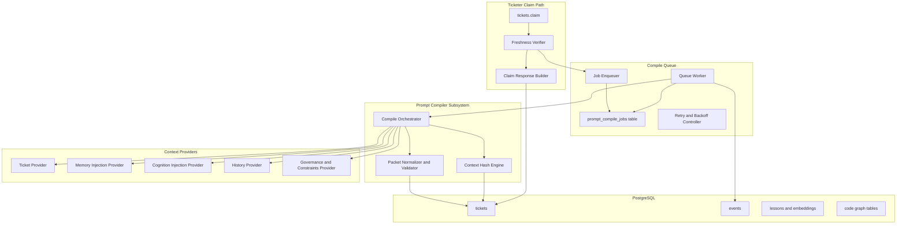
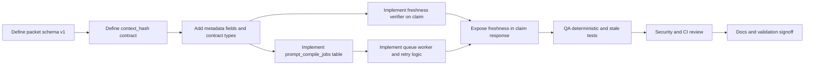

# Prompt Compiler Architecture (Deterministic Execution Packets)

> **Ticket:** CTO-prompt-compiler-architecture | **Agent:** Architect | **Date:** 2026-03-14  
> **Confidence:** HIGH (89%) | **Status:** PROPOSED

## 1. Executive Summary

ForgeOS already includes partial prompt compilation and delivery in `forgeos-server/src/services/compiler.ts` and `forgeos-server/src/tools/tickets-claim.ts`. This architecture upgrades the existing capability to a deterministic, freshness-verified, prompt-authoritative model aligned with MCP-first lifecycle rules.

The design introduces:

- A strict execution packet schema with deterministic section ordering.
- A canonical `context_hash` used as a freshness gate on ticket claim.
- A durable background compilation queue with retry and idempotency guarantees.
- A versioned claim contract that preserves backward compatibility (`system_directive`) while standardizing compiled prompt delivery (`compiled_prompt`, `raw_payload`, freshness metadata).
- A phased migration path from opportunistic prompt usage to mandatory prompt-authoritative execution.

This is a design-only deliverable. No product code changes are included.

## 2. Context Map

### 2.1 Primary Files (Current Implementation Anchors)

| File | Existing Role |
|---|---|
| `forgeos-server/src/services/compiler.ts` | JIT compilation and storage of `compiled_prompt` metadata |
| `forgeos-server/src/tools/tickets-claim.ts` | Claim response includes `compiled_prompt` and `system_directive`; missing freshness gate |
| `forgeos-server/src/db/migrations/007-compiled-prompt.sql` | Adds prompt storage columns |
| `forgeos-server/src/webhooks/reconciliation.ts` | Triggers fire-and-forget compile on transitions |
| `forgeos-server/src/types/index.ts` | Ticket and claim output typing for prompt fields |

### 2.2 Secondary Files

| File | Role |
|---|---|
| `docs/architecture/intelligence-architecture.md` | Existing cognition and memory architecture baseline |
| `docs/product/PRD-prompt-compiler.md` | Product requirements and acceptance criteria |
| `.github/agent-output/Research/CTO-prompt-compiler-research.md` | Current-state evidence and gap analysis |
| `prompt_plan.md` | Initiative source plan and phased intent |

### 2.3 Established Patterns to Preserve

- MCP-first lifecycle (`tickets.claim`, `tickets.complete`, `tickets.reject`)
- PostgreSQL as state authority
- Additive schema evolution and backward-compatible contracts
- Event-sourced observability via structured events and metadata

## 3. Target Component Architecture and Boundaries



### 3.1 Component Boundary Definitions

| Component | Owns | Does Not Own |
|---|---|---|
| Compile Orchestrator | Context assembly and synthesis invocation | Ticket lifecycle transitions |
| Packet Normalizer and Validator | Schema conformance and deterministic ordering | Context retrieval |
| Context Hash Engine | Canonical hash material generation and `context_hash` computation | Prompt text generation |
| Freshness Verifier (claim path) | Current hash computation and stale/missing/fresh decision | Queue internals |
| Compile Queue | Durable job lifecycle (`PENDING`, `RUNNING`, `DONE`, `FAILED`, `DEAD`) | Prompt synthesis semantics |
| Claim Response Builder | Response contract assembly and backward-compat aliases | Recompilation logic beyond trigger call |

## 4. Execution Packet Generation Pipeline and Data Contracts

### 4.1 Pipeline

1. Trigger compile enqueue when ticket enters executable states (policy-driven).
2. Queue worker claims compile job using DB locking semantics.
3. Compile orchestrator fetches ticket, history, memory, cognition, and governance constraints.
4. Packet synthesizer creates draft content.
5. Packet normalizer enforces exact section ordering and schema fields.
6. Context hash engine computes `context_hash` from canonical context material.
7. Store packet and metadata atomically on `tickets` row.
8. Emit success or failure event for observability.

### 4.2 Compile Input Contract

```json
{
  "ticket": {
    "ticket_id": "string",
    "title": "string",
    "priority": "critical|high|medium|low",
    "goal": "string",
    "acceptance_criteria": ["string"],
    "file_paths": ["string"],
    "stage": "string",
    "status": "string"
  },
  "history": {
    "attempts": [
      {
        "agent": "string",
        "files_modified": ["string"],
        "outcome": "string",
        "unresolved": ["string"]
      }
    ]
  },
  "memory": {
    "snapshot_version": "string",
    "learnings": [
      {
        "lesson_id": "string",
        "summary": "string",
        "applicability": "string"
      }
    ],
    "best_practices": ["string"]
  },
  "cognition": {
    "graph_version": "string",
    "context_locations": [
      {
        "path": "string",
        "reason": "string"
      }
    ],
    "execution_hints": ["string"]
  },
  "governance": {
    "system_constraints": ["string"],
    "post_completion": ["string"]
  }
}
```

### 4.3 Compile Output Contract (Execution Packet)

```json
{
  "packet_version": "v1",
  "sections": {
    "ROLE": "markdown",
    "TICKET": "markdown",
    "SYSTEM CONSTRAINTS": "markdown",
    "HISTORY": "markdown",
    "LEARNINGS": "markdown",
    "BEST PRACTICES": "markdown",
    "CONTEXT LOCATIONS": "markdown",
    "YOUR EXACT TASK": "markdown",
    "EXECUTION PLAN": "markdown",
    "EDGE CASES": "markdown",
    "POST-COMPLETION": "markdown"
  },
  "compiled_prompt": "markdown",
  "compiled_at": "ISO8601",
  "context_hash": "sha256-hex"
}
```

## 5. Packet Schema and Deterministic Ordering Rules

### 5.1 Mandatory Section Order

1. `ROLE`
2. `TICKET`
3. `SYSTEM CONSTRAINTS`
4. `HISTORY`
5. `LEARNINGS`
6. `BEST PRACTICES`
7. `CONTEXT LOCATIONS`
8. `YOUR EXACT TASK`
9. `EXECUTION PLAN`
10. `EDGE CASES`
11. `POST-COMPLETION`

### 5.2 Determinism Rules

- Section headers are exact, uppercase, and immutable.
- Ordered lists are stable-sorted by deterministic keys.
- `CONTEXT LOCATIONS` sorted by `path` ascending.
- `HISTORY` sorted by attempt timestamp ascending.
- Memory and best practices sorted by relevance score descending, tie-break `lesson_id` ascending.
- Rendered packet normalized with canonical newline policy (`\n`) and trimmed trailing spaces.

### 5.3 Determinism Fitness Function

- For identical compile inputs and template version, packet text and `context_hash` must be identical in 100/100 repeated runs.

## 6. `context_hash` Computation and Freshness Verification

### 6.1 Canonical Hash Inputs

`context_hash` is SHA-256 over canonical material:

```text
repo_commit=<sha>|graph_version=<version>|memory_snapshot=<version>|packet_schema=v1|template_version=<id>
```

Required fields:

- `repo_commit`: commit SHA of execution context
- `graph_version`: deterministic cognition graph version
- `memory_snapshot`: deterministic memory snapshot version
- `packet_schema`: schema version
- `template_version`: synthesis template version

### 6.2 Freshness Verification Flow (Claim Path)

1. On `tickets.claim`, load stored packet metadata.
2. Compute current `context_hash` from current context providers.
3. Compare with stored `context_hash`.
4. If packet missing: return status `missing`, enqueue compile.
5. If hash mismatch: return status `stale`, enqueue compile.
6. If match: return status `fresh`.

### 6.3 Freshness Policy Modes

- `strict`: block claim completion when stale/missing for selected ticket profiles.
- `permissive`: return stale packet with explicit stale flag and asynchronous recompile trigger.

## 7. Background Compilation Queue, Retry, and Idempotency Model

### 7.1 Queue Architecture

Use a durable PostgreSQL job table `prompt_compile_jobs`.

Core columns:

- `job_id` UUID PK
- `ticket_id` text
- `target_context_hash` text
- `status` enum (`PENDING`, `RUNNING`, `DONE`, `FAILED`, `DEAD`)
- `attempt_count` int
- `max_attempts` int
- `next_attempt_at` timestamptz
- `idempotency_key` text unique
- `last_error` text
- `created_at`, `updated_at`

### 7.2 Idempotency

`idempotency_key = ticket_id + ':' + target_context_hash + ':' + packet_schema + ':' + template_version`

Rules:

- Insert is upserted by `idempotency_key`.
- Duplicate enqueues collapse into one pending/running/done job.
- Worker writes packet only if job `target_context_hash` is still relevant at commit time.

### 7.3 Retry Strategy

- Exponential backoff with jitter.
- Retryable errors: provider timeout, transient network/5xx, temporary DB contention.
- Non-retryable errors: schema validation failure, invalid ticket payload shape.
- `DEAD` state after retry budget exhausted.

## 8. Claim API/Tool Contract Changes

### 8.1 `tickets.claim` Response Additions

```json
{
  "ticket": {"...": "..."},
  "compiled_prompt": "string|null",
  "system_directive": "string|null",
  "raw_payload": {
    "ticket": {"...": "..."},
    "history": {"...": "..."},
    "memory": {"...": "..."},
    "cognition": {"...": "..."}
  },
  "prompt_packet": {
    "version": "v1",
    "compiled_at": "ISO8601|null",
    "context_hash": "string|null",
    "freshness_status": "fresh|stale|missing",
    "stale_reason": "hash_mismatch|not_compiled|null"
  }
}
```

### 8.2 Backward Compatibility

- Keep `system_directive` as alias to `compiled_prompt` for thin clients.
- Mark `system_directive` as deprecated in docs; remove only after versioned client migration is complete.

### 8.3 MCP Contract Rules

- Claim remains atomic for lock semantics.
- Freshness verification runs inside claim processing.
- Compile trigger is side-effect event, not a claim failure unless policy is `strict`.

## 9. Memory and Cognition Injection Data Flow

### 9.1 Memory Injection

- Query lessons by ticket domain, module overlap, and semantic similarity.
- Project memory entries into:
  - `LEARNINGS` (specific incident-derived guidance)
  - `BEST PRACTICES` (generalized durable conventions)

### 9.2 Cognition Injection

- Query blast radius, symbol graph, and dependency data.
- Project results into:
  - `CONTEXT LOCATIONS`
  - `EXECUTION PLAN` hints
  - `EDGE CASES` influenced by dependency impact

### 9.3 Partial Context Handling

If one provider is degraded:

- Mark packet completeness metadata.
- Include explicit gap note in packet.
- Lower confidence level and emit warning event.

## 10. Observability and Failure Handling

### 10.1 Required Metrics

- `prompt_compile_duration_ms` (p50/p95/p99)
- `prompt_compile_queue_depth`
- `prompt_compile_success_total`
- `prompt_compile_failure_total`
- `prompt_claim_freshness_total{freshness_status}`
- `prompt_stale_delivery_total`
- `prompt_partial_context_total`

### 10.2 Timeouts and Circuit Controls

- Provider-level timeout budgets per context provider.
- Global compilation timeout per job.
- Per-provider circuit breaker to avoid retry storms.

### 10.3 Failure Modes and Responses

| Failure Mode | Detection | Response |
|---|---|---|
| Missing packet | `compiled_prompt IS NULL` | Return `missing`, enqueue compile |
| Stale packet | hash mismatch | Return `stale`, enqueue compile |
| Queue backlog | queue age/depth SLO breach | Raise alert, scale workers, strict-mode fallback |
| Partial context | provider timeout/error | Compile with completeness flag, emit warning |
| Validation failure | schema validator reject | Mark job non-retryable failed; require template/data fix |

## 11. Migration Strategy to Prompt-Authoritative Execution

### 11.1 Migration Phases

1. **Contract Foundation**
   - Add packet metadata and freshness fields.
   - Introduce versioned claim response additions.
2. **Freshness Gate Activation**
   - Enable freshness evaluation in permissive mode.
   - Instrument stale/missing metrics.
3. **Durable Queue Cutover**
   - Replace fire-and-forget queue with DB-backed job workers.
4. **Prompt Authority Enforcement**
   - Require packet presence/freshness per policy for executor stages.
   - Keep alias compatibility for old clients.
5. **Repository Decoupling Preparation**
   - Move non-governance context to centralized retrieval.
   - Keep `.github/instructions/` under version control.

### 11.2 Rollback Strategy

- Toggle claim freshness policy to permissive-only mode.
- Disable strict packet enforcement by feature flag.
- Continue returning legacy alias fields while repairing queue/freshness.

## 12. Well-Architected Assessment (6 Pillars)

| Pillar | Score (1-5) | Notes |
|---|---|---|
| Operational Excellence | 5 | Explicit queue states, retry policy, observable freshness |
| Security | 4 | Scope constraints preserved; no new secret exposure; add review for raw payload redaction |
| Reliability | 5 | Durable queue + idempotency + stale detection removes silent drift |
| Performance | 4 | Background precompile and fast freshness checks keep claim path low latency |
| Cost Optimization | 4 | Compile is async, deduplicated by idempotency key; low-cost models remain supported |
| Sustainability | 5 | Versioned contracts + schema + ADR-backed decisions improve maintainability |

## 13. DAG Task Graph and Critical Path



Critical path: `A -> B -> C -> D -> G -> H -> I -> J`

Parallelizable group 1: `E`, `F` after `C`.
Parallelizable group 2: observability dashboard and runbook updates after `G`.

## 14. Fitness Functions

- Determinism: repeated compile from identical context must yield identical packet text and hash.
- Freshness: any change in repo commit, graph version, or memory snapshot invalidates hash.
- Claim latency: freshness check should keep claim p95 within operational target.
- Queue resilience: no lost compile jobs across restart; eventual success for transient failures.
- Contract compliance: claim response includes freshness metadata in 100% successful claims.

## 15. Key Decisions Summary

1. Use deterministic packet schema v1 with exact section ordering.
2. Introduce canonical `context_hash` as freshness gate before prompt delivery.
3. Replace in-process fire-and-forget compile behavior with durable DB queue and idempotency.
4. Version claim contract while preserving legacy `system_directive` alias.
5. Migrate in phased mode (permissive to strict) to avoid execution disruptions.
