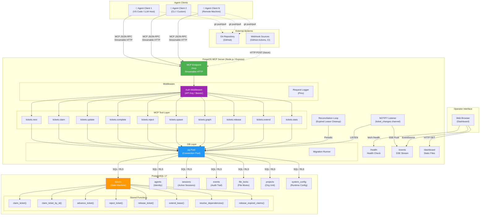
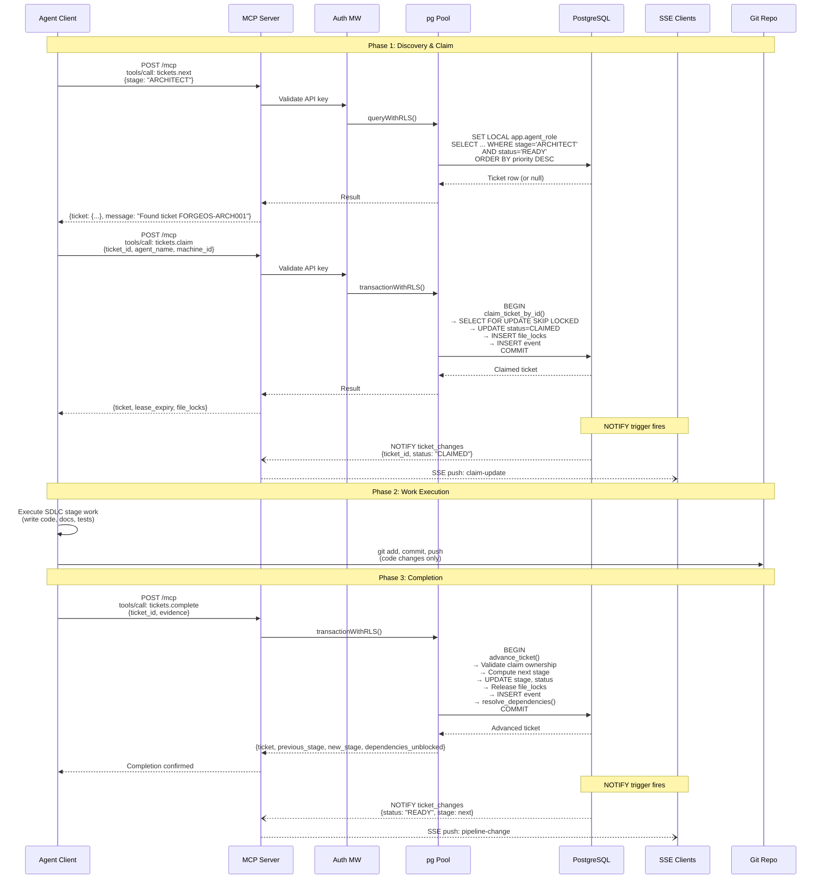
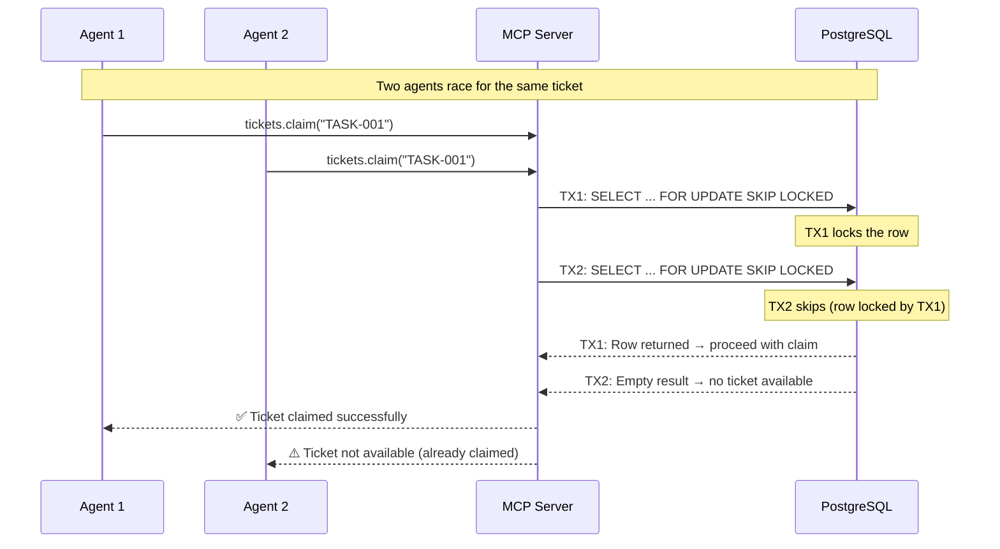
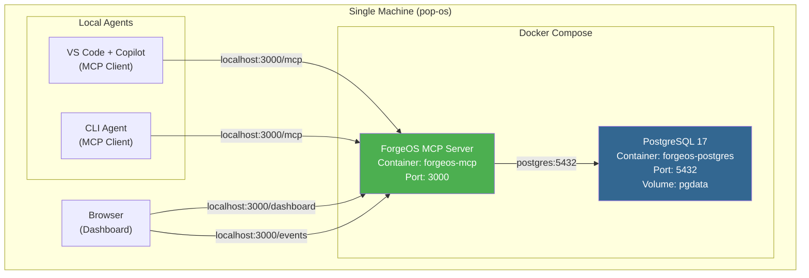
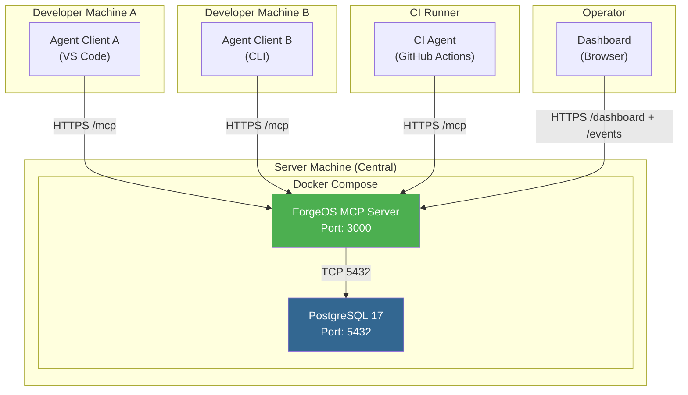
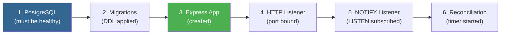
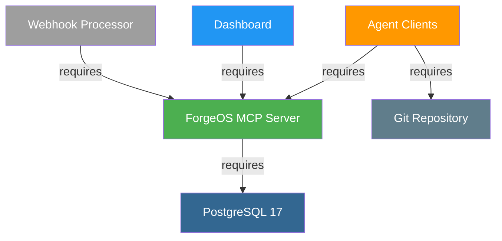
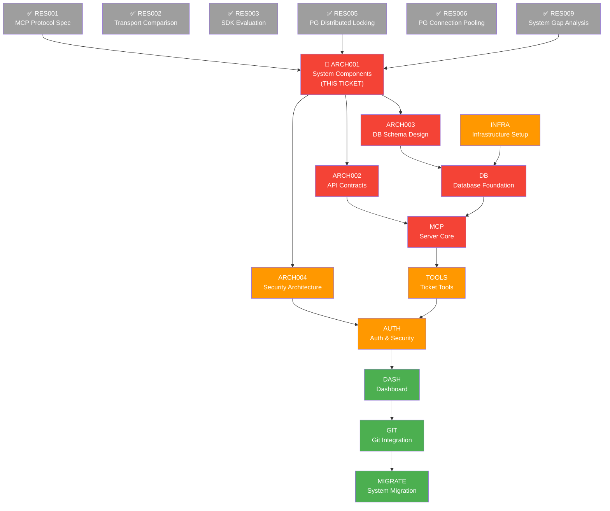

# ForgeOS System Component Architecture

> **Ticket:** FORGEOS-ARCH001 | **Agent:** Architect | **Date:** 2026-03-06  
> **Confidence:** HIGH (90%) | **Status:** APPROVED

---

## Table of Contents

1. [Executive Summary](#1-executive-summary)
2. [Context Map](#2-context-map)
3. [System Component Diagram](#3-system-component-diagram)
4. [Component Boundary Definitions](#4-component-boundary-definitions)
5. [Inter-Component Communication Protocols](#5-inter-component-communication-protocols)
6. [Data Flow: Ticket Operation Lifecycle](#6-data-flow-ticket-operation-lifecycle)
7. [Deployment Topology](#7-deployment-topology)
8. [Component Dependency Graph](#8-component-dependency-graph)
9. [Well-Architected Assessment](#9-well-architected-assessment)
10. [ADR-001: Modular Monolith over Microservices](#10-adr-001-modular-monolith-over-microservices)
11. [ADR-002: Streamable HTTP as Primary MCP Transport](#11-adr-002-streamable-http-as-primary-mcp-transport)
12. [ADR-003: PostgreSQL as Single Source of Truth](#12-adr-003-postgresql-as-single-source-of-truth)
13. [Fitness Functions](#13-fitness-functions)
14. [DAG Task Graph](#14-dag-task-graph)

---

## 1. Executive Summary

ForgeOS is a **distributed multi-agent orchestration platform** that replaces a file-based ticket state machine with a PostgreSQL-backed, MCP-protocol-driven system. The platform coordinates AI agents performing software development tasks across multiple machines.

The architecture follows a **modular monolith** pattern: a single deployable Node.js/Express process (the ForgeOS MCP Server) encapsulates all server-side logic, exposing functionality via MCP tools over Streamable HTTP. PostgreSQL provides ACID-guaranteed state management, distributed locking, and audit trails. Agent clients connect over HTTP and interact exclusively through MCP JSON-RPC operations.

### Six Major Components

| # | Component | Technology | Role |
|---|-----------|-----------|------|
| 1 | **MCP Server** | Node.js / Express / `@modelcontextprotocol/sdk` | Central orchestration hub; exposes 10 MCP tools for ticket lifecycle |
| 2 | **PostgreSQL Database** | PostgreSQL 17 | Persistent state, distributed locking (`SKIP LOCKED`), audit trail, RLS |
| 3 | **Git Integration** | Git CLI / GitHub API | Code delivery, branch management, file-based legacy compatibility |
| 4 | **Agent Clients** | LLM host applications (VS Code, CLI, custom) | Autonomous workers that claim and execute tickets via MCP |
| 5 | **Dashboard** | Express static serving + SSE + client-side JS | Real-time operator visibility into pipeline state |
| 6 | **Webhook Processor** | Express middleware (future) | External event ingestion (GitHub webhooks, CI notifications) |

---

## 2. Context Map

### 2.1 Primary Files (Directly Affected by Architecture)

| File | Role |
|------|------|
| `forgeos-server/src/server.ts` | Express app factory; MCP endpoint, SSE, health check, dashboard |
| `forgeos-server/src/index.ts` | Entry point; boot sequence, migrations, graceful shutdown |
| `forgeos-server/src/config.ts` | Zod-validated environment configuration |
| `forgeos-server/src/types/index.ts` | 835-line canonical type definitions (Ticket, Event, Agent, etc.) |
| `forgeos-server/src/tools/index.ts` | MCP tool registration hub (10 tools) |
| `forgeos-server/src/tools/tickets-*.ts` | Individual tool handlers (claim, complete, reject, etc.) |
| `forgeos-server/src/db/pool.ts` | pg Pool singleton, RLS helpers, health check |
| `forgeos-server/src/db/migrate.ts` | Migration runner |
| `forgeos-server/src/db/migrations/001_initial.sql` | 1011-line DDL: tables, indexes, RLS, stored functions |
| `forgeos-server/src/middleware/auth.ts` | API key / bearer token authentication |
| `forgeos-server/src/middleware/logging.ts` | Pino structured logging |
| `forgeos-server/docker-compose.yml` | PostgreSQL 17 + ForgeOS server containers |

### 2.2 Secondary Files (Indirectly Affected)

| File | Role |
|------|------|
| `.github/tickets.py` | Legacy file-based ticket state machine (being replaced) |
| `.github/agent-runner.py` | Legacy two-commit protocol runner (being replaced) |
| `todo_visual.py` | Legacy visualization (being replaced by dashboard) |
| `forgeos-server/src/dashboard/` | Static HTML/CSS/JS dashboard |

### 2.3 Established Patterns

| Pattern | Evidence |
|---------|----------|
| Modular monolith | Single Express process, modules as directories |
| MCP JSON-RPC tools | `server.tool()` registration with Zod schemas |
| Stored function encapsulation | All business logic in PL/pgSQL functions |
| Stateless HTTP transport | `sessionIdGenerator: undefined` in server.ts |
| RLS-based authorization | `SET LOCAL app.agent_role/name` per request |
| Event-sourced audit trail | Append-only `events` table with NOTIFY trigger |
| Zod schema validation | All tool inputs validated with Zod |

### 2.4 Dependencies

| Type | Dependencies |
|------|-------------|
| **Internal** | 10 MCP tool modules, 1 migration, 2 middleware, 1 DB pool |
| **External** | `@modelcontextprotocol/sdk ^1.27.1`, `express ^4.21`, `pg ^8.13`, `pino ^9.6`, `zod ^3.24` |
| **Infrastructure** | PostgreSQL 17, Docker, Node.js ≥22 |

---

## 3. System Component Diagram

### 3.1 High-Level Architecture



### 3.2 Component Interaction Summary

```
┌──────────────┐     MCP JSON-RPC      ┌──────────────────────────────────┐
│ Agent Client ├───────────────────────►│ ForgeOS MCP Server               │
│ (LLM Host)  │   Streamable HTTP      │                                  │
└──────────────┘   POST /mcp            │  ┌──────────┐  ┌────────────┐   │
                                        │  │ Auth MW  ├──► Tool Layer │   │
┌──────────────┐   GET /events (SSE)    │  └──────────┘  └─────┬──────┘   │
│  Dashboard   ├───────────────────────►│                      │          │
│  (Browser)   │   GET /dashboard       │               ┌──────▼──────┐   │
└──────────────┘                        │               │  DB Layer   │   │
                                        │               │  (pg Pool)  │   │
                                        │               └──────┬──────┘   │
                                        └──────────────────────┼──────────┘
                                                               │ SQL
                                                        ┌──────▼──────┐
                                                        │ PostgreSQL  │
                                                        │   (PG 17)   │
                                                        └─────────────┘
```

---

## 4. Component Boundary Definitions

### 4.1 Component 1: MCP Server

**Bounded Context:** Ticket lifecycle orchestration and agent coordination.

| Aspect | Definition |
|--------|-----------|
| **Owns** | HTTP endpoints, MCP tool registration, request routing, SSE broadcasting, reconciliation scheduling |
| **Responsibilities** | Accept MCP JSON-RPC requests, validate inputs (Zod), route to tool handlers, manage SSE client connections, run periodic reconciliation |
| **Does NOT own** | Business logic (delegated to stored functions), authentication decisions (delegated to auth middleware), data persistence |
| **Interfaces** | `/mcp` (MCP Streamable HTTP), `/health` (REST), `/events` (SSE), `/dashboard` (static) |
| **State** | Stateless (no server-side sessions; `sessionIdGenerator: undefined`) |
| **Technology** | Node.js ≥22, Express 4.x, `@modelcontextprotocol/sdk ^1.27.1` |
| **Deployment** | Single Docker container (`forgeos-mcp`) |

**Internal Modules:**

| Module | Path | Responsibility |
|--------|------|---------------|
| Tool Layer | `src/tools/` | 10 MCP tool handlers with Zod validation |
| Auth Middleware | `src/middleware/auth.ts` | API key hashing, bearer token validation |
| Logging Middleware | `src/middleware/logging.ts` | Structured request/response logging (Pino) |
| DB Pool | `src/db/pool.ts` | Connection pooling, RLS session variable injection |
| Migration Runner | `src/db/migrate.ts` | Sequential SQL migration execution |
| Config | `src/config.ts` | Zod-validated environment variable loading |

### 4.2 Component 2: PostgreSQL Database

**Bounded Context:** Persistent state management, distributed coordination, and audit.

| Aspect | Definition |
|--------|-----------|
| **Owns** | All mutable state (tickets, agents, sessions, file locks, events, projects, system config) |
| **Responsibilities** | ACID transactions, distributed locking (`SELECT FOR UPDATE SKIP LOCKED`), advisory locks (file-path mutex), dependency resolution, RLS enforcement, audit event recording, change notification (`NOTIFY`) |
| **Does NOT own** | HTTP transport, MCP protocol handling, business rule interpretation beyond what stored functions encode |
| **Interfaces** | PostgreSQL wire protocol (port 5432), LISTEN/NOTIFY channels |
| **State** | Full persistent state; single source of truth |
| **Technology** | PostgreSQL 17 with `uuid-ossp` and `pgcrypto` extensions |
| **Deployment** | Docker container (`forgeos-postgres`) with persistent volume |

**Schema Objects:**

| Category | Objects | Count |
|----------|---------|-------|
| Tables | `projects`, `agents`, `sessions`, `tickets`, `file_locks`, `events`, `system_config` | 7 |
| Enums | `ticket_status`, `ticket_stage`, `ticket_type`, `ticket_priority`, `event_type` | 5 |
| Stored Functions | `claim_ticket`, `claim_ticket_by_id`, `advance_ticket`, `reject_ticket`, `release_ticket`, `extend_lease`, `resolve_dependencies`, `release_expired_claims`, `update_updated_at`, `notify_ticket_change` | 10 |
| Indexes | B-tree (8), GIN (4), Partial (3) | 15 |
| Triggers | `trg_tickets_updated_at`, `trg_agents_updated_at`, `trg_projects_updated_at`, `trg_ticket_notify` | 4 |
| RLS Policies | `admin_all_tickets`, `agent_select_tickets`, `agent_update_tickets`, `agent_insert_events`, `agent_select_events`, `agent_file_locks` | 6 |

### 4.3 Component 3: Git Integration

**Bounded Context:** Code delivery and version control.

| Aspect | Definition |
|--------|-----------|
| **Owns** | Code repository, branch management, commit history |
| **Responsibilities** | Store and version application code written by agents. In the distributed platform, git is used ONLY for code delivery — ticket state management moves entirely to PostgreSQL |
| **Does NOT own** | Ticket state, claim locking, dependency resolution (all migrated to PostgreSQL) |
| **Interfaces** | Git CLI (push/pull), GitHub REST/GraphQL API (future webhook integration) |
| **State** | Git commit history (immutable append-only log) |
| **Technology** | Git, GitHub |

**Migration Note:** In the legacy system, git push served as the distributed locking mechanism (two-commit protocol). In the new architecture, this responsibility transfers entirely to PostgreSQL's `SELECT FOR UPDATE SKIP LOCKED`. Git remains solely for code delivery. The `agent-runner.py` two-commit protocol is superseded by MCP tool calls (`tickets.claim` → `tickets.complete`).

### 4.4 Component 4: Agent Clients

**Bounded Context:** Autonomous task execution.

| Aspect | Definition |
|--------|-----------|
| **Owns** | Local development environment, LLM context, code generation, file modifications |
| **Responsibilities** | Connect to ForgeOS MCP Server, discover available tools, claim tickets, execute SDLC stage work, report completion with evidence |
| **Does NOT own** | Ticket state transitions (server-side), dependency resolution (server-side), file conflict detection (server-side) |
| **Interfaces** | MCP Client SDK (JSON-RPC over Streamable HTTP), Git CLI for code commits |
| **State** | Ephemeral per-invocation (stateless workers) |
| **Technology** | TypeScript SDK (`@modelcontextprotocol/sdk`) or Python SDK (`mcp`), LLM host application |

**Agent Lifecycle:**

```
1. Connect:    MCP Client → POST /mcp (initialize)
2. Discover:   tools/list → receive 10 tool definitions
3. Find Work:  tickets.next(stage) → get highest-priority ticket
4. Claim:      tickets.claim(ticket_id, agent_name, machine_id) → atomic lock
5. Execute:    Perform SDLC stage work (code, tests, review, docs)
6. Complete:   tickets.complete(ticket_id, evidence) → advance to next stage
   OR Reject:  tickets.reject(ticket_id, reason) → rework/escalate
7. Disconnect: Session ends; agent is stateless
```

### 4.5 Component 5: Dashboard

**Bounded Context:** Operator visibility and monitoring.

| Aspect | Definition |
|--------|-----------|
| **Owns** | UI rendering, real-time event display, filtering/search |
| **Responsibilities** | Display pipeline state, ticket distribution, active claims, dependency graphs, system alerts. Receive real-time updates via SSE |
| **Does NOT own** | Data computation (server provides via MCP tools and SSE), authentication (cookie/token-based via server) |
| **Interfaces** | HTTP GET `/dashboard` (static files), SSE `/events` (real-time push), REST `/health` (status) |
| **State** | Client-side only (JavaScript in-memory state) |
| **Technology** | Vanilla HTML/CSS/JS, Mermaid.js for dependency graphs |

**Features:**

| Feature | Data Source |
|---------|-----------|
| Stage pipeline bar | `tickets.stats` → `by_stage` |
| Ticket table (sortable/filterable) | `tickets.stats` + SSE updates |
| Dependency graph (Mermaid) | `tickets.graph` → nodes/edges |
| Active claims tracker | `tickets.stats` → `active_agents` |
| Real-time status updates | SSE `/events` channel |
| Health indicator | REST `/health` endpoint |

### 4.6 Component 6: Webhook Processor (Future)

**Bounded Context:** External event ingestion.

| Aspect | Definition |
|--------|-----------|
| **Owns** | Webhook endpoint, event parsing, signature verification |
| **Responsibilities** | Receive GitHub webhooks (push, PR, CI status), parse events, trigger ticket state updates or notifications |
| **Does NOT own** | Ticket lifecycle logic (delegates to existing MCP tools/stored functions) |
| **Interfaces** | HTTP POST `/webhooks/github` (future), reads `WEBHOOK_SECRET` from config |
| **State** | Stateless event processor |
| **Technology** | Express middleware within the existing server process |

**Planned Events:**

| Webhook Event | ForgeOS Action |
|---------------|---------------|
| `push` (to main) | Verify committed files match ticket scope |
| `pull_request.merged` | Auto-advance ticket if merge criteria met |
| `check_suite.completed` | Update ticket metadata with CI results |
| `workflow_run.completed` | Record CI pass/fail evidence |

---

## 5. Inter-Component Communication Protocols

### 5.1 Protocol Matrix

| From | To | Protocol | Transport | Data Format | Auth |
|------|----|----------|-----------|-------------|------|
| Agent Client | MCP Server | **MCP JSON-RPC 2.0** | Streamable HTTP (POST `/mcp`) | JSON | API Key / Bearer Token |
| Dashboard | MCP Server (SSE) | **Server-Sent Events** | HTTP GET `/events` | JSON events | None (read-only public) |
| Dashboard | MCP Server (health) | **REST** | HTTP GET `/health` | JSON | None |
| Dashboard | MCP Server (static) | **HTTP** | HTTP GET `/dashboard/*` | HTML/CSS/JS | None |
| MCP Server | PostgreSQL | **PostgreSQL Wire Protocol** | TCP (port 5432) | Binary (pg protocol) | md5/scram-sha-256 |
| MCP Server | PostgreSQL (NOTIFY) | **LISTEN/NOTIFY** | Dedicated pg connection | JSON payload | Same as above |
| Agent Client | Git | **Git Protocol** | HTTPS / SSH | Git objects | SSH key / PAT |
| Webhook Source | MCP Server | **HTTP POST** (future) | HTTPS | JSON | HMAC signature |

### 5.2 MCP JSON-RPC Communication Detail

The MCP protocol as used by ForgeOS follows this pattern:

**Request (Agent → Server):**
```json
{
  "jsonrpc": "2.0",
  "id": 1,
  "method": "tools/call",
  "params": {
    "name": "tickets.claim",
    "arguments": {
      "ticket_id": "FORGEOS-ARCH001",
      "agent_name": "Architect",
      "machine_id": "pop-os",
      "operator": "reaperoak"
    }
  }
}
```

**Response (Server → Agent):**
```json
{
  "jsonrpc": "2.0",
  "id": 1,
  "result": {
    "content": [{
      "type": "text",
      "text": "{\"ticket\": {...}, \"lease_expiry\": \"2026-03-06T01:30:00Z\", \"file_locks\": [\"docs/architecture/system-components.md\"]}"
    }],
    "isError": false
  }
}
```

### 5.3 SSE Real-Time Communication

```
Server → Dashboard (push):
  event: message
  data: {"ticket_id":"FORGEOS-ARCH001","status":"CLAIMED","stage":"ARCHITECT","claimed_by":"Architect","machine_id":"pop-os","updated_at":"2026-03-06T00:30:00Z"}
```

Triggered by PostgreSQL `NOTIFY trigger` → `LISTEN` in server → broadcast to SSE clients.

### 5.4 Database Communication

All database interactions follow the RLS-aware pattern:

```
1. Acquire client from pg Pool
2. SET LOCAL app.agent_role = '<role>'
3. SET LOCAL app.agent_name = '<name>'
4. Execute query / call stored function
5. Release client back to pool
```

Stored functions encapsulate ALL business logic (claim, advance, reject, release, extend, resolve dependencies, expire claims). The application layer is a thin pass-through.

---

## 6. Data Flow: Ticket Operation Lifecycle

### 6.1 Complete Ticket Claim-to-Completion Flow



### 6.2 Claim Contention Resolution



---

## 7. Deployment Topology

### 7.1 Single-Machine Configuration (Development / Small Team)



**Resource Requirements:**

| Component | CPU | Memory | Disk |
|-----------|-----|--------|------|
| PostgreSQL 17 | 0.5 core | 256 MB | 1 GB (data) |
| ForgeOS Server | 0.5 core | 128 MB | 50 MB (app) |
| **Total** | **1 core** | **384 MB** | **~1 GB** |

### 7.2 Multi-Machine Configuration (Team / Production)



**Key Differences from Single-Machine:**

| Aspect | Single-Machine | Multi-Machine |
|--------|---------------|---------------|
| Transport | HTTP (localhost) | HTTPS (TLS termination required) |
| Auth | API key (low risk) | API key + TLS + optional OAuth 2.1 |
| Database access | Docker network | Firewalled, auth-only access |
| Agents | Local processes | Remote HTTP clients |
| Git | Local clone | Each machine clones independently |
| Monitoring | Docker logs | Centralized logging (future) |

### 7.3 Scaling Path (Future)

```
Phase 1 (Current):  Single ForgeOS Server + PostgreSQL
                     Handles ≤50 concurrent agents

Phase 2 (Scale):    ForgeOS Server + PgBouncer + PostgreSQL
                     PgBouncer in transaction mode
                     Handles ≤200 concurrent agents

Phase 3 (HA):       N × ForgeOS Server (stateless)
                     + Load Balancer
                     + PgBouncer
                     + PostgreSQL (primary + read replicas)
                     Handles ≤1000+ concurrent agents
```

**Note:** The ForgeOS MCP Server is already stateless (`sessionIdGenerator: undefined`). This means Phase 3 horizontal scaling requires only a load balancer in front of N server instances — no session affinity needed. All coordination happens in PostgreSQL.

---

## 8. Component Dependency Graph

### 8.1 Startup Order



### 8.2 Health Check Dependencies

| Component | Health Check | Dependency |
|-----------|-------------|-----------|
| PostgreSQL | `pg_isready -U forgeos -d forgeos` | None (root dependency) |
| ForgeOS Server | `GET /health` → `SELECT 1` | PostgreSQL healthy |
| NOTIFY Listener | Subcomponent of server | PostgreSQL connection |
| Reconciliation Loop | Subcomponent of server | PostgreSQL connection |
| Dashboard | Served by Express | ForgeOS Server running |
| Agent Clients | MCP `initialize` handshake | ForgeOS Server reachable |

### 8.3 Dependency Graph (Mermaid)



### 8.4 Graceful Shutdown Order (Reverse of Startup)

```
1. Stop reconciliation timer
2. Close HTTP server (drain in-flight requests)
3. Close NOTIFY listener
4. Close pg Pool (drain connections)
5. Exit process
```

Implemented in `index.ts` `shutdown()` handler with a 10-second force-exit timeout.

---

## 9. Well-Architected Assessment

### 9.1 Pillar Scores

| Pillar | Score | Assessment |
|--------|-------|-----------|
| **Operational Excellence** | 8/10 | Structured logging (Pino), health checks, SSE monitoring, reconciliation loop. Gap: no distributed tracing, no metrics export (Prometheus). |
| **Security** | 7/10 | RLS, API key auth, scram-sha-256 DB auth, input validation (Zod). Gap: no OAuth 2.1 yet, no rate limiting enforcement, ADMIN_API_KEY has weak default. |
| **Reliability** | 8/10 | ACID transactions, SKIP LOCKED (no contention), lease expiry + reconciliation, graceful shutdown. Gap: no circuit breaker for DB, single PG instance (no replication). |
| **Performance** | 8/10 | Partial indexes, GIN indexes, stored functions (reduced round-trips), stateless server (horizontal scaling ready). Gap: no query caching, no connection pooler (PgBouncer) yet. |
| **Cost Optimization** | 9/10 | Minimal infrastructure: two containers. PostgreSQL and Node.js are free. Single-machine deployment possible. Docker volumes for persistence. |
| **Sustainability** | 8/10 | TypeScript with strict types, Zod validation, comprehensive type definitions (835 lines), Pino structured logging, clear module boundaries. Gap: no automated architecture fitness tests. |

### 9.2 Technical Debt Items

| Item | Severity | Mitigation |
|------|----------|-----------|
| Default `ADMIN_API_KEY` (`forgeos_admin_CHANGE_ME`) | Medium | Enforce non-default key at startup |
| No PgBouncer for >50 agents | Low | Add PgBouncer service to docker-compose when scaling |
| No OAuth 2.1 | Medium | MCP SDK supports it natively — implement when multi-tenant |
| Single PostgreSQL instance | Medium | Add read replica for dashboard queries at scale |
| No rate limiting enforcement | Medium | Middleware exists in config but not wired |

---

## 10. ADR-001: Modular Monolith over Microservices

### Status

**ACCEPTED** — 2026-03-06

### Context

ForgeOS needs to orchestrate multiple AI agents across potentially multiple machines. The team must decide between a microservices architecture (separate services for ticket management, authentication, webhooks, dashboard) and a modular monolith (single deployable with internal module boundaries).

### Options Considered

| Option | Capability Fit | Team Experience | Ecosystem Maturity | Operational Cost | Risk |
|--------|---------------|----------------|--------------------|-----------------|----- |
| **Modular Monolith** | 9/10 | 9/10 | 10/10 | 2/10 (low cost) | 2/10 (low risk) |
| Microservices | 8/10 | 5/10 | 8/10 | 7/10 (high cost) | 6/10 (medium risk) |
| Serverless Functions | 6/10 | 4/10 | 7/10 | 5/10 | 7/10 (cold starts) |

### Decision

**Modular monolith.** All server-side components (MCP endpoint, auth, dashboard, webhook processing, reconciliation) run in a single Node.js/Express process with clear internal module boundaries.

### Consequences

**Positive:**
- Single deployment unit — one Docker container, one health check, one log stream
- Shared pg Pool — no inter-service network calls for database operations
- Simple local development — `docker compose up` starts everything
- Trivially horizontally scalable — server is stateless; add more instances behind a load balancer
- Lower operational overhead — no service mesh, no inter-service auth, no distributed tracing required at current scale

**Negative:**
- All modules share a single process — a bug in one module can crash the whole server
- Cannot independently scale individual components (e.g., dashboard vs. ticket operations)
- Technology lock-in to Node.js for all server-side code (mitigated: MCP clients can use any language)

**Mitigation:**
- Process isolation via `try/catch` in Express error handler
- Module boundaries enforce separation of concerns (tools/, middleware/, db/)
- Stateless design allows restart without data loss
- If independent scaling is needed, extract the specific module into a separate service later (Strangler Fig pattern)

### Anti-Pattern Check

| Anti-Pattern | Status |
|-------------|--------|
| Big Ball of Mud | ✅ Avoided — clear module directories (tools/, middleware/, db/) |
| Distributed Monolith | ✅ N/A — single process, not pretending to be microservices |
| God Service | ✅ Avoided — each tool handler is a focused unit |
| Golden Hammer | ✅ Avoided — PostgreSQL chosen for state, MCP for protocol, Express for HTTP — each tool fits its job |

---

## 11. ADR-002: Streamable HTTP as Primary MCP Transport

### Status

**ACCEPTED** — 2026-03-06

### Context

MCP defines three transport options: stdio, HTTP+SSE (deprecated), and Streamable HTTP. ForgeOS needs a transport that supports multi-machine agents, reconnection, and proxy compatibility.

### Options Considered

| Transport | Multi-Machine | Reconnection | Proxy Compat | Latency | Maturity |
|-----------|-------------|-------------|-------------|---------|----------|
| stdio | ❌ Local only | ❌ None | ❌ N/A | <1ms | High |
| HTTP+SSE | ✅ | ⚠️ Basic | ⚠️ Sticky sessions | 1-5ms | **Deprecated** |
| **Streamable HTTP** | ✅ | ✅ Resumable | ✅ Standard HTTP | 1-5ms | Current spec |

### Decision

**Streamable HTTP** as primary transport. stdio retained for local development and testing only. HTTP+SSE not adopted (deprecated).

### Evidence

From FORGEOS-RES002 (Transport Layer Comparison, 88% confidence):
- Streamable HTTP is the current MCP specification standard (2025-03-26 revision)
- Single endpoint design (`/mcp`) simplifies proxy and load balancer configuration
- Session resumability via `Mcp-Session-Id` header enables reconnection without re-initialization
- ForgeOS already implements this successfully (`StreamableHTTPServerTransport` in server.ts)

### Consequences

**Positive:**
- Standard HTTP semantics — works with any proxy, load balancer, CDN
- Resumable sessions — agents can reconnect without losing state
- Single endpoint — simplified routing and security configuration
- Already implemented and validated in the existing codebase

**Negative:**
- Higher latency than stdio (~1-5ms vs <1ms) — acceptable for ForgeOS workloads
- Newer transport — less ecosystem documentation than stdio — mitigated by SDK support

---

## 12. ADR-003: PostgreSQL as Single Source of Truth

### Status

**ACCEPTED** — 2026-03-06

### Context

The legacy ForgeOS system uses git-push-based locking and file-system directories as the ticket state machine. This approach has fundamental limitations: race conditions on concurrent push, no ACID guarantees, O(n) file scanning for dependency resolution, and inability to support parallel agent coordination reliably.

### Options Considered

| Option | ACID | Concurrency | Query Speed | Operational Cost | ForgeOS Fit |
|--------|------|------------|-------------|-----------------|------------|
| **PostgreSQL** | ✅ Full | ✅ SKIP LOCKED | ✅ Indexed | Low (single DB) | 10/10 |
| SQLite | ⚠️ WAL mode | ⚠️ Write lock | ✅ Fast reads | Very Low | 5/10 (no multi-machine) |
| Redis + PG | ✅/⚠️ Mixed | ✅ Redis locks | ✅ Redis cache | Medium (two systems) | 7/10 |
| Git FS (current) | ❌ None | ❌ Push-race | ❌ File scan | Low | 3/10 |

### Decision

**PostgreSQL 17** as the single source of truth for all ticket state, agent identity, file locks, and audit events.

### Evidence

From FORGEOS-RES005 (PG Distributed Locking, 91% confidence):
- `SELECT FOR UPDATE SKIP LOCKED` provides zero-contention work-stealing queue semantics
- Advisory locks (`pg_advisory_xact_lock`) enable file-path-level mutual exclusion
- Row-level locking ensures serializable atomic state transitions
- Eliminates ALL race conditions from the git-push-based model

From FORGEOS-RES006 (PG Connection Pooling, 87% confidence):
- `pg` Pool with 10-20 connections handles ≤50 concurrent agents
- PgBouncer in transaction mode is fully compatible with `pg_advisory_xact_lock` and `SET LOCAL` for RLS
- Scaling path is clear: pg Pool → PgBouncer → read replicas

### Consequences

**Positive:**
- True ACID guarantees — no more race conditions on ticket claims
- Sub-millisecond lock acquisition (vs. multi-second git push/pull cycles)
- Indexed queries for O(log n) ticket lookup (vs. O(n) directory scanning)
- RLS provides database-enforced authorization
- `NOTIFY` trigger enables real-time dashboard updates
- Event sourcing via append-only `events` table provides full audit trail

**Negative:**
- Requires running PostgreSQL (additional infrastructure)
- Schema migrations needed for changes (vs. schema-free JSON files)
- Migration effort from git-based to DB-based state management

**Mitigation:**
- PostgreSQL in Docker — trivial to provision (`docker compose up`)
- Migration tooling in `db/migrate.ts` — sequential SQL file execution
- System gap analysis (FORGEOS-RES009) maps all 32 current capabilities to distributed equivalents

---

## 13. Fitness Functions

| Metric | Threshold | Measurement Method |
|--------|-----------|-------------------|
| Ticket claim latency (p99) | < 50ms | Instrument `tickets.claim` handler |
| Ticket advance latency (p99) | < 100ms | Instrument `tickets.complete` handler |
| Health check response (p99) | < 20ms | Monitor `/health` endpoint |
| SSE broadcast latency | < 500ms from NOTIFY | Measure NOTIFY → SSE write delta |
| Database connection pool utilization | < 80% | Monitor `pool.totalCount` vs `pool.idleCount` |
| Zero claim contention failures | 0 deadlocks per day | Monitor `pg_stat_activity` for deadlocks |
| API availability | ≥ 99.5% uptime | Health check monitoring |
| Test coverage (new code) | ≥ 80% | Vitest coverage report |
| TypeScript strict mode | Zero errors | `tsc --noEmit` in CI |
| Lint | Zero errors, zero warnings | `eslint src/` in CI |

---

## 14. DAG Task Graph

### 14.1 Implementation Ordering

The following DAG shows the recommended implementation order for remaining ForgeOS tickets. Critical path is highlighted.



### 14.2 Critical Path

```
RES001/RES005/RES009 → ARCH001 → ARCH003 → DB → MCP_CORE → TOOLS → AUTH → DASH → GIT → MIGRATION
```

**Estimated critical path length:** 10 stages (3 done + 7 remaining)

### 14.3 Parallelizable Work Groups

| Group | Tickets | Requires |
|-------|---------|----------|
| **Group A** (Architecture) | ARCH002, ARCH003, ARCH004 | ARCH001 complete |
| **Group B** (Foundation) | INFRA, DB (after ARCH003) | ARCH003 complete |
| **Group C** (Server) | MCP_CORE, TOOLS | DB complete |
| **Group D** (Integration) | AUTH, DASH, GIT_INT | Prior group complete |

---

## Appendix A: Technology Selection Matrix

| Component | Selected Technology | Score | Alternatives Considered | Reason for Selection |
|-----------|-------------------|-------|------------------------|---------------------|
| Server Runtime | Node.js ≥22 | 9/10 | Python (asyncio), Go, Deno | MCP TypeScript SDK is mature; team expertise; existing codebase |
| HTTP Framework | Express 4.x | 8/10 | Fastify, Hono, Koa | MCP SDK examples use Express; battle-tested; sufficient performance |
| Database | PostgreSQL 17 | 10/10 | SQLite, MySQL, CockroachDB | SKIP LOCKED, advisory locks, RLS, LISTEN/NOTIFY, JSON/JSONB |
| MCP SDK | `@modelcontextprotocol/sdk ^1.27.1` | 9/10 | Custom JSON-RPC, gRPC | Official SDK with Streamable HTTP transport; maintained by Anthropic |
| Validation | Zod 3.x | 9/10 | Joi, Yup, io-ts | TypeScript-first; MCP SDK integration; runtime + compile-time safety |
| Logging | Pino 9.x | 9/10 | Winston, Bunyan, console | Fastest Node.js logger; structured JSON output; low overhead |
| DB Driver | pg 8.x (node-postgres) | 8/10 | Drizzle, Prisma, TypeORM | Direct SQL control needed for stored functions; minimal abstraction |
| Container | Docker + docker-compose | 9/10 | Podman, K8s | Simple single-machine deployment; compose for multi-container |

---

## Appendix B: Glossary

| Term | Definition |
|------|-----------|
| **MCP** | Model Context Protocol — JSON-RPC 2.0-based protocol for AI agent communication |
| **Streamable HTTP** | MCP transport using standard HTTP POST/GET with optional SSE streaming |
| **SKIP LOCKED** | PostgreSQL feature that skips locked rows instead of waiting — enables contention-free queuing |
| **RLS** | Row-Level Security — database-enforced access control via session variables |
| **SDLC Flow** | Ordered sequence of pipeline stages a ticket must traverse |
| **Advisory Lock** | Application-defined lock in PostgreSQL using bigint keys |
| **NOTIFY** | PostgreSQL pub/sub mechanism for real-time event broadcasting |
| **SSE** | Server-Sent Events — HTTP-based one-way push from server to client |
| **Modular Monolith** | Architecture pattern where a single deployable contains well-separated internal modules |
| **Two-Commit Protocol** | Legacy ForgeOS distributed locking via git commit + push (being replaced by DB locking) |
