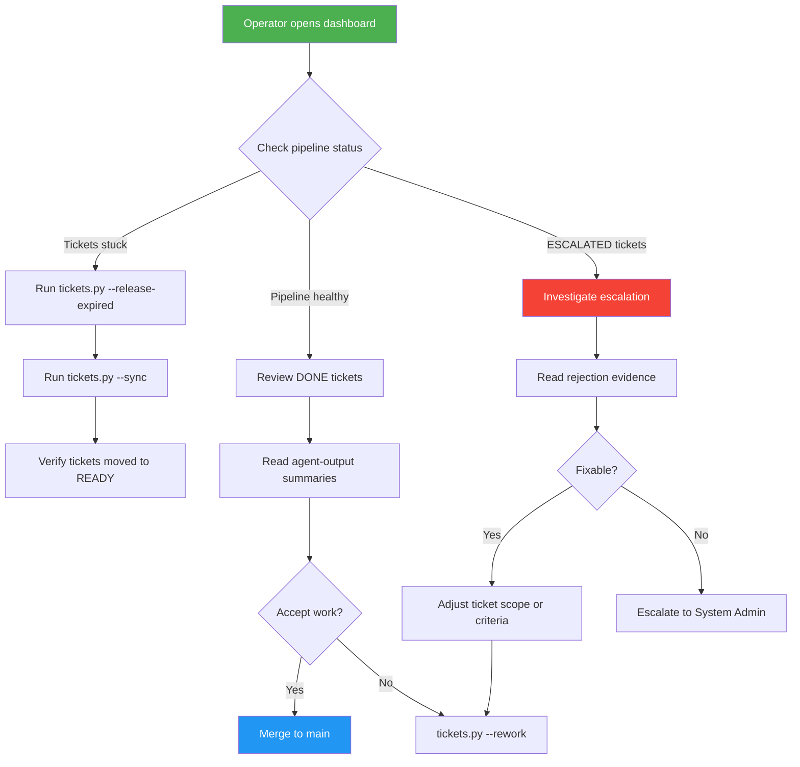
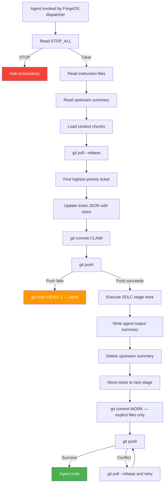
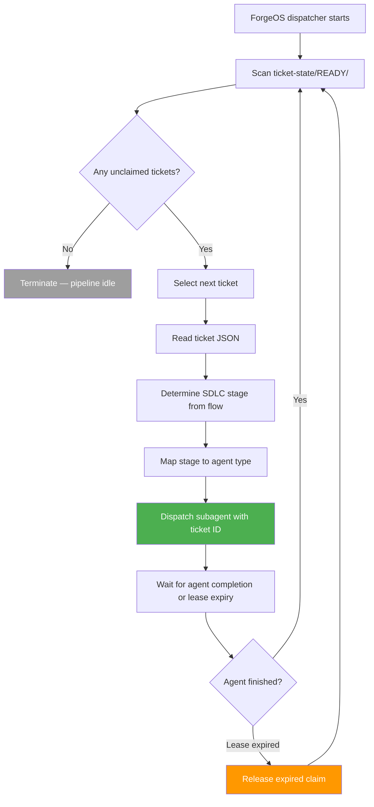
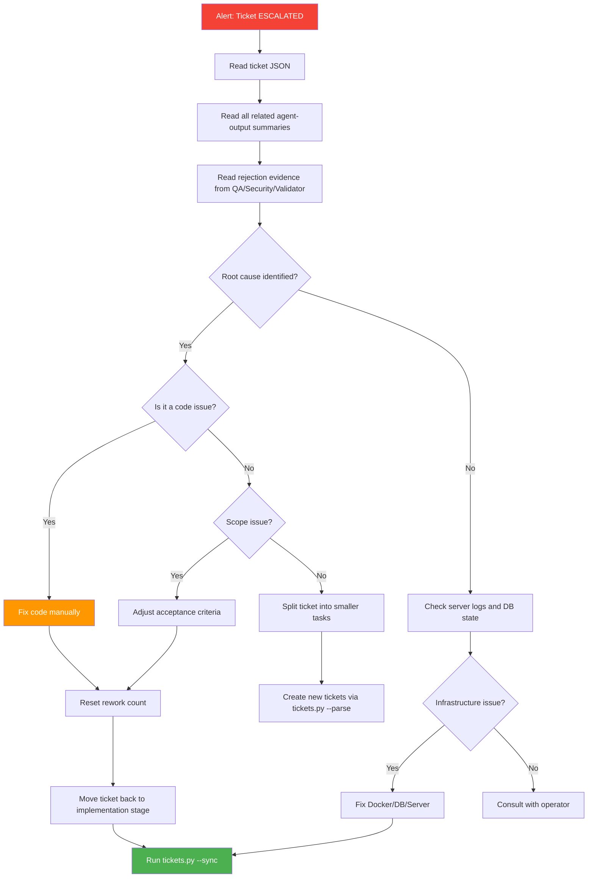
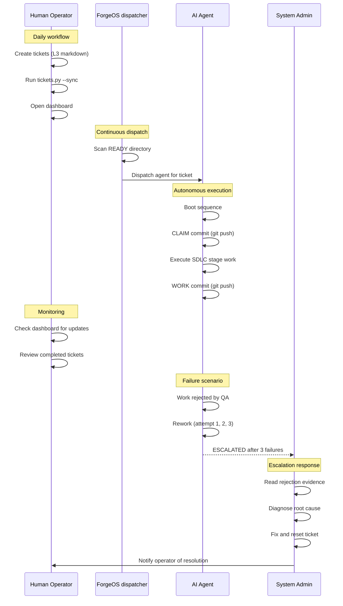

# ForgeOS User Personas

> **Ticket:** FORGEOS-PM001 | **Agent:** Documentation Specialist | **Date:** 2026-03-07  
> **Confidence:** HIGH (92%)

---

## Table of Contents

1. [Overview](#1-overview)
2. [Persona 1: Human Operator](#2-persona-1-human-operator)
3. [Persona 2: AI Agent](#3-persona-2-ai-agent)
4. [Persona 3: ForgeOS Dispatcher](#4-persona-3-forgeos-dispatcher)
5. [Persona 4: System Administrator](#5-persona-4-system-administrator)
6. [Persona Comparison Matrix](#6-persona-comparison-matrix)
7. [Interaction Pattern Diagrams](#7-interaction-pattern-diagrams)
8. [Pain Points Summary](#8-pain-points-summary)

---

## 1. Overview

ForgeOS is a distributed multi-agent orchestration platform that coordinates AI agents performing software development tasks across multiple machines. Four distinct personas interact with the platform. Each persona has unique goals, constraints, and interaction patterns.

| Persona | Role | Frequency | Interface |
|---------|------|-----------|-----------|
| Human Operator | Manages tickets, monitors agents | Daily | CLI + Dashboard |
| AI Agent | Claims work, executes tasks, reports results | Continuous | MCP JSON-RPC (programmatic) |
| ForgeOS Dispatcher | Dispatches agents, advances pipeline | Continuous | MCP JSON-RPC (automated) |
| System Administrator | Maintains platform, handles escalations | Weekly | Full access (CLI + DB + Dashboard) |

---

## 2. Persona 1: Human Operator

### 2.1 Profile

| Attribute | Detail |
|-----------|--------|
| **Name** | Operator Ops |
| **Role** | Software engineer or team lead who oversees the AI agent pipeline |
| **Technical skill** | Intermediate to advanced; comfortable with CLI, git, and dashboards |
| **Interaction frequency** | Daily (multiple sessions per day during active development) |
| **Primary interface** | Web dashboard for monitoring, CLI for ticket management |

### 2.2 Goals

1. **Create and manage tickets.** Define work items with acceptance criteria, file paths, dependencies, and priority levels.
2. **Monitor agent progress.** Track which agents are claimed, which stages are active, and identify bottlenecks in the pipeline.
3. **Review agent output.** Read agent summaries, verify acceptance criteria are met, and approve or reject work.
4. **Resolve blocked tickets.** Identify dependency issues, clear stale claims, and unblock the pipeline.
5. **Control the pipeline.** Halt all agents via the STOP_ALL guardian, release expired leases, and trigger syncs.

### 2.3 Constraints

| Constraint | Detail |
|------------|--------|
| **Interface** | CLI (`tickets.py`, `agent-runner.py`) and web dashboard. No direct database access in daily workflow. |
| **Authority** | Can create, claim, release, advance, and rework tickets. Cannot modify agent definitions or system configuration without admin privileges. |
| **Concurrency** | Multiple operators may work simultaneously on the same repository. Git push/pull is the synchronization mechanism. |
| **Visibility** | Sees ticket state, agent claims, and pipeline metrics. Does not see internal agent reasoning or LLM context. |

### 2.4 Interaction Patterns

1. **Morning check-in.** Open the dashboard. Review the stage pipeline bar: how many tickets are READY, in progress, and DONE. Identify any BLOCKED or ESCALATED tickets.
2. **Ticket creation.** Write L3 task markdown files in `TODO/tasks/`. Run `tickets.py --parse` to generate ticket JSON. Run `tickets.py --sync` to evaluate dependencies and move unblocked tickets to READY.
3. **Pipeline monitoring.** Watch the dashboard for real-time SSE updates. Filter by stage, priority, or operator. Check the dependency graph for bottlenecks.
4. **Intervention.** Release expired claims with `tickets.py --release-expired`. Rework rejected tickets. Escalate tickets that fail three rework cycles.
5. **End-of-day review.** Check `tickets.py --status` for a summary. Review CHANGELOG entries and agent output summaries.

### 2.5 Pain Points with the Current Filesystem-Based System

| Pain Point | Impact | Detail |
|------------|--------|--------|
| **No real-time updates** | High | The dashboard is a static HTML file generated by `todo_visual.py`. Operators must re-run the script to see changes. There is no live SSE or polling. |
| **Git-based locking is fragile** | High | The two-commit protocol uses `git push` as a distributed lock. Push conflicts require manual recovery (`git reset HEAD~1`). Multiple operators on different machines frequently collide. |
| **Manual sync required** | Medium | Operators must run `tickets.py --sync` manually to evaluate dependencies and move tickets to READY. Forgetting to sync leaves tickets stuck. |
| **No search or filtering** | Medium | The CLI dashboard (`--status`) shows all tickets sequentially. There is no way to filter by assignee, tag, or date range without piping through `grep`. |
| **Scattered state** | Medium | Ticket state lives in 11 directories under `.github/ticket-state/`. Agent summaries live in `.github/agent-output/`. Memory bank entries live in `.github/memory-bank/`. Operators must navigate multiple directories to understand one ticket's history. |
| **No authentication** | Low | Any operator with git access can claim any ticket. There is no role-based access control. |

---

## 3. Persona 2: AI Agent

### 3.1 Profile

| Attribute | Detail |
|-----------|--------|
| **Name** | Agent Worker |
| **Role** | Autonomous AI agent executing a specific SDLC stage (Architect, Backend, Frontend, QA, Security, CI, Documentation, Validator, etc.) |
| **Technical skill** | Expert-level within assigned domain; follows strict protocol rules |
| **Interaction frequency** | Continuous (always-on during active pipeline operation) |
| **Primary interface** | Programmatic only — MCP JSON-RPC over Streamable HTTP. No UI, no browser, no manual interaction. |

### 3.2 Goals

1. **Claim work.** Find the highest-priority ticket in the correct SDLC stage and claim it atomically.
2. **Execute the assigned stage.** Perform implementation, testing, review, or documentation work according to the agent's role definition.
3. **Report results.** Write a summary to `.github/agent-output/{AgentName}/{ticket-id}.md` with artifacts, evidence, and confidence level.
4. **Advance the pipeline.** After completing work, move the ticket to the next SDLC stage so downstream agents can pick it up.
5. **Obey protocol rules.** Follow the two-commit protocol, scope restrictions, forbidden actions list, and memory gate requirements.

### 3.3 Constraints

| Constraint | Detail |
|------------|--------|
| **Interface** | Programmatic MCP tool calls only. No UI, no browser, no manual input. Agents interact through JSON-RPC requests. |
| **Scope** | Can only modify files listed in the ticket's `file_paths` array. Cannot cross-reference other tickets. |
| **Statefulness** | Ephemeral and stateless. Each invocation handles exactly one ticket, one SDLC stage. No memory across invocations except via filesystem artifacts. |
| **Protocol** | Must execute the two-commit protocol: CLAIM commit (distributed lock via git push) then WORK commit (deliverables). No shortcuts. |
| **Boot sequence** | Must read STOP_ALL, instruction files, upstream summary, and chunk files in order before any work. |
| **Evidence** | Must provide artifact paths, test results (or justified N/A), and confidence level (HIGH/MEDIUM/LOW) with every completion claim. |

### 3.4 Interaction Patterns

1. **Boot.** Read `.github/guardian/STOP_ALL`. If STOP, halt immediately. Read all instruction files. Read upstream agent summary. Load context chunks.
2. **Discover.** Query for available tickets matching the agent's SDLC stage. Select the highest-priority unclaimed ticket.
3. **Claim.** Execute `git pull --rebase`. Update ticket JSON with claim metadata (agent name, machine ID, operator, lease expiry). Commit only ticket files. Push. If push fails, abort and try another ticket.
4. **Execute.** Perform the stage work: write code, run tests, review artifacts, create documentation — depending on the agent's role.
5. **Complete.** Write summary to agent-output directory. Delete upstream summary. Move ticket to next stage. Commit all modified files explicitly. Push.
6. **Exit.** Agent invocation ends. No persistent state retained.

### 3.5 Pain Points with the Current Filesystem-Based System

| Pain Point | Impact | Detail |
|------------|--------|--------|
| **Git push contention** | Critical | Multiple agents on different machines compete for the same `git push` lock. Push failures require `git reset HEAD~1` and retry. High-throughput scenarios cause frequent collisions. |
| **Two-commit overhead** | High | Every ticket interaction requires two git commits (CLAIM + WORK). Each commit involves `git pull --rebase`, staging files, committing, and pushing. This adds 20–30 seconds of latency per operation. |
| **File scanning is slow** | Medium | Discovering tickets requires scanning 11 `ticket-state/` directories and parsing JSON files. At scale (100+ tickets), this becomes noticeably slow compared to indexed database queries. |
| **No atomic operations** | High | The gap between the CLAIM commit push and the WORK commit creates a window where the ticket is claimed but no work is committed. Crashes in this window leave orphaned claims that require manual lease expiry. |
| **No file conflict detection** | High | Two agents can simultaneously modify the same source file if their tickets share `file_paths`. The filesystem offers no mutex mechanism. Merge conflicts are discovered only at `git push` time. |
| **Limited error feedback** | Medium | Agents receive string error messages. There are no structured error codes for programmatic handling. Retry logic must parse human-readable text. |

---

## 4. Persona 3: ForgeOS Dispatcher

### 4.1 Profile

| Attribute | Detail |
|-----------|--------|
| **Name** | ForgeOS dispatcher |
| **Role** | Stateless dispatcher that orchestrates the multi-agent pipeline. Scans for READY tickets and dispatches the correct subagent for each one. |
| **Technical skill** | N/A — ForgeOS dispatcher follows a fixed dispatch algorithm with zero reasoning |
| **Interaction frequency** | Continuous (runs in a loop while tickets exist in READY state) |
| **Primary interface** | Programmatic only — invokes subagents via CLI or MCP tool calls |

### 4.2 Goals

1. **Scan for READY tickets.** Check `.github/ticket-state/READY/` for unclaimed, unblocked tickets.
2. **Dispatch subagents.** For each READY ticket, invoke the correct agent based on the ticket's SDLC flow and current stage.
3. **Advance the pipeline.** Ensure tickets move through the SDLC stages without manual intervention.
4. **Stop when done.** Terminate when no READY tickets remain.

### 4.3 Constraints

| Constraint | Detail |
|------------|--------|
| **Stateless** | ForgeOS dispatcher retains no state between dispatch cycles. Every cycle starts with a fresh scan of the READY directory. |
| **No reasoning** | ForgeOS dispatcher does NOT analyze code, compute file overlap, calculate safe parallel sets, reason about dependencies, or optimize batching. |
| **No implementation** | ForgeOS dispatcher does NOT write code, modify files, run tests, or implement any product features. |
| **No context injection** | ForgeOS dispatcher does NOT inject context into subagents. Agents derive context from the filesystem independently. |
| **Dispatch only** | ForgeOS dispatcher calls one subagent per READY ticket. No grouping logic. No dependency reasoning. No conflict analysis. |
| **Interface** | Invokes subagents programmatically. Does not use the dashboard or CLI for monitoring. |

### 4.4 Interaction Patterns

1. **Scan.** List all files in `.github/ticket-state/READY/`. Parse each ticket JSON. Filter for unclaimed tickets.
2. **Match.** For each unclaimed ticket, determine the next SDLC stage from `sdlc_flow`. Map the stage to the correct agent using `STAGE_TO_AGENT`.
3. **Dispatch.** Invoke the matched agent as a subagent with the ticket ID. One agent per ticket. No batching.
4. **Wait.** Wait for the subagent to complete (or timeout via lease expiry).
5. **Repeat.** After all dispatches complete, rescan READY. Continue until no READY tickets exist.
6. **Terminate.** Exit when the READY directory is empty.

### 4.5 Pain Points with the Current Filesystem-Based System

| Pain Point | Impact | Detail |
|------------|--------|--------|
| **Sequential dispatch** | High | ForgeOS dispatcher dispatches agents one at a time by scanning a filesystem directory. There is no event-driven trigger — it must poll the READY directory repeatedly. |
| **No visibility into agent status** | High | Once a subagent is dispatched, ForgeOS dispatcher has no way to monitor its progress. It can only check whether the ticket has moved to a new stage directory after the agent finishes. |
| **Stale claim detection is slow** | Medium | Identifying expired claims requires reading every ticket JSON and comparing timestamps. In the filesystem model, there is no index or query — just sequential file reads. |
| **No prioritization** | Medium | ForgeOS dispatcher dispatches tickets in directory listing order (alphabetical by filename). It does not sort by priority, age, or criticality. Critical tickets may wait behind low-priority ones. |
| **No parallel safety** | High | Because ForgeOS dispatcher lacks file conflict analysis (by design), two agents dispatched simultaneously may attempt to modify the same files. The only safety net is `git push` conflict detection, which is late and expensive. |
| **Directory scanning overhead** | Low | Scanning 11 directories and parsing JSON files is adequate for small ticket counts (< 50) but does not scale to hundreds of active tickets. |

---

## 5. Persona 4: System Administrator

### 5.1 Profile

| Attribute | Detail |
|-----------|--------|
| **Name** | Admin Root |
| **Role** | Platform engineer responsible for deploying, maintaining, and troubleshooting the ForgeOS infrastructure |
| **Technical skill** | Advanced; experienced with PostgreSQL, Docker, Node.js, git internals, and system administration |
| **Interaction frequency** | Weekly (routine maintenance) with on-demand escalation response |
| **Primary interface** | Full access — CLI, dashboard, direct database access, Docker management, git administration |

### 5.2 Goals

1. **Deploy and maintain the platform.** Manage Docker containers (PostgreSQL, ForgeOS MCP Server), run database migrations, and handle upgrades.
2. **Handle escalations.** Investigate tickets that fail three rework cycles (ESCALATED state). Diagnose root causes and either fix the issue manually or adjust ticket scope.
3. **Monitor system health.** Check database connections, pool utilization, disk usage, and log output. Respond to alerts.
4. **Manage agent credentials.** Create API keys for new agents, revoke compromised keys, and configure role-based access.
5. **Recover from failures.** Fix git conflicts, reset orphaned claims, repair inconsistent ticket state, and restore from backups.
6. **Tune performance.** Adjust connection pool sizes, lease durations, reconciliation intervals, and rate limits.

### 5.3 Constraints

| Constraint | Detail |
|------------|--------|
| **Full access** | System administrators have unrestricted access to all systems: database, server, git, filesystem, and configuration. |
| **Human approval required** | Destructive operations (database drops, mass deletions, production deploys, force pushes) require explicit human approval per core instructions. |
| **Audit trail** | All administrative actions are logged in the events table (distributed) or memory bank (filesystem). |
| **On-call availability** | Must be reachable for escalation handling during active pipeline operation. |

### 5.4 Interaction Patterns

1. **Deployment.** Run `docker-compose up -d` to start PostgreSQL and the ForgeOS MCP Server. Verify health via `/health` endpoint. Run database migrations via the migration runner.
2. **Routine maintenance.** Check `tickets.py --validate` for integrity errors. Run `tickets.py --release-expired` to clear stale claims. Review `tickets.py --status` for anomalies.
3. **Escalation response.** When a ticket is ESCALATED (3 failed rework cycles), read the rejection evidence from agent output. Diagnose the failure. Options: manually fix the issue, adjust acceptance criteria, split the ticket, or reassign to a different agent type.
4. **Incident response.** If agents are stuck or producing errors: check STOP_ALL guardian file, review server logs (`pino` structured output), check PostgreSQL connection status, inspect Docker container health.
5. **Configuration tuning.** Adjust `system_config` values: `default_lease_minutes`, `max_lease_minutes`, `rate_limit_per_minute`, `reconciliation_interval_seconds`. In the filesystem system, these are hardcoded constants requiring code changes.
6. **Backup and recovery.** Take PostgreSQL snapshots. In the filesystem system, backup is `git` history — which mixes code and state, making selective recovery difficult.

### 5.5 Pain Points with the Current Filesystem-Based System

| Pain Point | Impact | Detail |
|------------|--------|--------|
| **No centralized logging** | High | Agent logs are scattered across terminal output, git commit messages, and agent-output markdown files. There is no structured, searchable log aggregation. Diagnosing failures requires reading multiple files across multiple directories. |
| **Git state is fragile** | High | Ticket state is encoded as directory location under `.github/ticket-state/`. A misconfigured `git add .` can corrupt state by staging unrelated files. Recovery requires manual `git reset` and state reconstruction. |
| **Hardcoded configuration** | Medium | Lease duration (30 minutes), max rework count (3), and SDLC flows are hardcoded in Python scripts. Changing any value requires a code commit — not a runtime configuration update. |
| **No role-based access control** | Medium | Any person or agent with repository write access can execute any operation. There is no separation between operator privileges and admin privileges. A mistyped command can advance or rework tickets incorrectly. |
| **Integrity validation is periodic** | Medium | `tickets.py --validate` must be run manually. Between runs, inconsistencies (duplicate tickets in multiple stage directories, orphaned state files) can accumulate undetected. |
| **No health monitoring** | High | The filesystem-based system has no health endpoint, no heartbeat mechanism, and no automated alerting. The administrator discovers problems only when agents fail or operators report issues. |
| **Mixed code and state in git** | Medium | Git history contains both product code commits and ticket state transitions (CLAIM and WORK commits). This makes `git log` noisy, `git bisect` unreliable for code issues, and repository size grows faster than necessary. |

---

## 6. Persona Comparison Matrix

| Dimension | Human Operator | AI Agent | ForgeOS Dispatcher | System Administrator |
|-----------|---------------|----------|---------------------|---------------------|
| **Goal** | Manage and monitor | Execute and report | Dispatch and advance | Maintain and recover |
| **Interface** | CLI + Dashboard | MCP JSON-RPC | Programmatic dispatch | Full access (all interfaces) |
| **Frequency** | Daily | Continuous | Continuous | Weekly + on-demand |
| **Authority level** | Standard (ticket ops) | Scoped (single ticket) | None (dispatch only) | Full (all systems) |
| **Statefulness** | Stateful (session) | Ephemeral (per-task) | Stateless (per-cycle) | Stateful (persistent access) |
| **Autonomy** | Manual decisions | Autonomous execution | Automated dispatch | Manual intervention |
| **Biggest pain point** | No real-time updates | Git push contention | No visibility into agents | No centralized logging |
| **Primary need from distributed platform** | Live dashboard with SSE | Atomic DB locking | Event-driven dispatch | Structured logging + health monitoring |

---

## 7. Interaction Pattern Diagrams

### 7.1 Human Operator Workflow

### 7.2 AI Agent Lifecycle

### 7.3 ForgeOS dispatcher Dispatch Loop

### 7.4 System Administrator Escalation Response

### 7.5 Cross-Persona Interaction Map

---

## 8. Pain Points Summary

This section aggregates pain points across all personas, ranked by severity and frequency.

| Rank | Pain Point | Affected Personas | Severity | Root Cause |
|------|-----------|-------------------|----------|------------|
| 1 | **Git push contention** | AI Agent, ForgeOS dispatcher | Critical | Two-commit protocol uses git push as distributed lock. Concurrent agents collide frequently. |
| 2 | **No real-time updates** | Human Operator, System Admin | High | Dashboard is static HTML. No SSE, no polling, no live data. |
| 3 | **No centralized logging** | System Admin | High | Logs spread across terminal output, git history, and markdown files. |
| 4 | **No atomic operations** | AI Agent | High | Gap between CLAIM and WORK commits creates orphan risk. |
| 5 | **No file conflict detection** | AI Agent, ForgeOS dispatcher | High | No mutex prevents two agents from editing the same file. |
| 6 | **No visibility into agent status** | ForgeOS dispatcher, Human Operator | High | No progress reporting between CLAIM and completion. |
| 7 | **Git state fragility** | System Admin, Human Operator | High | Misconfigured git staging can corrupt ticket state. |
| 8 | **Sequential dispatch** | ForgeOS dispatcher | High | Directory polling is the only trigger mechanism. No event-driven dispatch. |
| 9 | **Manual sync required** | Human Operator | Medium | Dependency resolution requires explicit `tickets.py --sync` invocation. |
| 10 | **Hardcoded configuration** | System Admin | Medium | Lease duration, max reworks, and SDLC flows require code changes to modify. |
| 11 | **No role-based access control** | Human Operator, System Admin | Medium | Any git write access grants full ticket manipulation capability. |
| 12 | **Mixed code and state in git** | System Admin | Medium | Ticket state commits pollute git history alongside product code. |
| 13 | **Scattered state** | Human Operator | Medium | Ticket data, agent output, and memory bank are in separate directory trees. |
| 14 | **File scanning overhead** | AI Agent, ForgeOS dispatcher | Medium | Directory traversal and JSON parsing does not scale beyond ~50 active tickets. |
| 15 | **Limited error feedback** | AI Agent | Medium | String error messages are not machine-parseable. No structured error codes. |
| 16 | **No health monitoring** | System Admin | High | No endpoint, heartbeat, or alerting mechanism in the filesystem-based system. |

### How the Distributed Platform Addresses These Pain Points

| Pain Point | Distributed Platform Solution |
|-----------|-------------------------------|
| Git push contention | PostgreSQL `SELECT FOR UPDATE SKIP LOCKED` provides atomic, contention-free distributed locking. |
| No real-time updates | SSE endpoint (`/events`) pushes ticket changes to dashboards instantly via `pg_notify`. |
| No centralized logging | Pino structured logging with JSON output. All events stored in the `events` table. |
| No atomic operations | Single MCP tool call (`tickets.claim`) executes an atomic database transaction. No two-phase commit. |
| No file conflict detection | `file_locks` table with partial unique index prevents two agents from claiming overlapping files. |
| No visibility into agents | `sessions` table and `agents` table track active connections and current claims. SSE broadcasts status changes. |
| Git state fragility | Ticket state lives in PostgreSQL, not in git-tracked JSON files. State is protected by ACID transactions. |
| Sequential dispatch | `pg_notify` enables event-driven dispatch. ForgeOS dispatcher can listen for READY events instead of polling directories. |
| Manual sync required | `resolve_dependencies()` SQL function auto-fires when any ticket reaches DONE. No manual sync needed. |
| Hardcoded configuration | `system_config` table allows runtime updates to lease duration, max reworks, and rate limits. |
| No RBAC | `agents` table with `role` field + RLS policies enforce role-based access at the database level. |
| Mixed code and state | Git contains only code. Ticket state lives in PostgreSQL. Clean separation. |
| Scattered state | All ticket data, events, agent sessions, and file locks are in one database, queryable via SQL. |
| File scanning overhead | Indexed PostgreSQL queries replace filesystem traversal. Sub-millisecond lookups at any scale. |
| Limited error feedback | `ForgeOSErrorCode` enum provides 13 structured, machine-parseable error codes. |
| No health monitoring | `/health` endpoint returns server and database status. Docker health checks enable alerting. |
