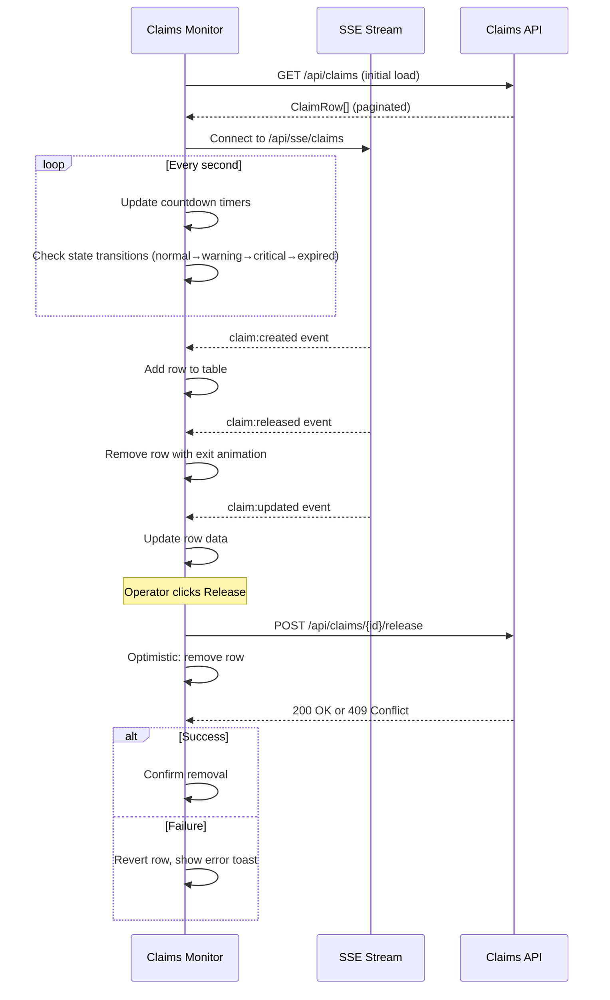

# Claims Monitor — Component Specification

> **Ticket:** FORGEOS-UID004 | **Author:** UIDesigner | **Date:** 2026-03-10

## Overview

The Claims Monitor is a real-time monitoring view for tracking all active ticket claims
across the ForgeOS multi-agent orchestration system. It provides operators with immediate
visibility into lease status, agent assignments, and expiration urgency.

## Components

### ClaimsMonitorTable

Full specification in [mockup document](../mockups/FORGEOS-UID004.md#31-claimsmonitortable).

**Key behaviors:**
- Default sort: Lease Remaining ascending (most urgent first)
- Real-time updates via SSE (Server-Sent Events)
- Color-coded urgency states: normal (green), warning (yellow, <5min), critical (red, <1min), expired (red badge)
- Batch action: "Release All Expired" with confirmation modal
- Individual actions: View (eye icon), Release (unlock icon)

### LeaseCountdownTimer

Full specification in [mockup document](../mockups/FORGEOS-UID004.md#32-leasecountdowntimer).

**Key behaviors:**
- Updates every second via `setInterval` or `requestAnimationFrame`
- State transitions: Normal → Warning (≤5min) → Critical (≤1min) → Expired (≤0)
- Pulse animation on warning/critical dots (respects `prefers-reduced-motion`)
- `aria-live` updates at decreasing intervals as urgency increases
- Monospace font (`JetBrains Mono`) for stable character width

### Row States

```
┌─────────────────────────────────────────────────────────────────────────────┐
│ NORMAL ROW                                                                  │
│ FORGEOS-BE015  │ Backend  │ pop-os    │ reaperoak │ 🟢 24:15 │ [👁] [🔓]  │
├─────────────────────────────────────────────────────────────────────────────┤
│ WARNING ROW (yellow left border, warning bg tint)                           │
│ FORGEOS-UID003 │ Frontend │ dev-serv  │ john_doe  │ 🟡 04:32 │ [👁] [🔓]  │
├─────────────────────────────────────────────────────────────────────────────┤
│ CRITICAL ROW (red left border, critical bg tint)                            │
│ TASK-FOS-002   │ QA       │ staging   │ reaperoak │ 🔴 00:45 │ [👁] [🔓]  │
├─────────────────────────────────────────────────────────────────────────────┤
│ EXPIRED ROW (red left border, dimmed opacity 0.8)                           │
│ FORGEOS-RES003 │ Research │ pop-os    │ alice     │ ❌ EXPIRED│ [👁] [⚠🔓] │
└─────────────────────────────────────────────────────────────────────────────┘
```

### Pagination

- Default: 20 rows per page
- Shows: "Showing {start}-{end} of {total} claims"
- Page navigation: Previous/Next buttons + direct page number links
- Keyboard: Arrow Left/Right to navigate pages

## Data Flow



## Integration Notes

- Reuses `StatusDot` component from FORGEOS-UID001 (§3.5)
- Reuses `Badge` component from FORGEOS-UID001 (§3.6)
- Extends `CountdownTimer` from FORGEOS-UID001 (§3.7) with warning/critical thresholds
- Color tokens from `docs/uiux/design-tokens.json` (no new tokens needed)
