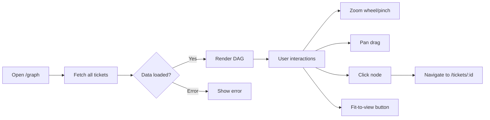

# Dependency Graph Component Specification

**Ticket:** FORGEOS-FE005  
**Status:** APPROVED  
**Author:** UIDesigner  
**Date:** 2026-03-11  

## Overview

Interactive DAG visualization of the ticket dependency graph. Renders all tickets as nodes with directed edges showing dependency relationships. Supports zoom, pan, fit-to-view, and click-to-navigate.

## Screen Inventory

| Screen | Route | Description |
|--------|-------|-------------|
| Dependency Graph | `/graph` | Full-page interactive dependency DAG |

## Components

### 1. `DependencyGraph` — `dashboard/src/components/graph/DependencyGraph.tsx`

SVG-based directed acyclic graph renderer.

**Props:**

| Prop | Type | Required | Description |
|------|------|----------|-------------|
| `tickets` | `Ticket[]` | Yes | Array of tickets with `ticket_id`, `title`, `stage`, `depends_on` |

**States:**

| State | Description |
|-------|-------------|
| Default | Graph rendered with all nodes and edges, auto fit-to-view |
| Hover (node) | Node border highlights with primary color; connected edges brighten |
| Empty | "No tickets to display" message on empty data |
| Panning | Cursor changes to grabbing; canvas translates with mouse movement |
| Zoomed | Scale changes via wheel, pinch, or control buttons |

**Node Design:**

- Dimensions: 180×56px with 8px border-radius
- Left 4px colored indicator bar matching stage color
- Ticket ID in mono font (11px, bold, stage color)
- Abbreviated title below (11px, text color, truncated at 18 chars)
- Background: `--color-surface`
- Border: 2px solid, stage color (2.5px + primary color on hover)

**Edge Design:**

- Cubic bezier curves from right-center of source → left-center of target
- Stroke: `--color-text-muted` at 0.5 opacity (default), primary at full opacity (highlighted)
- Arrowhead marker at target end (8×6px polygon)

**Interactions:**

| Action | Behavior |
|--------|----------|
| Mouse wheel | Zoom in/out (0.15 step, range 0.2×–3×) |
| Two-finger pinch | Zoom in/out proportionally |
| Mouse drag on canvas | Pan the graph |
| Click node | Navigate to `/tickets/{ticket_id}` |
| Keyboard Enter/Space on focused node | Navigate to detail page |
| Hover node | Highlight node border + connected edges |

**Accessibility:**

- SVG has `role="img"` with `aria-label="Ticket dependency graph"`
- Each node has `role="button"`, `tabIndex={0}`, `aria-label` with ticket ID, title, and stage
- Keyboard navigation: Tab through nodes, Enter/Space to navigate
- Touch targets: 180×56px nodes exceed 44×44px minimum

### 2. `GraphControls` — `dashboard/src/components/graph/GraphControls.tsx`

Floating control toolbar for graph zoom and fit operations.

**Props:**

| Prop | Type | Required | Description |
|------|------|----------|-------------|
| `scale` | `number` | Yes | Current zoom scale |
| `onZoomIn` | `() => void` | Yes | Zoom in handler |
| `onZoomOut` | `() => void` | Yes | Zoom out handler |
| `onFitToView` | `() => void` | Yes | Fit-to-view handler |

**Layout:**

- Position: absolute bottom-right of graph container
- Background: `--color-surface` with border and shadow
- Three icon buttons: ZoomIn, scale percentage, ZoomOut, divider, Maximize2 (fit)
- Scale shown as percentage (tabular-nums for alignment)

**Accessibility:**

- Container has `role="toolbar"` with `aria-label="Graph controls"`
- Each button has descriptive `aria-label` and `title`
- Focus ring on all interactive elements

### 3. `layout.ts` — `dashboard/src/lib/graph/layout.ts`

DAG layout engine using Sugiyama-style layered graph algorithm.

**Exports:**

| Export | Type | Description |
|--------|------|-------------|
| `GraphNode` | interface | Positioned node with id, title, stage, x, y, width, height |
| `GraphEdge` | interface | Directed edge from dependency to dependent |
| `GraphLayout` | interface | Complete layout with nodes, edges, width, height |
| `computeLayout` | function | Computes positions for all nodes |

**Algorithm:**

1. Build adjacency list from `depends_on` arrays
2. Topological sort via Kahn's algorithm (cycle-safe — appends remaining nodes)
3. Layer assignment: each node placed at `max(parent layers) + 1`
4. Group nodes by layer; position layers left-to-right, nodes within layer top-to-bottom
5. Constants: node 180×56px, 80px horizontal gap, 100px vertical gap, 60px padding

### 4. `page.tsx` — `dashboard/src/app/graph/page.tsx`

Next.js page component for the `/graph` route.

**Data Fetching:**

- Fetches all tickets via paginated `fetchTickets()` calls (100 per page)
- Continues until `has_more` is false
- Cleanup on unmount via cancelled flag

**States:**

| State | Visual |
|-------|--------|
| Loading | Centered spinner with "Loading dependency graph…" |
| Error | Centered alert icon with error message |
| Loaded | `DependencyGraph` component with full ticket data |

## Design Token References

**Stage Colors (from design-tokens.json):**

| Stage | Dark | Light |
|-------|------|-------|
| READY | `#06B6D4` | `#0891B2` |
| RESEARCH | `#A855F7` | `#9333EA` |
| ARCHITECT | `#8B5CF6` | `#7C3AED` |
| BACKEND | `#3B82F6` | `#2563EB` |
| FRONTEND | `#14B8A6` | `#0D9488` |
| QA | `#F97316` | `#EA580C` |
| SECURITY | `#EF4444` | `#DC2626` |
| CI | `#EAB308` | `#CA8A04` |
| DOCS | `#64748B` | `#475569` |
| VALIDATION | `#16A34A` | `#15803D` |
| DONE | `#22C55E` | `#16A34A` |

**Surface Colors:** `--color-surface`, `--color-background`, `--color-border`  
**Text Colors:** `--color-text`, `--color-text-muted`  
**Interactive:** `--color-primary` for hover highlights, `--color-focus` for focus rings

## User Flow

## Responsive Behavior

| Breakpoint | Behavior |
|------------|----------|
| Desktop (>1024px) | Full graph view, mouse wheel zoom, mouse drag pan |
| Tablet (640–1024px) | Full graph view, touch pinch zoom, touch drag pan |
| Mobile (<640px) | Full graph view, touch interactions, controls remain visible |

Graph auto-fits to container on mount at all breakpoints. Container height is `calc(100vh - 10rem)` to leave room for topbar and page header.

## Accessibility Checklist

- [x] WCAG AA color contrast on node text (white on dark surface ≥ 7:1)
- [x] Focus indicators: 2px focus ring on all interactive elements
- [x] Touch targets: nodes 180×56px, control buttons with padding ≥ 44×44px
- [x] Keyboard navigation: Tab to nodes, Enter/Space to activate
- [x] ARIA roles: img on SVG, button on nodes, toolbar on controls
- [x] Screen reader text: aria-labels with ticket ID, title, and stage on each node
- [x] Reduced motion: CSS transitions respect prefers-reduced-motion
