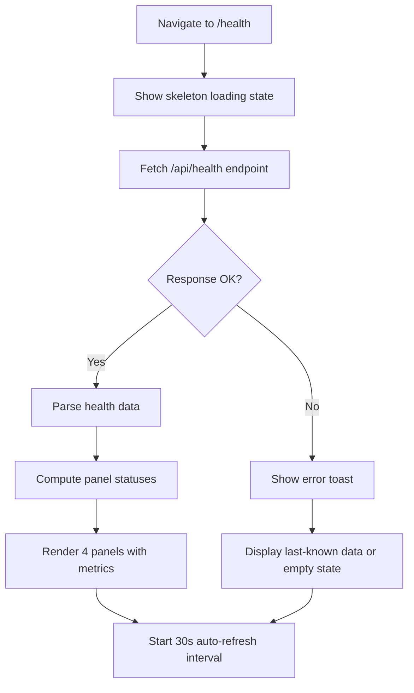
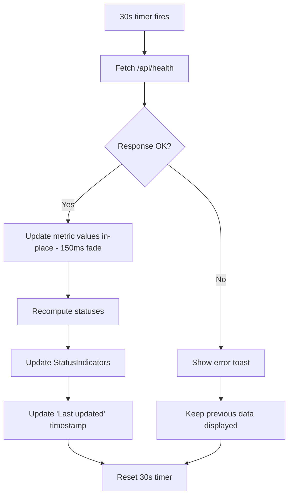

# FORGEOS-FE011 — System Health Dashboard Implementation Spec

> **Ticket:** FORGEOS-FE011 | **Agent:** UIDesigner | **Date:** 2026-03-11
> **Status:** APPROVED | **Confidence:** HIGH

This specification maps the approved FORGEOS-UID005 design to the concrete file structure and component API for Frontend Engineer implementation.

---

## 1. File Structure

```
dashboard/src/
├── app/health/
│   └── page.tsx              ← Main health page (already exists, needs rework)
├── components/health/
│   ├── HealthPanel.tsx        ← Container panel with header + status
│   ├── MetricCard.tsx         ← Metric display with trend + sparkline
│   ├── StatusIndicator.tsx    ← Green/yellow/red status dot
│   ├── ConnectionPoolGauge.tsx (optional stretch)
│   ├── SuccessRateDonut.tsx   (optional stretch)
│   └── AlertItem.tsx          (optional stretch)
```

**Note:** Existing `dashboard/src/components/MetricCard.tsx` and `dashboard/src/components/HealthStatusCard.tsx` should be used as base patterns. The health-specific components in `components/health/` extend them with domain-specific props.

---

## 2. Component Hierarchy

```
HealthPage (app/health/page.tsx)
├── PageHeader ("System Health", refresh button, last-updated timestamp)
├── HealthPanelGrid (CSS Grid 2×2 → 1-col mobile)
│   ├── HealthPanel (title="Database", status=computed)
│   │   ├── StatusIndicator (status: healthy|degraded|critical)
│   │   ├── MetricCard (label="Connection Pool", value="12/20", unit="active")
│   │   ├── MetricCard (label="P50 Latency", value="4.2", unit="ms", trend={dir,val})
│   │   └── MetricCard (label="P99 Latency", value="18.7", unit="ms", trend={dir,val})
│   ├── HealthPanel (title="MCP Server", status=computed)
│   │   ├── StatusIndicator (status: healthy|degraded|critical)
│   │   ├── MetricCard (label="Uptime", value="14d 3h", unit="")
│   │   ├── MetricCard (label="Connected Agents", value="6", trend={dir,val})
│   │   └── MetricCard (label="Requests/min", value="142", trend={dir,val})
│   ├── HealthPanel (title="Webhooks", status=computed)
│   │   ├── StatusIndicator (status: healthy|degraded|critical)
│   │   ├── MetricCard (label="Success Rate", value="99.2", unit="%")
│   │   ├── MetricCard (label="Pending Queue", value="3")
│   │   └── MetricCard (label="Failed Deliveries", value="2", severity="warning")
│   └── HealthPanel (title="Alerts", badge={count: 3})
│       ├── AlertItem (severity="critical", message="DB Latency Spike", time="5m ago")
│       ├── AlertItem (severity="warning", message="Queue Growth Warning", time="15m ago")
│       ├── AlertItem (severity="info", message="Agent Restart", time="1h ago")
│       └── EmptyState (when no alerts)
```

---

## 3. Component Specifications

### 3.1 HealthPanel

Container card wrapping a health domain (Database, MCP Server, Webhooks, Alerts).

```typescript
interface HealthPanelProps {
  title: string;                                        // "Database", "MCP Server", etc.
  status?: 'healthy' | 'degraded' | 'critical' | 'unknown';
  badge?: { count: number };                            // Alert count badge
  children: React.ReactNode;                            // MetricCards, AlertItems
  collapsible?: boolean;                                // true on mobile
  defaultCollapsed?: boolean;
}
```

**Styling (using design tokens):**

| Property | Token / Value |
|----------|---------------|
| Background | `surface` (#1E293B dark / #FFFFFF light) |
| Border | 1px `border` (#334155 dark / #E2E8F0 light) |
| Border-radius | `borderRadius.lg` (8px) |
| Padding | `spacing.md` (16px) |
| Header height | 48px |
| Header font | `fontSize.xl` (20px), `fontWeight.semibold` |
| Header border-bottom | 1px `borderSubtle` |
| Gap between children | `spacing.sm` (8px) |

**States:**

| State | Appearance |
|-------|-----------|
| Default | Title + StatusIndicator in header, children visible |
| Collapsed (mobile) | Chevron right, children hidden, only header visible |
| Expanded (mobile) | Chevron down, children visible |
| Loading | Skeleton shimmer in content area |

**Accessibility:**
- `role="region"` with `aria-labelledby` pointing to the title element
- Collapsible: `aria-expanded`, `aria-controls` on header button
- Badge: `aria-label="3 alerts"` on badge element

---

### 3.2 MetricCard (Health-Specific)

Extends the existing `MetricCard` pattern at `dashboard/src/components/MetricCard.tsx`.

```typescript
interface HealthMetricCardProps {
  label: string;                                        // "P50 Latency", "Connected Agents"
  value: string | number;                               // "4.2", 6, "99.2"
  unit?: string;                                        // "ms", "%", "/min", "active"
  trend?: {
    direction: 'up' | 'down' | 'flat';
    value: string;                                      // "+0.3ms", "-2"
  };
  severity?: 'normal' | 'warning' | 'critical';        // Left-border accent color
  loading?: boolean;
}
```

**Styling:**

| Property | Token / Value |
|----------|---------------|
| Background | `surfaceAlt` (#162032 dark / #F8FAFC light) |
| Border | 1px `border` |
| Border-radius | `borderRadius.lg` (8px) |
| Padding | `spacing.md` (16px) |
| Min-width | 200px (desktop), 100% (mobile) |
| Label font | `fontSize.sm` (14px), `fontWeight.medium`, color `textMuted` |
| Value font | `fontSize.2xl` (24px), `fontWeight.bold`, `fontFamily.mono` |
| Value color | `text` (normal), `warning` (warning severity), `error` (critical) |
| Unit font | `fontSize.sm`, `textMuted`, inline after value |
| Left border (warning) | 3px solid `warning` (#EAB308) |
| Left border (critical) | 3px solid `error` (#EF4444) |

**Trend Indicator:**

| Direction | Icon | Color |
|-----------|------|-------|
| up (positive context, e.g., agents) | ↑ | `success` (#16A34A) |
| up (negative context, e.g., latency) | ↑ | `error` (#EF4444) |
| down (positive context, e.g., latency) | ↓ | `success` (#16A34A) |
| down (negative context, e.g., agents) | ↓ | `error` (#EF4444) |
| flat | → | `textMuted` |

Trend text: `fontSize.xs` (12px), `fontFamily.mono`, inline below value.

**States:**

| State | Visual |
|-------|--------|
| Default | Value in `text` color, no left accent |
| Warning | Value in `warning`, 3px left border `warning` |
| Critical | Value in `error`, 3px left border `error` |
| Loading | Skeleton shimmer: label placeholder (50% width), value placeholder (75% width) |
| No Data | Value shows "—" in `textMuted` |

**Accessibility:**
- `role="status"` with `aria-label="{label}: {value}{unit}"`
- Trend: `aria-label="Change: {direction} {value}"`

---

### 3.3 StatusIndicator

Colored dot indicating system health status.

```typescript
interface StatusIndicatorProps {
  status: 'healthy' | 'degraded' | 'critical' | 'unknown';
  label?: string;                                       // Optional text label beside dot
  size?: 'sm' | 'md' | 'lg';                           // 6px | 8px | 12px
  pulse?: boolean;                                      // Animated ring for critical
}
```

**Color Mapping (from design tokens):**

| Status | Dot Color (Dark) | Dot Color (Light) | Text Label |
|--------|------------------|-------------------|------------|
| healthy | `success` #16A34A | `success` #16A34A | "Healthy" |
| degraded | `warning` #EAB308 | `warning` #D97706 | "Degraded" |
| critical | `error` #EF4444 | `error` #DC2626 | "Critical" |
| unknown | #6B7280 | #6B7280 | "Unknown" |

**Sizes:**

| Size | Dot diameter | Use case |
|------|-------------|----------|
| sm | 6px | Inline with text, compact spaces |
| md | 8px | Panel headers (default) |
| lg | 12px | Standalone status displays |

**Pulse animation (critical only):**
```css
@keyframes pulse-ring {
  0% { box-shadow: 0 0 0 0 rgba(239, 68, 68, 0.4); }
  70% { box-shadow: 0 0 0 6px rgba(239, 68, 68, 0); }
  100% { box-shadow: 0 0 0 0 rgba(239, 68, 68, 0); }
}
/* Duration: 1.5s ease infinite */
/* Respects prefers-reduced-motion: disable animation */
```

**Accessibility:**
- `role="status"`, `aria-live="polite"`
- `aria-label="{label} status: {status}"` (e.g., "Database status: healthy")
- Color is NEVER the sole indicator — always display text label or tooltip
- Focus ring: 2px solid `focus` token, 2px offset
- Touch target on mobile: 44×44px minimum (padding around dot)

---

## 4. Page Layout — `dashboard/src/app/health/page.tsx`

### 4.1 Page Structure

```tsx
// Pseudocode layout (NOT implementation code)
<div className="p-6 space-y-6">
  {/* Page Header */}
  <div className="flex items-center justify-between">
    <h1 className="text-2xl font-bold">System Health</h1>
    <div className="flex items-center gap-3">
      <span className="text-sm text-muted">
        Last updated: {lastUpdated}
      </span>
      <RefreshButton onClick={refresh} loading={isRefreshing} />
    </div>
  </div>

  {/* 2×2 Health Panel Grid */}
  <div className="grid grid-cols-1 md:grid-cols-2 gap-6">
    <HealthPanel title="Database" status={dbStatus}>
      <MetricCard label="Connection Pool" value={poolUsed + "/" + poolMax} />
      <div className="grid grid-cols-2 gap-2">
        <MetricCard label="P50 Latency" value={p50} unit="ms" trend={p50Trend} />
        <MetricCard label="P99 Latency" value={p99} unit="ms" trend={p99Trend} />
      </div>
    </HealthPanel>

    <HealthPanel title="MCP Server" status={mcpStatus}>
      <MetricCard label="Uptime" value={uptimeFormatted} />
      <div className="grid grid-cols-2 gap-2">
        <MetricCard label="Connected Agents" value={agentCount} trend={agentTrend} />
        <MetricCard label="Requests/min" value={reqPerMin} trend={reqTrend} />
      </div>
    </HealthPanel>

    <HealthPanel title="Webhooks" status={webhookStatus}>
      <MetricCard label="Success Rate" value={successRate} unit="%" />
      <div className="grid grid-cols-2 gap-2">
        <MetricCard label="Pending Queue" value={pendingCount} />
        <MetricCard label="Failed Deliveries" value={failedCount} severity={failedSeverity} />
      </div>
    </HealthPanel>

    <HealthPanel title="Alerts" badge={{ count: alertCount }}>
      {alerts.map(alert => (
        <AlertItem
          severity={alert.severity}
          message={alert.message}
          timestamp={alert.timestamp}
          onDismiss={dismissAlert}
        />
      ))}
      {alerts.length === 0 && <EmptyState message="No active alerts" />}
    </HealthPanel>
  </div>
</div>
```

### 4.2 Data Refresh UX

| Behavior | Specification |
|----------|---------------|
| Auto-refresh interval | 30 seconds |
| Refresh indicator | Subtle rotate animation on refresh icon during fetch |
| Manual refresh | Click refresh button triggers immediate fetch |
| Stale data indicator | "Last updated: X seconds ago" text in header |
| Error state | Toast notification on failed refresh, retain last-good data |
| Loading (initial) | Skeleton shimmer in all MetricCards and panels |
| Loading (refresh) | No skeleton — values update in-place with 150ms fade |
| Unmount cleanup | Clear interval on page unmount |

### 4.3 Status Computation Rules

Status for each panel is computed client-side from metric values:

**Database:**

| Condition | Status |
|-----------|--------|
| Pool utilization ≤ 70% AND P99 < 100ms | healthy |
| Pool utilization 71–90% OR P99 100–500ms | degraded |
| Pool utilization > 90% OR P99 > 500ms | critical |

**MCP Server:**

| Condition | Status |
|-----------|--------|
| Server reachable AND agents > 0 | healthy |
| Server reachable AND agents = 0 | degraded |
| Server unreachable | critical |

**Webhooks:**

| Condition | Status |
|-----------|--------|
| Success rate ≥ 99% | healthy |
| Success rate 95–98.9% | degraded |
| Success rate < 95% | critical |

---

## 5. Design Token Usage Summary

All values reference `docs/uiux/design-tokens.json`.

### Colors

| Token | Usage in Health Dashboard |
|-------|--------------------------|
| `success` | Healthy status dots, positive trends |
| `warning` | Degraded status dots, warning-severity alerts, MetricCard left border |
| `error` | Critical status dots, critical-severity alerts, MetricCard left border |
| `info` | Info-severity alerts |
| `surface` | HealthPanel background |
| `surfaceAlt` | MetricCard background (nested inside panel) |
| `border` | Panel and card borders |
| `borderSubtle` | Panel header bottom border |
| `text` | Primary text, metric values |
| `textMuted` | Labels, units, timestamps, "Last updated" |
| `primary` | Refresh button, page heading accent |
| `focus` | Focus ring (keyboard navigation) |

### Typography

| Token | Usage |
|-------|-------|
| `fontSize.2xl` (24px) | Page heading "System Health" |
| `fontSize.xl` (20px) | Panel header titles |
| `fontSize.2xl` (24px) | Metric values |
| `fontSize.sm` (14px) | Metric labels, alert messages, "Last updated" |
| `fontSize.xs` (12px) | Trend indicators, alert timestamps |
| `fontFamily.mono` | Metric values, latency numbers |
| `fontFamily.sans` | Everything else |
| `fontWeight.bold` | Metric values, page heading |
| `fontWeight.semibold` | Panel titles |
| `fontWeight.medium` | Metric labels |

### Spacing

| Token | Usage |
|-------|-------|
| `spacing.lg` (24px) | Grid gap between panels, page padding |
| `spacing.md` (16px) | Panel internal padding, MetricCard padding |
| `spacing.sm` (8px) | Gap between MetricCards within a panel |
| `spacing.xs` (4px) | Gap between status dot and label |

### Other Tokens

| Token | Usage |
|-------|-------|
| `borderRadius.lg` (8px) | Panels and cards |
| `transitions.fast` (150ms) | Value updates, hover states |
| `transitions.normal` (250ms) | Panel collapse/expand |
| `zIndex.base` (0) | Normal content flow |

---

## 6. Responsive Breakpoints

| Breakpoint | Grid | Panel Behavior | MetricCard Layout |
|-----------|------|----------------|-------------------|
| Desktop ≥ 1024px | 2 columns, 24px gap | Always expanded | 2-col pairs within panel |
| Tablet 768–1023px | 2 columns, 16px gap | Always expanded | 2-col pairs, compressed |
| Mobile < 768px | 1 column, 16px gap | Collapsible (chevron toggle) | Full-width stacked |

### Mobile-Specific

- Panels are collapsible with chevron toggle in header
- Touch targets: 44×44px minimum for all interactive elements
- Alert items: 56px min-height (44px touch target compliance)
- MetricCards stack vertically at full width

---

## 7. User Flow Diagrams

### 7.1 Health Dashboard Load



### 7.2 Auto-Refresh Cycle



---

## 8. Acceptance Criteria Verification

| # | Criterion | Status | Evidence |
|---|-----------|--------|----------|
| 1 | 4 health panels: Database, MCP Server, Webhooks, Alerts | ✅ MET | §2 Component Hierarchy, §4.1 Page Layout |
| 2 | StatusIndicator states: green=healthy, yellow=degraded, red=critical | ✅ MET | §3.3 StatusIndicator color mapping table |
| 3 | MetricCard layout: label, value, arrow direction | ✅ MET | §3.2 HealthMetricCardProps with trend.direction |
| 4 | Component hierarchy documented | ✅ MET | §2 full component tree |
| 5 | Design tokens referenced for styling | ✅ MET | §5 complete token usage mapping |
| 6 | Responsive breakpoints defined | ✅ MET | §6 three breakpoints with grid/behavior specs |
| 7 | Data refresh UX (30-second auto-refresh) | ✅ MET | §4.2 Data Refresh UX table |

---

## 9. Cross-References

| Artifact | Path | Relationship |
|----------|------|-------------|
| Design Mockup | `docs/uiux/mockups/FORGEOS-UID005.md` | Full wireframes, screenshots, layout spec |
| Component Spec (detailed) | `docs/uiux/components/health-panel.md` | Detailed TypeScript interfaces, all states |
| Design Tokens | `docs/uiux/design-tokens.json` | Color, typography, spacing values |
| Layout Spec | `docs/uiux/layout-spec.md` | Shell architecture, responsive matrix |
| Existing MetricCard | `dashboard/src/components/MetricCard.tsx` | Base pattern to extend |
| Existing HealthStatusCard | `dashboard/src/components/HealthStatusCard.tsx` | Reference for status patterns |
| Health API | FORGEOS-BE038 | Data source: `/api/health` endpoint |
