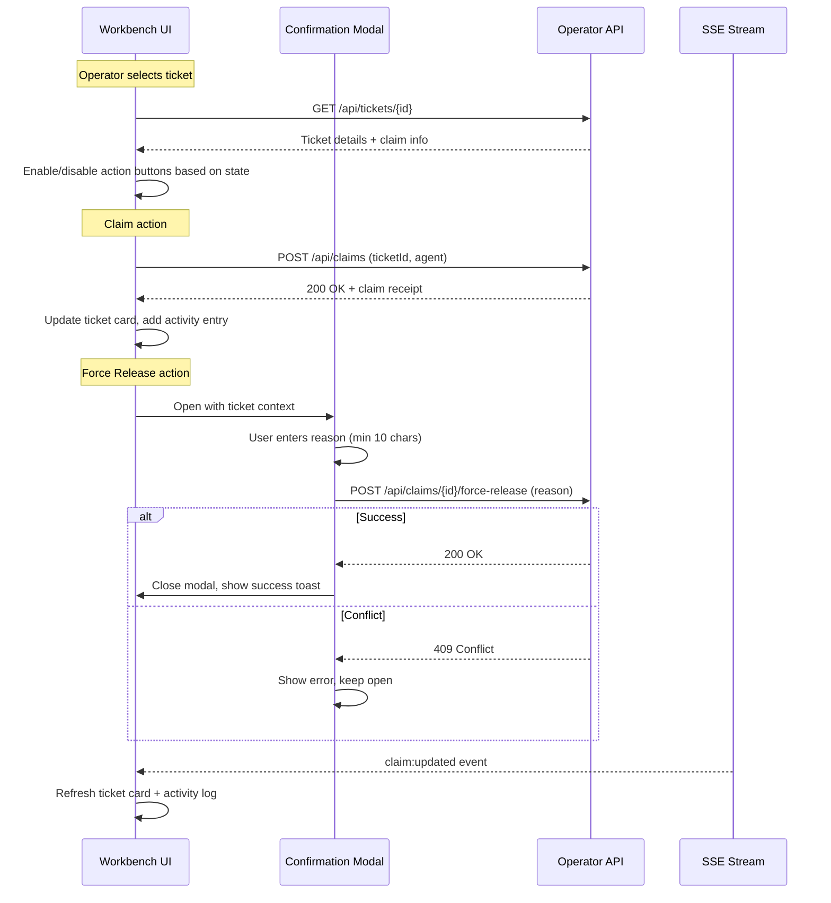

# Operator Actions — Component Specification

> **Ticket:** FORGEOS-UID004 | **Author:** UIDesigner | **Date:** 2026-03-10

## Overview

The Operator Actions components provide authenticated operators with the ability to
perform ticket management operations: Claim, Release, Advance, and Force-Release.
All destructive actions require confirmation via a modal dialog with a reason input.

## Components

### OperatorActionButton

Full specification in [mockup document](../mockups/FORGEOS-UID004.md#33-operatoractionbutton).

**Action button grid (2×2 on desktop):**

```
┌─────────────────────────┬─────────────────────────┐
│  ✋ Claim Ticket         │  🔓 Release Claim       │
│  Acquire lease on an    │  Release your active    │
│  unclaimed ticket       │  claim on a ticket      │
│  [GREEN #16A34A]        │  [ORANGE #F97316]       │
├─────────────────────────┼─────────────────────────┤
│  → Advance Stage        │  🔒⚠ Force Release      │
│  Move ticket to next    │  Force-release another  │
│  SDLC stage             │  operator's claim       │
│  [BLUE #3B82F6]         │  [RED #EF4444]          │
└─────────────────────────┴─────────────────────────┘
```

**Auth gate behavior:**
- When `isAuthenticated = false`: all buttons disabled (opacity 0.5), lock overlay
- When `isAuthenticated = true`: buttons enabled based on selected ticket state
- Force-Release always requires explicit confirmation modal

### ConfirmationModal

Full specification in [mockup document](../mockups/FORGEOS-UID004.md#34-confirmationmodal).

**Usage contexts:**
1. **Force Release** — Red danger variant, reason required
2. **Force Advance** — Orange warning variant, reason required  
3. **Release All Expired** — Red danger variant, no ticket-specific context

**Validation rules:**
- Reason field: required, minimum 10 characters
- Inline validation shown on blur or submit attempt
- Confirm button only enabled when validation passes

### MachineStatusCard

Full specification in [mockup document](../mockups/FORGEOS-UID004.md#35-machinestatuscard).

**Machine status indicators:**
| Status | Dot Color | Animation | Label |
|--------|-----------|-----------|-------|
| Connected | `success` green | None | "Connected" |
| Reconnecting | `warning` yellow | Pulse (1s) | "Reconnecting..." |
| Disconnected | `error` red | None | "Disconnected" |

**Grid layout:**
```
┌──────────────────┬──────────────────┬──────────────────┐
│ 🟢 pop-os        │ 🟢 dev-server    │ 🟡 staging-box   │
│ 192.168.1.42     │ 10.0.0.15        │ 172.16.0.5       │
│ Heartbeat: 2s    │ Heartbeat: 12s   │ Heartbeat: 45s   │
│ ──────────────── │ ──────────────── │ ──────────────── │
│ Backend  BE015   │ Architect FOS002 │ Research  RES003 │
│ Frontend FOS005  │ DevOps   FOS004  │ (Stale ⚠)        │
│ QA       FOS003  │ CI       FOS006  │                   │
│ Security FOS002  │                   │                   │
│ ──────────────── │ ──────────────── │ ──────────────── │
│ CPU ████░░ 42%   │ CPU ██░░░░ 28%   │ CPU █░░░░░  5%   │
│ MEM ██████ 67%   │ MEM ████░░ 51%   │ MEM ██░░░░ 12%   │
│ Sessions: 4      │ Sessions: 3      │ Sessions: 1      │
└──────────────────┴──────────────────┴──────────────────┘
```

### AuthUserBadge

Full specification in [mockup document](../mockups/FORGEOS-UID004.md#36-authuserbadge).

**Visual states:**
```
Authenticated:   [👤] reaperoak ✓
Unauthenticated: [🔒] Sign In
Loading:         [░░] ░░░░░░░░
```

### OperatorActivityLog

Full specification in [mockup document](../mockups/FORGEOS-UID004.md#37-operatoractivitylog).

**Entry format:**
```
[2 min ago]  ✓ Claimed FORGEOS-BE015 (Backend → BACKEND stage)
[5 min ago]  ✓ Released TASK-FOS-003 (QA claim released)  
[12 min ago] ✓ Advanced FORGEOS-UID001 (FRONTEND → QA)
[1 hr ago]   ✗ Force Release TASK-FOS-002 failed (conflict)
[2 hr ago]   ✓ Force Released FORGEOS-RES003 (lease expired)
```

## Data Flow



## Integration Notes

- Extends nav tabs from FORGEOS-UID001 with "Workbench" tab
- Reuses `Badge`, `StatusDot` components from FORGEOS-UID001
- All API endpoints are JWT-authenticated (token from auth service)
- Activity log entries are stored server-side for audit trail
- Color tokens from `docs/uiux/design-tokens.json` (no modifications)
