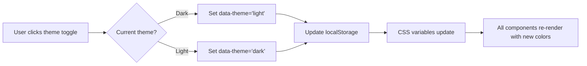
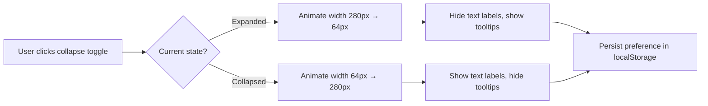
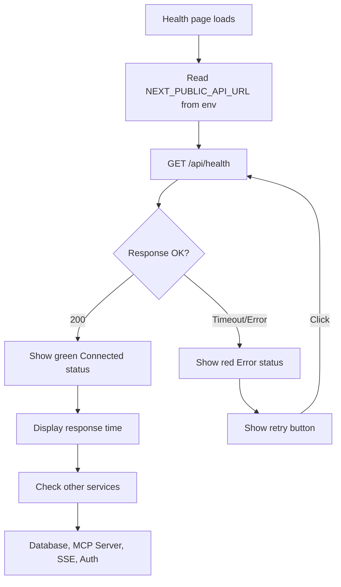
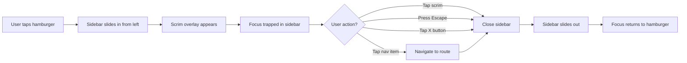

# FORGEOS-FE001 — Dashboard Web Application Scaffold

> **Ticket:** FORGEOS-FE001 | **Agent:** UIDesigner | **Date:** 2026-03-11
> **Status:** APPROVED | **Confidence:** HIGH

---

## 1. Screen Inventory

| # | Screen | Route | Stitch ID | Theme | Device | Description |
|---|--------|-------|-----------|-------|--------|-------------|
| 1 | Shell — Expanded Sidebar | `/` | `fb3d9ab27fe44b84a5242041afd08bda` | Dark | Desktop | Dashboard shell with 280px sidebar, top bar, breadcrumbs, metric cards |
| 2 | Shell — Collapsed Sidebar | `/` | `3b98dff3865648a8a0d4ef46de8e1650` | Dark | Desktop | Shell with 64px icon-only sidebar, recent activity feed |
| 3 | Shell — Light Theme | `/` | `df96a4a08be64209ad1116b29b7ffda7` | Light | Desktop | Light mode variant of expanded sidebar shell |
| 4 | Health Check Page | `/health` | `d68d0e3db3eb4493bc94361b0252b40c` | Dark | Desktop | API connectivity verification, service status grid |
| 5 | Mobile Navigation | `/` | `0683315849214f86b83df2b9ea07231c` | Dark | Mobile | Hamburger sidebar overlay, vertically stacked metrics |

### Screenshot References

| Screen | Screenshot |
|--------|------------|
| Shell — Expanded Sidebar (Dark) | [Stitch Screenshot](https://lh3.googleusercontent.com/aida/AOfcidWZ3J2Dspf_tQ9VIzFEgRbnzUgEQs0E-JVcMjOnkp3zn_O_izq7iKZ7B9Y7MyKFrEc99YpfPp2AepBH2i6bx_E11yQrIZdNo7CbUPj4YAmwGl31X9yuJLG-_4iIQ-rkohtl_uscuvjkAHGQ3xKHKO2tFuGfcmrQbsZejrQqCL2AXMgqK2Qhf80nqfSmzVigbOHAGxw6mxh_eBJiTkVgDeK7D0NnRRTz-Dce7y8pTTvEb3kddIqIjsHLLMQl) |
| Shell — Collapsed Sidebar (Dark) | [Stitch Screenshot](https://lh3.googleusercontent.com/aida/AOfcidUUm0P_RfZe3YGJcCYBzIQbmhBFqcW3j9v4YdSiEb4cBC9T5fCUuSVhh8nDwNjMPP5wjXJzco6PbJ037aKgw1TnXKQ_qcJ-C6mssArl451yTIFZ3oVc0KlAKOpywi3d9DCH9iLO1d_nVguG1SdsZFilNpHq4IMriTGt9KL0Xiw_zEEdDGOlrDBuoq7h8CWXiYs3NzcSJxcDUriV1VCHqbm-iQLyEod0jbQYShRBwpSANitsxhZQLGM_jlGl) |
| Shell — Light Theme | [Stitch Screenshot](https://lh3.googleusercontent.com/aida/AOfcidW86v_5S73QjT2iT8nLy07GLRapqJ-rZtHVuLzvUT1oflMvaEce5jDsvEHRDcSMMfu_vgBPwxbEabDfBB2pxDWZASiIVHUMcnr5p6LVqNiMHoRwlRNif-nQehdJo6fQHSrKQjznmT8BrjVj1q_DxudZdS5PBnh8ueMHNAW7xZYyepoDL8KuOILy9AKZ5BUMINsdjzcqrAE-QvCra3qHFMjOUhHADjcogOkJ72rc-LnMbon9-PC7W9f8eww) |
| Health Check Page (Dark) | [Stitch Screenshot](https://lh3.googleusercontent.com/aida/AOfcidUDXAJPZjDQ1TRTGu7Szzk0APEeuM2Lhq6C-UWpxc_e5wdglyESdXVZdsbP2z-la3N5j53N1dy0n12fEuP5hp4AaB-OuPMtykpq27kTRtBjV26pW9w6ah9Jnhqzd3b6QmdyNnyoSXaoy5v5AQjxWYoifE2WCbDEGC_rHD1tVqcGRrDA1nPrVwcBIPLsGOfDL1g1VymyUCFkIy754b7ZrYaVIKBxhQqImxuhsxxS90dDclDWMUI5ZxVWIjf6) |
| Mobile Navigation (Dark) | [Stitch Screenshot](https://lh3.googleusercontent.com/aida/AOfcidVktPUl2l6EVuK3VLAkxw6orpakj2QaNlItKtqq61wXYSjEHO3CpHIHVI4adx2QAlIjzfbtlAl9BeX4xg1XnaBlfJG1sJLzFS9dBhFzHlUqmKYXGKl2l4F-p96SH_QGGu9QbFq5s9gqcnldQd2MvpV07WoqqbwaAnGK9y_z6d2GjdPiGalnEWRcWZahmJgeZFuE94UUIuFdzZ1hP3lEKT-42Ircxcv1cSuBj2aP0qKlgsKFTaGkx4OE2qhs) |

---

## 2. Design Token Reference

Full design tokens are in [`docs/uiux/design-tokens.json`](../design-tokens.json) (from FORGEOS-UID001).

This scaffold uses the following token subsets:

### 2.1 Theme Colors

| Token | Dark | Light | Usage |
|-------|------|-------|-------|
| `primary` | `#06B6D4` | `#2563EB` | Active nav, links, accent |
| `primaryHover` | `#0891B2` | `#1D4ED8` | Hover on primary elements |
| `primaryMuted` | `#164E63` | `#DBEAFE` | Active nav background |
| `surface` | `#1E293B` | `#FFFFFF` | Cards, sidebar, panels |
| `background` | `#0F172A` | `#F1F5F9` | Page background |
| `border` | `#334155` | `#E2E8F0` | Dividers, card borders |
| `text` | `#F8FAFC` | `#0F172A` | Primary text |
| `textMuted` | `#94A3B8` | `#64748B` | Secondary text, labels |
| `error` | `#EF4444` | `#DC2626` | Error states |
| `warning` | `#EAB308` | `#D97706` | Warning states |
| `success` | `#16A34A` | `#16A34A` | Connected, healthy |

### 2.2 Typography

| Element | Font | Size | Weight |
|---------|------|------|--------|
| Page heading | Inter | 1.5rem (24px) | 700 (Bold) |
| Section heading | Inter | 1.25rem (20px) | 600 (Semibold) |
| Nav item | Inter | 0.875rem (14px) | 500 (Medium) |
| Section label | Inter | 0.75rem (12px) | 600 (Semibold) |
| Body | Inter | 1rem (16px) | 400 (Normal) |
| Metric value | Inter | 2.25rem (36px) | 700 (Bold) |
| Endpoint URL | JetBrains Mono | 0.875rem (14px) | 400 |
| Badge | Inter | 0.75rem (12px) | 600 |

### 2.3 Layout Dimensions

| Element | Size |
|---------|------|
| Sidebar expanded | 280px |
| Sidebar collapsed | 64px |
| Top bar height | 56px |
| Content padding | 32px (xl) |
| Card border-radius | 8px (lg) |
| Card padding | 16px (md) |
| Sidebar transition | 250ms ease-in-out |

---

## 3. Shell Architecture

### 3.1 Layout Structure

```
┌──────────────────────────────────────────────────────┐
│ SIDEBAR (280px/64px)  │        TOP BAR (56px)        │
│  Logo + Toggle        │  Breadcrumbs   │ Search Bell │
│  ──────────────       │                │   Live  RO  │
│  NAVIGATION           ├────────────────────────────── │
│   Dashboard *         │                              │
│   Pipeline            │     MAIN CONTENT AREA        │
│   Claims              │                              │
│   Agents              │   Page Heading               │
│   Health              │   Metric Cards (grid)        │
│   Settings            │   Content Sections           │
│  ──────────────       │                              │
│  QUICK FILTERS        │                              │
│   My Tickets          │                              │
│   Critical Only       │                              │
│   Blocked             │                              │
│  ──────────────       │                              │
│  User Info            │                              │
│  Theme Toggle         │                              │
└───────────────────────┴──────────────────────────────┘
```

### 3.2 Sidebar States

| State | Width | Content | Trigger |
|-------|-------|---------|---------|
| Expanded | 280px | Icons + labels + sections | Default on desktop (≥1024px) |
| Collapsed | 64px | Icons only, tooltips on hover | Click collapse toggle |
| Mobile overlay | 280px | Same as expanded, over scrim | Hamburger menu tap |
| Hidden | 0px | Not rendered | Mobile default (< 768px) |

### 3.3 Top Bar Breadcrumbs

| Route | Breadcrumb |
|-------|------------|
| `/` | Dashboard > Overview |
| `/pipeline` | Dashboard > Pipeline |
| `/claims` | Dashboard > Claims |
| `/agents` | Dashboard > Agents |
| `/health` | Dashboard > Health Check |
| `/settings` | Dashboard > Settings |

---

## 4. Component Specifications

### 4.1 Sidebar

**Description:** Persistent left navigation panel with collapsible sections and theme toggle.

#### Props

| Prop | Type | Required | Default | Description |
|------|------|----------|---------|-------------|
| `isCollapsed` | `boolean` | no | `false` | Collapsed icon-only mode |
| `onToggleCollapse` | `() => void` | yes | — | Toggle sidebar width |
| `activeRoute` | `string` | yes | — | Currently active route path |
| `user` | `{ name: string; role: string; initials: string }` | yes | — | User info for bottom section |
| `theme` | `'dark' \| 'light'` | yes | — | Current theme |
| `onThemeToggle` | `() => void` | yes | — | Toggle dark/light theme |

#### States

| State | Description | Visual |
|-------|-------------|--------|
| Expanded | Full width with labels | 280px, text labels visible, sections expanded |
| Collapsed | Icon-only | 64px, tooltips on hover, section labels hidden |
| Mobile Open | Overlay on content | 280px over scrim backdrop, close button visible |
| Mobile Closed | Hidden | 0px, hamburger button in top bar |

#### Navigation Items

| Item | Icon | Route | Description |
|------|------|-------|-------------|
| Dashboard | `Home` | `/` | Overview with metrics |
| Pipeline | `LayoutDashboard` | `/pipeline` | Kanban board (from UID001) |
| Claims | `Clock` | `/claims` | Active claims monitor |
| Agents | `Users` | `/agents` | Agent status dashboard |
| Health | `HeartPulse` | `/health` | System health check |
| Settings | `Settings` | `/settings` | Configuration |

#### Accessibility

| Aspect | Requirement |
|--------|-------------|
| ARIA Role | `<nav role="navigation" aria-label="Main navigation">` |
| Keyboard Nav | Tab through items, Enter to navigate, Arrow Up/Down within nav |
| Screen Reader | Each item: "{label}, navigation link, {active or inactive}" |
| Focus Indicator | 2px solid focus ring (primary color) |
| Collapse Button | `aria-label="Collapse sidebar"` / `"Expand sidebar"` |
| Theme Toggle | `role="switch"`, `aria-checked`, `aria-label="Toggle dark mode"` |

#### Responsive Behavior

| Breakpoint | Behavior |
|------------|----------|
| Mobile (< 768px) | Hidden; hamburger icon in top bar opens overlay sidebar |
| Tablet (768–1023px) | Collapsed by default (64px), expandable |
| Desktop (≥ 1024px) | Expanded by default (280px), collapsible |

---

### 4.2 TopBar

**Description:** Horizontal bar with breadcrumbs, search, notifications, and connection status.

#### Props

| Prop | Type | Required | Default | Description |
|------|------|----------|---------|-------------|
| `breadcrumbs` | `{ label: string; href?: string }[]` | yes | — | Breadcrumb trail segments |
| `connectionStatus` | `'connected' \| 'reconnecting' \| 'disconnected'` | yes | — | SSE connection state |
| `notificationCount` | `number` | no | `0` | Unread notification count |
| `onSearch` | `() => void` | no | — | Opens global search |
| `onMenuToggle` | `() => void` | no | — | Mobile hamburger menu handler |
| `showMenuButton` | `boolean` | no | `false` | Show hamburger on mobile |
| `user` | `{ initials: string }` | yes | — | Avatar display |

#### States

| State | Description | Visual |
|-------|-------------|--------|
| Default | Normal state | Surface bg, breadcrumbs visible |
| Connected | SSE live | Green dot + "Live" text |
| Reconnecting | SSE reconnecting | Yellow pulsing dot + "Reconnecting..." |
| Disconnected | SSE lost | Red dot + "Disconnected" |
| Mobile | Compact mode | Hamburger icon replaces breadcrumbs |

#### Accessibility

| Aspect | Requirement |
|--------|-------------|
| ARIA | `<header role="banner">`, breadcrumbs in `<nav aria-label="Breadcrumbs">` |
| Notifications | `aria-label="Notifications, {count} unread"` |
| Connection | `aria-live="polite"` for status changes |
| Keyboard | Tab through interactive elements |

---

### 4.3 ThemeToggle

**Description:** Switch control in sidebar footer that toggles between dark and light themes.

#### Props

| Prop | Type | Required | Default | Description |
|------|------|----------|---------|-------------|
| `theme` | `'dark' \| 'light'` | yes | — | Current theme |
| `onToggle` | `() => void` | yes | — | Toggle callback |
| `compact` | `boolean` | no | `false` | Icon-only mode (collapsed sidebar) |

#### States

| State | Description | Visual |
|-------|-------------|--------|
| Dark active | Dark theme selected | Moon icon highlighted, switch left |
| Light active | Light theme selected | Sun icon highlighted, switch right |
| Hover | Hovering over toggle | Subtle background change |
| Focus | Keyboard focused | 2px focus ring |

#### Implementation Notes

- Theme preference persisted in `localStorage` key `forgeos-theme`
- Respects `prefers-color-scheme` media query on first load
- CSS custom properties updated on `<html>` element via `data-theme` attribute
- Transition: 250ms ease-in-out on all color properties

#### Accessibility

| Aspect | Requirement |
|--------|-------------|
| ARIA | `role="switch"`, `aria-checked="true/false"`, `aria-label="Toggle dark mode"` |
| Keyboard | Space/Enter to toggle |
| Screen Reader | Announces "Dark mode, on" or "Light mode, on" |

---

### 4.4 MetricCard

**Description:** Summary card displaying a key dashboard metric with value and label.

#### Props

| Prop | Type | Required | Default | Description |
|------|------|----------|---------|-------------|
| `label` | `string` | yes | — | Metric name (e.g., "Active Tickets") |
| `value` | `number \| string` | yes | — | Metric value |
| `color` | `string` | no | `'primary'` | Token-based color for value text |
| `icon` | `ReactNode` | no | — | Optional icon left of label |
| `trend` | `{ direction: 'up' \| 'down' \| 'flat'; value: string }` | no | — | Optional trend indicator |
| `isLoading` | `boolean` | no | `false` | Skeleton state |

#### States

| State | Description | Visual |
|-------|-------------|--------|
| Default | Showing metric | Surface bg, large colored value, muted label |
| Loading | Data fetching | Skeleton pulse (2 lines) |
| Error | Failed to load | Error icon + "Failed to load" text |
| Hover | Mouse over | Subtle elevation increase |

#### Accessibility

| Aspect | Requirement |
|--------|-------------|
| ARIA | `role="status"`, `aria-label="{label}: {value}"` |
| Color Independence | Label text always accompanies the colored value |

#### Responsive

| Breakpoint | Behavior |
|------------|----------|
| Mobile (< 768px) | Full width, stacked vertically, 16px gap |
| Tablet (768–1023px) | 2-column grid, 16px gap |
| Desktop (≥ 1024px) | 4-column grid, 24px gap |

---

### 4.5 HealthStatusCard

**Description:** Card showing health/connectivity status of a backend service.

#### Props

| Prop | Type | Required | Default | Description |
|------|------|----------|---------|-------------|
| `serviceName` | `string` | yes | — | Service display name |
| `status` | `'connected' \| 'warning' \| 'error' \| 'checking'` | yes | — | Health status |
| `endpoint` | `string` | no | — | API endpoint path |
| `baseUrl` | `string` | no | — | Base URL (from env) |
| `responseTime` | `string` | no | — | Latency display (e.g., "24ms") |
| `lastChecked` | `string` | no | — | Relative time (e.g., "2 seconds ago") |
| `message` | `string` | no | — | Status message for warning/error |
| `onCheck` | `() => void` | no | — | Manual check trigger |
| `isPrimary` | `boolean` | no | `false` | Large card variant for main API |

#### States

| State | Description | Visual |
|-------|-------------|--------|
| Connected | All healthy | Green dot, "Connected" text, response time shown |
| Warning | Degraded | Yellow dot, warning message, amber border-left |
| Error | Unreachable | Red dot, error message, red border-left, retry button |
| Checking | Running check | Spinner animation, "Checking..." text |

#### Accessibility

| Aspect | Requirement |
|--------|-------------|
| ARIA | `role="status"`, `aria-label="{serviceName}: {status}"` |
| Screen Reader | Announces status change via `aria-live="polite"` |
| Color Independence | Status conveyed by dot + text label + border, not color alone |
| Keyboard | "Check Now" button focusable, Enter/Space to activate |

---

### 4.6 Breadcrumb

**Description:** Navigation trail showing current location in the app hierarchy.

#### Props

| Prop | Type | Required | Default | Description |
|------|------|----------|---------|-------------|
| `items` | `{ label: string; href?: string }[]` | yes | — | Breadcrumb segments |
| `separator` | `string` | no | `'>'` | Separator character |

#### Accessibility

| Aspect | Requirement |
|--------|-------------|
| ARIA | `<nav aria-label="Breadcrumbs">`, `<ol>` with `<li>` items |
| Current Page | Last item has `aria-current="page"`, not a link |
| Separator | `aria-hidden="true"` on separator elements |

---

### 4.7 MobileSidebar

**Description:** Overlay sidebar for mobile viewports, slides in from left.

#### Props

| Prop | Type | Required | Default | Description |
|------|------|----------|---------|-------------|
| `isOpen` | `boolean` | yes | — | Controls visibility |
| `onClose` | `() => void` | yes | — | Close handler (X button or scrim tap) |
| `activeRoute` | `string` | yes | — | Currently active route |
| `user` | `{ name: string; role: string; initials: string }` | yes | — | User info |
| `theme` | `'dark' \| 'light'` | yes | — | Current theme |
| `onThemeToggle` | `() => void` | yes | — | Theme toggle handler |

#### States

| State | Description | Visual |
|-------|-------------|--------|
| Open | Visible over scrim | 280px from left, scrim overlay on content |
| Closed | Hidden | Off-screen left, no scrim |
| Opening | Slide-in animation | 250ms ease-out from left |
| Closing | Slide-out animation | 250ms ease-in to left |

#### Accessibility

| Aspect | Requirement |
|--------|-------------|
| ARIA | `role="dialog"`, `aria-modal="true"`, `aria-label="Navigation menu"` |
| Focus Trap | Focus trapped within sidebar when open |
| Escape | Closes sidebar |
| Focus Return | Focus returns to hamburger button on close |
| Scrim | Click to close, `aria-hidden="true"` |

---

## 5. User Flow Diagrams

### 5.1 Theme Toggle Flow



### 5.2 Sidebar Collapse Flow



### 5.3 Health Check Flow



### 5.4 Mobile Navigation Flow



---

## 6. REST API Client Module

The scaffold includes a typed API client module:

### Configuration

| Setting | Source | Default | Description |
|---------|--------|---------|-------------|
| `NEXT_PUBLIC_API_URL` | Environment variable | `http://localhost:3011` | ForgeOS API base URL |

### Client Module Structure

```
dashboard/src/lib/
├── api-client.ts      # Fetch wrapper with base URL, error handling
├── theme.ts           # Theme context, toggle logic, CSS var mapping
└── types.ts           # Shared TypeScript types
```

### API Client Features

- Base URL from `NEXT_PUBLIC_API_URL` environment variable
- Typed response wrappers with error handling
- `GET /api/health` endpoint for health check page
- Request timeout (10s default)
- JSON response parsing with type guards

---

## 7. File Structure Specification

```
dashboard/
├── package.json               # Next.js 14+, React 18+, Tailwind CSS
├── tsconfig.json              # TypeScript strict mode
├── next.config.js             # Next.js configuration
├── tailwind.config.ts         # Tailwind with design token colors
├── postcss.config.js          # PostCSS for Tailwind
├── .env.local                 # NEXT_PUBLIC_API_URL=http://localhost:3011
├── src/
│   ├── app/
│   │   ├── layout.tsx         # Root layout with theme provider, sidebar, top bar
│   │   ├── page.tsx           # Dashboard overview (metric cards)
│   │   └── health/
│   │       └── page.tsx       # Health check page
│   ├── components/
│   │   ├── Sidebar.tsx        # Collapsible sidebar navigation
│   │   ├── TopBar.tsx         # Top bar with breadcrumbs
│   │   ├── ThemeToggle.tsx    # Dark/light theme switch
│   │   ├── MetricCard.tsx     # Dashboard metric card
│   │   ├── HealthStatusCard.tsx # Service health status card
│   │   ├── Breadcrumb.tsx     # Breadcrumb navigation
│   │   └── MobileSidebar.tsx  # Mobile overlay sidebar
│   ├── lib/
│   │   ├── api-client.ts      # REST API client with base URL config
│   │   ├── theme.ts           # Theme context and CSS variable mapping
│   │   └── types.ts           # Shared TypeScript types
│   └── styles/
│       └── globals.css        # Tailwind directives, CSS custom properties
```

---

## 8. Accessibility Checklist

| Check | Status | Notes |
|-------|--------|-------|
| Color contrast WCAG AA (4.5:1 text) | PASS | Dark: #F8FAFC on #0F172A = 15.4:1; Light: #0F172A on #F1F5F9 = 14.5:1 |
| Color contrast WCAG AA (3:1 large text) | PASS | All heading combinations exceed 3:1 |
| Focus indicators on all interactive elements | PASS | 2px solid primary ring on all buttons, links, nav items |
| Touch targets ≥ 44×44px on mobile | PASS | All nav items, buttons meet minimum |
| Status not conveyed by color alone | PASS | All status uses icon + text label alongside color |
| Keyboard navigation complete | PASS | Tab order defined for all components |
| ARIA roles and labels | PASS | Navigation, banner, dialog roles specified |
| Reduced motion support | PASS | `prefers-reduced-motion` disables sidebar animations |
| Screen reader announcements | PASS | `aria-live="polite"` on connection status, health checks |

---

## 9. Responsive Breakpoints

| Breakpoint | Width | Sidebar | Top Bar | Content | Metric Grid |
|------------|-------|---------|---------|---------|-------------|
| Mobile | < 768px | Hamburger overlay | Logo + hamburger + status | Full width | 1 column |
| Tablet | 768–1023px | Collapsed (64px) | Breadcrumbs + icons | Fills remaining | 2 columns |
| Desktop | ≥ 1024px | Expanded (280px) | Full breadcrumbs + search + avatar | Fills remaining | 4 columns |

---

## 10. Implementation Notes for Frontend Engineer

1. **Next.js App Router**: Use `app/` directory structure. Root `layout.tsx` wraps all pages with `ThemeProvider`, `Sidebar`, and `TopBar`.
2. **Tailwind Config**: Extend theme with design tokens from `docs/uiux/design-tokens.json`. Use CSS custom properties for theme-aware colors via `data-theme` attribute on `<html>`.
3. **Theme Persistence**: Store preference in `localStorage('forgeos-theme')`. Default to `prefers-color-scheme` on first visit.
4. **Sidebar Collapse**: Store preference in `localStorage('forgeos-sidebar-collapsed')`. Animate with CSS transition on `width`.
5. **API Client**: Environment variable `NEXT_PUBLIC_API_URL` for base URL. Use `fetch()` with typed response wrappers.
6. **Health Check**: Client-side fetch to `/api/health` with auto-refresh every 30 seconds. Manual "Check Now" button.
7. **Icons**: Use Lucide React icons (consistent with design system).
