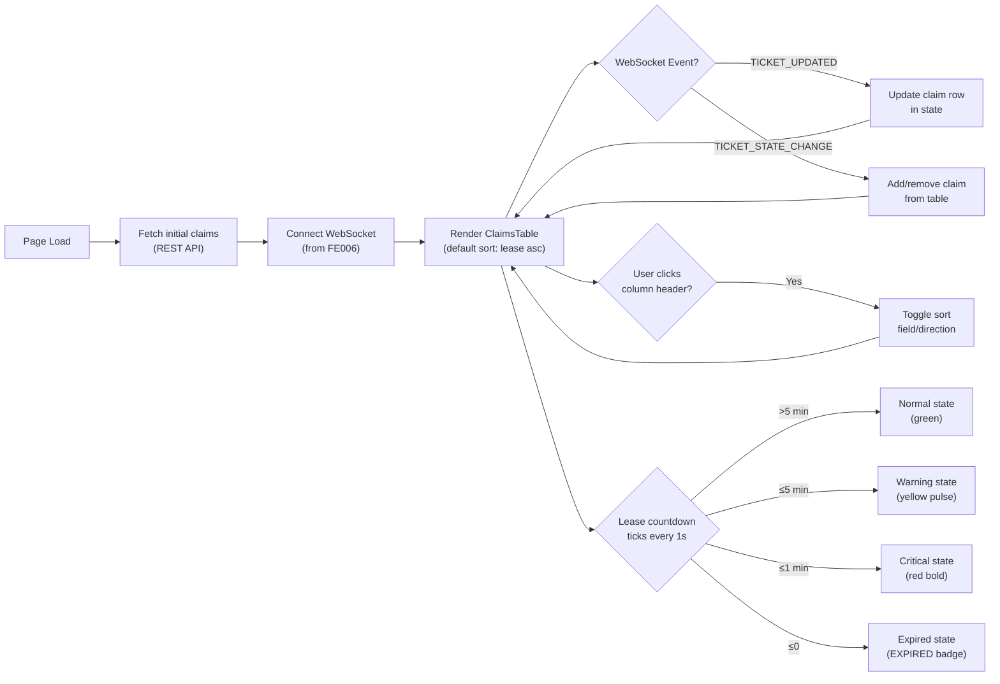

# FORGEOS-FE008 — Active Claims Monitor Implementation Mockup

> **Ticket:** FORGEOS-FE008 | **Agent:** UIDesigner | **Date:** 2026-03-12
> **Status:** APPROVED | **Confidence:** HIGH
> **Parent Design:** FORGEOS-UID004 (Operator Workbench and Claims Monitor)

---

## 1. Screen Inventory

| # | Screen | Route | Stitch Screen ID | Device | Description |
|---|--------|-------|------------------|--------|-------------|
| 1 | Claims Monitor (Desktop) | `/claims` | `fde941cfc5b3406b846023d3b9318a64` | Desktop (2560×2048) | Full sortable table with lease countdown timers, warning/critical/expired states |
| 2 | Claims Monitor (Mobile) | `/claims` | `9e4a24776e5b4e4ab772c5510b337f90` | Mobile (780×2110) | Card-based layout with stacked claim fields and countdown timers |

### Screenshot References

| Screen | Stitch Project | Screenshot |
|--------|---------------|------------|
| Claims Monitor (Desktop) | `projects/17753507249462882723` | [Desktop Screenshot](https://lh3.googleusercontent.com/aida/AOfcidUVY8wyZ4bP0dDdPyvC4jKp9F0wBvnESn8Nglgpj_AhoTQY4n4xmONqp3R7brswxNj-IFP8t3smznIIHJ95RhMiaMLxAU_1itv0Ux23YjBrR9yq3NM6qWY4LpPRu5GXTIQiZ2gWaekF_XqpWzy3JtKcI9FzV4_vHy93R4fb9OWY3WQ1x9QuOXatdFj6oPy8mmTSWibb1n8OKdMRKjQQsnNashlNWBxYMGY0sTqYhTwltMypCds2dPwXIKA) |
| Claims Monitor (Mobile) | `projects/17753507249462882723` | [Mobile Screenshot](https://lh3.googleusercontent.com/aida/AOfcidVRXp5uc4jGsRc2z4oZ7waalEGogYjBFeABxiE9jqh0o7VZ6CkfAD9XKmbWDmeBkl2qxRRmLlPtDBAx8gfi6cx50081QCtgNN-2MemSppXuDEZxY83vmAqLfSJ4DrpjNtRKEjTvztrbDyq23EQtMlSRMhL9yat8l9e-fb1C8p4z_lWDDQsXrV03JLVMghoKm2AWnA8lbWuYP_Wv578T5TxZTRbhd1kMQRlf7qSb_FduVndUgf9B-mSH7Jc) |

---

## 2. Files to Implement

| File | Component | Purpose |
|------|-----------|---------|
| `dashboard/src/app/claims/page.tsx` | ClaimsPage | Route page orchestrating claims data, WebSocket integration, sorting state |
| `dashboard/src/components/claims/ClaimsTable.tsx` | ClaimsTable | Sortable data table rendering claim rows with lease countdowns |
| `dashboard/src/components/claims/LeaseCountdown.tsx` | LeaseCountdown | Real-time countdown timer with warning/critical/expired states |

---

## 3. Design Token References

All tokens from [`docs/uiux/design-tokens.json`](../design-tokens.json). This ticket uses existing tokens — no new tokens required.

### Token Usage Mapping

| Token (Tailwind class) | Usage |
|------------------------|-------|
| `text-success` / `bg-success` | Normal countdown state (>5 min remaining), active dot |
| `text-warning` / `bg-warning` / `bg-warning-muted` | Warning countdown state (≤5 min), yellow left border |
| `text-error` / `bg-error` / `bg-error-muted` | Critical countdown (<1 min), expired badge, red left border |
| `bg-surface` / `border-border` | Table container, row backgrounds |
| `bg-surface-alt` | Alternating table rows |
| `text-primary` / `font-mono` | Ticket ID links |
| `text-muted` | Secondary text, column headers, timestamps |
| `text-foreground` | Primary text content |
| `bg-background` | Page background |
| `focus-ring` | Keyboard focus indicators on interactive elements |

---

## 4. Component Specifications

### 4.1 ClaimsPage (`dashboard/src/app/claims/page.tsx`)

**Description:** Route-level page component that orchestrates the Claims Monitor view. Manages WebSocket subscription for real-time claim updates, sorting state, and data fetching.

#### Responsibilities
- Subscribe to WebSocket events via `TicketWebSocketClient` from FORGEOS-FE006
- Filter incoming ticket events for claimed tickets (those with `claimed_by` populated)
- Maintain sort state (field + direction) — default: `leaseRemaining` ascending
- Pass claim data to `ClaimsTable` component
- Display page header with "Active Claims" title and active claim count metric
- Show `ConnectionStatusIndicator` for WebSocket status

#### Layout Structure

```
┌─────────────────────────────────────────────────────┐
│ Page Header                                         │
│ ┌─────────────────────────────┐ ┌─────────────────┐ │
│ │ "Active Claims" (h1, 2xl)   │ │ ConnectionStatus│ │
│ │ "X active claims" (muted)   │ │ Indicator       │ │
│ └─────────────────────────────┘ └─────────────────┘ │
├─────────────────────────────────────────────────────┤
│ ClaimsTable                                         │
│ ┌─────────────────────────────────────────────────┐ │
│ │ (full component — see 4.2)                      │ │
│ └─────────────────────────────────────────────────┘ │
└─────────────────────────────────────────────────────┘
```

#### Styling
- Container: `<div>` with no extra wrapper (DashboardShell provides layout)
- Header: `flex items-center justify-between mb-6`
- Title: `text-2xl font-bold` (matches existing page pattern from `page.tsx`)
- Subtitle: `text-sm text-muted mt-1`

---

### 4.2 ClaimsTable (`dashboard/src/components/claims/ClaimsTable.tsx`)

**Description:** Sortable data table displaying all active ticket claims with real-time lease countdown timers. Follows existing component patterns (surface card with border).

#### Props

```typescript
interface ClaimRow {
  ticketId: string;       // e.g. "FORGEOS-BE015"
  ticketTitle: string;    // e.g. "Implement backup strategy"
  agent: string;          // e.g. "Backend"
  machine: string;        // e.g. "pop-os"
  operator: string;       // e.g. "ForgeOS dispatcher"
  leaseExpiry: string;    // ISO 8601 timestamp
  stage: string;          // Current SDLC stage
  claimedAt: string;      // ISO 8601 claim timestamp
}

type SortField = 'ticket' | 'agent' | 'machine' | 'operator' | 'stage' | 'leaseRemaining';
type SortDirection = 'asc' | 'desc';

interface ClaimsTableProps {
  claims: ClaimRow[];
  sortField: SortField;
  sortDirection: SortDirection;
  onSort: (field: SortField) => void;
  isLoading?: boolean;
}
```

#### Table Columns

| Column | Width | Content | Sortable | Tailwind Classes |
|--------|-------|---------|----------|------------------|
| Ticket | `w-[160px]` | Ticket ID (monospace, primary link) + truncated title | Yes | `font-mono text-primary text-sm` |
| Agent | `w-[120px]` | Agent name | Yes | `text-sm` |
| Machine | `w-[120px]` | Machine hostname as pill badge | Yes | `text-xs bg-accent/20 text-accent px-2 py-0.5 rounded-full` |
| Operator | `w-[120px]` | Operator username | Yes | `text-sm` |
| Stage | `w-[100px]` | Stage badge | Yes | `text-xs font-semibold uppercase px-2 py-0.5 rounded` |
| Lease Remaining | `w-[140px]` | `LeaseCountdown` component | Yes | (delegated to LeaseCountdown) |

#### Column Header Styling
- `text-xs font-medium text-muted uppercase tracking-wide cursor-pointer`
- Active sort column: `text-primary` with arrow indicator (▲/▼)
- Hover: `hover:text-foreground`

#### Row Styling

| State | Left Border | Background | Opacity |
|-------|-------------|------------|---------|
| Normal (>5 min) | `border-l-2 border-transparent` | `bg-surface` (even) / `bg-surface-alt` (odd) | 1.0 |
| Warning (≤5 min) | `border-l-2 border-warning` | `bg-warning-muted/30` | 1.0 |
| Critical (≤1 min) | `border-l-2 border-error` | `bg-error-muted/30` | 1.0 |
| Expired (≤0) | `border-l-2 border-error` | `bg-error-muted/20` | 0.8 |

#### States

| State | Description | Visual |
|-------|-------------|--------|
| Default | Table with claim rows | Sorted by lease remaining ascending |
| Loading | `isLoading=true` | 6 skeleton rows: `animate-pulse` with `bg-surface-alt rounded h-4` bars |
| Empty | `claims.length === 0` | Centered icon + "No active claims" text + muted description |

#### Accessibility

| Aspect | Requirement |
|--------|-------------|
| Container | `role="table"` with `aria-label="Active claims monitor"` |
| Column Headers | `role="columnheader"` with `aria-sort="ascending"` / `"descending"` / `"none"` |
| Sort Controls | Click or Enter/Space on column header toggles sort |
| Keyboard Nav | Tab between sortable column headers |
| Focus Indicator | `focus-ring` utility class (2px solid primary ring) |
| Color Independence | Row state conveyed by left border + countdown text label, not color alone |

#### Responsive Behavior

| Breakpoint | Behavior |
|------------|----------|
| Mobile (< 768px) | Card layout. Each claim rendered as a card with stacked fields. Touch targets ≥ 44px. Hide Machine/Operator columns. |
| Tablet (768–1023px) | Condensed table, hide Operator column, truncate title to 20 chars |
| Desktop (≥ 1024px) | Full table with all columns, hover states on rows |

---

### 4.3 LeaseCountdown (`dashboard/src/components/claims/LeaseCountdown.tsx`)

**Description:** Real-time countdown timer showing lease remaining time. Ticks every second. Transitions through normal → warning → critical → expired states with distinct visual urgency.

#### Props

```typescript
interface LeaseCountdownProps {
  /** ISO 8601 lease expiry timestamp */
  expiresAt: string;
  /** Seconds remaining to enter warning state. Default: 300 (5 min) */
  warningThreshold?: number;
  /** Seconds remaining to enter critical state. Default: 60 (1 min) */
  criticalThreshold?: number;
  /** Callback when timer reaches zero */
  onExpire?: () => void;
}
```

#### States

| State | Condition | Text Color | Dot | Text Format | Animation |
|-------|-----------|------------|-----|-------------|-----------|
| Normal | remaining > 300s | `text-success` | `bg-success w-2 h-2 rounded-full` | `24:15` | None |
| Warning | 60s < remaining ≤ 300s | `text-warning` | `bg-warning w-2 h-2 rounded-full animate-pulse` | `04:32` | Dot pulses (1s ease-in-out) |
| Critical | 0s < remaining ≤ 60s | `text-error font-bold` | `bg-error w-2 h-2 rounded-full` + rapid pulse | `00:45` | Dot rapid pulse (0.5s), text bold |
| Expired | remaining ≤ 0 | `text-error` | None | `EXPIRED` badge | None (static) |

#### Expired Badge Styling
```
bg-error text-inverse text-xs font-semibold uppercase px-2 py-0.5 rounded
```
Matches the `Badge` pattern from `TicketMetadata.tsx`.

#### Timer Display
- Font: `font-mono text-sm` (monospace for consistent width)
- Format: `MM:SS` (zero-padded, e.g. `04:32`, `00:15`)
- Layout: `inline-flex items-center gap-1.5` (dot + time text)

#### Internal Logic
- Uses `useEffect` with `setInterval(1000)` for tick
- Computes `remaining = Math.max(0, Math.floor((expiresAt - now) / 1000))`
- Formats as `MM:SS`: `String(Math.floor(remaining/60)).padStart(2,'0') + ':' + String(remaining%60).padStart(2,'0')`
- Fires `onExpire` once when transitioning to expired
- Cleans up interval on unmount

#### Accessibility

| Aspect | Requirement |
|--------|-------------|
| ARIA | `role="timer"`, `aria-live="polite"`, `aria-label="Lease expires in {remaining}"` |
| Update Frequency | `aria-live` updates every 30s (normal), 10s (warning), 5s (critical) |
| Screen Reader | Announces state transitions: "Warning: expiring soon" / "Critical: less than 1 minute" / "Expired" |
| Color Independence | State conveyed by dot + text label ("EXPIRED"), not color alone |
| Reduced Motion | Pulse animation disabled via `prefers-reduced-motion: reduce` (already in globals.css) |

#### Responsive Behavior

| Breakpoint | Behavior |
|------------|----------|
| Mobile (< 768px) | Full width in card layout, `text-base` font, touch target 44px |
| Tablet/Desktop (≥ 768px) | Compact inline `text-sm font-mono` |

---

## 5. User Flow



---

## 6. Accessibility Checklist

| Check | Status | Notes |
|-------|--------|-------|
| Color contrast ≥ 4.5:1 (text) | PASS | All text colors verified against dark/light surface backgrounds |
| Color contrast ≥ 3:1 (large text) | PASS | Headings meet AA standard |
| Focus indicators visible | PASS | `focus-ring` utility on all interactive elements |
| Touch targets ≥ 44px (mobile) | PASS | Card layout on mobile with adequate tap areas |
| Status conveyed without color alone | PASS | Left border + dot icon + text label ("EXPIRED") |
| Keyboard navigation | PASS | Tab to sort headers, Enter/Space to toggle sort |
| Screen reader support | PASS | `role="table"`, `aria-sort`, `role="timer"`, `aria-live="polite"` |
| Reduced motion | PASS | Pulse animations disabled via `prefers-reduced-motion` in globals.css |

---

## 7. Integration Notes

### WebSocket Dependency (FORGEOS-FE006)
- Use `TicketWebSocketClient` from `@/lib/api/websocket`
- Subscribe to `TICKET_UPDATED` and `TICKET_STATE_CHANGE` events
- Filter for tickets where `claimed_by` is non-null to populate claims table
- Use `ConnectionStatusIndicator` component to show connection state

### Data Source
- Claims data derived from ticket objects where `claimed_by`, `machine_id`, `operator`, and `lease_expiry` are populated
- Map from `Ticket` type to `ClaimRow` type in the page component

### Existing Pattern Consistency
- Page layout follows `dashboard/src/app/page.tsx` pattern (heading + content)
- Card/table styling follows `bg-surface border border-border rounded-lg` pattern
- Badge styling follows `TicketMetadata.tsx` Badge component pattern
- Status dots follow `ConnectionStatusIndicator.tsx` pattern
- Loading skeletons follow `MetricCard` skeleton pattern
