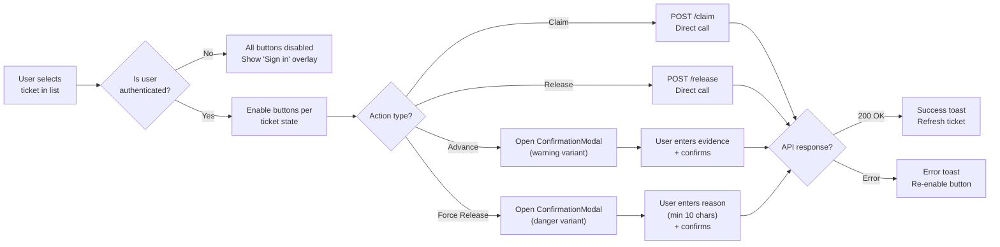
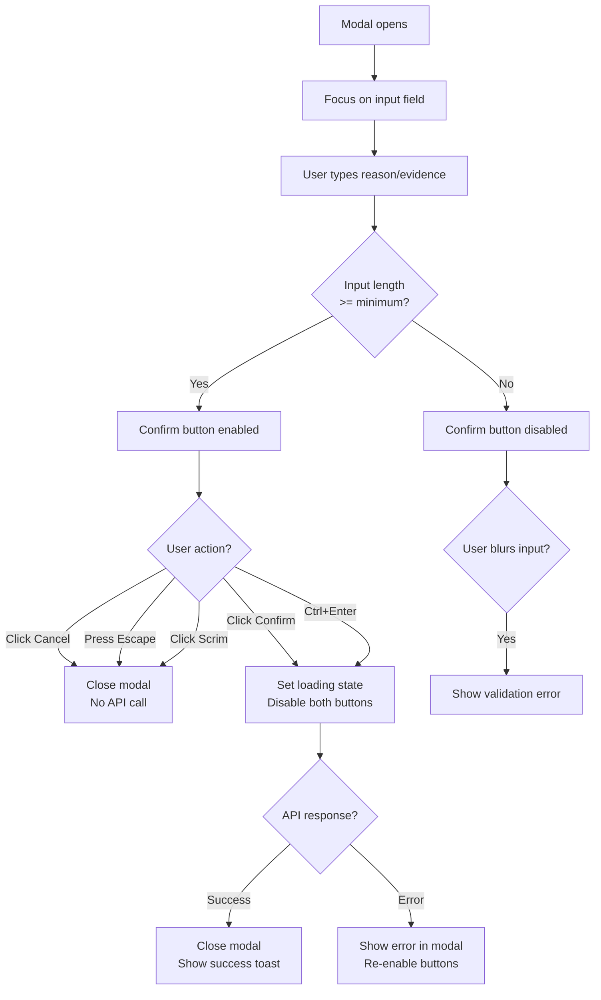

# FORGEOS-FE009 — Operator Workbench Actions Implementation Mockup

> **Ticket:** FORGEOS-FE009 | **Agent:** UIDesigner | **Date:** 2026-03-12
> **Status:** APPROVED | **Confidence:** HIGH
> **Parent Design:** FORGEOS-UID004 (Operator Workbench and Claims Monitor)

---

## 1. Screen Inventory

| # | Screen | Route | Stitch Screen ID | Device | Description |
|---|--------|-------|------------------|--------|-------------|
| 1 | Operator Actions (Desktop) | `/workbench` | `50716bd670a8476585b52129cb111b39` | Desktop (2560×2048) | 2×2 action button grid with auth status bar and disabled-state variant |
| 2 | ConfirmationModal — Danger (Desktop) | overlay | `0959208701fe4fca97efc8ced28ebd2f` | Desktop (2560×2048) | Force Release confirmation with red danger theme, reason input, validation |
| 3 | ConfirmationModal — Warning (Desktop) | overlay | `8e138453ec1241b0bc92f0ef951bbfe4` | Desktop (2560×2048) | Advance Stage confirmation with orange warning theme, evidence textarea |
| 4 | Operator Actions (Mobile) | `/workbench` | `bf555f9993a44a2b805a585d8f4bf23e` | Mobile (780×1768) | Stacked action buttons + bottom-sheet confirmation modal |

### Screenshot References

| Screen | Stitch Project | Screenshot |
|--------|---------------|------------|
| Operator Actions (Desktop) | `projects/17753507249462882723` | [Desktop Screenshot](https://lh3.googleusercontent.com/aida/AOfcidVDyUBA_4uWaVoXpEKnV9APOOJKQEZJCEaCaFNAEL-K5JgvurW_xuwSAOSVsCnHQ603tM0KQsWd5VKrh2hDPMFYPKXutYQfFqRZXlf4rapK-A_NRawBTCLI2BUIlUqdtHAqDkN7YKn9DPYJ9cRkWI5NkA3X8PYGFbXuulZMxaiBj_A2TlcfKIwTxj5WfsRyFKs7Stdo2fwjJ4_2ReuLh6iBLecieiggbkN_WuYgt4M2MPs13hUXslzbUpRd) |
| ConfirmationModal — Danger | `projects/17753507249462882723` | [Danger Modal Screenshot](https://lh3.googleusercontent.com/aida/AOfcidWqt5I3ISu9LfE83yIwkJ4lwNv9x94FhR93jpNliZDbf494KcvimJ4gKsoaTHFBZDL9MSQ4BdY3B5s6nLO1G4PWyC5GOS34xQeFiQtw3mhlfc9DMyofZwBaNOIBg3ViCpggXAgYitGrxkC7tFVROu5q6Lna-xxiA9WwgR_Dk3e_gfbh1uR1H8uniViR3fjNHKZqrR69u43fMHCiZAi0U4esitcOQeX7fkup5mK28itybC-FL6ZFccMOQdCv) |
| ConfirmationModal — Warning | `projects/17753507249462882723` | [Warning Modal Screenshot](https://lh3.googleusercontent.com/aida/AOfcidWLdChhl7oNwyx2AqdSZHUBKbK4_gefgAFpxUMrwi6ynAi6Rwsm5BlQnfHb_otxCSs9Lie0gf3P4hRJ_EUN_ZZexHeHeS3ojRhfYpDXWs1KkMlJgsJkTNbbnNzENUiv4nsS58mBGIMEyY0SjvaSF5Y2dJsZIlCp56KoAnMnpPjlkqcqcAxy_joCuzG5PLkB5ILVjKsDhUFw5_TnBFsdZ9fGOwBSauE8msMFBba1xlEt5x01K4kQFjQiZMPc) |
| Operator Actions (Mobile) | `projects/17753507249462882723` | [Mobile Screenshot](https://lh3.googleusercontent.com/aida/AOfcidXB7vAWJDs2of6XsBDGSPXPNtosqlJvf_BI1hV8U_gHL3To9jsycuALASY5jwW97HB6Z-dMCTLlwIld2TOy8CXKTq2UG5WiiHARfDSY9NMjT1fO-BlGygGjToOCebvQzKzN2Cdn_PKif3POufiXHlAvM0uMqqMenAdNlA-I69zDkvmj7aU-FQKS_ft6CjIU3Y485fp7FIgV_oqME2WJZoYykhcOiBPEgtUZxTlojbm7ao6pbJPoLdBFDSQ) |

---

## 2. Files to Implement

| File | Component | Purpose |
|------|-----------|---------|
| `dashboard/src/components/operator/OperatorActions.tsx` | OperatorActions | 2×2 grid of action buttons with auth gating and state management |
| `dashboard/src/components/operator/ConfirmationModal.tsx` | ConfirmationModal | Reusable modal for destructive/important actions with reason/evidence input |
| `dashboard/src/lib/api/operations.ts` | — | API client for claim, release, advance, force-release REST endpoints |

---

## 3. Design Token References

All tokens from [`docs/uiux/design-tokens.json`](../design-tokens.json). No new tokens required — this ticket reuses existing tokens.

### Token Usage Mapping

| Token | Dark Value | Usage in This Ticket |
|-------|-----------|---------------------|
| `success` | `#16A34A` | Claim button left accent, auth status dot |
| `warning` | `#EAB308` | Advance button alt-accent (when caution needed) |
| `warningMuted` | `#713F12` | Warning modal banner background |
| `error` | `#EF4444` | Force Release button left accent, danger modal elements |
| `errorMuted` | `#7F1D1D` | Danger modal warning banner background |
| `info` | `#3B82F6` | Advance Stage button left accent |
| `priority.high` | `#F97316` | Release Claim button left accent |
| `surface` | `#1E293B` | Button card backgrounds, modal background |
| `background` | `#0F172A` | Input field backgrounds, page background |
| `border` | `#334155` | Card borders, input borders, modal border |
| `text` | `#F8FAFC` | Button labels, modal title |
| `textMuted` | `#94A3B8` | Button descriptions, auth status text, cancel button text |
| `scrim` | `rgba(15, 23, 42, 0.6)` | Modal backdrop overlay |
| `focus` | `#06B6D4` | Focus ring on interactive elements |

### Typography

| Element | Font | Size Token | Weight | Usage |
|---------|------|-----------|--------|-------|
| Button label | Inter | `base` (1rem) | 600 | "Claim Ticket", "Release Claim", etc. |
| Button description | Inter | `sm` (0.875rem) | 400 | Action description text |
| Modal title | Inter | `lg` (1.125rem) | 700 | "Force Release Ticket", "Advance Stage" |
| Modal body | Inter | `sm` (0.875rem) | 400 | Description text |
| Warning banner | Inter | `sm` (0.875rem) | 500 | Alert text |
| Input label | Inter | `sm` (0.875rem) | 500 | "Reason", "Evidence" labels |
| Input text | Inter | `sm` (0.875rem) | 400 | User input |
| Validation error | Inter | `xs` (0.75rem) | 500 | Inline error messages |
| Auth status | Inter | `sm` (0.875rem) | 500 | "Ticketer", "Authenticated as operator" |
| Danger badge | Inter | `xs` (0.75rem) | 600 | "DANGER" badge on Force Release |

---

## 4. Component Specifications

### 4.1 OperatorActions (`dashboard/src/components/operator/OperatorActions.tsx`)

**Description:** Grid of operator action buttons enabling ticket lifecycle management. Each button triggers a specific REST API call. Destructive actions open a ConfirmationModal. All buttons are gated on authentication status.

#### Props

```typescript
interface OperatorActionsProps {
  /** The currently selected ticket ID (null if none selected) */
  ticketId: string | null;
  /** Current ticket stage (used to determine which actions are available) */
  ticketStage: string | null;
  /** Whether the current user holds the claim on this ticket */
  isClaimHolder: boolean;
  /** Whether a claim exists on this ticket (by any operator) */
  isClaimed: boolean;
  /** Whether the user is authenticated */
  isAuthenticated: boolean;
  /** Callback when any action completes successfully */
  onActionComplete?: (action: OperatorAction, result: ActionResult) => void;
  /** Callback when an action fails */
  onActionError?: (action: OperatorAction, error: Error) => void;
}

type OperatorAction = 'claim' | 'release' | 'advance' | 'force-release';

interface ActionResult {
  ticketId: string;
  action: OperatorAction;
  timestamp: string;
  message: string;
}
```

#### Action Definitions

| Action | Icon | Color Token | Condition to Enable | API Endpoint | Requires Confirmation |
|--------|------|-------------|--------------------|--------------|-----------------------|
| Claim Ticket | ✋ (hand) | `success` (#16A34A) | `!isClaimed && ticketId` | `POST /api/tickets/:id/claim` | No |
| Release Claim | 🔓 (unlock) | `priority.high` (#F97316) | `isClaimHolder` | `POST /api/tickets/:id/release` | No |
| Advance Stage | → (arrow-right) | `info` (#3B82F6) | `isClaimHolder` | `POST /api/tickets/:id/advance` | Yes (warning) |
| Force Release | ⚠ (warning) | `error` (#EF4444) | `isClaimed && !isClaimHolder` | `POST /api/tickets/:id/force-release` | Yes (danger) |

#### Layout — Desktop (≥1024px)

```
┌──────────────────────────────────────────────────────────────┐
│  Operator Actions                                            │
│  ┌──────────────────────────┬──────────────────────────┐     │
│  │ ✋ Claim Ticket           │ 🔓 Release Claim         │     │
│  │ Acquire lease on an      │ Release your active       │     │
│  │ unclaimed ticket          │ claim on a ticket         │     │
│  │ [GREEN left accent]      │ [ORANGE left accent]      │     │
│  ├──────────────────────────┼──────────────────────────┤     │
│  │ → Advance Stage          │ ⚠ Force Release  DANGER  │     │
│  │ Move ticket to next      │ Force-release another     │     │
│  │ SDLC stage               │ operator's claim          │     │
│  │ [BLUE left accent]       │ [RED left accent]         │     │
│  └──────────────────────────┴──────────────────────────┘     │
│                                                               │
│  🟢 Ticketer ✓  Authenticated as operator                   │
└──────────────────────────────────────────────────────────────┘
```

Button card classes:
```
bg-surface border border-border rounded-lg p-4
border-l-4 border-l-{color}
hover:bg-surface-alt transition-colors duration-150
cursor-pointer
focus-visible:ring-2 focus-visible:ring-focus focus-visible:ring-offset-2 focus-visible:ring-offset-background
```

Grid container: `grid grid-cols-1 md:grid-cols-2 gap-3`

#### Layout — Mobile (<768px)

```
┌────────────────────────────────┐
│ 🟢 Ticketer ✓                 │
│ Authenticated as operator      │
├────────────────────────────────┤
│ ✋ Claim Ticket                 │
│ Acquire lease on unclaimed...  │
├────────────────────────────────┤
│ 🔓 Release Claim               │
│ Release your active claim...   │
├────────────────────────────────┤
│ → Advance Stage                │
│ Move ticket to next SDLC...    │
├────────────────────────────────┤
│ ⚠ Force Release  [DANGER]     │
│ Force-release another...       │
└────────────────────────────────┘
```

Stacked: `grid grid-cols-1 gap-3`, each card min-height 60px, touch target ≥ 44px.

#### States

| State | Description | Visual |
|-------|-------------|--------|
| Default (Authenticated) | User logged in, ticket selected | Buttons enabled per conditions table above |
| Unauthenticated | User not logged in | All buttons opacity 0.5, `pointer-events-none`, lock icon overlay with "Sign in to perform actions" text centered |
| No Ticket Selected | `ticketId` is null | All buttons disabled (opacity 0.5), tooltip: "Select a ticket first" |
| Loading | Action in progress | Clicked button shows spinner icon replacing action icon, text "Processing...", disabled |
| Success | Action completed | Success toast via `onActionComplete` callback |
| Error | Action failed | Error toast via `onActionError` callback, button re-enabled |

#### Disabled Button Styling
```
opacity-50 cursor-not-allowed
```

#### Loading Button Styling
```
opacity-75 cursor-wait animate-pulse
```
Icon replaced with `<Spinner className="w-4 h-4 animate-spin" />`

#### Accessibility

| Aspect | Requirement |
|--------|-------------|
| Container | `role="toolbar"` with `aria-label="Operator actions"` |
| Buttons | `<button>` elements with `aria-label="{action name}: {description}"` |
| Disabled state | `aria-disabled="true"` + `title` tooltip explaining why disabled |
| Loading state | `aria-busy="true"` + `aria-label="Processing {action}..."` |
| Focus order | Tab through buttons left-to-right, top-to-bottom |
| Focus indicator | `focus-visible:ring-2 focus-visible:ring-focus` (2px solid cyan ring) |
| Keyboard activation | Enter or Space triggers action |
| Color independence | Action type conveyed by icon + label text, not color alone |
| Touch targets | Minimum 44×44px on mobile (full card is clickable) |
| Screen reader | State changes announced via `aria-live="polite"` region for toast messages |

---

### 4.2 ConfirmationModal (`dashboard/src/components/operator/ConfirmationModal.tsx`)

**Description:** Reusable modal dialog for confirming important or destructive operator actions. Supports danger and warning variants. Requires text input (reason/evidence) before confirmation.

#### Props

```typescript
type ModalVariant = 'danger' | 'warning';

interface ConfirmationModalProps {
  /** Whether the modal is open */
  isOpen: boolean;
  /** Callback to close the modal */
  onClose: () => void;
  /** Callback when user confirms the action */
  onConfirm: (inputText: string) => void;
  /** Visual variant determining color scheme */
  variant: ModalVariant;
  /** Modal title text */
  title: string;
  /** Modal body/description text */
  description: string;
  /** Warning banner text (displayed above input) */
  warningText: string;
  /** Label for the text input field */
  inputLabel: string;
  /** Placeholder for the text input field */
  inputPlaceholder: string;
  /** Label for the confirm button */
  confirmLabel: string;
  /** Minimum character count for input validation */
  minInputLength?: number;
  /** Whether the confirm action is in progress */
  isLoading?: boolean;
  /** Whether input is a textarea (multi-line) vs single-line input */
  multiline?: boolean;
}
```

#### Variant Styling

| Element | Danger Variant | Warning Variant |
|---------|---------------|-----------------|
| Header icon color | `text-error` (#EF4444) | `text-warning` (#EAB308) |
| Header icon | Warning triangle (AlertTriangle) | Caution circle (AlertCircle) |
| Warning banner bg | `bg-error-muted` (#7F1D1D) | `bg-warning-muted` (#713F12) |
| Warning banner border | `border-l-4 border-error` | `border-l-4 border-warning` |
| Confirm button bg | `bg-error hover:bg-red-600` | `bg-info hover:bg-blue-600` |
| Confirm button text | `text-white font-semibold` | `text-white font-semibold` |

#### Layout Structure

```
┌────── Scrim (rgba(15,23,42,0.6), z-50) ──────┐
│                                                │
│  ┌───────────── Modal (480px) ──────────────┐  │
│  │                                           │  │
│  │  ⚠ {title}                          [✕]  │  │
│  │  ─────────────────────────────────────    │  │
│  │  {description}                            │  │
│  │                                           │  │
│  │  ┌─ Warning banner ────────────────────┐  │  │
│  │  │ ⚠ {warningText}                    │  │  │
│  │  └────────────────────────────────────┘  │  │
│  │                                           │  │
│  │  {inputLabel}                             │  │
│  │  ┌────────────────────────────────────┐  │  │
│  │  │ {inputPlaceholder}                 │  │  │
│  │  └────────────────────────────────────┘  │  │
│  │  ⚠ Validation error (if shown)          │  │
│  │                                           │  │
│  │  ─────────────────────────────────────    │  │
│  │  [Cancel]                    [{confirmLabel}] │
│  │                                           │  │
│  └───────────────────────────────────────────┘  │
│                                                │
└────────────────────────────────────────────────┘
```

#### Modal CSS Classes
```
Scrim:     fixed inset-0 bg-scrim z-modal flex items-center justify-center
Container: bg-surface border border-border rounded-xl shadow-lg max-w-md w-full mx-4
Header:    flex items-center justify-between p-4 border-b border-border
Body:      p-4 space-y-4
Footer:    flex justify-end gap-3 p-4 border-t border-border
```

#### Input Field Styling
```
Single-line: bg-background border border-border rounded-md px-3 py-2 text-sm text-foreground
             placeholder:text-muted focus:ring-2 focus:ring-focus focus:border-focus
Textarea:    Same + min-h-[80px] resize-y
Error state: border-error focus:ring-error
```

#### Button Styling
```
Cancel:  border border-border text-muted hover:text-foreground hover:bg-surface-alt
         px-4 py-2 rounded-md text-sm font-medium transition-colors
Confirm: bg-{variant-color} text-white px-4 py-2 rounded-md text-sm font-semibold
         hover:bg-{variant-color-dark} disabled:opacity-50 disabled:cursor-not-allowed
         transition-colors
```

#### Validation Rules

| Rule | Behavior |
|------|----------|
| Minimum length | `minInputLength` (default: 10 for danger, 0 for warning) |
| Validation timing | On blur + on confirm attempt |
| Error message | `"Reason must be at least {minInputLength} characters"` displayed below input in `text-error text-xs` |
| Confirm button | `disabled` until input meets minimum length |
| Empty submit | Focus input field + show validation error |

#### States

| State | Description | Visual |
|-------|-------------|--------|
| Default | Modal open, input empty | Confirm button disabled, no validation error |
| Input Valid | Input meets minimum length | Confirm button enabled |
| Validation Error | Input too short + blur/submit attempted | Red border on input, error text below |
| Loading | `isLoading=true` | Confirm button shows spinner, both buttons disabled |
| Closed | `isOpen=false` | Not rendered (unmounted or `display: none`) |

#### Animation
- Open: `animate-in fade-in-0 zoom-in-95 duration-200`
- Close: `animate-out fade-out-0 zoom-out-95 duration-150`
- Scrim: `animate-in fade-in-0 duration-200`

#### Accessibility

| Aspect | Requirement |
|--------|-------------|
| Container | `role="dialog"` with `aria-modal="true"` and `aria-labelledby` pointing to title |
| Title | `id="modal-title"` for labelledby reference |
| Description | `aria-describedby` pointing to body text |
| Focus trap | Focus trapped within modal while open. Tab cycles through: Close button → Input → Cancel → Confirm |
| Initial focus | Input field receives focus on open |
| Close | Escape key closes modal. Click on scrim closes modal. Close (✕) button closes modal. |
| Confirm shortcut | Ctrl+Enter submits when input is valid |
| Input | `aria-required="true"`, `aria-invalid="true"` when validation error shown |
| Error message | `aria-live="assertive"` for validation error announcements |
| Loading | `aria-busy="true"` on confirm button during loading |
| Z-index | `z-modal` (50) — above slide-over (40) and overlays (30) |

#### Responsive Behavior

| Breakpoint | Behavior |
|------------|----------|
| Mobile (<768px) | Bottom sheet style: `fixed inset-x-0 bottom-0 rounded-t-xl` instead of centered. Full width minus 16px margin. Buttons stack vertically (confirm on top). |
| Tablet (768–1023px) | Centered modal, max-width 400px |
| Desktop (≥1024px) | Centered modal, max-width 480px |

---

### 4.3 Operations API Client (`dashboard/src/lib/api/operations.ts`)

**Description:** API client functions for operator actions. Each function calls the corresponding REST endpoint with proper authentication headers.

#### API Functions

```typescript
interface ClaimRequest {
  ticketId: string;
  agent: string;
  machine: string;
  operator: string;
}

interface ReleaseRequest {
  ticketId: string;
}

interface AdvanceRequest {
  ticketId: string;
  evidence: string;
}

interface ForceReleaseRequest {
  ticketId: string;
  reason: string;
}

interface OperationResponse {
  success: boolean;
  message: string;
  ticketId: string;
  timestamp: string;
}

// POST /api/tickets/:id/claim
async function claimTicket(req: ClaimRequest): Promise<OperationResponse>;

// POST /api/tickets/:id/release
async function releaseTicket(req: ReleaseRequest): Promise<OperationResponse>;

// POST /api/tickets/:id/advance
async function advanceTicket(req: AdvanceRequest): Promise<OperationResponse>;

// POST /api/tickets/:id/force-release
async function forceReleaseTicket(req: ForceReleaseRequest): Promise<OperationResponse>;
```

#### Error Handling

| HTTP Status | Meaning | UI Response |
|-------------|---------|-------------|
| 200 | Success | Show success toast, call `onActionComplete` |
| 401 | Unauthorized | Show "Authentication required" error, redirect to login |
| 403 | Forbidden | Show "Insufficient permissions" error toast |
| 404 | Ticket not found | Show "Ticket not found" error toast |
| 409 | Conflict (already claimed, etc.) | Show specific conflict message from response body |
| 500 | Server error | Show "Server error — please try again" error toast |

---

## 5. User Flow Diagrams

### 5.1 Primary Action Flow



### 5.2 ConfirmationModal Flow



### 5.3 Toast Notification Pattern

```
┌──────────────────────────────────────────────────┐
│ ✓ Successfully claimed FORGEOS-BE015            ×│
│   Lease expires in 30 minutes                    │
└──────────────────────────────────────────────────┘

┌──────────────────────────────────────────────────┐
│ ✗ Failed to force release FORGEOS-RES003        ×│
│   409 Conflict: Ticket claim was already released│
└──────────────────────────────────────────────────┘
```

Toast classes:
```
Success: bg-success-muted border border-success text-foreground rounded-lg p-4 shadow-lg
Error:   bg-error-muted border border-error text-foreground rounded-lg p-4 shadow-lg
```
Position: `fixed top-4 right-4 z-toast` (z-index: 60). Auto-dismiss after 5s.

---

## 6. Responsive Layout Specification

### Desktop (≥1024px)

```
┌──────────────────────────────────────────────────────────────┐
│ TopBar (Pipeline | Graph | Claims | Machines | Workbench)    │
├──────────────────────────────────────────────────────────────┤
│                                                              │
│  Operator Actions                                            │
│  ┌──────────────────────────┬──────────────────────────┐     │
│  │ ✋ Claim Ticket          │ 🔓 Release Claim          │     │
│  │ Acquire lease on an     │ Release your active       │     │
│  │ unclaimed ticket         │ claim on a ticket         │     │
│  ├──────────────────────────┼──────────────────────────┤     │
│  │ → Advance Stage         │ ⚠ Force Release  DANGER  │     │
│  │ Move ticket to next     │ Force-release another     │     │
│  │ SDLC stage              │ operator's claim          │     │
│  └──────────────────────────┴──────────────────────────┘     │
│                                                              │
│  🟢 Ticketer ✓  Authenticated as operator                   │
│                                                              │
└──────────────────────────────────────────────────────────────┘
```

### Mobile (<768px)

```
┌────────────────────────────────┐
│ ☰  ForgeOS Dashboard    🟢    │
├────────────────────────────────┤
│ 🟢 Ticketer ✓ Authenticated  │
├────────────────────────────────┤
│ ✋ Claim Ticket                │
│ Acquire lease on unclaimed... │
├────────────────────────────────┤
│ 🔓 Release Claim              │
│ Release your active claim...  │
├────────────────────────────────┤
│ → Advance Stage               │
│ Move ticket to next SDLC...   │
├────────────────────────────────┤
│ ⚠ Force Release  [DANGER]    │
│ Force-release another op...   │
└────────────────────────────────┘
```

---

## 7. Accessibility Checklist

| Check | Status | Notes |
|-------|--------|-------|
| Color contrast ≥ 4.5:1 (text) | PASS | All text verified: white (#F8FAFC) on #1E293B = 10.5:1. Muted (#94A3B8) on #1E293B = 4.6:1 |
| Color contrast ≥ 3:1 (large text) | PASS | Button labels (semibold, 16px) exceed 3:1 on all surfaces |
| Focus indicators visible | PASS | `focus-visible:ring-2 focus-visible:ring-focus` (2px solid #06B6D4) on all interactive elements |
| Touch targets ≥ 44px (mobile) | PASS | Action cards min-height 60px. Modal buttons min-height 44px. |
| Status conveyed without color alone | PASS | Actions identified by icon + label text. Danger marked with "DANGER" badge |
| Keyboard navigation | PASS | Tab through action buttons. Modal: focus trap with Escape to close, Ctrl+Enter to confirm |
| Screen reader support | PASS | `role="toolbar"`, `role="dialog"`, `aria-modal`, `aria-labelledby`, `aria-describedby`, `aria-live` |
| Reduced motion | PASS | Modal animations respect `prefers-reduced-motion: reduce` (existing globals.css rule) |
| Focus trap in modal | PASS | Focus cycles through Close → Input → Cancel → Confirm while modal is open |
| Error announcements | PASS | Validation errors use `aria-live="assertive"` for immediate screen reader announcement |

---

## 8. Integration Notes

### Dependencies
- **FORGEOS-FE008** (Claims Monitor): Provides context for which tickets are claimed, enabling Release/Force Release actions
- **FORGEOS-BE036** (Claim endpoint): `POST /api/tickets/:id/claim` and `POST /api/tickets/:id/release`
- **FORGEOS-BE037** (Advance endpoint): `POST /api/tickets/:id/advance` with evidence payload
- **FORGEOS-BE055** (Auth system): JWT-based authentication; action buttons gated on auth status

### Component Reuse
- Reuses `Badge` component pattern from ticket cards (FORGEOS-UID001)
- Reuses `ConnectionStatusIndicator` from FORGEOS-FE006
- Toast notification pattern shared across all action contexts
- Modal pattern can be reused for future confirmation dialogs (e.g., bulk operations)

### Navigation Integration
- Operator Workbench is accessible via the "Workbench" tab in the TopBar component
- On mobile, accessible via hamburger sidebar navigation
