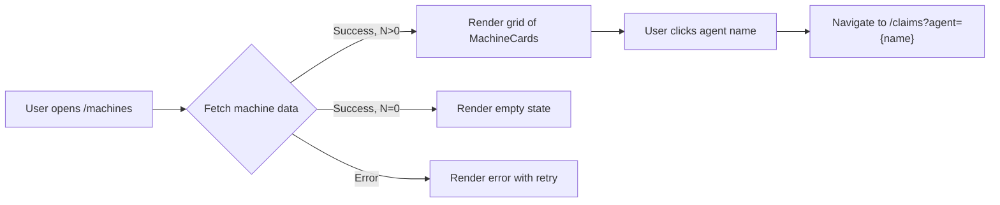
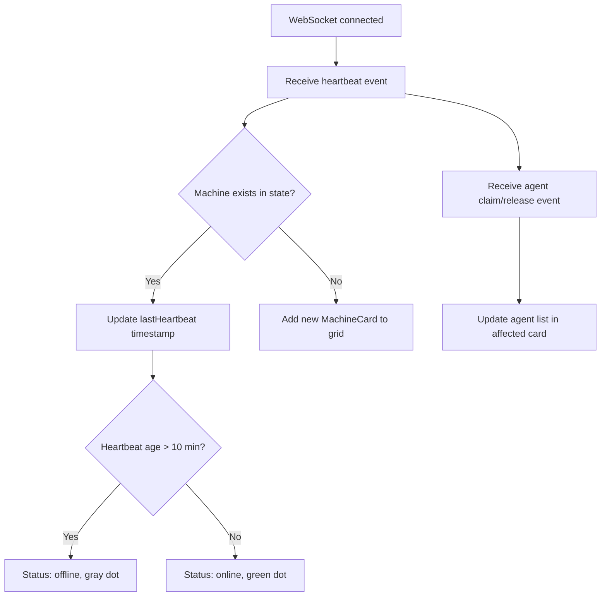

# FORGEOS-FE010 — Multi-Machine Status View

> **Ticket:** FORGEOS-FE010 | **Agent:** UIDesigner | **Date:** 2026-03-12
> **Status:** APPROVED | **Confidence:** HIGH

---

## 1. Screen Inventory

| # | Screen | Route | Stitch ID | Theme | Device | Description |
|---|--------|-------|-----------|-------|--------|-------------|
| 1 | Machine Status Grid | `/machines` | `6d9a71c227074afeb76b30b1233d9ef0` | Dark | Desktop | 3-column responsive grid of machine cards with status, heartbeat, agent lists |
| 2 | Machine Status Mobile | `/machines` | `1eae570cc6494ff89fc8138eb5a2ed33` | Dark | Mobile | Single-column stack of machine cards, touch-optimized |
| 3 | Empty State | `/machines` | `5e96f12325bb4249bd4b26481cbe041d` | Dark | Desktop | Centered empty state when no machines are active |

### Screenshot References

| Screen | Screenshot |
|--------|------------|
| Machine Status Grid (Desktop) | [Stitch Screenshot](https://lh3.googleusercontent.com/aida/AOfcidUQp_zXy9E-KPHdxijD9SRg79f604bGvxtC6afdwOlpgeVWH_-IMyP0Yg_FyeMnhVodyfj7bpA6LZohmbJYXw2R5mSpuL8Svfj6CFsRZIdIx6f3KIchbhkC6SoXD1FcEkJT9rg7RlNLBPgicS548yrtjV0_wFcj_f4-9zGsdNl-gAvmxHr37GqwBveoWxxR97DNHX4jejNfdX14NjR3yMK1gBlc7jntSCfUuANIPZ5g7fj0adcIDpbdngJx) |
| Machine Status Mobile | [Stitch Screenshot](https://lh3.googleusercontent.com/aida/AOfcidVQPKcuIbQp20AsCFST9VrXoR8mQi6ml-r7QXPIo7X4qvAErf6wzuZy_CTv0PJHWwIgfok0FBaLG5Q9PyTHyLj4T6BxnHgr1kHxQcSl2CDq2FjIe85WOjqo5A5hWQio4St3oObpL9aFOuSYRy3Lu7_DbcPDXfmIMBclhb3VG4Cv5m5Llo94SkxCvXEiFML4cYmiygtmj24hXOBitA-GA9m1fesPj2NDRKiIbh087b58XvAtlKJ6z2eg_w4) |
| Empty State (Desktop) | [Stitch Screenshot](https://lh3.googleusercontent.com/aida/AOfcidXnlLjpw4EHDFTKkQ0R18aHC_cvZ_yTTCTlftyUpWJYJxMBQ2v_0EBZS12PXmcu_qt_LGRP4Qsy4qvW3hBxWakdilg58qnL7yVqwFjVtFjGiEz1qL-864LtxiRQomCdxen8Pg2t9UGr6pW7k6Qwtx3850EF45WHrOViQxTPKNHcW6-jJbPOHKIqav96eAgBZ91_jnwa1EShHsPCJ7XD0JXB6BCXLywpoy1xWMCGAKUkyn1Egb96gDfUnxyn) |

---

## 2. Design Token References

All design tokens from [`docs/uiux/design-tokens.json`](../design-tokens.json) (FORGEOS-UID001).
No new tokens required — this ticket reuses existing tokens.

### Token Usage Mapping

| Token | Dark Value | Usage in This Ticket |
|-------|-----------|---------------------|
| `success` | `#16A34A` | Online status dot, "Online" label text |
| `secondary` | `#94A3B8` | Offline status dot, "Offline" label, muted text |
| `surface` | `#1E293B` | Machine card background |
| `background` | `#0F172A` | Page background |
| `border` | `#334155` | Card borders, divider lines |
| `text` | `#F8FAFC` | Hostname text, page title |
| `textMuted` | `#94A3B8` | Subtitle, heartbeat timestamp, agent count label |
| `primary` | `#06B6D4` | Agent name links (clickable to claims view) |
| `primaryHover` | `#0891B2` | Agent name hover state |
| `machine.palette` | `[#3B82F6, #8B5CF6, ...]` | Machine color badges (optional per-machine accent) |

### Typography

| Element | Font | Size Token | Weight | Usage |
|---------|------|-----------|--------|-------|
| Page heading | Inter | `2xl` (1.5rem) | 700 | "Machines" title |
| Subtitle | Inter | `sm` (0.875rem) | 400 | "N machines online" |
| Hostname | Inter | `lg` (1.125rem) | 600 | Card title (e.g., "pop-os") |
| Status label | Inter | `xs` (0.75rem) | 500 | "Online" / "Offline" |
| Heartbeat | Inter | `xs` (0.75rem) | 400 | "Last heartbeat: 2 minutes ago" |
| Section label | Inter | `xs` (0.75rem) | 600 | "Running Agents (2)" |
| Agent name | Inter | `sm` (0.875rem) | 500 | Clickable agent link |
| Ticket ID | JetBrains Mono | `xs` (0.75rem) | 400 | "FORGEOS-BE074" |
| Empty heading | Inter | `lg` (1.125rem) | 600 | "No machines currently active" |
| Empty body | Inter | `sm` (0.875rem) | 400 | Description text |

---

## 3. Component Specifications

### 3.1 MachinesPage (`dashboard/src/app/machines/page.tsx`)

**Description:** Top-level page component for the `/machines` route. Fetches machine data, renders responsive grid of MachineCard components, handles empty state.

#### Props

None (page component, derives data from hooks/API).

#### States

| State | Description | Visual |
|-------|-------------|--------|
| Loading | Data being fetched | Skeleton cards — 3 pulsing placeholder cards in the grid |
| Populated | 1+ machines returned | Responsive grid of MachineCard components |
| Empty | 0 machines returned | Centered empty state with icon + message |
| Error | API fetch failure | Error banner with retry button |

#### Layout

- Page heading: "Machines" (`text-2xl font-bold`)
- Subtitle: `{onlineCount} machines online` (`text-sm text-muted`)
- Grid container: `grid grid-cols-1 md:grid-cols-2 lg:grid-cols-3 gap-4 md:gap-6`

#### Responsive Behavior

| Breakpoint | Columns | Gap |
|-----------|---------|-----|
| Mobile (<768px) | 1 | 16px |
| Tablet (768–1023px) | 2 | 16px |
| Desktop (≥1024px) | 3 | 24px |

---

### 3.2 MachineCard (`dashboard/src/components/machines/MachineCard.tsx`)

**Description:** Individual machine status card displaying hostname, online/offline status, last heartbeat, and list of running agents.

#### Props

| Prop | Type | Required | Default | Description |
|------|------|----------|---------|-------------|
| `hostname` | `string` | yes | — | Machine hostname (e.g., "pop-os") |
| `status` | `'online' \| 'offline'` | yes | — | Machine connectivity status |
| `lastHeartbeat` | `string` | yes | — | ISO 8601 timestamp of last heartbeat |
| `agents` | `AgentInfo[]` | yes | `[]` | List of agents running on this machine |
| `machineColor` | `string` | no | `undefined` | Optional accent color from machine palette |

#### AgentInfo Type

```typescript
interface AgentInfo {
  agentName: string;       // e.g., "Backend", "QA", "Frontend"
  ticketId: string;        // e.g., "FORGEOS-BE074"
  stage: string;           // e.g., "BACKEND", "QA"
  claimedAt: string;       // ISO 8601 timestamp
}
```

#### States

| State | Description | Visual |
|-------|-------------|--------|
| Online | Heartbeat within 10 min | Green dot (#16A34A), "Online" in green text |
| Offline | Heartbeat >10 min ago | Gray dot (#94A3B8), "Offline" in muted text |
| With agents | agents.length > 0 | AgentList rendered below divider |
| No agents | agents.length === 0 | "No active agents" italic muted text |

#### Visual Structure

```
┌─────────────────────────────────────────────┐
│  ● hostname                    Online/Offline│
│  Last heartbeat: X minutes ago              │
│─────────────────────────────────────────────│
│  Running Agents (N)                         │
│  AgentName  →  TICKET-ID                    │
│  AgentName  →  TICKET-ID                    │
└─────────────────────────────────────────────┘
```

#### CSS Classes

```
Card container:  bg-surface border border-border rounded-lg p-4
Status dot:      w-2.5 h-2.5 rounded-full {bg-success | bg-secondary}
Hostname:        text-lg font-semibold text-foreground
Status label:    text-xs font-medium {text-success | text-muted}
Heartbeat:       text-xs text-muted
Divider:         border-t border-border my-3
Section label:   text-xs font-semibold text-muted uppercase tracking-wide
```

#### Accessibility

| Requirement | Implementation |
|------------|----------------|
| Screen reader | `role="article"` with `aria-label="{hostname}: {status}"` |
| Status dot | `aria-hidden="true"` (status conveyed by text label) |
| Focus ring | `focus-visible:ring-2 focus-visible:ring-focus` on interactive elements |
| Keyboard nav | Tab to card, Tab to each agent link within |
| Color independence | Status conveyed by dot color AND text label ("Online"/"Offline") |

---

### 3.3 AgentList (`dashboard/src/components/machines/AgentList.tsx`)

**Description:** List of agents currently running on a machine, with clickable agent names linking to the claims view.

#### Props

| Prop | Type | Required | Default | Description |
|------|------|----------|---------|-------------|
| `agents` | `AgentInfo[]` | yes | — | Array of agent info objects |

#### States

| State | Description | Visual |
|-------|-------------|--------|
| Populated | agents.length > 0 | List of agent rows with ticket IDs |
| Empty | agents.length === 0 | "No active agents" italic muted message |

#### Agent Row Visual

```
[AgentName]    TICKET-ID
  ↑ link         ↑ monospace
  cyan           gray muted
```

- Agent name: `text-sm font-medium text-primary hover:text-primary-hover hover:underline cursor-pointer`
- Ticket ID: `text-xs font-mono text-muted`
- Row: `flex items-center justify-between py-1.5`
- Link: `<Link href="/claims?agent={agentName}">` — navigates to claims view filtered by agent

#### Accessibility

| Requirement | Implementation |
|------------|----------------|
| Link purpose | Link text is agent name, opens claims filtered view |
| Touch target | Minimum 44px row height on mobile (`py-3` on mobile breakpoint) |
| Screen reader | Each row: `"{agentName} working on {ticketId}"` via aria-label on the link |
| Keyboard | Tab navigation through agent links, visible focus ring |

---

## 4. User Flow Diagrams

### 4.1 Primary Flow — Viewing Machine Status



### 4.2 Real-Time Update Flow



---

## 5. Responsive Layout Specification

### Desktop (≥1024px)

```
┌─────────────────────────────────────────────────────────┐
│ Machines                           3 machines online     │
├──────────────┬──────────────┬──────────────┐            │
│  ● pop-os    │  ● dev-srv   │  ● staging   │            │
│  Online      │  Online      │  Offline     │            │
│  2m ago      │  5m ago      │  45m ago     │            │
│  ────────    │  ────────    │  ────────    │            │
│  Agents (2)  │  Agents (1)  │  No agents   │            │
│  Backend →   │  Frontend →  │              │            │
│  QA →        │              │              │            │
└──────────────┴──────────────┴──────────────┘            │
└─────────────────────────────────────────────────────────┘
```

### Tablet (768–1023px)

```
┌──────────────┬──────────────┐
│  ● pop-os    │  ● dev-srv   │
│  Online      │  Online      │
│  ...         │  ...         │
├──────────────┴──────────────┤
│  ● staging                  │
│  Offline                    │
│  ...                        │
└─────────────────────────────┘
```

### Mobile (<768px)

```
┌─────────────────────────────┐
│  ● pop-os                   │
│  Online                     │
│  ...                        │
├─────────────────────────────┤
│  ● dev-server               │
│  Online                     │
│  ...                        │
├─────────────────────────────┤
│  ● staging-box              │
│  Offline                    │
│  ...                        │
└─────────────────────────────┘
```

---

## 6. Empty State Specification

| Property | Value |
|----------|-------|
| Container | `bg-surface border border-border rounded-lg p-12 text-center` |
| Icon | Server/Monitor icon, 64px, `text-muted` color |
| Heading | "No machines currently active" — `text-lg font-semibold` |
| Description | "Machines will appear here when agents start claiming tickets and sending heartbeats." — `text-sm text-muted max-w-md mx-auto` |
| Min height | `min-h-[400px] flex items-center justify-center` |

---

## 7. Accessibility Checklist

| Check | Result | Notes |
|-------|--------|-------|
| Color contrast (text on surface) | PASS | #F8FAFC on #1E293B = 11.5:1 (exceeds 4.5:1) |
| Color contrast (muted text) | PASS | #94A3B8 on #1E293B = 4.6:1 (meets 4.5:1) |
| Color contrast (success text) | PASS | #16A34A on #1E293B = 4.8:1 (meets 4.5:1) |
| Color contrast (primary links) | PASS | #06B6D4 on #1E293B = 6.2:1 (exceeds 4.5:1) |
| Status not color-only | PASS | Status conveyed by dot + text label |
| Focus indicators | PASS | 2px solid ring (`focus-visible:ring-2 ring-focus`) |
| Touch targets | PASS | Agent rows ≥44px on mobile |
| Keyboard navigation | PASS | Tab through cards, then agent links |
| Screen reader | PASS | ARIA labels on cards and agent links |
| Reduced motion | PASS | `prefers-reduced-motion: reduce` disables pulse animation |

---

## 8. Implementation Notes for Frontend Engineer

1. **Route:** Create `dashboard/src/app/machines/page.tsx` as a Next.js page component
2. **Data source:** Use existing WebSocket/SSE connection from `lib/api/websocket.ts` for real-time updates. Derive machine data from claims/heartbeat events.
3. **Status logic:** `status = (Date.now() - lastHeartbeat) < 10 * 60 * 1000 ? 'online' : 'offline'`
4. **Navigation:** Agent name links go to `/claims?agent={agentName}` — consistent with existing sidebar Claims route
5. **Sidebar:** Add "Machines" nav item to Sidebar.tsx (route: `/machines`, icon: `Monitor` from lucide-react)
6. **Loading skeleton:** Follow MetricCard loading pattern — `animate-pulse` with `bg-surface-alt` placeholder blocks
7. **Component files:**
   - `dashboard/src/app/machines/page.tsx` — Page component
   - `dashboard/src/components/machines/MachineCard.tsx` — Individual card
   - `dashboard/src/components/machines/AgentList.tsx` — Agent list within card
