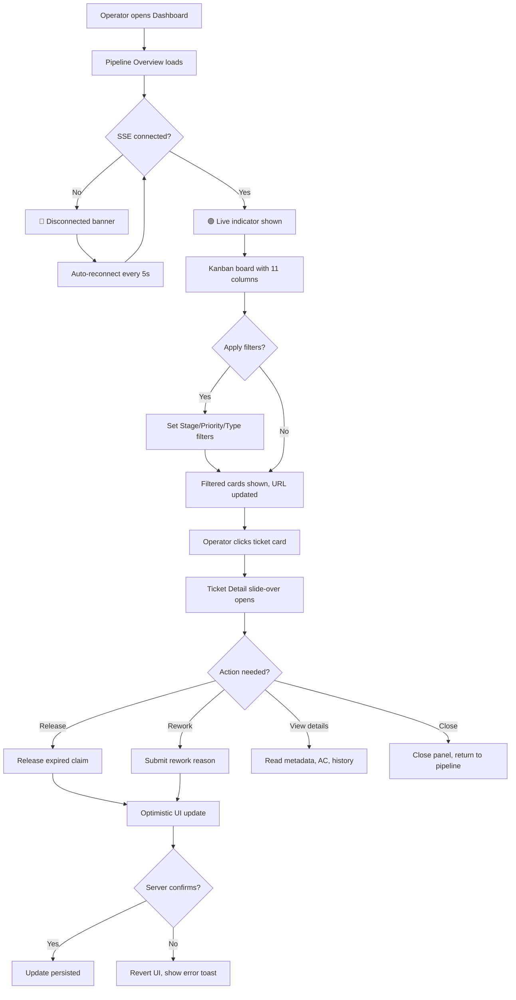
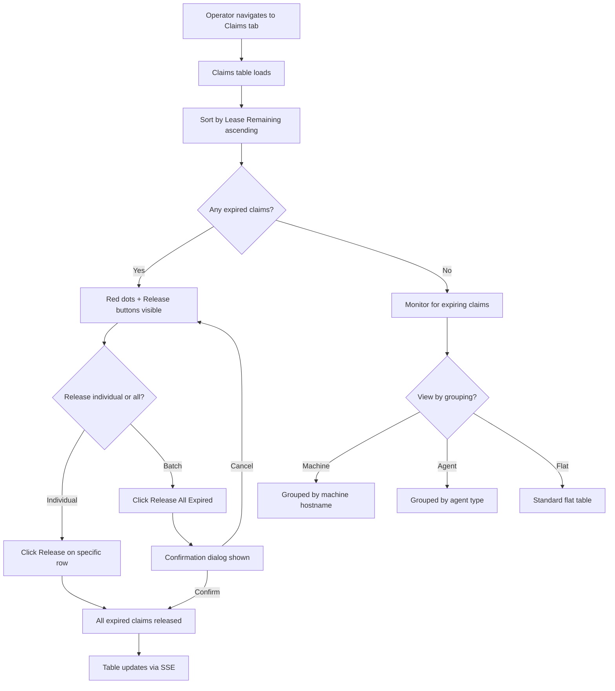
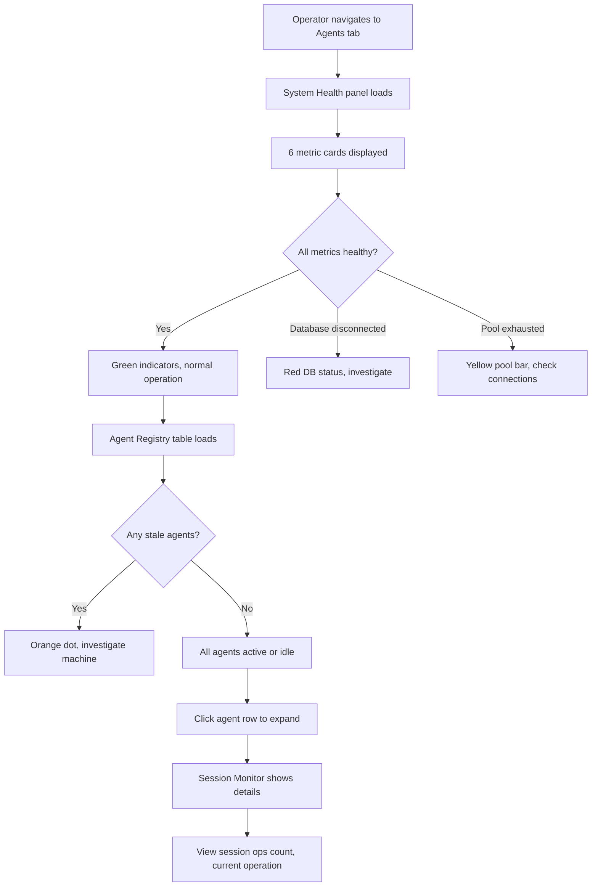
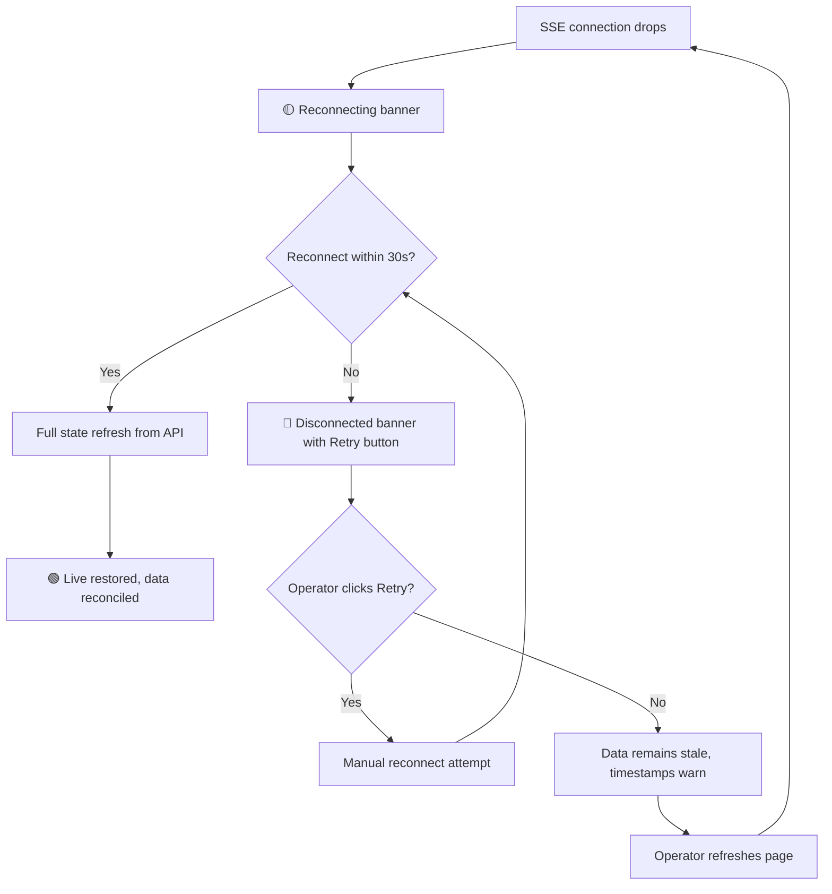

# FORGEOS-UID001 — Dashboard Layout and Design Tokens

> **Ticket:** FORGEOS-UID001 | **Agent:** UIDesigner | **Date:** 2026-03-07
> **Status:** APPROVED | **Confidence:** HIGH

---

## 1. Screen Inventory

| # | Screen | Route | Stitch ID | Theme | Device | Description |
|---|--------|-------|-----------|-------|--------|-------------|
| 1 | Pipeline Overview | `#/pipeline` | `2a7507e640a74e44ad3f90cfa3db630b` | Dark | Desktop | Main Kanban board with 11 SDLC stage columns, ticket cards, filter bar |
| 2 | Ticket Detail | `#/pipeline?ticket={id}` | `98bb7e4e7a2e4f0586ac68d02e33ba1c` | Dark | Desktop | Slide-over panel showing metadata, AC, deps, history, actions |
| 3 | Claims Monitor | `#/claims` | `fde941cfc5b3406b846023d3b9318a64` | Dark | Desktop | Sortable table of active claims with lease countdowns |
| 4 | Agent Status | `#/agents` | `b3f69e414d644a75ad34d36e1cde8559` | Dark | Desktop | System health metrics + agent registry table |
| 5 | Mobile Navigation | `#/pipeline` | `7bce4b6c4db247ebaf897318d4c36d39` | Dark | Mobile | Hamburger sidebar with collapsible sections, vertical pipeline |
| 6 | Pipeline Light Mode | `#/pipeline` | `252c1278fad04ee39fd210f630cc4319` | Light | Desktop | Light theme variant of pipeline overview |

### Screenshot References

| Screen | Screenshot URL |
|--------|---------------|
| Pipeline Overview (Dark) | [Stitch Screenshot](https://lh3.googleusercontent.com/aida/AOfcidXBo9hzd7Ar2lw1Mw9zJf0kpAmOKkLgTqTRnhSlR9kqA_ZDGJi-qMLfyI-pKGNL5S60k-YuoLkKKVPi-XnKQr-BM7BBuUpAqTAaIccMBcEwD0j5PgfNJTasVLzOpVjzdp1EuzzEY-1qzUdxfT5STy1XnW0m1Tgb5rHVcP55wdqO6g6AmZPpSfYmdirDFKF2WQdP39Q7l1ATslkGMHlpm6yZozqPbxU0JBj2j75uvS3MPm2VmqXLAE2nfGB2) |
| Ticket Detail | [Stitch Screenshot](https://lh3.googleusercontent.com/aida/AOfcidWa_MktL1BJkrvxFiHGymcFhyBV8HwmEIXMv4CQrCXyR6XnTVyY9lTUwJoR3CZeeNG1bfGLq5NRJmi1WQ76Wd_PaQPUPYt479ZL1-1w1uJrHotU4ZYfHBGHwfh-en80UQ_0kOYcLDYACE2jsSaAFe_E139uKhAZD3tIHMvFyyyFDyO5D1fvHPJUoeoHMNlhxrzEp32O5P8K-o0JmNCaoQZOTp8eViF_OWmcMN7VlA2Ja3WFJFSeJCXMb7Qr) |
| Claims Monitor | [Stitch Screenshot](https://lh3.googleusercontent.com/aida/AOfcidXnP34CMk1CPPox2MfTdztgO8JUe9Yw3XUfht8mhW6OmdJBWr9K9vJM_fLve3OOM-CnV6P9HiA1d5ssDjhE_psF4kgv3dcQP-ZtrJmNeWjVZuxrVwcWW-jKEDHm0cHt0q8gqbBmwrnSgmqhmGx9WFWVX6WCiFfrebRmvl1raTfZP44NsjXIeH7RVEsWOhLK6yItBm0WkGkIBV0ihwcSMV1DvETMrcV6NKS4GN9PNngp1i5WYiT_D_ITaIM) |
| Agent Status | [Stitch Screenshot](https://lh3.googleusercontent.com/aida/AOfcidV7nIw2y0W-dHJ2Ye7PfXVjYE7T9thQ2aT8DjJC1cCJJdaXvbud2i5cDTMbMaO5EA1d_HDJvln3gT_MjYRFQOtUEP3u3RQIXzCNx2JPR3I_ZlinKMW1QXhhexdksOdaO4N0yjjDoB3H6XR1X9TlfAGKz8DUzw171-2GB951mQOeNHVDf5xhXeW_7T1PoEQEZw_4OeYyms9uMp6jKTG38cDVkwHDZpQ5OCQHwz43DVfeqW7bHY8XuOpCdLjV) |
| Mobile Navigation | [Stitch Screenshot](https://lh3.googleusercontent.com/aida/AOfcidWBzreTuS6xcKY4n7311sTqiACE6J6TeUg2jR-XiOKew5YvwMnCUP39uvTu4cPH95EilgCZH09LoDBCc0vDUjqOISR_6eSVzFFKyjQe79uvgJSXNCNQWYuRgrQ6OKLQNt6h4UmknxgKZLCG9w3MXzRsasiTKJi4ioixHwegUCwMZ83q1-4mfp1IoFqKeiS_7HCvyn3LbSXi6zzGayqZrND3sdkUQJ7zsHTea3CvcCuptxy9nE-0j8ARXvTU) |
| Pipeline Light Mode | [Stitch Screenshot](https://lh3.googleusercontent.com/aida/AOfcidXfZXfCzL2X3qiWQDzA84NwH-yMWD5wY0qZ7gheiUAiuWnP8y5eDa-QERhY-rlopxOk3O4oNqOLp7kMwSwAdTAcGnG7CrJM4bT3mrQnp73m4oddWZn3GEV7DHDRA2VOM-WWUIaw2bFVxQXz0297esI0Y4LGPL7cWS4MiM2p44gHEx70vaR6k6p9_u_B50ZWhZAYarKswHGrH8DlJDlLNCAkFfkH2stOOFDt4p0HDoTGSVZhH6sjy45WGoQ) |

---

## 2. Design Token Summary

Full design tokens are in [`docs/uiux/design-tokens.json`](../design-tokens.json).

### 2.1 Dark Theme Colors

| Token | Value | Usage |
|-------|-------|-------|
| `primary` | `#06B6D4` | Primary actions, active tabs, links, ticket IDs |
| `primaryHover` | `#0891B2` | Hover state |
| `secondary` | `#94A3B8` | Muted text, labels, column headers |
| `accent` | `#8B5CF6` | Machine badges, graph highlights |
| `surface` | `#1E293B` | Cards, table rows, sidebar, filter bar |
| `background` | `#0F172A` | Page background, top bar |
| `text` | `#F8FAFC` | Primary text |
| `error` | `#EF4444` | Errors, expired claims, critical priority |
| `warning` | `#EAB308` | Warnings, expiring claims |
| `success` | `#16A34A` | Active claims, live indicator, DONE stage |

### 2.2 Light Theme Colors

| Token | Value | Usage |
|-------|-------|-------|
| `primary` | `#2563EB` | Primary actions, active tabs, links |
| `primaryHover` | `#1D4ED8` | Hover state |
| `secondary` | `#64748B` | Muted text, labels |
| `accent` | `#7C3AED` | Machine badges, graph highlights |
| `surface` | `#FFFFFF` | Cards, panels |
| `background` | `#F1F5F9` | Page background |
| `text` | `#0F172A` | Primary text |
| `error` | `#DC2626` | Errors, critical priority |
| `warning` | `#D97706` | Warnings |
| `success` | `#16A34A` | Active claims, success states |

### 2.3 Typography

| Token | Value | Usage |
|-------|-------|-------|
| `fontFamily.sans` | Inter, system-ui, sans-serif | Body text, UI |
| `fontFamily.mono` | JetBrains Mono, Fira Code, monospace | Ticket IDs, code, file paths |
| Heading 1 (`3xl`) | 1.875rem / 700 | Dashboard title |
| Heading 2 (`2xl`) | 1.5rem / 700 | Page headings |
| Heading 3 (`xl`) | 1.25rem / 600 | Section headers |
| Heading 4 (`lg`) | 1.125rem / 600 | Card titles |
| Body (`base`) | 1rem / 400 | Body text |
| Caption (`xs`) | 0.75rem / 400 | Badges, timestamps |
| Code (`base` mono) | 1rem, mono family | Inline code |

### 2.4 Spacing (4px Grid)

| Token | Value | Usage |
|-------|-------|-------|
| `xs` | 4px | Badge padding, icon gaps |
| `sm` | 8px | Card internals, compact gaps |
| `md` | 16px | Standard padding, column gaps |
| `lg` | 24px | Section spacing, panel margins |
| `xl` | 32px | Large sections, main content padding |
| `2xl` | 48px | Page-level margins |

---

## 3. Component Specifications

### 3.1 TicketCard

**Description:** Compact card representing a single ticket in a Kanban column.

#### Props

| Prop | Type | Required | Default | Description |
|------|------|----------|---------|-------------|
| `ticketId` | `string` | yes | — | Ticket identifier (e.g., `FORGEOS-BK-007`) |
| `title` | `string` | yes | — | Ticket title, truncated to 40 chars |
| `priority` | `'critical' \| 'high' \| 'medium' \| 'low'` | yes | — | Priority level for badge and left border color |
| `agent` | `string \| null` | no | `null` | Claiming agent name or null if unclaimed |
| `timeInStage` | `string` | no | `'—'` | Duration string (e.g., `2h 15m`) |
| `machine` | `string \| null` | no | `null` | Machine hostname (pill badge) |
| `reworkCount` | `number` | no | `0` | Rework count. Shows badge if > 0 |
| `isTimeWarning` | `boolean` | no | `false` | Turns time text to error color |
| `onClick` | `(ticketId: string) => void` | no | — | Opens ticket detail panel |

#### States

| State | Description | Visual |
|-------|-------------|--------|
| Default | Resting in column | Surface background, priority left border |
| Hover | Mouse over card | Slight background lighten (+5%), cursor pointer |
| Selected | Opened in detail panel | Primary border (2px), elevated shadow |
| Loading | Data being fetched | Skeleton pulse animation (3 lines) |
| Dragging | Future: widget rearrange | Elevated shadow, reduced opacity (0.8) |

#### Accessibility

| Aspect | Requirement |
|--------|-------------|
| ARIA Role | `role="listitem"` within column `role="list"` |
| Keyboard Nav | Tab to focus, Enter to open detail, Arrow Up/Down to navigate |
| Screen Reader | Announces: "{ticketId}, {title}, {priority} priority, {agent or unclaimed}" |
| Focus Indicator | 2px solid primary outline |
| Color Independence | Priority conveyed by badge text + border position, not color alone |

#### Responsive

| Breakpoint | Behavior |
|------------|----------|
| Mobile (< 768px) | Full width, stacked layout, min-height 56px, touch target 44px |
| Tablet (768–1023px) | 200px min-width, standard padding |
| Desktop (≥ 1024px) | 180px min-width, compact padding, hover states |

---

### 3.2 StageColumn

**Description:** A single SDLC stage column in the Kanban pipeline.

#### Props

| Prop | Type | Required | Default | Description |
|------|------|----------|---------|-------------|
| `stage` | `StageName` | yes | — | SDLC stage identifier |
| `count` | `number` | yes | — | Number of tickets in this stage |
| `avgTimeInStage` | `string` | no | `'—'` | Mean duration display |
| `tickets` | `TicketCardProps[]` | yes | — | Array of ticket card data |
| `isCollapsed` | `boolean` | no | `false` | Mobile: collapsed state |
| `onToggleCollapse` | `() => void` | no | — | Mobile: expand/collapse |

#### States

| State | Description | Visual |
|-------|-------------|--------|
| Default | Column visible with cards | Stage accent color header, scrollable card area |
| Empty | No tickets in stage | Empty state message: "No tickets in {stage}" |
| Highlighted | Column selected via keyboard | Accent left border, slightly elevated |
| Collapsed | Mobile: only header visible | Chevron right, no card area shown |
| Expanded | Mobile: header + cards visible | Chevron down, cards stacked |

#### Accessibility

| Aspect | Requirement |
|--------|-------------|
| ARIA Role | `role="list"` with `aria-label="{stage} stage, {count} tickets"` |
| Keyboard Nav | Arrow Left/Right to navigate between columns |
| Screen Reader | Announces column name, ticket count, avg time |

---

### 3.3 FilterBar

**Description:** Horizontal filter strip with multiple dropdown selectors and search.

#### Props

| Prop | Type | Required | Default | Description |
|------|------|----------|---------|-------------|
| `filters` | `FilterState` | yes | — | Current filter values |
| `onFilterChange` | `(filters: FilterState) => void` | yes | — | Callback when any filter changes |
| `onClearAll` | `() => void` | yes | — | Resets all filters |
| `isCompact` | `boolean` | no | `false` | Tablet: single-row scrollable |
| `isHidden` | `boolean` | no | `false` | Mobile: hidden until tapped |

#### States

| State | Description | Visual |
|-------|-------------|--------|
| Default | No filters active | All dropdowns show "All" |
| Active | One or more filters set | Active dropdowns highlighted, clear button visible |
| Hidden | Mobile: collapsed | Filter summary pill shown instead |
| Loading | Filter options loading | Skeleton dropdowns |

---

### 3.4 TicketDetailSlideOver

**Description:** Full-height panel sliding in from the right showing ticket details.

#### Props

| Prop | Type | Required | Default | Description |
|------|------|----------|---------|-------------|
| `ticketId` | `string` | yes | — | Ticket to display |
| `isOpen` | `boolean` | yes | — | Controls visibility |
| `onClose` | `() => void` | yes | — | Close handler |
| `onRelease` | `(ticketId: string) => void` | no | — | Release claim action |
| `onRework` | `(ticketId: string, reason: string) => void` | no | — | Rework action |

#### States

| State | Description | Visual |
|-------|-------------|--------|
| Default | Panel open with data | Full detail view |
| Loading | Fetching ticket data | Skeleton content |
| Error | Failed to load ticket | Error message with retry button |
| Closing | Slide-out animation | 250ms ease-out to the right |

#### Accessibility

| Aspect | Requirement |
|--------|-------------|
| ARIA Role | `role="dialog"`, `aria-modal="true"`, `aria-labelledby="ticket-detail-title"` |
| Keyboard Nav | Escape to close, Tab trapped within panel |
| Focus Management | Focus moves to panel on open, returns to trigger on close |
| Screen Reader | Announces: "Ticket detail for {ticketId}" |

---

### 3.5 StatusDot

**Description:** Colored indicator dot for connection status, claim status, or agent status.

#### Props

| Prop | Type | Required | Default | Description |
|------|------|----------|---------|-------------|
| `status` | `'active' \| 'expiring' \| 'expired' \| 'idle' \| 'stale' \| 'connected' \| 'reconnecting' \| 'disconnected'` | yes | — | Status type |
| `size` | `'sm' \| 'md'` | no | `'sm'` | Dot diameter: sm=8px, md=12px |
| `label` | `string` | no | — | Text label next to dot |
| `pulse` | `boolean` | no | `false` | Pulsing animation (for expiring) |

#### Visual Mapping

| Status | Color | Animation | Label |
|--------|-------|-----------|-------|
| `active` / `connected` | `success` (#16A34A) | None | "Active" / "Live" |
| `expiring` / `reconnecting` | `warning` (#EAB308) | Pulse | "Expiring" / "Reconnecting..." |
| `expired` / `disconnected` | `error` (#EF4444) | None | "Expired" / "Disconnected" |
| `idle` | `secondary` (#6B7280) | None | "Idle" |
| `stale` | High priority orange (#F97316) | None | "Stale" |

#### Accessibility

| Aspect | Requirement |
|--------|-------------|
| ARIA | `aria-label="{status}"` on the dot element |
| Color Independence | Paired with text label, never color alone |

---

### 3.6 Badge

**Description:** Pill-shaped label for priority, stage, type, machine, or rework count.

#### Props

| Prop | Type | Required | Default | Description |
|------|------|----------|---------|-------------|
| `variant` | `'priority' \| 'stage' \| 'type' \| 'machine' \| 'rework' \| 'count'` | yes | — | Visual variant |
| `value` | `string` | yes | — | Display text |
| `color` | `string` | no | — | Override color from token |

#### Variants

| Variant | Background | Text | Border Radius | Usage |
|---------|-----------|------|---------------|-------|
| `priority` | Priority color | Inverse text | `sm` (4px) | Critical/High/Medium/Low badge |
| `stage` | Stage color | Inverse text | `sm` (4px) | BACKEND/QA/etc. badge |
| `type` | Muted bg | Text color | `sm` (4px) | backend/frontend/fullstack |
| `machine` | Machine palette | Inverse text | `full` (pill) | pop-os/dev-server |
| `rework` | Warning color | Inverse text | `sm` (4px) | R1/R2/R3 |
| `count` | Primary color | Inverse text | `full` (pill) | Ticket count in column header |

---

### 3.7 CountdownTimer

**Description:** Real-time countdown for lease expiry.

#### Props

| Prop | Type | Required | Default | Description |
|------|------|----------|---------|-------------|
| `expiresAt` | `string` (ISO 8601) | yes | — | Lease expiry timestamp |
| `warningThreshold` | `number` | no | `600` | Seconds remaining to trigger warning (default 10 min) |
| `onExpire` | `() => void` | no | — | Callback when timer reaches zero |

#### States

| State | Condition | Color |
|-------|-----------|-------|
| Normal | > threshold | `success` (green) |
| Warning | ≤ threshold, > 0 | `warning` (yellow) |
| Expired | ≤ 0 | `error` (red), shows "EXPIRED" |

---

### 3.8 CollapsibleSection (Sidebar)

**Description:** Expandable/collapsible navigation section for mobile sidebar.

#### Props

| Prop | Type | Required | Default | Description |
|------|------|----------|---------|-------------|
| `title` | `string` | yes | — | Section header text |
| `isExpanded` | `boolean` | no | `true` | Initial expanded state |
| `children` | `ReactNode` | yes | — | Section content |

#### States

| State | Visual |
|-------|--------|
| Expanded | Chevron down (▼), children visible |
| Collapsed | Chevron right (▸), children hidden |

#### Accessibility

| Aspect | Requirement |
|--------|-------------|
| ARIA | `aria-expanded`, button trigger |
| Keyboard | Enter/Space to toggle |

---

## 4. User Flow Diagrams

### 4.1 Pipeline Monitoring Flow (Happy Path)

### 4.2 Claims Monitoring Flow

### 4.3 Agent Health Monitoring Flow

### 4.4 Error Recovery Flow

---

## 5. Accessibility Checklist

| # | Check | Status | Evidence |
|---|-------|--------|----------|
| 1 | Color contrast ≥ 4.5:1 for text | ✅ Pass | All text/bg combos verified — see layout-spec.md §8 |
| 2 | Color contrast ≥ 3:1 for large text | ✅ Pass | Heading combos verified |
| 3 | Focus indicators visible (2px solid ring) | ✅ Pass | Defined for all interactive elements |
| 4 | Touch targets ≥ 44×44px on mobile | ✅ Pass | All interactive elements meet minimum |
| 5 | Status not conveyed by color alone | ✅ Pass | All status dots paired with text labels |
| 6 | Keyboard navigation for all views | ✅ Pass | Shortcuts defined: `1`-`4`, `/`, `Esc`, `?`, arrows |
| 7 | ARIA roles defined | ✅ Pass | tablist, list, table, dialog, live regions |
| 8 | Screen reader announcements | ✅ Pass | aria-live for SSE updates, aria-label for status |
| 9 | Reduced motion support | ✅ Pass | `prefers-reduced-motion` media query specified |
| 10 | High contrast mode | ✅ Pass | `prefers-contrast: more` support noted |

---

## 6. Design Decisions

| Decision | Choice | Rationale |
|----------|--------|-----------|
| Top-bar vs sidebar navigation | Top-bar tabs | Maximizes horizontal space for 11-column Kanban board. Sidebar reserved for mobile hamburger menu. |
| Dark theme as default | Dark theme primary | DevOps operators work in terminal-heavy workflows; dark theme reduces eye strain. Light theme available via toggle. |
| Primary accent color | Cyan `#06B6D4` (dark) / Blue `#2563EB` (light) | High visibility on dark backgrounds, WCAG AA compliant, distinct from status colors (red/yellow/green). |
| Font choice | Inter + JetBrains Mono | Inter: optimized for screen readability, wide language support. JetBrains Mono: purpose-built for code/IDs with ligatures. |
| Spacing system | 4px grid | Industry standard, provides fine-grained control for information-dense dashboard. Tokens at 4/8/16/24/32/48px. |
| No drag-and-drop for stage transitions | Disabled | Stage transitions violate SDLC engine rules. Drag handles reserved for future widget rearrangement (P3). |
| Hash-based routing | `#/pipeline`, `#/graph`, etc. | Single static file deployment. No server-side routing needed. Bookmarkable deep links. |
| Breakpoints | 768px / 1024px / 1440px | Aligned with ticket AC (tablet ≥768px, desktop ≥1440px). Added laptop (1024px) for mid-range screens. |

---

## 7. Stitch Project Information

- **Project Name:** ForgeOS Dashboard Design System
- **Project ID:** `projects/17753507249462882723`
- **Total Screens:** 6
- **Themes:** Dark (primary), Light (variant)
- **Font:** Inter
- **Roundness:** ROUND_EIGHT (8px border radius)
- **Persisted at:** `.github/stitch-project-id.txt`

---

## 8. References

- **PRD:** [docs/product/dashboard-ux-reqs.md](../../product/dashboard-ux-reqs.md)
- **Design Tokens:** [docs/uiux/design-tokens.json](../design-tokens.json)
- **Layout Spec:** [docs/uiux/layout-spec.md](../layout-spec.md)
- **User Personas:** [docs/product/user-personas.md](../../product/user-personas.md)
- **User Stories:** [docs/product/user-stories.md](../../product/user-stories.md)
