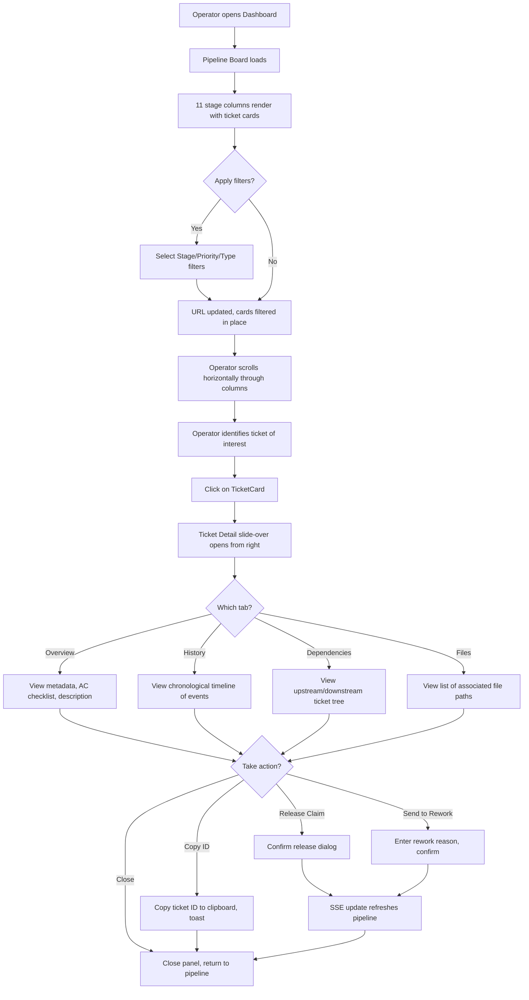
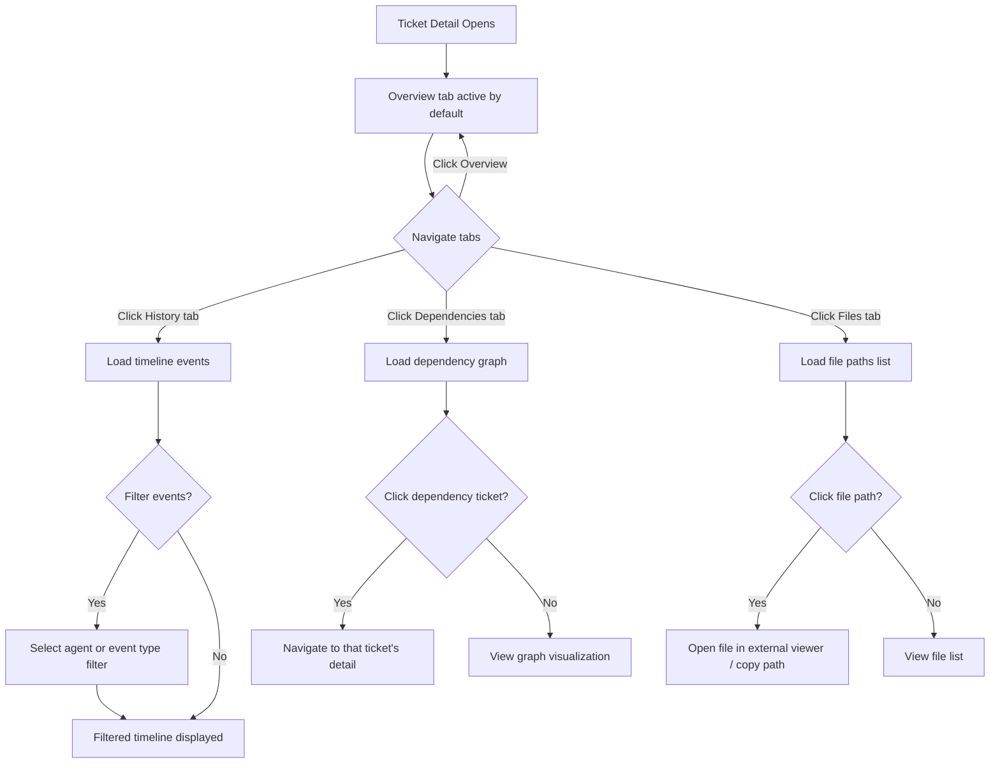
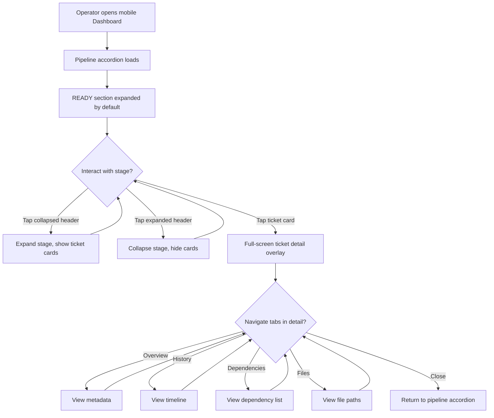
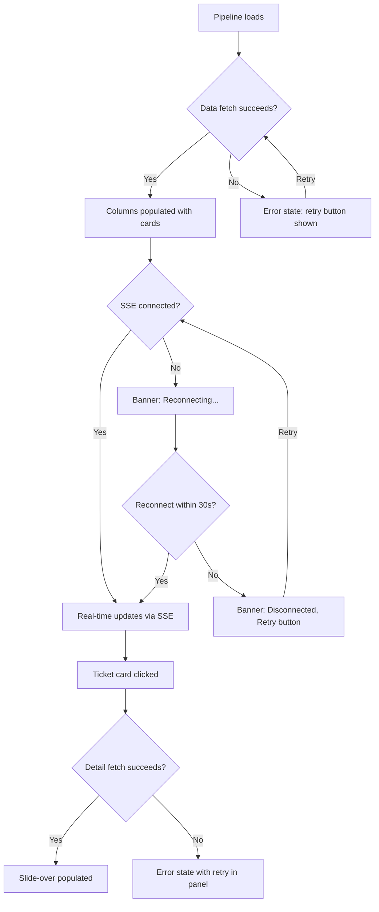

# FORGEOS-UID002 — Pipeline and Ticket Detail Views

> **Ticket:** FORGEOS-UID002 | **Agent:** UIDesigner | **Date:** 2026-03-10
> **Status:** APPROVED | **Confidence:** HIGH

---

## 1. Screen Inventory

| # | Screen | Route | Stitch ID | Theme | Device | Description |
|---|--------|-------|-----------|-------|--------|-------------|
| 1 | Pipeline Board (Kanban) | `#/pipeline` | `ff33d46a7937435b92a6abcf00eb4305` | Dark | Desktop | 11-column SDLC Kanban with ticket cards, count badges, scrollable lists |
| 2 | Ticket Detail (Tabbed) | `#/pipeline?ticket={id}` | `d0c96e90a12d429384b45b153bd266c0` | Dark | Desktop | Slide-over panel with Overview, History, Dependencies, Files tabs |
| 3 | History Timeline | `#/pipeline?ticket={id}&tab=history` | `dfbe9a74087143099d69ad81a83ec079` | Dark | Desktop | Chronological event list with agent attribution and timestamps |
| 4 | Dependencies View | `#/pipeline?ticket={id}&tab=dependencies` | `a0a443dad0ce453f96bc0dbbbc88a8ee` | Dark | Desktop | Upstream/downstream tree with visual dependency graph |
| 5 | Mobile Pipeline | `#/pipeline` | `b8c8123cc14d4eedbb04ccb152595111` | Dark | Mobile | Accordion-style vertical stage sections with collapsible cards |

### Screenshot References

| Screen | Screenshot URL |
|--------|---------------|
| Pipeline Board | [Stitch Screenshot](https://lh3.googleusercontent.com/aida/AOfcidWvHtqt2x_d9JzuJ_SLAIdD2l91dR6VqdpMEOsLbFq566k34x0RomPF5B0oxRqZtCEBaDEWg2uiwPEI1hrqhrqDlru2JOSgxtBm--_2dUEu7061tSYETkrsHGMdQKt3I_6lRTwSczq3zYmBaDJOV6lemk2NG96Drd-SyubUHBDrLP1IyAo-B1TSXGBm0FvtVG7U-1cyYgWDYkBu_jmgF6YG-OEhZxf5OIIBfoksD9rD-k-4WsJ4Z5bZbVDh) |
| Ticket Detail | [Stitch Screenshot](https://lh3.googleusercontent.com/aida/AOfcidVHtZt9diVJ73x_c8lkvmml3lhC0yYdd9FPMwteLuTwFKaqsfkBBXdQW5TxKJ7pxi5pVrA_BaP1Bd-ko5_3BVXAFQWBFocPTPnPmxAcdY_d6BCQ8qS2jKbMKSGiXKf3KxxRhRKT1Z-Zzndq4jtKe4bNJsw4qJ8FmOmB_k9AyDRiTxhdPYuad2VupfjEwzYHXcJATkc7FeaNBxWYRai1dLNpxeHtq5gVO_4TCtrvFBSr7_PdoFNK-Ny9jbzy) |
| History Timeline | [Stitch Screenshot](https://lh3.googleusercontent.com/aida/AOfcidXQWcuLgHe3nPfSRTC_TeYNL-J61BD7i-cdCD9BMUbGKSI4yr2ApG-SD99PD1LXbpL6kwCSXbIAAivm1hWseK7lUMkLntLvHShakwJUSf_FSYpm5VZfbvMcywFfXG1A8rVW-IbCxSqMR3u_8UR_s39elFiy4vyVz4uflfomftBFdqSkHZG5-VFK0eXGoa1FkDAFU18aC8Gz4mt9fiJzQnMndKVtSTO_njaC4e-zT6X-s1wUAbIVrD-KQ0A) |
| Dependencies View | [Stitch Screenshot](https://lh3.googleusercontent.com/aida/AOfcidXn952p-e9e2FuQtiz4BtCct-I5kh28d4uaIaZ2Oc9BsAA30Xi80AtlCdccmUkli-wJbbPPSaITtEhRxROIGwZGNJstyyODPAH7iOrM9yDjF08xgG_Bnw-R0HHRvQsj2iXeiykcC7XrUF1YMutNa7N2C8TJrgBauS5DPXGJ2bg-7RHsvl0r_j7MTLryvM-PcBCidv81ahqYh7_oseeoIl50pbPCR0_vhzhu3c72lwKquJFXmCpqVl6nt0hQ) |
| Mobile Pipeline | [Stitch Screenshot](https://lh3.googleusercontent.com/aida/AOfcidUHG3jYLCUYxzJsFnKv3LnyfEsAvW36ECDbCCBov3hwe2fCOESHJoNIsKKsRVPzPorE2vX65ZQ8H7mckg3yMhRqsJeBRHnKWas2FTdmOEYmInYozrrpA_t4US6FgxupVJLbs_hzY88yuBFcP6RllRRGM_S095n6n1ou4b1jhnlLMh3btLNz3dnEGjq8a7YbIYLXsy7ix4YYsbWcpyhn6aB5LbiTu89LPlDnx2HIL95me8X0NgnNfi4SocVi) |

---

## 2. Design Token References

All tokens defined in FORGEOS-UID001 are reused. See [`docs/uiux/design-tokens.json`](../design-tokens.json).

### Stage Column Colors (per design-tokens.json)

| Stage | Color | Token Path |
|-------|-------|------------|
| READY | `#06B6D4` | `themes.dark.stage.ready` |
| ARCHITECT | `#8B5CF6` | `themes.dark.stage.architect` |
| RESEARCH | `#A855F7` | `themes.dark.stage.research` |
| BACKEND | `#3B82F6` | `themes.dark.stage.backend` |
| FRONTEND | `#14B8A6` | `themes.dark.stage.frontend` |
| QA | `#F97316` | `themes.dark.stage.qa` |
| SECURITY | `#EF4444` | `themes.dark.stage.security` |
| CI | `#EAB308` | `themes.dark.stage.ci` |
| DOCS | `#64748B` | `themes.dark.stage.docs` |
| VALIDATION | `#16A34A` | `themes.dark.stage.validation` |
| DONE | `#22C55E` | `themes.dark.stage.done` |
| ESCALATED | `#DC2626` | `themes.dark.stage.escalated` |

### Priority Colors (per design-tokens.json)

| Priority | Color | Token Path |
|----------|-------|------------|
| Critical | `#EF4444` | `themes.dark.priority.critical` |
| High | `#F97316` | `themes.dark.priority.high` |
| Medium | `#3B82F6` | `themes.dark.priority.medium` |
| Low | `#6B7280` | `themes.dark.priority.low` |

---

## 3. Component Specifications

### 3.1 TicketCard (Enhanced)

**Description:** Compact card representing a single ticket in a Kanban column. Extends the base spec from FORGEOS-UID001 with type badge and claim indicator.

#### Props

| Prop | Type | Required | Default | Description |
|------|------|----------|---------|-------------|
| `ticketId` | `string` | yes | — | Ticket identifier (e.g., `FORGEOS-BK-007`) |
| `title` | `string` | yes | — | Ticket title, truncated to 2 lines with ellipsis |
| `priority` | `'critical' \| 'high' \| 'medium' \| 'low'` | yes | — | Priority level for left border and badge |
| `type` | `'backend' \| 'frontend' \| 'fullstack' \| 'infra' \| 'security' \| 'docs' \| 'research' \| 'architecture'` | yes | — | Ticket type for color-coded badge |
| `agent` | `string \| null` | no | `null` | Claiming agent name or null if unclaimed |
| `machine` | `string \| null` | no | `null` | Machine hostname for pill badge |
| `timeInStage` | `string` | no | `'—'` | Duration string (e.g., `2h 15m`) |
| `reworkCount` | `number` | no | `0` | Rework count; shows yellow badge if > 0 |
| `isTimeWarning` | `boolean` | no | `false` | Turns time text to error color when threshold exceeded |
| `isClaimed` | `boolean` | no | `false` | Shows claim indicator (filled dot vs empty circle) |
| `onClick` | `(ticketId: string) => void` | no | — | Opens ticket detail slide-over panel |

#### States

| State | Description | Visual Indicators |
|-------|-------------|-------------------|
| Default | Resting in column | Surface `#1E293B` background, priority-colored 3px left border |
| Hover | Mouse over card | Background lightens to `#253145` (+5%), cursor pointer |
| Selected | Detail panel open for this ticket | Primary `#06B6D4` 2px border, elevated shadow |
| Loading | Data being fetched | Skeleton pulse animation (3 placeholder lines) |
| Unclaimed | No agent assigned | Empty circle indicator, muted agent text "Unclaimed" |
| Claimed | Agent assigned | Filled green dot indicator, agent name displayed |
| Dragging | Future: widget rearrange | Elevated shadow, reduced opacity (0.8) |

#### Type Badge Color Mapping

| Type | Background | Text |
|------|-----------|------|
| `backend` | `#3B82F6` | `#F8FAFC` |
| `frontend` | `#14B8A6` | `#F8FAFC` |
| `fullstack` | `#8B5CF6` | `#F8FAFC` |
| `infra` | `#64748B` | `#F8FAFC` |
| `security` | `#EF4444` | `#F8FAFC` |
| `docs` | `#64748B` | `#F8FAFC` |
| `research` | `#A855F7` | `#F8FAFC` |
| `architecture` | `#8B5CF6` | `#F8FAFC` |

#### Card Layout (Desktop)

```
┌─── 3px priority-colored left border ──────────────────┐
│                                                        │
│  FORGEOS-BK-007                          [pop-os]     │
│  Implement Ticket Claim with SKIP LO...               │
│                                                        │
│  [Critical] [backend]  ● Backend     2h 15m   [R1]   │
│                                                        │
└────────────────────────────────────────────────────────┘
```

| Element | Font | Size | Color | Position |
|---------|------|------|-------|----------|
| Ticket ID | Mono | `sm` (14px) | Primary `#06B6D4` | Top-left |
| Machine badge | Sans | `xs` (12px) | Machine palette, inverse text | Top-right |
| Title | Sans | `sm`–`base` | Text `#F8FAFC` | Below ID, 1-2 lines max |
| Priority badge | Sans | `xs` (12px) | Priority color bg, inverse text | Bottom-left |
| Type badge | Sans | `xs` (12px) | Type color bg, inverse text | After priority badge |
| Claim indicator | — | 8px dot | Green (claimed) / Gray (unclaimed) | Before agent name |
| Agent name | Sans | `xs` (12px) | Muted `#94A3B8` | Bottom-center |
| Time in stage | Mono | `xs` (12px) | Muted (or `error` if warning) | Bottom-right |
| Rework badge | Sans | `xs` (12px) | Warning bg, inverse text | Far right, conditional |

#### Dimensions

| Property | Desktop | Tablet | Mobile |
|----------|---------|--------|--------|
| Width | `minmax(180px, 1fr)` | `minmax(200px, 1fr)` | `100%` |
| Min height | 88px | 96px | 56px |
| Padding | 12px | 12px | 12px 16px |
| Border radius | 8px (`lg`) | 8px (`lg`) | 8px (`lg`) |
| Margin bottom | 8px (`sm`) | 8px (`sm`) | 8px (`sm`) |

#### Accessibility

| Aspect | Requirement |
|--------|-------------|
| ARIA Role | `role="listitem"` within column `role="list"` |
| Keyboard Nav | Tab to focus, Enter to open detail, Arrow Up/Down to navigate within column |
| Screen Reader | Announces: "{ticketId}, {title}, {priority} priority, {type} type, {agent or unclaimed}" |
| Focus Indicator | 2px solid `#06B6D4` outline, 2px offset |
| Color Independence | Priority conveyed by badge text + left border position; type conveyed by badge text; claim status conveyed by icon shape (filled/empty) + text label |
| Touch Target | Minimum 44×44px on mobile (entire card is tappable) |

#### Responsive Behavior

| Breakpoint | Behavior |
|------------|----------|
| Mobile (< 768px) | Full width, stacked layout, min-height 56px, touch target 44px, muted elements hidden |
| Tablet (768–1023px) | 200px min-width, standard padding, all elements visible |
| Desktop (≥ 1024px) | 180px min-width, compact padding, hover states active |

---

### 3.2 StageColumn

**Description:** A single SDLC stage column in the Kanban pipeline. Contains header with stage info and a scrollable list of TicketCards.

#### Props

| Prop | Type | Required | Default | Description |
|------|------|----------|---------|-------------|
| `stage` | `'READY' \| 'ARCHITECT' \| 'RESEARCH' \| 'BACKEND' \| 'FRONTEND' \| 'QA' \| 'SECURITY' \| 'CI' \| 'DOCS' \| 'VALIDATION' \| 'DONE' \| 'ESCALATED'` | yes | — | SDLC stage identifier |
| `count` | `number` | yes | — | Number of tickets in this stage |
| `avgTimeInStage` | `string` | no | `'—'` | Mean duration display (e.g., `Avg: 4h`) |
| `tickets` | `TicketCardProps[]` | yes | — | Array of ticket card data |
| `accentColor` | `string` | no | — | Override stage accent color (from stage tokens)  |
| `isCollapsed` | `boolean` | no | `false` | Mobile: collapsed state |
| `isCompact` | `boolean` | no | `false` | Bottom row compact mode (DOCS, VALIDATION, DONE, ESCALATED) |
| `onToggleCollapse` | `() => void` | no | — | Mobile: expand/collapse handler |
| `onTicketClick` | `(ticketId: string) => void` | no | — | Passes click through to TicketCard |

#### Column Layout (Desktop)

```
┌──────────────────────────────┐
│ ──── stage accent border ─── │  ← 3px top border in stage color
│  BACKEND          [4]  Avg:  │  ← Header: name, count badge, avg time
│                       2h     │
├──────────────────────────────┤
│ ┌────────────────────────┐   │
│ │ FORGEOS-BK-007  [pop]  │   │  ← TicketCard (scrollable list)
│ │ Implement Claim...     │   │
│ │ [Critical][backend] 2h │   │
│ └────────────────────────┘   │
│ ┌────────────────────────┐   │
│ │ FORGEOS-BK-012  [dev]  │   │
│ │ Migration Helper...    │   │
│ │ [High][backend]   45m  │   │
│ └────────────────────────┘   │
│                              │  ← Scrollable overflow area
│                              │
└──────────────────────────────┘
```

#### Header Layout

| Element | Font | Size | Color |
|---------|------|------|-------|
| Stage name | Sans | `xl` (20px), weight 600 | Text `#F8FAFC` |
| Count badge | Sans | `xs` (12px), weight 600 | Primary `#06B6D4` bg, inverse text |
| Avg time | Mono | `xs` (12px) | Muted `#94A3B8` |
| Accent border | — | 3px top | Stage token color |

#### States

| State | Description | Visual Indicators |
|-------|-------------|-------------------|
| Default | Column visible with cards | Stage accent 3px top border, scrollable card area |
| Empty | No tickets in stage | Centered text: "No tickets in {stage}", muted, with empty state icon |
| Highlighted | Column selected via keyboard | Accent left border glow, slightly elevated |
| Collapsed (mobile) | Only header visible | Chevron right (▸), no card area shown |
| Expanded (mobile) | Header + cards visible | Chevron down (▼), cards stacked below |
| Compact | Bottom row summary mode | Single row with count only, reduced height (60px) |

#### Dimensions

| Property | Desktop | Tablet | Mobile |
|----------|---------|--------|--------|
| Width | `minmax(180px, 1fr)` | `minmax(200px, 1fr)` | `100%` |
| Height | `calc(100vh - 104px - 60px)` | `auto` | `auto` |
| Header height | 48px | 48px | 48px |
| Column gap | 8px (`sm`) | 8px (`sm`) | 0 |
| Scroll | `overflow-y: auto` per column | `overflow-y: auto` | native scroll |

#### Accessibility

| Aspect | Requirement |
|--------|-------------|
| ARIA Role | `role="list"` with `aria-label="{stage} stage, {count} tickets"` |
| Keyboard Nav | Arrow Left/Right to navigate between columns, Arrow Up/Down within column |
| Screen Reader | Announces column name, ticket count, average time in stage |
| Focus Indicator | 2px solid primary outline on column header when focused |
| Color Independence | Stage identity conveyed by header text label, not just color bar |

#### Responsive Behavior

| Breakpoint | Behavior |
|------------|----------|
| Mobile (< 768px) | Vertical accordion sections, tap to expand/collapse |
| Tablet (768–1023px) | Horizontal scroll, 4 columns visible, swipe navigation |
| Desktop (≥ 1024px) | All 8 primary columns visible, bottom compact row for remaining 4 |

---

### 3.3 MetadataPanel

**Description:** Card displaying ticket metadata in the Overview tab of the ticket detail panel.

#### Props

| Prop | Type | Required | Default | Description |
|------|------|----------|---------|-------------|
| `ticketId` | `string` | yes | — | Ticket identifier |
| `createdAt` | `string` (ISO 8601) | yes | — | Creation timestamp |
| `createdBy` | `string` | yes | — | Creator agent or system |
| `type` | `string` | yes | — | Ticket type |
| `priority` | `string` | yes | — | Priority level |
| `stage` | `string` | yes | — | Current SDLC stage |
| `reworkCount` | `number` | yes | — | Number of rework iterations |
| `tags` | `string[]` | no | `[]` | Tags displayed as pill badges |
| `claimedBy` | `string \| null` | no | `null` | Current claiming agent |
| `machineId` | `string \| null` | no | `null` | Current machine hostname |
| `leaseExpiry` | `string \| null` | no | `null` | Lease expiry timestamp |
| `description` | `string` | no | `''` | Ticket description text |
| `acceptanceCriteria` | `AcceptanceCriterion[]` | no | `[]` | List of AC with checked status |

#### AcceptanceCriterion Type

```typescript
interface AcceptanceCriterion {
  text: string;
  checked: boolean;
}
```

#### Layout

```
┌─────────────────────────────────────────────┐
│  METADATA                                    │
│  ────────────────────────────────────────    │
│  Created    2026-03-05T18:13:46Z            │
│  Creator    TODO                             │
│  Type       [backend]                        │
│  Priority   [Critical]                       │
│  Stage      [QA]                             │
│  Rework     0                                │
│  Tags       [phase4] [kanban] [pipeline]     │
├─────────────────────────────────────────────┤
│  ACCEPTANCE CRITERIA                    3/5  │
│  ────────────────────────────────────────    │
│  ☑ API endpoint returns 200 for valid req   │
│  ☑ Test coverage exceeds 80% for new code   │
│  ☑ Lint passes with zero warnings            │
│  ☐ Documentation updated for new endpoint    │
│  ☐ No console.log statements in production   │
├─────────────────────────────────────────────┤
│  DESCRIPTION                                 │
│  ────────────────────────────────────────    │
│  Design the stage pipeline view (Kanban      │
│  board) and ticket detail view...            │
└─────────────────────────────────────────────┘
```

#### States

| State | Description | Visual Indicators |
|-------|-------------|-------------------|
| Default | All metadata loaded | Standard layout with values populated |
| Loading | Fetching metadata | Skeleton placeholders for each field |
| Error | Failed to load | Error message with retry button |
| Empty AC | No acceptance criteria | "No acceptance criteria defined" muted text |

#### Accessibility

| Aspect | Requirement |
|--------|-------------|
| ARIA Role | `role="region"` with `aria-label="Ticket metadata"` |
| AC Checkboxes | `role="checkbox"` with `aria-checked` for each criterion |
| Screen Reader | Announces field labels and values as definition list |
| Keyboard Nav | Tab through metadata fields and checkboxes |
| Focus Indicator | 2px solid primary outline on interactive elements |

---

### 3.4 HistoryTimeline

**Description:** Chronological vertical timeline showing ticket lifecycle events with agent attribution and timestamps.

#### Props

| Prop | Type | Required | Default | Description |
|------|------|----------|---------|-------------|
| `events` | `TimelineEvent[]` | yes | — | Array of lifecycle events, newest first |
| `filterAgent` | `string \| null` | no | `null` | Filter events by agent name |
| `filterEventType` | `string \| null` | no | `null` | Filter events by type |
| `onEventClick` | `(event: TimelineEvent) => void` | no | — | Click handler for event details |

#### TimelineEvent Type

```typescript
interface TimelineEvent {
  timestamp: string;       // ISO 8601
  event: string;           // CREATED | CLAIMED | MOVED_TO_READY | BACKEND_COMPLETE | QA_PASS | etc.
  agent: string;           // Agent name or "tickets.py"
  machineId?: string;      // Machine hostname
  details: string;         // Description text
}
```

#### Event Color Mapping

| Event Type | Dot Color | Badge Color |
|------------|-----------|-------------|
| CREATED | `#6B7280` (gray) | Gray background |
| MOVED_TO_READY | `#06B6D4` (teal) | Teal background |
| CLAIMED | `#06B6D4` (cyan) | Cyan background |
| *_COMPLETE | `#3B82F6` (blue) | Blue background |
| QA_PASS | `#16A34A` (green) | Green background |
| QA_REJECT | `#EF4444` (red) | Red background |
| SECURITY_PASS | `#16A34A` (green) | Green background |
| REWORK | `#EAB308` (yellow) | Yellow background |
| ESCALATED | `#DC2626` (red) | Red background |

#### Layout

```
Filter by: [All Events ▼]  [All Agents ▼]
──────────────────────────────────────────

  ● ┌─────────────────────────────────────┐
  │ │ QA PASS               2026-03-09   │
  │ │ QA Engineer  [pop-os]              │
  │ │ All 7 criteria verified. Coverage  │
  │ │ 92%. 0 critical issues.            │
  │ └─────────────────────────────────────┘
  │
  ● ┌─────────────────────────────────────┐
  │ │ CLAIMED                2026-03-09   │
  │ │ QA Engineer  [pop-os]              │
  │ │ CLAIM by QA Engineer for quality   │
  │ │ verification                        │
  │ └─────────────────────────────────────┘
  │
  ● ┌─────────────────────────────────────┐
  │ │ BACKEND COMPLETE       2026-03-08   │
  │ │ Backend  [dev-server]              │
  │ │ 12 files modified, 3 new tests.    │
  │ └─────────────────────────────────────┘
  │
  ● ┌─────────────────────────────────────┐
    │ CREATED                2026-03-05   │
    │ TODO  [system]                      │
    │ Created from TODO/tasks/phase4.md   │
    └─────────────────────────────────────┘
```

#### States

| State | Description | Visual Indicators |
|-------|-------------|-------------------|
| Default | All events loaded | Full timeline with colored dots and cards |
| Loading | Fetching events | Skeleton cards with pulsing dots |
| Empty | No events | "No history events found" with empty icon |
| Filtered | Agent or event type filter active | Filter badge shown, non-matching hidden |

#### Event Card Elements

| Element | Font | Size | Color |
|---------|------|------|-------|
| Event type | Sans | `sm` (14px), weight 600 | Text `#F8FAFC` |
| Timestamp | Mono | `xs` (12px) | Muted `#94A3B8` |
| Agent name | Sans | `xs` (12px), weight 500 | Badge background per agent color |
| Machine pill | Sans | `xs` (12px) | Machine palette color bg, inverse text |
| Details text | Sans | `sm` (14px), weight 400 | Muted `#94A3B8` |
| Timeline line | — | 2px wide | Border `#334155` |
| Event dot | — | 12px circle | Event-type color (see mapping above) |

#### Accessibility

| Aspect | Requirement |
|--------|-------------|
| ARIA Role | `role="feed"` with `aria-label="Ticket history timeline"` |
| Event Items | `role="article"` for each event card |
| Screen Reader | Announces: "{event type} by {agent} on {date}: {details}" |
| Keyboard Nav | Arrow Up/Down to navigate events, Enter to expand details |
| Focus Indicator | 2px solid primary outline on focused event card |
| Color Independence | Event type identified by badge text label, not dot color alone |

#### Responsive Behavior

| Breakpoint | Behavior |
|------------|----------|
| Mobile (< 768px) | Full width, compact cards, timeline line hidden, stacked layout |
| Tablet (768–1023px) | Standard layout, timeline line visible |
| Desktop (≥ 1024px) | Full layout with filters, hover highlights |

---

### 3.5 DependencyTree

**Description:** Displays upstream (depends_on) and downstream (depended_by) ticket relationships with a visual graph.

#### Props

| Prop | Type | Required | Default | Description |
|------|------|----------|---------|-------------|
| `ticketId` | `string` | yes | — | Current ticket being viewed |
| `dependsOn` | `DependencyTicket[]` | yes | — | Upstream dependencies |
| `dependedBy` | `DependencyTicket[]` | yes | — | Downstream dependents |
| `onTicketClick` | `(ticketId: string) => void` | no | — | Navigate to a dependency |

#### DependencyTicket Type

```typescript
interface DependencyTicket {
  ticketId: string;
  title: string;
  stage: string;
  status: 'resolved' | 'waiting' | 'blocked';
}
```

#### Layout

```
┌─────────────────────────────────────────────┐
│  DEPENDS ON                            (2)  │
│  ────────────────────────────────────────    │
│  ✅ FORGEOS-ARC-001  Architecture Cont...   │
│     [DONE]                                   │
│  ✅ FORGEOS-BK-003   Database Schema...     │
│     [DONE]                                   │
├─────────────────────────────────────────────┤
│  BLOCKS                                (3)  │
│  ────────────────────────────────────────    │
│  ⏳ FORGEOS-QA-012   QA: Verify Claim...   │
│     [READY]                                  │
│  🔒 FORGEOS-FE-005   Frontend: Claim...    │
│     [BLOCKED]                                │
│  🔒 FORGEOS-SEC-002  Security: Review...   │
│     [BLOCKED]                                │
├─────────────────────────────────────────────┤
│  DEPENDENCY GRAPH                            │
│  ────────────────────────────────────────    │
│                                              │
│  [ARC-001]──→[BK-003]──→[BK-007]           │
│                    (current ●)               │
│              ├──→[QA-012]                    │
│              ├──→[FE-005]                    │
│              └──→[SEC-002]                   │
│                                              │
└─────────────────────────────────────────────┘
```

#### Status Visual Mapping

| Status | Icon | Stage Badge Color | Text Color |
|--------|------|-------------------|------------|
| `resolved` | ✅ | Success `#16A34A` | Muted (completed) |
| `waiting` | ⏳ | Primary `#06B6D4` | Text (active) |
| `blocked` | 🔒 | Error `#EF4444` | Error tint |

#### Graph Node Styles

| Node Type | Border Color | Background | Label Color |
|-----------|-------------|------------|-------------|
| Current ticket | Primary `#06B6D4` (glow) | Surface `#1E293B` | Primary |
| DONE dependency | Success `#16A34A` | Success muted `#14532D` | Success |
| READY dependency | Primary `#06B6D4` | Surface `#1E293B` | Primary |
| BLOCKED dependency | Error `#EF4444` | Error muted `#7F1D1D` | Error |

#### States

| State | Description | Visual Indicators |
|-------|-------------|-------------------|
| Default | Dependencies loaded | Full list + graph |
| Loading | Fetching dependency data | Skeleton list items and graph placeholder |
| No Upstream | No depends_on entries | "No upstream dependencies" muted text |
| No Downstream | No depended_by entries | "No downstream dependents" muted text |
| Orphan | Neither upstream nor downstream | "This ticket has no dependencies" with info icon |

#### Accessibility

| Aspect | Requirement |
|--------|-------------|
| ARIA Role | `role="region"` with `aria-label="Ticket dependencies"` |
| Ticket Links | Clickable links with `role="link"`, focus visible |
| Screen Reader | Section headers announce count; each entry announces: "{ticketId}, {title}, {stage}, {status}" |
| Keyboard Nav | Tab through ticket links, Enter to navigate |
| Graph | `role="img"` with `aria-label` describing the dependency chain textually |
| Color Independence | Status conveyed by icon (✅/⏳/🔒) + badge text, not color alone |

#### Responsive Behavior

| Breakpoint | Behavior |
|------------|----------|
| Mobile (< 768px) | List-only view, graph hidden (graph visible on landscape) |
| Tablet (768–1023px) | List + compact graph |
| Desktop (≥ 1024px) | Full list + interactive graph with hover tooltips |

---

## 4. Wireframes

### 4.1 Pipeline Board (Desktop) — Full Layout

```
┌────────────────────────────────────────────────────────────────────┐
│  ForgeOS Dashboard    [Pipeline] [Graph] [Claims] [Agents]  ●Live │
├────────────────────────────────────────────────────────────────────┤
│  [Stage ▼]  [Priority ▼]  [Type ▼]  [Assignee]  🔍       Clear  │
├────────────────────────────────────────────────────────────────────┤
│                                                                    │
│ ┌────────┬────────┬────────┬────────┬────────┬────────┬────────┐  │
│ │ READY  │ARCHIT. │RESEAR. │BACKEND │FRONTEN.│  QA    │SECURIT.│  │
│ │  [12]  │  [0]   │  [1]   │  [4]   │  [2]   │  [3]   │  [1]  │  │
│ │Avg: 2h │        │Avg: 8h │Avg: 4h │Avg: 3h │Avg: 2h │Avg: 1h│  │
│ ├────────┼────────┼────────┼────────┼────────┼────────┼────────┤  │
│ │┌──────┐│        │┌──────┐│┌──────┐│┌──────┐│┌──────┐│┌──────┐│  │
│ ││BK-007││        ││RS-01 ││├BK-012││├FE-001││├QA-005││├SC-002││  │
│ ││Impl..││        ││MCP...││├Migr..││├Dash..││├Claim.││├Auth..││  │
│ │└──────┘│        │└──────┘│└──────┘│└──────┘│└──────┘│└──────┘│  │
│ │┌──────┐│        │        │┌──────┐│┌──────┐│┌──────┐│        │  │
│ ││BK-015││        │        ││BK-003││├FE-005││├QA-012││        │  │
│ ││Pool..││        │        ││Schema││├Claim.││├Verif.││        │  │
│ │└──────┘│        │        │└──────┘│└──────┘│└──────┘│        │  │
│ │  ...   │        │        │  ...   │        │┌──────┐│        │  │
│ │        │        │        │        │        │├QA-015││        │  │
│ │        │        │        │        │        │└──────┘│        │  │
│ └────────┴────────┴────────┴────────┴────────┴────────┴────────┘  │
│ ┌─────────────┬──────────┬──────────┬──────────────┐              │
│ │  CI  [2]    │DOCS [1]  │VALID [0] │ DONE [8]     │  ← Compact  │
│ └─────────────┴──────────┴──────────┴──────────────┘              │
└────────────────────────────────────────────────────────────────────┘
```

### 4.2 Ticket Detail — Tabbed Slide-Over (Desktop)

```
        ┌──────── scrim overlay ─────────┐┌──── 480px panel ────────────┐
        │                                ││  ✕                           │
        │     Pipeline Board behind      ││  FORGEOS-BK-007              │
        │     (dimmed, not interactive)   ││  Implement Ticket Claim     │
        │                                ││  with SKIP LOCKED            │
        │                                ││  [Critical] [backend] [QA]  │
        │                                ││  ● Backend  [pop-os]        │
        │                                ││  ⏱ 18m 32s remaining        │
        │                                ││                              │
        │                                ││  [Overview] [History]       │
        │                                ││  [Dependencies] [Files]     │
        │                                ││  ──────────────────────     │
        │                                ││                              │
        │                                ││  { Tab Content Area }       │
        │                                ││                              │
        │                                ││                              │
        │                                ││                              │
        │                                ││                              │
        │                                ││  ─────────────────────      │
        │                                ││  [Release] [Rework] [Copy]  │
        └────────────────────────────────┘└──────────────────────────────┘
```

### 4.3 Mobile Pipeline — Accordion Layout

```
┌──────────────────────────┐
│  ☰  ForgeOS        ● Live│
├──────────────────────────┤
│                          │
│  ▼ READY           [12]  │
│  ├──────────────────────┤│
│  │ FORGEOS-BK-007       ││
│  │ Implement Claim...   ││
│  │ [Critical][backend]  ││
│  ├──────────────────────┤│
│  │ FORGEOS-BK-015       ││
│  │ Connection Pool...   ││
│  │ [High][backend]      ││
│  └──────────────────────┘│
│                          │
│  ▼ BACKEND          [4]  │
│  ├──────────────────────┤│
│  │ FORGEOS-BK-012       ││
│  │ Migration Helper...  ││
│  │ [Medium][backend]    ││
│  └──────────────────────┘│
│                          │
│  ▸ ARCHITECT         [0] │
│  ▸ RESEARCH          [1] │
│  ▸ FRONTEND          [2] │
│  ▸ QA                [3] │
│  ▸ SECURITY          [1] │
│  ▸ CI                [2] │
│  ▸ DOCS              [1] │
│  ▸ VALIDATION        [0] │
│  ▸ DONE              [8] │
│                          │
│ 23 total • 5 crit • 3 rw│
└──────────────────────────┘
```

---

## 5. User Flow Diagrams

### 5.1 Pipeline Browsing Flow (Happy Path)



### 5.2 Ticket Detail Tab Navigation Flow



### 5.3 Mobile Pipeline Interaction Flow



### 5.4 Error State Flow



---

## 6. Accessibility Checklist

| # | Check | Status | Evidence |
|---|-------|--------|----------|
| 1 | Color contrast ≥ 4.5:1 for text | ✅ Pass | All text/bg combos verified per FORGEOS-UID001 §8 |
| 2 | Color contrast ≥ 3:1 for large text | ✅ Pass | Heading combos verified |
| 3 | Focus indicators visible (2px solid ring) | ✅ Pass | Defined for TicketCard, StageColumn, tabs, timeline events |
| 4 | Touch targets ≥ 44×44px on mobile | ✅ Pass | Cards min-height 56px, all buttons 44px, hamburger 44px |
| 5 | Status not conveyed by color alone | ✅ Pass | All dots/badges paired with text labels and icons |
| 6 | Keyboard navigation for all views | ✅ Pass | Arrow keys for columns/cards, Tab for elements, Esc to close |
| 7 | ARIA roles defined | ✅ Pass | list/listitem (columns/cards), dialog (detail), feed (timeline), region (dependencies) |
| 8 | Screen reader announcements | ✅ Pass | Descriptive aria-labels for all interactive elements |
| 9 | Reduced motion support | ✅ Pass | `prefers-reduced-motion` disables slide animations |
| 10 | Dependency graph accessible | ✅ Pass | Graph has `role="img"` with text description; list view as fallback |

---

## 7. Design Decisions

| Decision | Choice | Rationale |
|----------|--------|-----------|
| Tabbed detail panel | 4 tabs (Overview, History, Dependencies, Files) | Organizes dense information without overwhelming. Matches AC requirement. |
| 11 columns with compact bottom row | Primary 8 + compact row for DOCS/VALIDATION/DONE/ESCALATED | Screen width constraint; less-interactive stages don't need full columns. |
| Type badge on TicketCard | Color-coded pill badge | Instant visual identification of ticket type alongside priority. |
| Claim indicator shape | Filled dot (claimed) vs empty circle (unclaimed) | Color-independent signaling; works for color-blind users. |
| Accordion on mobile | Vertical collapsible sections, not horizontal scroll | Better touch ergonomics; content fits phone width without horizontal scroll. |
| Timeline ordering | Newest first | Most relevant activity visible immediately without scrolling. |
| Dependency graph as visual tree | Simple box-and-arrow graph | Quick comprehension of dependency chains; complex graph defers to Graph tab. |
| Summary bar on mobile | "X tickets / Y critical / Z rework" | Provides context without taking space from card content. |

---

## 8. Stitch Project Information

- **Project Name:** ForgeOS Dashboard Design System
- **Project ID:** `projects/17753507249462882723`
- **New Screens (this ticket):** 5
- **Themes:** Dark (primary)
- **Font:** Inter
- **Roundness:** ROUND_EIGHT (8px border radius)
- **Persisted at:** `.github/stitch-project-id.txt`

---

## 9. References

- **Upstream Mockup:** [docs/uiux/mockups/FORGEOS-UID001.md](FORGEOS-UID001.md) (Dashboard Layout and Design Tokens)
- **Design Tokens:** [docs/uiux/design-tokens.json](../design-tokens.json)
- **Layout Spec:** [docs/uiux/layout-spec.md](../layout-spec.md)
- **Component Specs:**
  - [docs/uiux/components/pipeline-board.md](../components/pipeline-board.md)
  - [docs/uiux/components/ticket-card.md](../components/ticket-card.md)
- **PRD:** [docs/product/dashboard-ux-reqs.md](../../product/dashboard-ux-reqs.md)
