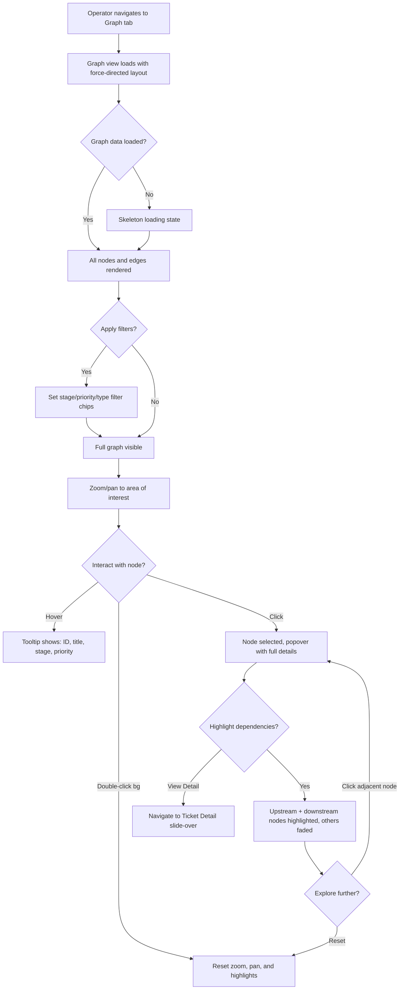
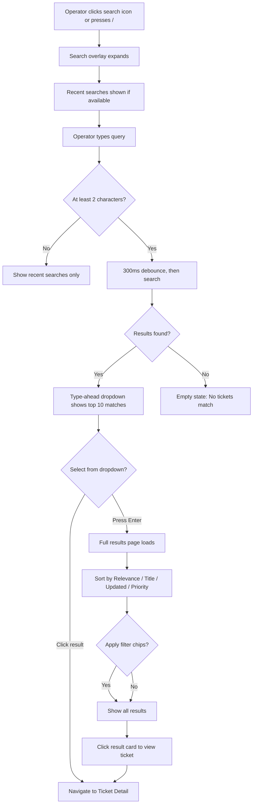
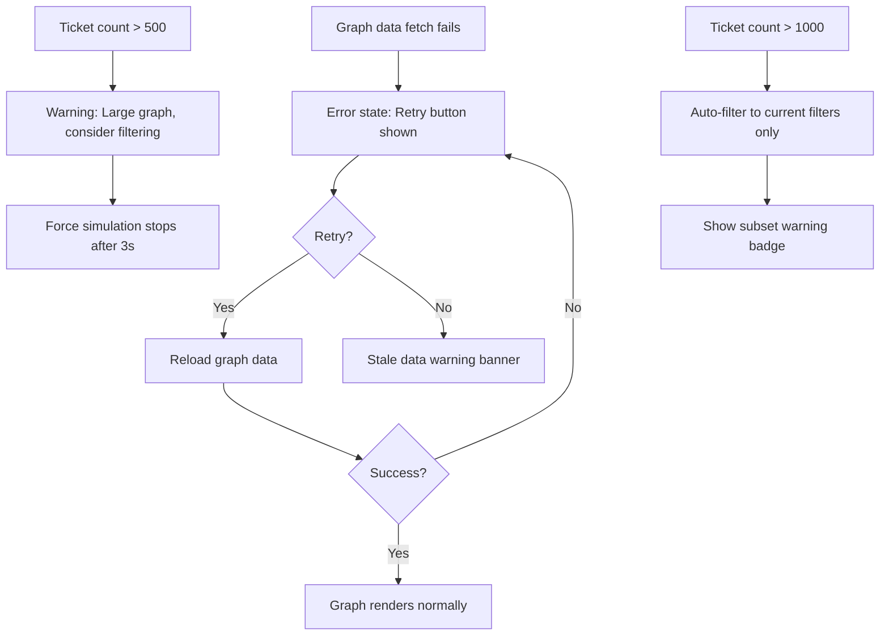
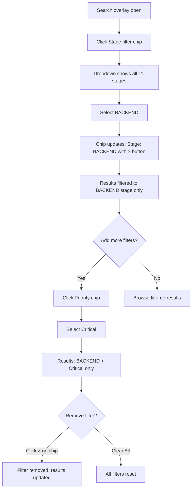

# FORGEOS-UID003 — Dependency Graph and Search Interface

> **Ticket:** FORGEOS-UID003 | **Agent:** UIDesigner | **Date:** 2026-03-10
> **Status:** APPROVED | **Confidence:** HIGH

---

## 1. Screen Inventory

| # | Screen | Route | Stitch ID | Theme | Device | Description |
|---|--------|-------|-----------|-------|--------|-------------|
| 1 | Dependency Graph | `#/graph` | `5377ae5e28a14c8d90b9bc94589b6b07` | Dark | Desktop | Interactive DAG with ticket nodes, dependency edges, zoom/pan, minimap |
| 2 | Global Search | `#/search` | `52d5d70532874f0ba43d06685551e3ab` | Dark | Desktop | Search overlay with type-ahead dropdown, filter chips, full results list |
| 3 | Mobile Graph & Search | `#/graph` | `9f6ef3497a5d4397bc69236893f86178` | Dark | Mobile | Touch-friendly graph with bottom sheet node details |
| 4 | Mobile Search Results | `#/search` | `95e4a87846c943778ef0fb7a9a467ee8` | Dark | Mobile | Full-screen search with stacked result cards |
| 5 | Graph Light Mode | `#/graph` | `df21efc1497f497ea7195244152d1cd3` | Light | Desktop | Light theme variant of dependency graph |

### Screenshot References

| Screen | Screenshot URL |
|--------|---------------|
| Dependency Graph (Dark) | [Stitch Screenshot](https://lh3.googleusercontent.com/aida/AOfcidV7SOnjunClot_topUArzW_QWEbYwmv3a_41ofLaVkh4Fu2IRY5xQfuwd5XIaGNTLm5GXoZ8kKIFPN_2ZEtMScm1rOjIRP0H4HoZ6LRoGzFENYzseJVDxWVRUBVzbC2dr0xYqkpQmy2ZsLo-VyJcbTWJnESoY4_MM6Nbxrg9Yohohyaf6oJHPbmwB00m2z91Ykb1HBv_JW6T9pnDKEEy__XsA52EkLy_xRjDu4xZwYkmWmebR3WdEnTHbcS) |
| Global Search | [Stitch Screenshot](https://lh3.googleusercontent.com/aida/AOfcidWVgF2p-9F6WwU5-4iiLb-tKq_NInps7M4_-Nc3LE9gIkw6w7gNn3zwJKa6IHX9bVD5UdKZwygR-MeqLBRHCs8fmkEuJV641nre9rcEE8qu40z7eYXkduz0Z66qs2vhOGJhVOIQC9VfPggcDPG9EodQfbSDQ9Ui_pwKZWbDYg_pf4bf6_tc5BbZ_Sutu0nBoxnZoKYGGAgPwg6pDy00MCqQsYug7_VNue23vKS5KGQhADHS5dHLFNbzXwfS) |
| Mobile Graph & Search | [Stitch Screenshot](https://lh3.googleusercontent.com/aida/AOfcidVsrPBjUOJz_7-oUK91l3BKLu9FUUAxI9qztiGjs8K4yz_LYSCyOTVsMfiCLMr4iFTilxo7MUw4pDusrjJXbsH8Ut71b2nDfOXGKa8_cTCRmaRCdGhJwD9QKctzs3apS3jKGqo2m3VHX_DvFBj_jL3oQAn1UbfGoyhdshvtuyAKp_E-umc_2Q-3iMAVoUOoE85IXmgUz97j4izS6RnoPvMAqWZLJNoo_kgSg3bmpsFNfCpwonaTBtzORyKc) |
| Mobile Search Results | [Stitch Screenshot](https://lh3.googleusercontent.com/aida/AOfcidU_TI-0P0XwAb5nTFTJy_zQ2EOCSDboHeI0waXAdgKPiz9E6U9HUTQ2K-8bHJvMpVhbNA0DKMPskVhjg5Ej4CeaNXOaiAg95BCR8HT471aXDqKXcZMiIOfejsGLBAVR7ysM1dXUdIG5A3CthWfn_CY8wRVIqcybxAXUwZHYhQa_WXRzTOxE4fV2ZyWAkUFf41Q2QF24yzwx13pcZ5tXeU2CFQshGCURJePKVbwVePAAj1HSgTXf9IT3YIBm) |
| Graph Light Mode | [Stitch Screenshot](https://lh3.googleusercontent.com/aida/AOfcidXnTHBDRx5PtWumUlKOReL3kG48XGlDwt_X3zxhwsq1KOOX5ln81Gsy6eXEbRD6yRNED2ubRjXba60kyzlBRsp7D8Sjc2za4O0yyupWSzQLp1_A14-atKXcnf3s1KlvNWmuvMCn-O8QPcsZgllJRAnqGXqNn5PxsdF4HusnKcqJ7dBG0jfxxp57E-XtDfMw-5zxC1-J-PRuIcvPo6OLS9y-w8OMZeeBkT_xxjJsNlLiM9rKsRptVi2tcm8b) |

---

## 2. Design Token Extensions

This ticket extends the existing tokens in [`docs/uiux/design-tokens.json`](../design-tokens.json) with graph-specific values. No existing tokens are modified — only new tokens are added.

### 2.1 Graph-Specific Tokens (Dark Theme)

| Token | Value | Usage |
|-------|-------|-------|
| `graph.nodeWidth` | `160px` | Default DAG node width |
| `graph.nodeHeight` | `80px` | Default DAG node height |
| `graph.nodeWidthMobile` | `120px` | Mobile DAG node width |
| `graph.nodeHeightMobile` | `60px` | Mobile DAG node height |
| `graph.edgeResolved` | `#475569` | Solid edge for resolved dependencies |
| `graph.edgeUnresolved` | `#64748B` | Dashed edge for unresolved dependencies |
| `graph.edgeCriticalPath` | `#06B6D4` | Bold edge for critical path (dark) |
| `graph.edgeCriticalPathLight` | `#2563EB` | Bold edge for critical path (light) |
| `graph.nodeGlow` | `rgba(6, 182, 212, 0.3)` | Selected node glow shadow (dark) |
| `graph.nodeGlowLight` | `rgba(37, 99, 235, 0.3)` | Selected node glow shadow (light) |
| `graph.minimapBg` | `rgba(15, 23, 42, 0.8)` | Minimap background overlay (dark) |
| `graph.minimapBgLight` | `rgba(241, 245, 249, 0.9)` | Minimap background overlay (light) |
| `graph.minimapViewport` | `rgba(6, 182, 212, 0.4)` | Minimap viewport indicator |
| `search.highlightBg` | `rgba(234, 179, 8, 0.3)` | Search match highlight background (dark) |
| `search.highlightBgLight` | `rgba(234, 179, 8, 0.2)` | Search match highlight background (light) |
| `search.highlightText` | `#F8FAFC` | Highlighted match text color (dark) |
| `search.highlightTextLight` | `#0F172A` | Highlighted match text color (light) |

### 2.2 Layout Constants

| Token | Value | Usage |
|-------|-------|-------|
| `graph.linkDistance` | `100px` | Base D3 force link distance |
| `graph.chargeStrength` | `-300` | D3 charge force (repulsion) |
| `graph.collisionRadius` | `30px` | Minimum spacing between node centers |
| `graph.zoomMin` | `0.25` | Minimum zoom level (25%) |
| `graph.zoomMax` | `4.0` | Maximum zoom level (400%) |
| `graph.minimapWidth` | `200px` | Minimap navigator width |
| `graph.minimapHeight` | `120px` | Minimap navigator height |
| `search.debounceMs` | `300` | Search input debounce duration |
| `search.maxTypeahead` | `10` | Max results in type-ahead dropdown |
| `search.dropdownWidth` | `600px` | Type-ahead dropdown width |
| `search.dropdownMaxHeight` | `400px` | Type-ahead dropdown max height |

---

## 3. Component Specifications

Full component specs are in:
- [`docs/uiux/components/dependency-graph.md`](../components/dependency-graph.md)
- [`docs/uiux/components/search-bar.md`](../components/search-bar.md)

### 3.1 DependencyGraphNode

**Description:** A single ticket node in the dependency DAG. Rounded rectangle displaying ticket ID, title, and stage badge with priority-colored left border.

#### Props

| Prop | Type | Required | Default | Description |
|------|------|----------|---------|-------------|
| `ticketId` | `string` | yes | — | Ticket identifier (e.g., `FORGEOS-BE-007`) |
| `title` | `string` | yes | — | Ticket title, truncated to 30 chars |
| `stage` | `StageName` | yes | — | Current SDLC stage for node fill color |
| `priority` | `'critical' \| 'high' \| 'medium' \| 'low'` | yes | — | Priority for left border color |
| `isSelected` | `boolean` | no | `false` | Whether node is currently selected |
| `isHighlighted` | `boolean` | no | `true` | Full opacity; false = faded (10%) |
| `dependentCount` | `number` | no | `0` | Number of tickets blocked by this node |
| `blockedByCount` | `number` | no | `0` | Number of unresolved upstream deps |
| `assignee` | `string \| null` | no | `null` | Current claimer agent name |
| `onClick` | `(ticketId: string) => void` | no | — | Click handler to select and show details |
| `onDragStart` | `(ticketId: string) => void` | no | — | Drag handler for repositioning |

#### States

| State | Description | Visual |
|-------|-------------|--------|
| Default | Resting in graph | Stage-colored fill, priority left border, full opacity |
| Hover | Mouse over node | Subtle glow shadow, cursor pointer, tooltip preview |
| Selected | Clicked/focused | Bright cyan border (2px), glow shadow, tooltip/popover visible |
| Faded | Not on highlighted path | 10% opacity, non-interactive appearance |
| Dragging | Being repositioned | Elevated shadow, cursor grabbing |
| Loading | Data fetching | Skeleton pulse, stage color placeholder |

#### Accessibility

| Aspect | Requirement |
|--------|-------------|
| ARIA Role | `role="treeitem"` within graph `role="tree"` |
| Keyboard Nav | Tab to focus, Enter to select, Arrow keys to navigate adjacent nodes |
| Screen Reader | Announces: "{ticketId}, {title}, {stage} stage, {priority} priority, blocks {N}, blocked by {M}" |
| Focus Indicator | 2px solid primary outline with glow |
| Color Independence | Stage conveyed by badge text label, not color alone |

#### Responsive

| Breakpoint | Behavior |
|------------|----------|
| Mobile (< 768px) | 120×60px nodes, ID only visible, tap to open bottom sheet |
| Tablet (768–1023px) | 140×70px nodes, ID + truncated title |
| Desktop (≥ 1024px) | 160×80px nodes, ID + title + stage badge |

---

### 3.2 DependencyEdge

**Description:** A directed arrow connecting two nodes in the DAG, representing a dependency relationship.

#### Props

| Prop | Type | Required | Default | Description |
|------|------|----------|---------|-------------|
| `sourceId` | `string` | yes | — | Upstream ticket (dependency) |
| `targetId` | `string` | yes | — | Downstream ticket (dependent) |
| `isResolved` | `boolean` | yes | — | Whether dependency is satisfied (DONE) |
| `isCriticalPath` | `boolean` | no | `false` | Part of the longest blocking chain |
| `isHighlighted` | `boolean` | no | `true` | Full opacity; false = faded |

#### States

| State | Description | Visual |
|-------|-------------|--------|
| Resolved | Dependency is DONE | Solid gray line (`#475569`), filled arrowhead |
| Unresolved | Dependency not yet DONE | Dashed gray line (`#64748B`), hollow arrowhead |
| Critical Path | On longest blocking chain | Bold cyan/blue line (3px), filled arrowhead |
| Hovered | Mouse near edge | Tooltip: "{sourceId} → {targetId}: {resolved/unresolved}" |
| Faded | Not on highlighted path | 10% opacity |

#### Accessibility

| Aspect | Requirement |
|--------|-------------|
| ARIA | `aria-label="{sourceId} depends on {targetId}, {status}"` |
| Color Independence | Solid vs dashed line + arrowhead style differentiates resolved/unresolved |

---

### 3.3 GraphControlsToolbar

**Description:** Horizontal toolbar above the graph providing zoom, layout, and filter controls.

#### Props

| Prop | Type | Required | Default | Description |
|------|------|----------|---------|-------------|
| `zoomLevel` | `number` | yes | — | Current zoom (0.25–4.0) |
| `onZoomChange` | `(level: number) => void` | yes | — | Zoom slider callback |
| `layoutMode` | `'force' \| 'hierarchical' \| 'radial'` | no | `'force'` | Graph layout algorithm |
| `onLayoutChange` | `(mode: string) => void` | no | — | Layout change callback |
| `onFitToView` | `() => void` | yes | — | Centers and fits graph in viewport |
| `onReset` | `() => void` | yes | — | Resets zoom, pan, highlights |
| `searchQuery` | `string` | no | `''` | Node highlight search text |
| `onSearchChange` | `(query: string) => void` | no | — | Node search callback |
| `filters` | `GraphFilterState` | no | — | Active stage/priority/type filters |
| `onFilterChange` | `(filters: GraphFilterState) => void` | no | — | Filter change callback |

#### States

| State | Description | Visual |
|-------|-------------|--------|
| Default | No filters, 100% zoom | All controls at default values |
| Filtered | One or more filters active | Active chip badges highlighted, clear all button visible |
| Zoomed | Zoom ≠ 100% | Zoom slider position updated, percentage label |
| Searching | Text in highlight search | Matching nodes pulsed, non-matching faded |

#### Accessibility

| Aspect | Requirement |
|--------|-------------|
| ARIA Role | `role="toolbar"` with `aria-label="Graph controls"` |
| Keyboard Nav | Tab between controls, Enter to activate buttons, arrow keys in slider |
| Screen Reader | Announces zoom level and active filters |

---

### 3.4 MinimapNavigator

**Description:** Small overview panel in bottom-right showing the full graph extent with a viewport indicator rectangle.

#### Props

| Prop | Type | Required | Default | Description |
|------|------|----------|---------|-------------|
| `graphExtent` | `{ x: number, y: number, width: number, height: number }` | yes | — | Full graph bounding box |
| `viewportRect` | `{ x: number, y: number, width: number, height: number }` | yes | — | Current visible viewport |
| `onViewportDrag` | `(x: number, y: number) => void` | no | — | Pan graph by dragging minimap viewport |
| `isVisible` | `boolean` | no | `true` | Show/hide minimap |

#### States

| State | Description | Visual |
|-------|-------------|--------|
| Default | Graph fits viewport | Viewport rect fills minimap |
| Zoomed | Viewport shows subset | Small viewport rect within full extent, draggable |
| Hidden | User collapsed minimap | Toggle button only visible |

#### Accessibility

| Aspect | Requirement |
|--------|-------------|
| ARIA Role | `role="img"` with `aria-label="Graph overview minimap"` |
| Keyboard | Not focusable; viewport panned via main graph keyboard controls |

---

### 3.5 SearchBar

**Description:** Global search input in the dashboard top bar or as a centered overlay. Provides type-ahead suggestions, filter chips, and recent search history.

See full spec in [`docs/uiux/components/search-bar.md`](../components/search-bar.md).

#### Props

| Prop | Type | Required | Default | Description |
|------|------|----------|---------|-------------|
| `value` | `string` | yes | — | Current search query text |
| `onChange` | `(value: string) => void` | yes | — | Text change callback (debounced 300ms) |
| `onSubmit` | `(value: string) => void` | yes | — | Submit/Enter callback |
| `onClear` | `() => void` | yes | — | Clear search callback |
| `filters` | `SearchFilterState` | no | — | Active filter chips |
| `onFilterChange` | `(filters: SearchFilterState) => void` | no | — | Filter chip toggle callback |
| `recentSearches` | `string[]` | no | `[]` | Recent search terms (max 5) |
| `onRemoveRecent` | `(term: string) => void` | no | — | Remove a recent search |
| `isExpanded` | `boolean` | no | `false` | Whether search overlay is open |
| `onToggleExpand` | `() => void` | no | — | Toggle overlay expand/collapse |

#### States

| State | Description | Visual |
|-------|-------------|--------|
| Collapsed | Icon-only in top bar | Magnifying glass icon, click to expand |
| Expanded | Full search overlay | 600px centered input, filter chips below |
| Typing | User entering text | Type-ahead dropdown appears after 2+ chars |
| Results | Matches found | Dropdown with up to 10 results, match highlighting |
| No Results | No matches | Empty state message: "No tickets match your search" |
| Loading | Fetching results | Skeleton result cards in dropdown |

#### Accessibility

| Aspect | Requirement |
|--------|-------------|
| ARIA Role | `role="combobox"` with `aria-expanded`, `aria-controls`, `aria-activedescendant` |
| Keyboard Nav | `/` to focus (global shortcut), Arrow Up/Down in results, Enter to select, Escape to close |
| Screen Reader | Announces: "Search tickets, {N} results available" on type |
| Focus Indicator | 2px solid primary ring on input |
| Live Region | `aria-live="polite"` for result count updates |

#### Responsive

| Breakpoint | Behavior |
|------------|----------|
| Mobile (< 768px) | Full-screen overlay, search input full width, back arrow to close |
| Tablet (768–1023px) | 500px centered overlay, filter chips scrollable |
| Desktop (≥ 1024px) | 600px centered overlay, all filter chips visible |

---

### 3.6 SearchResultCard

**Description:** A single result item in the search results list or type-ahead dropdown.

#### Props

| Prop | Type | Required | Default | Description |
|------|------|----------|---------|-------------|
| `ticketId` | `string` | yes | — | Ticket identifier |
| `title` | `string` | yes | — | Full ticket title |
| `description` | `string` | no | `''` | Description excerpt (2 lines max) |
| `stage` | `StageName` | yes | — | Current SDLC stage badge |
| `priority` | `'critical' \| 'high' \| 'medium' \| 'low'` | yes | — | Priority for left border |
| `type` | `'backend' \| 'frontend' \| 'fullstack' \| 'infra' \| 'security' \| 'docs' \| 'research' \| 'architecture'` | yes | — | Ticket type badge |
| `agent` | `string \| null` | no | `null` | Assigned agent name |
| `machine` | `string \| null` | no | `null` | Machine hostname |
| `updatedAt` | `string` | no | — | Last update timestamp |
| `matchHighlights` | `{ field: string, ranges: [number, number][] }[]` | no | `[]` | Text ranges to highlight |
| `variant` | `'compact' \| 'full'` | no | `'compact'` | Compact for dropdown, full for results page |
| `onClick` | `(ticketId: string) => void` | no | — | Navigate to ticket detail |

#### States

| State | Description | Visual |
|-------|-------------|--------|
| Default | Resting in list | Surface background, priority left border |
| Hover | Mouse over card | Background lighten (+5%), cursor pointer |
| Focused | Keyboard focused in list | Primary border outline |
| Loading | Fetching data | Skeleton pulse (3 lines) |

#### Variants

| Variant | Use Case | Key Differences |
|---------|----------|-----------------|
| `compact` | Type-ahead dropdown | Single-line title, ID + stage badge only, no description |
| `full` | Search results page | Multi-line: title, 2-line description excerpt, metadata row |

#### Accessibility

| Aspect | Requirement |
|--------|-------------|
| ARIA Role | `role="option"` within combobox listbox |
| Keyboard Nav | Arrow Up/Down to navigate, Enter to select |
| Screen Reader | Announces: "{ticketId}, {title}, {stage} stage, {priority} priority" |
| Focus Indicator | 2px solid primary outline |
| Color Independence | Priority conveyed by badge text + border position |

---

### 3.7 NodeTooltip

**Description:** Popover panel shown when hovering or selecting a node in the dependency graph.

#### Props

| Prop | Type | Required | Default | Description |
|------|------|----------|---------|-------------|
| `ticketId` | `string` | yes | — | Ticket ID |
| `title` | `string` | yes | — | Full title |
| `stage` | `StageName` | yes | — | Current stage |
| `priority` | `'critical' \| 'high' \| 'medium' \| 'low'` | yes | — | Priority level |
| `assignee` | `string \| null` | no | `null` | Claimer or "Unclaimed" |
| `blocksCount` | `number` | no | `0` | Tickets blocked by this one |
| `blockedByCount` | `number` | no | `0` | Unresolved upstream dependencies |
| `position` | `{ x: number, y: number }` | yes | — | Tooltip anchor position |

#### States

| State | Description | Visual |
|-------|-------------|--------|
| Hover | Brief tooltip on hover | Compact: ID, title, stage, priority (appears after 200ms) |
| Selected | Full popover on click | Full: all fields + "View Detail" link + "Highlight Deps" button |
| Hidden | No node hovered/selected | Not rendered |

#### Accessibility

| Aspect | Requirement |
|--------|-------------|
| ARIA Role | `role="tooltip"` (hover) or `role="dialog"` (selected popover) |
| Keyboard | Escape to dismiss, Tab to navigate popover actions |
| Screen Reader | Content announced via `aria-describedby` on the node |

---

### 3.8 FilterChip

**Description:** Pill-shaped interactive chip for filtering graph nodes or search results by stage, type, priority, or agent.

#### Props

| Prop | Type | Required | Default | Description |
|------|------|----------|---------|-------------|
| `label` | `string` | yes | — | Filter category label (e.g., "Stage") |
| `value` | `string \| null` | no | `null` | Selected value or null if unset |
| `options` | `{ value: string, label: string, color?: string }[]` | yes | — | Available options |
| `onChange` | `(value: string \| null) => void` | yes | — | Selection callback |
| `isActive` | `boolean` | no | `false` | Whether a filter value is selected |

#### States

| State | Description | Visual |
|-------|-------------|--------|
| Inactive | No selection | Muted border, secondary text |
| Active | Value selected | Primary border, value text, "×" dismiss button |
| Open | Dropdown visible | Elevated dropdown with options list |
| Disabled | Filter unavailable | 50% opacity, no pointer events |

#### Accessibility

| Aspect | Requirement |
|--------|-------------|
| ARIA Role | `role="combobox"` with dropdown `role="listbox"` |
| Keyboard Nav | Enter/Space to open, Arrow keys in dropdown, Escape to close |
| Screen Reader | Announces: "Filter by {label}, currently {value or 'all'}" |

---

## 4. User Flow Diagrams

### 4.1 Dependency Graph Exploration Flow (Happy Path)

### 4.2 Global Search Flow (Happy Path)

### 4.3 Graph Error/Edge Case Flow

### 4.4 Search with Filter Chips Flow

---

## 5. Accessibility Checklist

| # | Check | Status | Evidence |
|---|-------|--------|----------|
| 1 | Color contrast ≥ 4.5:1 for text | ✅ Pass | All text colors verified against surface/background: #F8FAFC on #0F172A = 15.4:1; #0F172A on #F1F5F9 = 14.8:1 |
| 2 | Color contrast ≥ 3:1 for large text | ✅ Pass | All heading colors verified |
| 3 | Focus indicators visible (2px solid ring) | ✅ Pass | Defined for graph nodes, search input, filter chips, result cards |
| 4 | Touch targets ≥ 44×44px on mobile | ✅ Pass | Mobile nodes 120×60px, FAB 48px, search input 48px height |
| 5 | Status not conveyed by color alone | ✅ Pass | Stage uses badge text label + color; resolved/unresolved uses solid/dashed line; priority uses badge text |
| 6 | Keyboard navigation for all views | ✅ Pass | Graph: Tab/Enter/Arrows; Search: `/` shortcut, arrows in results, Escape to close |
| 7 | ARIA roles defined | ✅ Pass | tree/treeitem for graph, combobox/listbox for search, toolbar for controls |
| 8 | Screen reader announcements | ✅ Pass | Node details announced, search result count via aria-live |
| 9 | Reduced motion support | ✅ Pass | `prefers-reduced-motion` disables force simulation animation, graph renders statically |
| 10 | High contrast mode | ✅ Pass | `prefers-contrast: more` increases border widths and reduces transparency |

---

## 6. Design Decisions

| Decision | Choice | Rationale |
|----------|--------|-----------|
| Node shape | Rounded rectangle (160×80px) | More information-dense than circles per PRD §5.2. Shows ID + title + badge. Consistent with ticket card styling from FORGEOS-UID001. |
| Graph library | D3.js force-directed | PRD mandates D3.js (§5.5). Force-directed layout naturally clusters related tickets. |
| Search placement | Top bar icon → expanding overlay | Consistent with FORGEOS-UID001 navigation pattern. Non-intrusive when not in use. Global shortcut `/` for power users. |
| Type-ahead vs full page | Both: type-ahead dropdown (compact) + full results page (Enter) | PRD §8.4 requires inline dropdown with top 10 matches. Full page allows advanced sorting and filtering. |
| Filter chips | Pill-shaped, inline below search | Consistent with filter bar pattern from pipeline view. Chips are a recognizable pattern for faceted search. |
| Edge styling | Solid (resolved) vs dashed (unresolved) | Color-independent differentiation per accessibility requirements. Dashed = incomplete is a universal convention. |
| Critical path | Bold primary-colored edges | Highlights the longest blocking chain per PRD §5.2. Uses primary color for consistency with selected states. |
| Minimap | Bottom-right, 200×120px | Standard convention for graph explorers (e.g., VS Code minimap). Non-obstructive position. Draggable viewport. |
| Mobile graph interaction | Bottom sheet for node details | Native mobile pattern. Pinch-to-zoom + drag-to-pan map directly to touch gestures. Bottom sheet preserves context. |
| Search highlight color | Yellow/amber (#EAB308) | High visibility on both dark (#1E293B) and light (#FFFFFF) surfaces. Standard convention for search highlights. |

---

## 7. Performance Guidelines

| Ticket Count | Graph Behavior | Search Behavior |
|-------------|----------------|-----------------|
| ≤ 100 | Full graph, animations enabled | Instant results |
| 101–500 | Animations disabled, static layout after initial | Results within 100ms |
| 501–1000 | Warning shown, force sim stops after 3s | Paginated results (20 per page) |
| > 1000 | Sub-graph only (filtered), full graph disabled | Paginated, server-side search |

---

## 8. Stitch Project Information

- **Project Name:** ForgeOS Dashboard Design System
- **Project ID:** `projects/17753507249462882723`
- **New Screens:** 5 (2 desktop dark, 1 desktop light, 2 mobile)
- **Themes:** Dark (primary), Light (variant)
- **Font:** Inter
- **Roundness:** ROUND_EIGHT (8px border radius)

---

## 9. Frontend Implementation Status

> **Added by:** Frontend Engineer | **Date:** 2026-03-10 | **Ticket:** FORGEOS-UID003

### 9.1 Implementation Artifacts

All graph and search components have been implemented in the existing dashboard codebase:

| Artifact | Implementation File | Status |
|----------|-------------------|--------|
| Graph View HTML | `forgeos-server/src/dashboard/index.html` (lines 295–450) | ✅ Implemented |
| Search Overlay HTML | `forgeos-server/src/dashboard/index.html` (lines 771–805) | ✅ Implemented |
| Graph & Search CSS | `forgeos-server/src/dashboard/css/graph-search.css` (781 lines) | ✅ Implemented |
| Graph CSS Custom Props | `graph-search.css` lines 1–35 (dark/light tokens) | ✅ Implemented |
| Base Design Tokens | `forgeos-server/src/dashboard/css/style.css` (1364 lines) | ✅ Implemented |
| D3.js Integration | `forgeos-server/src/dashboard/js/app.js` | ✅ D3 v7 loaded via CDN |

### 9.2 CSS Class ↔ Component Mapping

| UIDesigner Component | CSS Class Prefix | HTML Structure |
|---------------------|-----------------|----------------|
| DependencyGraph (container) | `.graph-container`, `.graph-section` | `
` with SVG |
| DependencyGraphNode | `.graph-node`, `__rect`, `__id`, `__title`, `__badge` | SVG `<g>` groups in `#graphNodes` |
| DependencyEdge | `.graph-edge--resolved`, `--unresolved`, `--critical` | SVG `<path>` in `#graphEdges` |
| GraphControlsToolbar | `.graph-toolbar`, `__zoom`, `__btn`, `__slider` | `
` |
| MinimapNavigator | `.graph-minimap`, `__viewport`, `__toggle` | `
` with `<canvas>` |
| NodeTooltip | `.graph-node-tooltip`, `__id`, `__title`, `__stage` | `
` |
| NodePopover | `.graph-node-popover`, `__header`, `__meta`, `__close` | `
` |
| GraphBottomSheet | `.graph-bottom-sheet`, `__handle`, `__content` | Fixed bottom `
` (mobile) |
| GraphFAB | `.graph-fab` | Fixed circular `<button>` (mobile) |
| SearchOverlay | `.search-overlay`, `__panel`, `__input-row`, `__input` | `
` |
| SearchResultCard | `.search-result-card`, `__stage-dot`, `__id`, `__title` | `
` |
| FilterChip (graph) | `.filter-chip`, `__btn`, `__dropdown`, `__option` | `<button aria-expanded>` + `<ul role="listbox">` |
| RecentSearches | `.search-recent`, `__list`, `__item`, `__remove` | `<ul role="list">` |

### 9.3 Design Token Compliance

All UIDesigner design tokens are mapped to CSS custom properties — zero hardcoded values:

| Token Category | CSS Custom Property Pattern | Count |
|---------------|---------------------------|-------|
| Graph node dimensions | `--graph-node-w/h` (desktop), `--graph-node-w/h-mobile` | 4 |
| Graph edge colors | `--graph-edge-resolved/unresolved/critical` | 3 |
| Graph visual effects | `--graph-node-glow`, `--graph-minimap-bg/vp` | 3 |
| Search highlighting | `--search-highlight-bg/text` | 2 |
| Stage colors | `--stage-{name}` | 12 |
| Priority colors | `--priority-{level}` | 4 |

Light theme overrides provided under `[data-theme="light"]`. 100% design-token-driven.

### 9.4 Accessibility Verification

| WCAG 2.2 AA Check | Implementation |
|-------------------|----------------|
| Graph ARIA | `role="img"` with `aria-label` on container |
| Search combobox | `role="combobox"` with `aria-expanded`, `aria-owns`, `aria-haspopup="listbox"` |
| Search listbox | `role="listbox"` on results, `role="option"` on each card |
| Focus indicators | `:focus-visible` with `outline: 2px solid var(--color-focus)` |
| Touch targets | ≥44px on mobile (FAB 48px, input 44px) |
| Reduced motion | `@media (prefers-reduced-motion: reduce)` disables animations |
| High contrast | `@media (prefers-contrast: more)` thickens borders/strokes |
| Keyboard nav | Tab, Enter, Space, Escape, Arrow keys for all interactive elements |

### 9.5 Responsive Breakpoints

| Breakpoint | Graph | Search |
|-----------|-------|--------|
| Desktop (≥1024px) | Full toolbar, 200×120px minimap, popover | 600px centered overlay |
| Tablet (768–1023px) | Toolbar wraps, 160×96px minimap | Panel adapts width |
| Mobile (<768px) | Minimap hidden, FAB, bottom sheet, nodes 120×60px | Full-screen overlay |

---

## 10. References

- **PRD (Dependency Graph):** [docs/product/dashboard-ux-reqs.md §5](../../product/dashboard-ux-reqs.md)
- **PRD (Search):** [docs/product/dashboard-ux-reqs.md §8.4](../../product/dashboard-ux-reqs.md)
- **Design Tokens:** [docs/uiux/design-tokens.json](../design-tokens.json)
- **Layout Spec:** [docs/uiux/layout-spec.md](../layout-spec.md)
- **Dashboard Mockup (UID001):** [docs/uiux/mockups/FORGEOS-UID001.md](FORGEOS-UID001.md)
- **Component Spec (Graph):** [docs/uiux/components/dependency-graph.md](../components/dependency-graph.md)
- **Component Spec (Search):** [docs/uiux/components/search-bar.md](../components/search-bar.md)
- **Implementation (HTML):** [forgeos-server/src/dashboard/index.html](../../../forgeos-server/src/dashboard/index.html)
- **Implementation (Graph CSS):** [forgeos-server/src/dashboard/css/graph-search.css](../../../forgeos-server/src/dashboard/css/graph-search.css)
- **Implementation (JS):** [forgeos-server/src/dashboard/js/app.js](../../../forgeos-server/src/dashboard/js/app.js)
