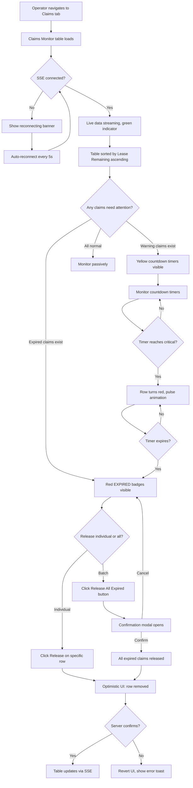
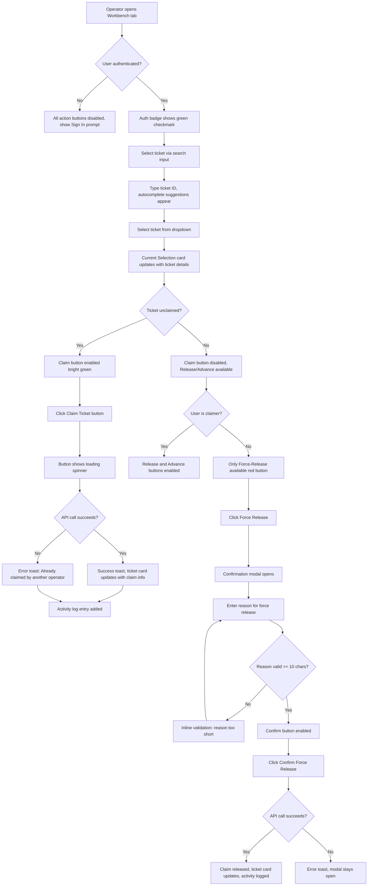
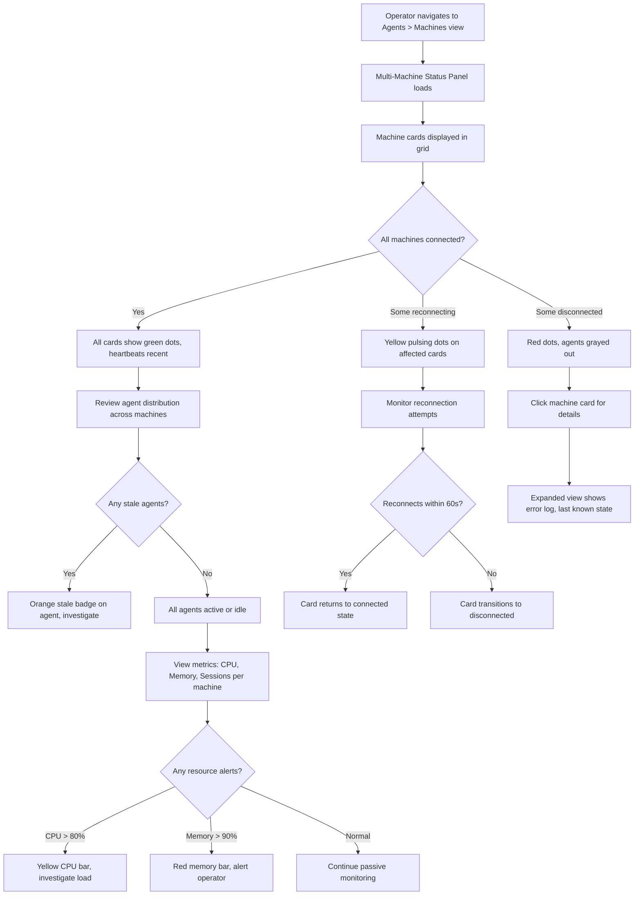
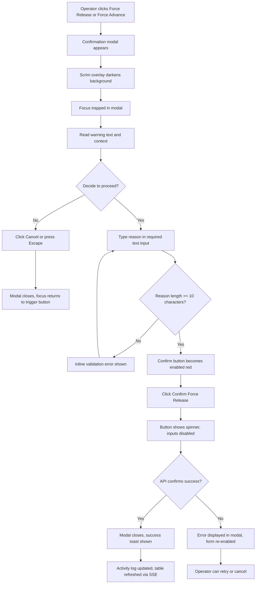

# FORGEOS-UID004 — Operator Workbench and Claims Monitor

> **Ticket:** FORGEOS-UID004 | **Agent:** UIDesigner | **Date:** 2026-03-10
> **Status:** APPROVED | **Confidence:** HIGH

---

## 1. Screen Inventory

| # | Screen | Route | Stitch ID | Theme | Device | Description |
|---|--------|-------|-----------|-------|--------|-------------|
| 1 | Claims Monitor | `#/claims` | `9e4a24776e5b4e4ab772c5510b337f90` | Dark | Desktop | Sortable table of active claims with lease countdown timers, warning/critical/expired states |
| 2 | Operator Workbench | `#/workbench` | `42f5d489a5a44b05bacab853efccf12d` | Dark | Desktop | Authenticated action center with Claim/Release/Advance/Force-Release buttons and ticket selector |
| 3 | Confirmation Modal | overlay | `0375050fc8df480ebb18b3eeffd15663` | Dark | Desktop | Destructive action confirmation dialog with reason input and explicit confirm |
| 4 | Multi-Machine Status | `#/agents/machines` | `90ccf28a6d444d7ba1780b9116050209` | Dark | Desktop | Machine cards with hostname, status, active agents, heartbeat |

### Screenshot References

| Screen | Screenshot URL |
|--------|---------------|
| Claims Monitor | [Stitch Screenshot](https://lh3.googleusercontent.com/aida/AOfcidXmvm0LyTF16nuY3Ag5C9A_bMd9c-znGFoJ-vDwRxrTMpYKBM50nmbC2ZgZbH2nQEO1WXASKCRPwv2H1SLxmfvyh5VtEJ-5uasrFOJhYDzXBHh-D8vq9dngXyn4n-rviC-DlfKGGMBGMgAV_J2Akv6PY7c9I1oM3KXVB3Wx3kEIyeQ-SQaf94jk0-GRdxR6Ni6_iHKCKQdhYokib5bPlLhLqluWo5ajYXqV7NDzeYQM1gnK0L3Yv7Pl2wo) |
| Operator Workbench | [Stitch Screenshot](https://lh3.googleusercontent.com/aida/AOfcidUR1NqgPjQQgCSWwn-X5945fIzyCMxa0qjL6sIMN4tQZaBCmoaH5Ypn4fuPoArwL8x2-njA1HoVPGELFcSQ2D9ASCdW-sEQiGg1hJrAKm2bEVXHRUaJsgDh3QYGZ__PTHVX8Q7ZHwjIvM6ARYqlwD9PlyCZczWRcsez2SWUqvaU3mxrlcZvkelv0muhYjTSEW57E5D8BNHNRw-yJUfbqbXCfhkH0JTW-MoNX2d3GBiCJgCCMPT1XeGP5qEm) |
| Confirmation Modal | [Stitch Screenshot](https://lh3.googleusercontent.com/aida/AOfcidVkKHPl3YLIHXyfeHaow6rIqDCcLkV2zxeor8HKBIzHrhmQ4885mdA2JJMy3Udp-V_xIxxme9XEqCjbR0obvDSZZut1Hev75dWvL_Kfak9IrkKE2HNS_Mi6i5Ry3a6J8wxwom3MHMROAgLqXet2WwZnYjINXfjZrDu-NbWLwpHfFhuTh9jXa4fdF11S5DhH2EqadFNNd6VX-1iMeJpc7w_WrS5xp9mEhAIWl-UHvqc9dkc81ZxEktyqQS-7) |
| Multi-Machine Status | [Stitch Screenshot](https://lh3.googleusercontent.com/aida/AOfcidWi2K6dxnPG2LY6kcVhppI3X1jP2uDh3mDVfZUFfnRQZGRm-oMzLZuaeAeKdXZJUwVJQVFXAQS-NtCuG-_HWZLMZLobg0hs664bBfdO1kZxCLDds-30rNfNfvawNrfru7iPw2LJ0JfpcktchHbHtzvWUBBxc2K_scbrFFXXYFCWdWkgfIeCNSX-TEhHxvJIfS84VR_4UuSMcvuRUgny8B5R65JK_gx2KfuVig0cl4xc4_EYF9d3TQ1XzbRQ) |

---

## 2. Design Token References

All design tokens defined in [`docs/uiux/design-tokens.json`](../design-tokens.json) from FORGEOS-UID001.
This ticket extends usage but does **not** modify existing tokens.

### New Token Usage Mapping

| Token | Usage in This Ticket |
|-------|---------------------|
| `error` (#EF4444 dark / #DC2626 light) | Force-Release button, expired claim rows, critical countdown |
| `warning` (#EAB308 dark / #D97706 light) | Countdown <5min warning state, reconnecting machine dot |
| `success` (#16A34A dark / #16A34A light) | Claim button, active claim countdown, connected machine dot |
| `info` (#3B82F6 dark / #2563EB light) | Advance Stage button |
| `priority.high` (#F97316 dark / #EA580C light) | Release Claim button |
| `scrim` (rgba(15,23,42,0.6)) | Modal overlay backdrop |
| `errorMuted` (#7F1D1D dark / #FEE2E2 light) | Confirmation modal warning callout background |
| `focus` (#06B6D4 dark / #2563EB light) | Reason text input focus ring |

---

## 3. Component Specifications

### 3.1 ClaimsMonitorTable

**Description:** Sortable data table displaying all active ticket claims with real-time lease countdown timers, agent identity, machine info, and action buttons.

#### Props

| Prop | Type | Required | Default | Description |
|------|------|----------|---------|-------------|
| `claims` | `ClaimRow[]` | yes | — | Array of active claim data |
| `sortField` | `'ticket' \| 'agent' \| 'machine' \| 'operator' \| 'leaseRemaining'` | no | `'leaseRemaining'` | Current sort column |
| `sortDirection` | `'asc' \| 'desc'` | no | `'asc'` | Sort direction |
| `onSort` | `(field: string) => void` | yes | — | Callback when column header clicked |
| `onRelease` | `(ticketId: string) => void` | yes | — | Release claim action |
| `onForceRelease` | `(ticketId: string) => void` | yes | — | Force-release (opens confirmation modal) |
| `onViewTicket` | `(ticketId: string) => void` | yes | — | Navigate to ticket detail |
| `onReleaseAllExpired` | `() => void` | yes | — | Batch release all expired claims |
| `isLoading` | `boolean` | no | `false` | Shows skeleton rows |
| `pageSize` | `number` | no | `20` | Rows per page |
| `currentPage` | `number` | no | `1` | Current pagination page |
| `totalClaims` | `number` | yes | — | Total claim count for pagination |

#### ClaimRow Type

```typescript
interface ClaimRow {
  ticketId: string;       // e.g. "FORGEOS-BE015"
  ticketTitle: string;    // e.g. "Implement backup strategy"
  agent: string;          // e.g. "Backend"
  machine: string;        // e.g. "pop-os"
  operator: string;       // e.g. "Ticketer"
  leaseExpiry: string;    // ISO 8601 timestamp
  stage: string;          // Current SDLC stage
  claimedAt: string;      // ISO 8601 claim timestamp
}
```

#### Table Columns

| Column | Width | Content | Sortable |
|--------|-------|---------|----------|
| Ticket | 160px | Ticket ID (monospace, cyan link) + truncated title below | Yes |
| Agent | 120px | Agent name + stage badge | Yes |
| Machine | 120px | Machine hostname as colored pill badge | Yes |
| Operator | 120px | Operator username | Yes |
| Lease Remaining | 140px | CountdownTimer component | Yes |
| Actions | 120px | View (eye icon) + Release (unlock icon) buttons | No |

#### States

| State | Description | Visual |
|-------|-------------|--------|
| Default | Table with active claim rows | Standard surface background, sorted by lease remaining ascending |
| Loading | Data being fetched | 8 skeleton rows with pulsing animation |
| Empty | No active claims | Empty state: illustration + "No active claims" message |
| Error | Failed to fetch claims | Error banner with retry button |
| Row Normal | Lease > 5 minutes | Green countdown text, standard row styling |
| Row Warning | Lease ≤ 5 minutes | Yellow countdown text, yellow left border, warning background tint |
| Row Critical | Lease ≤ 1 minute | Red countdown text with pulse dot, red left border, critical background tint |
| Row Expired | Lease ≤ 0 | Red "EXPIRED" badge, red left border, dimmed row (opacity 0.8), Force-Release button visible |

#### Accessibility

| Aspect | Requirement |
|--------|-------------|
| ARIA Role | `role="table"` with `aria-label="Active claims monitor"` |
| Column Headers | `role="columnheader"` with `aria-sort` attribute |
| Sort Controls | Click or Enter/Space on column header to toggle sort |
| Keyboard Nav | Tab to navigate between rows, Enter to view ticket, arrow keys between cells |
| Screen Reader | Row announces: "{ticketId}, claimed by {agent} on {machine}, {leaseRemaining} remaining" |
| Focus Indicator | 2px solid primary focus ring on rows and action buttons |
| Color Independence | Countdown state conveyed by text label + border + icon, not color alone |
| Live Region | `aria-live="polite"` on countdown cells for timer updates |

#### Responsive Behavior

| Breakpoint | Behavior |
|------------|----------|
| Mobile (< 768px) | Card layout instead of table. Each claim as a card with stacked fields. Touch targets ≥ 44px |
| Tablet (768–1023px) | Condensed table, hide Operator column, truncate ticket title |
| Desktop (≥ 1024px) | Full table with all columns, hover states on rows, compact spacing |

---

### 3.2 LeaseCountdownTimer

**Description:** Real-time countdown timer for lease expiry with visual urgency states. Updates every second.

#### Props

| Prop | Type | Required | Default | Description |
|------|------|----------|---------|-------------|
| `expiresAt` | `string` | yes | — | ISO 8601 lease expiry timestamp |
| `warningThreshold` | `number` | no | `300` | Seconds remaining to enter warning state (default 5 min) |
| `criticalThreshold` | `number` | no | `60` | Seconds remaining to enter critical state (default 1 min) |
| `onExpire` | `() => void` | no | — | Callback when timer reaches zero |
| `showIcon` | `boolean` | no | `true` | Show status dot icon before timer text |
| `format` | `'mm:ss' \| 'hh:mm:ss' \| 'human'` | no | `'mm:ss'` | Display format |

#### States

| State | Condition | Color Token | Icon | Text Format | Animation |
|-------|-----------|-------------|------|-------------|-----------|
| Normal | remaining > warningThreshold | `success` | Green dot | `24:15` | None |
| Warning | warningThreshold ≥ remaining > criticalThreshold | `warning` | Yellow pulsing dot | `04:32` | Dot pulse (1s ease-in-out infinite) |
| Critical | criticalThreshold ≥ remaining > 0 | `error` | Red rapid-pulse dot | `00:45` | Dot rapid pulse (0.5s), text bold |
| Expired | remaining ≤ 0 | `error` | Red X icon | `EXPIRED` | None (static) |

#### Accessibility

| Aspect | Requirement |
|--------|-------------|
| ARIA | `role="timer"`, `aria-live="polite"`, `aria-label="Lease expires in {remaining}"` |
| Update Frequency | aria-live updates every 30s (normal), every 10s (warning), every 5s (critical) |
| Screen Reader | Announces state transitions: "Warning: lease expiring soon" / "Critical: less than 1 minute" / "Expired" |
| Color Independence | State conveyed by icon shape + text label ("EXPIRED"), not color alone |
| Reduced Motion | Pulse animation disabled, static icons used instead |

#### Responsive Behavior

| Breakpoint | Behavior |
|------------|----------|
| Mobile (< 768px) | Full width in card layout, larger font (base), touch target 44px |
| Tablet (768–1023px) | Standard inline display, sm font |
| Desktop (≥ 1024px) | Compact inline display, sm font, monospace family |

---

### 3.3 OperatorActionButton

**Description:** Large action button for operator workbench with icon, label, and description. Color-coded by action severity.

#### Props

| Prop | Type | Required | Default | Description |
|------|------|----------|---------|-------------|
| `action` | `'claim' \| 'release' \| 'advance' \| 'force-release'` | yes | — | Action type determining color and icon |
| `label` | `string` | yes | — | Primary button text |
| `description` | `string` | yes | — | Secondary description text below label |
| `onClick` | `() => void` | yes | — | Click handler |
| `isDisabled` | `boolean` | no | `false` | Disabled state (no ticket selected or not authenticated) |
| `isLoading` | `boolean` | no | `false` | Shows spinner while action executes |
| `requiresAuth` | `boolean` | no | `true` | Shows lock icon if user not authenticated |

#### Action Variants

| Action | Background | Icon | Description |
|--------|-----------|------|-------------|
| `claim` | `success` (#16A34A) | Hand-grab icon | "Acquire lease on an unclaimed ticket" |
| `release` | `priority.high` (#F97316) | Unlock icon | "Release your active claim on a ticket" |
| `advance` | `info` (#3B82F6) | Arrow-right icon | "Move ticket to next SDLC stage" |
| `force-release` | `error` (#EF4444) | Lock + warning triangle | "Force-release another operator's claim" |

#### States

| State | Description | Visual |
|-------|-------------|--------|
| Default | Resting state | Action-specific background, white text and icon |
| Hover | Mouse over | Background lightened 10%, subtle scale(1.02) transform |
| Active | Mouse down | Background darkened 10%, scale(0.98) |
| Disabled | No ticket selected or not authenticated | Opacity 0.5, cursor not-allowed, muted background |
| Loading | Action in progress | Spinner icon replaces action icon, text "Processing..." |
| Focus | Keyboard focus | 2px solid focus ring (primary color), offset 2px |

#### Accessibility

| Aspect | Requirement |
|--------|-------------|
| ARIA Role | `role="button"`, `aria-label="{label}: {description}"` |
| Keyboard Nav | Tab to focus, Enter/Space to activate |
| Screen Reader | Announces: "{label}. {description}. {action type} button" |
| Focus Indicator | 2px solid focus ring with 2px offset |
| Disabled State | `aria-disabled="true"`, announces "disabled" |
| Loading State | `aria-busy="true"`, announces "Processing" |

#### Responsive Behavior

| Breakpoint | Behavior |
|------------|----------|
| Mobile (< 768px) | Full width, stacked vertically, min-height 64px, touch target ≥ 44px |
| Tablet (768–1023px) | 2-column grid, medium padding |
| Desktop (≥ 1024px) | 2×2 grid, compact padding, hover states |

---

### 3.4 ConfirmationModal

**Description:** Modal dialog for destructive actions (force-release, force-advance). Requires reason text input before action can be confirmed.

#### Props

| Prop | Type | Required | Default | Description |
|------|------|----------|---------|-------------|
| `isOpen` | `boolean` | yes | — | Controls modal visibility |
| `onClose` | `() => void` | yes | — | Close/cancel handler |
| `onConfirm` | `(reason: string) => void` | yes | — | Confirm with reason handler |
| `title` | `string` | yes | — | Modal heading (e.g. "Confirm Force Release") |
| `description` | `string` | yes | — | Contextual description of what will happen |
| `warningText` | `string` | yes | — | Red callout warning text |
| `confirmLabel` | `string` | no | `'Confirm'` | Confirm button text |
| `confirmVariant` | `'danger' \| 'warning'` | no | `'danger'` | Confirm button color (red or orange) |
| `ticketId` | `string` | yes | — | Ticket being acted upon (shown in description) |
| `isSubmitting` | `boolean` | no | `false` | Shows spinner on confirm button |

#### States

| State | Description | Visual |
|-------|-------------|--------|
| Default | Modal open, form empty | Title, description, empty reason input, disabled confirm button |
| Reason Entered | User typed reason (≥ 10 chars) | Confirm button enabled (red/orange solid) |
| Reason Too Short | User typed < 10 chars | Inline validation: "Reason must be at least 10 characters" |
| Submitting | Confirm clicked | Spinner on confirm button, inputs disabled |
| Error | Submission failed | Error toast, form re-enabled |
| Closing | Cancel or Escape pressed | Fade-out animation (150ms) |

#### Layout

```
┌──────────────────────────────────────┐
│  ⚠  Confirm Force Release           │  <- Red triangle icon + title
│                                      │
│  Forcing release of ticket           │  <- Description (muted text)
│  FORGEOS-BE015 currently claimed     │
│  by Backend on pop-os. This action   │
│  cannot be undone.                   │
│                                      │
│  ┌──────────────────────────────┐    │
│  │ Reason for force release     │    │  <- Required text input
│  │ ____________________________  │    │
│  └──────────────────────────────┘    │
│                                      │
│  ┌─────────────────────────────────┐ │
│  │ ⚠ This will interrupt the      │ │  <- Red callout box
│  │ agent's current work and may    │ │
│  │ require manual recovery.        │ │
│  └─────────────────────────────────┘ │
│                                      │
│            [Cancel]  [Confirm Force  │  <- Action buttons
│                       Release 🔒]   │
└──────────────────────────────────────┘
```

#### Accessibility

| Aspect | Requirement |
|--------|-------------|
| ARIA Role | `role="alertdialog"`, `aria-modal="true"`, `aria-labelledby="modal-title"`, `aria-describedby="modal-description"` |
| Focus Management | Focus moves to reason input on open, returns to trigger on close |
| Focus Trap | Tab cycles only within modal elements (title → input → cancel → confirm) |
| Keyboard Nav | Escape to close, Tab through elements, Enter on confirm |
| Screen Reader | Announces: "Confirm Force Release dialog. {description}. Warning: {warningText}" |
| Required Field | `aria-required="true"` on reason input, `aria-invalid` on validation failure |
| Live Region | `aria-live="assertive"` for validation errors |

#### Responsive Behavior

| Breakpoint | Behavior |
|------------|----------|
| Mobile (< 768px) | Full-screen modal (bottom sheet style), input full width, buttons stacked vertically, touch targets ≥ 44px |
| Tablet (768–1023px) | Centered modal, max-width 480px |
| Desktop (≥ 1024px) | Centered modal, max-width 480px, shadow-xl elevation |

---

### 3.5 MachineStatusCard

**Description:** Card showing a connected machine's status, running agents, and resource metrics.

#### Props

| Prop | Type | Required | Default | Description |
|------|------|----------|---------|-------------|
| `hostname` | `string` | yes | — | Machine hostname (e.g. "pop-os") |
| `ipAddress` | `string` | no | — | Machine IP address |
| `status` | `'connected' \| 'reconnecting' \| 'disconnected'` | yes | — | Connection status |
| `lastHeartbeat` | `string` | yes | — | ISO 8601 timestamp of last heartbeat |
| `agents` | `MachineAgent[]` | yes | — | List of agents running on this machine |
| `machineColor` | `string` | no | — | Color from machine palette for left border |
| `metrics` | `MachineMetrics` | no | — | Optional CPU/memory/sessions data |

#### MachineAgent Type

```typescript
interface MachineAgent {
  name: string;        // e.g. "Backend"
  ticketId: string;    // e.g. "FORGEOS-BE015"
  stage: string;       // e.g. "BACKEND"
  status: 'active' | 'idle' | 'stale';
}

interface MachineMetrics {
  cpuPercent: number;
  memoryPercent: number;
  activeSessions: number;
}
```

#### States

| State | Description | Visual |
|-------|-------------|--------|
| Connected | Machine online, heartbeat recent | Green status dot, all metrics normal |
| Reconnecting | Heartbeat delayed (30-60s) | Yellow pulsing dot, "Reconnecting..." label, metrics stale |
| Disconnected | Heartbeat > 60s or connection lost | Red dot, "Disconnected" label, agents grayed out |
| Loading | Data being fetched | Skeleton card with pulsing animation |
| No Agents | Machine connected but no active agents | "No active agents" placeholder text |

#### Card Layout

```
┌─ ─ ─ ─ ─ ─ ─ ─ ─ ─ ─ ─ ─ ─ ─ ─┐
│  🟢 pop-os                       │  <- Status dot + hostname (bold)
│  192.168.1.42 · Heartbeat: 2s ago│  <- IP + relative heartbeat
│  ─ ─ ─ ─ ─ ─ ─ ─ ─ ─ ─ ─ ─ ─ ─ │
│  Active Agents (4)                │  <- Section header
│  ┌────────────────────────────┐   │
│  │ Backend   FORGEOS-BE015    │   │  <- Agent badge + ticket ID (mono)
│  │ Frontend  TASK-FOS-005     │   │
│  │ QA        TASK-FOS-003     │   │
│  │ Security  TASK-FOS-002     │   │
│  └────────────────────────────┘   │
│  ─ ─ ─ ─ ─ ─ ─ ─ ─ ─ ─ ─ ─ ─ ─ │
│  CPU ████░░░░░░ 42%              │  <- Metric bars
│  MEM ██████░░░░ 67%              │
│  Sessions: 4                      │
└─ ─ ─ ─ ─ ─ ─ ─ ─ ─ ─ ─ ─ ─ ─ ─┘
```

#### Accessibility

| Aspect | Requirement |
|--------|-------------|
| ARIA Role | `role="region"`, `aria-label="{hostname} machine status"` |
| Status Dot | `aria-label="{status}"` — e.g. "connected", "reconnecting" |
| Heartbeat | Relative time announced (e.g. "last heartbeat 2 seconds ago") |
| Agent List | `role="list"` with agent items as `role="listitem"` |
| Metrics | `role="meter"` with `aria-valuenow`, `aria-valuemin=0`, `aria-valuemax=100` for CPU/MEM bars |
| Color Independence | Status conveyed by text label + icon, not color alone |
| Focus Indicator | 2px solid primary focus ring on card |

#### Responsive Behavior

| Breakpoint | Behavior |
|------------|----------|
| Mobile (< 768px) | Full width vertical stack, one card per row, touch targets ≥ 44px |
| Tablet (768–1023px) | 2-column grid, medium card width |
| Desktop (≥ 1024px) | 3-column grid, compact cards side-by-side, hover elevation |

---

### 3.6 AuthUserBadge

**Description:** Logged-in user indicator in the navigation bar showing authentication status, username, and avatar.

#### Props

| Prop | Type | Required | Default | Description |
|------|------|----------|---------|-------------|
| `username` | `string` | yes | — | Authenticated operator username |
| `avatarUrl` | `string \| null` | no | `null` | Optional avatar image URL |
| `isAuthenticated` | `boolean` | yes | — | Whether user is logged in |
| `onLogout` | `() => void` | no | — | Logout action handler |

#### States

| State | Description | Visual |
|-------|-------------|--------|
| Authenticated | User logged in | Green checkmark icon, username text, avatar circle |
| Unauthenticated | User not logged in | Gray lock icon, "Sign In" link, no avatar |
| Loading | Auth check in progress | Skeleton avatar + text |

#### Accessibility

| Aspect | Requirement |
|--------|-------------|
| ARIA | `aria-label="Logged in as {username}"` when authenticated |
| Keyboard Nav | Tab to focus, Enter to open user menu (future) |
| Screen Reader | Announces: "Authenticated as {username}" or "Not signed in" |
| Color Independence | Checkmark icon + "Verified" text, not just green color |

#### Responsive Behavior

| Breakpoint | Behavior |
|------------|----------|
| Mobile (< 768px) | Avatar only (no username text), in hamburger sidebar |
| Tablet (768–1023px) | Avatar + truncated username |
| Desktop (≥ 1024px) | Avatar + full username + checkmark indicator |

---

### 3.7 OperatorActivityLog

**Description:** Recent operator actions log displayed at the bottom of the workbench.

#### Props

| Prop | Type | Required | Default | Description |
|------|------|----------|---------|-------------|
| `entries` | `ActivityEntry[]` | yes | — | Array of recent operator actions |
| `maxEntries` | `number` | no | `5` | Maximum entries to display |
| `isLoading` | `boolean` | no | `false` | Shows skeleton entries |

#### ActivityEntry Type

```typescript
interface ActivityEntry {
  timestamp: string;    // ISO 8601
  action: 'claim' | 'release' | 'advance' | 'force-release';
  ticketId: string;
  agent: string;
  operator: string;
  result: 'success' | 'failure';
  detail: string;       // e.g. "Advanced to QA stage"
}
```

#### States

| State | Description | Visual |
|-------|-------------|--------|
| Default | Entries displayed | Chronological list, newest first |
| Empty | No recent activity | "No recent activity" placeholder |
| Loading | Data being fetched | 5 skeleton rows |
| Error | Failed to load | Error message with retry |

#### Accessibility

| Aspect | Requirement |
|--------|-------------|
| ARIA Role | `role="log"`, `aria-label="Recent operator activity"` |
| Live Region | `aria-live="polite"` for new entries |
| Entries | `role="listitem"` for each entry |
| Timestamps | Relative time (e.g. "2 minutes ago") with title attribute for absolute time |

---

## 4. User Flow Diagrams

### 4.1 Claims Monitoring Flow



### 4.2 Operator Workbench Flow (Claim Action)



### 4.3 Multi-Machine Monitoring Flow



### 4.4 Destructive Action Confirmation Flow



---

## 5. Accessibility Checklist

| # | Check | Status | Evidence |
|---|-------|--------|----------|
| 1 | Color contrast ≥ 4.5:1 for text | ✅ Pass | White (#F8FAFC) on surface (#1E293B) = 11.3:1. Muted text (#94A3B8) on surface = 4.6:1 |
| 2 | Color contrast ≥ 3:1 for large text | ✅ Pass | All heading combos verified against dark/light tokens |
| 3 | Focus indicators visible (2px solid ring) | ✅ Pass | Defined for all interactive elements: buttons, inputs, table rows, modal controls |
| 4 | Touch targets ≥ 44×44px on mobile | ✅ Pass | All action buttons, table row touch areas, modal buttons meet minimum |
| 5 | Status not conveyed by color alone | ✅ Pass | Countdown states: color + text label + icon shape. Machine status: color + text label. Action buttons: color + icon + text |
| 6 | Keyboard navigation for all views | ✅ Pass | Tab order defined: nav tabs → header actions → table rows → pagination. Modal: input → cancel → confirm. Escape closes modal |
| 7 | ARIA roles defined | ✅ Pass | table, timer, alertdialog, button, region, log, meter, list |
| 8 | Screen reader announcements | ✅ Pass | aria-live regions for countdown updates, activity log entries, SSE connection status |
| 9 | Reduced motion support | ✅ Pass | Pulse animations respect `prefers-reduced-motion: reduce` — replaced by static icons |
| 10 | High contrast mode | ✅ Pass | `prefers-contrast: more` increases border visibility and status indicator sizes |

---

## 6. Design Decisions

| Decision | Choice | Rationale |
|----------|--------|-----------|
| Countdown timer format | `mm:ss` with auto-switch to `hh:mm:ss` when > 60min | Default 30-min leases fit `mm:ss`. Extended leases gracefully handled. Monospace font for stable layout. |
| Warning threshold | 5 minutes | Based on typical agent CLAIM-to-WORK commit duration. Gives operator time to intervene before expiry. |
| Critical threshold | 1 minute | Final urgency level — red pulse animation demands immediate attention. |
| Force-Release requires reason | Required (min 10 chars) | Audit trail for destructive actions. Prevents accidental clicks. Reason logged in activity history. |
| Confirmation modal (not inline confirm) | Full modal dialog with scrim | Destructive action warrants full attention. Inline confirm too easily dismissed. Modal forces deliberate choice. |
| Machine cards horizontal grid | 3-column on desktop | Typical deployment has 2-5 machines. Horizontal layout enables quick visual scan. Falls back to vertical stack on mobile. |
| Auth gate on all actions | Buttons disabled when unauthenticated | Prevents anonymous destructive actions. Clear visual indication via grayed-out buttons + lock icon. |
| Sort by lease remaining (ascending) | Default sort order | Most urgent claims (shortest remaining time) surface first. Operators address expirations without scrolling. |

---

## 7. Stitch Project Information

- **Project Name:** ForgeOS Dashboard Design System
- **Project ID:** `projects/17753507249462882723`
- **New Screens Added:** 4 (Claims Monitor, Operator Workbench, Confirmation Modal, Multi-Machine Status)
- **Theme:** Dark (primary)
- **Font:** Inter
- **Roundness:** ROUND_EIGHT (8px border radius)
- **Persisted at:** `.github/stitch-project-id.txt`

---

## 8. References

- **Parent Mockup:** [docs/uiux/mockups/FORGEOS-UID001.md](FORGEOS-UID001.md)
- **Design Tokens:** [docs/uiux/design-tokens.json](../design-tokens.json)
- **Layout Spec:** [docs/uiux/layout-spec.md](../layout-spec.md)
- **Claims Monitor Component:** [docs/uiux/components/claims-monitor.md](../components/claims-monitor.md)
- **Operator Actions Component:** [docs/uiux/components/operator-actions.md](../components/operator-actions.md)
