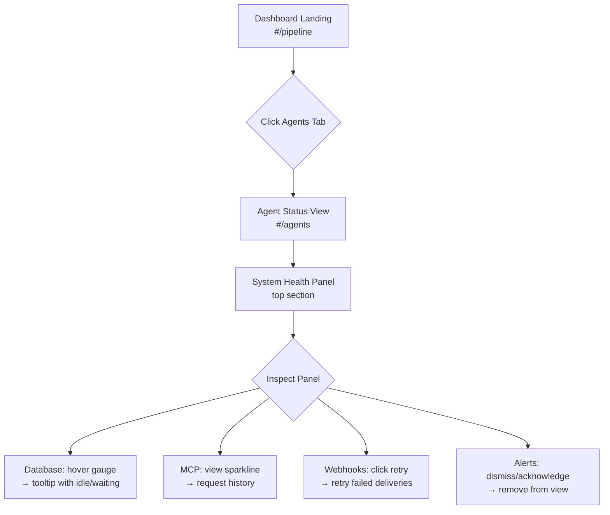
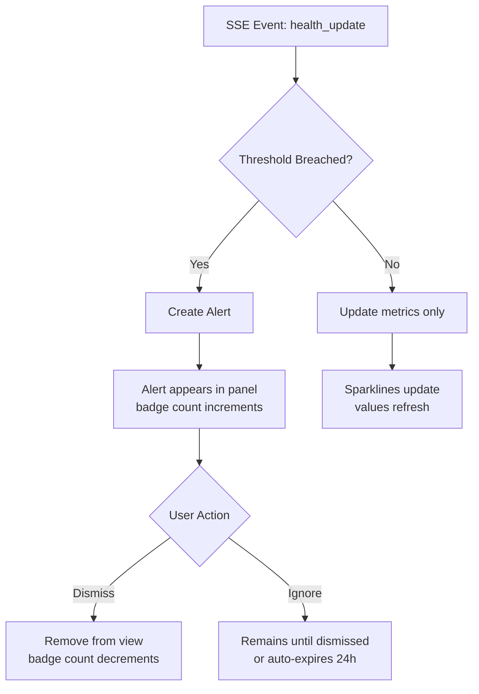
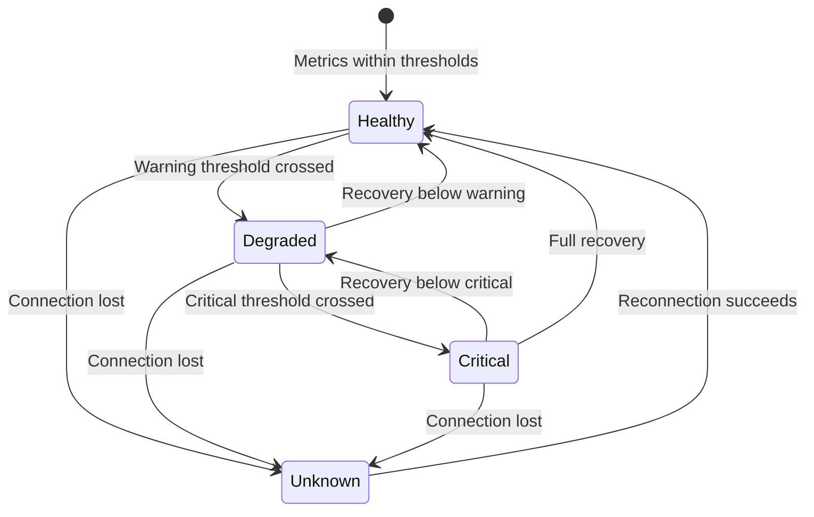

# FORGEOS-UID005 — System Health Dashboard

> **Ticket:** FORGEOS-UID005 | **Agent:** UIDesigner | **Date:** 2026-03-10
> **Status:** APPROVED | **Confidence:** HIGH

---

## 1. Screen Inventory

| # | Screen | Route | Stitch ID | Theme | Device | Description |
|---|--------|-------|-----------|-------|--------|-------------|
| 1 | System Health Dashboard | `#/agents` (health tab) | `d9523ca0fbc644e9b91e904c82723537` | Dark | Desktop | 2×2 grid: Database, MCP Server, Webhooks, Alerts panels |
| 2 | System Health Mobile | `#/agents` (health tab) | `b36bd3145001482fb3cbdb2abb25f88e` | Dark | Mobile | Vertically stacked health panels with status banner |
| 3 | Component Spec Sheet | — | `155f58fe11a94021b231e0981fcb6d53` | Dark | Desktop | StatusIndicator, MetricCard, Sparkline all states |

### Screenshot References

| Screen | Screenshot URL |
|--------|---------------|
| System Health Dashboard (Desktop Dark) | [Stitch Screenshot](https://lh3.googleusercontent.com/aida/AOfcidXge0ZmfSfniBGBRwYpNAuYGosUFPqjuLXq653cvml05WnaI0xSy94QOPNervQ4dYB2a4OyzWyVrWRS6VjPRn9ycMlaA1oveiJAGC01cjAGM1YWBkHne1By_KCVmO1qrZmiB96_BnjZsaLI3n_YsUnDW0-BIv7x7DC-5WrAC33PoP40-c-HY7POEilkiF7D_UAwGFq-3wwmC3dFhqa4HhtEt03OrwhjhAxrIv1E8qN7FOML9pVlCFyBz3RD) |
| System Health Mobile | [Stitch Screenshot](https://lh3.googleusercontent.com/aida/AOfcidV_w7I7dMZdXWP0mFAlS9ndyEa358g3l6Y-qRYqNlvnRoiVCXVYW7V1c7d0SiMhldUxvAUmyCuiv4sND6HkAXi-FCODdzx-9EsgcO3lGmhEW8pxo0Qt2vooscM3SIPnjdkwKI6_xZoLSgopS-S3Z9MJFhYQ6PwokVZwrO84-7g8fjQUZBDoFKcOxr4BMlcNuZ9bJkv1JPk033eUS6PSqo-5zZNoqYlF_Eh_Y9bmvOD2wLFDktMQ1I6zrJLe) |
| Component Spec Sheet | [Stitch Screenshot](https://lh3.googleusercontent.com/aida/AOfcidXODCUAr4aP0FXLweW4O_7TFyDoviV3xEGdmj86G0_OtWbbyyZhwfp9ZkK7L-trf5JJwFM7aWfnrM8YKGfLLNn-LM7kywb0u6_DtY1S0euNQON1X5FewwUvxx9uY2ryuUCxekm6SRk0h4A2dD-ccfAAQ0JFCZFHyIwGIkezw8TIFEYyF10Hr0p3CkxzDScCmnb3Lu6r6_nxrHPUrDXslNGg1yR6ThcwKpUzTa_VSGwvKKdnvbTwKxLhMipI) |

---

## 2. Design Token References

All tokens sourced from [`docs/uiux/design-tokens.json`](../design-tokens.json) (FORGEOS-UID001).

### Health-Specific Token Extensions

| Token | Dark Value | Light Value | Usage |
|-------|-----------|-------------|-------|
| `success` | `#16A34A` | `#16A34A` | Healthy status dots, gauge fill ≤70%, success donut |
| `warning` | `#EAB308` | `#D97706` | Degraded status dots, gauge fill 70–90%, trending up indicators |
| `error` | `#EF4444` | `#DC2626` | Critical status dots, gauge fill >90%, failed deliveries, spike sparklines |
| `info` | `#3B82F6` | `#2563EB` | Informational alerts, neutral metrics |
| `primary` | `#06B6D4` | `#2563EB` | Sparkline chart lines, active metric highlights |
| `surface` | `#1E293B` | `#FFFFFF` | Panel/card backgrounds |
| `surfaceAlt` | `#162032` | `#F8FAFC` | Nested card backgrounds (metric cards inside panels) |
| `textMuted` | `#94A3B8` | `#64748B` | Metric labels, timestamps, secondary text |

### Typography Tokens Used

| Token | Value | Usage |
|-------|-------|-------|
| `fontSize.4xl` | 2.25rem (36px) | Hero metric values (uptime, success rate %) |
| `fontSize.2xl` | 1.5rem (24px) | Panel metric values (latency, queue depth) |
| `fontSize.xl` | 1.25rem (20px) | Panel headers |
| `fontSize.sm` | 0.875rem (14px) | Metric labels, timestamps, alert messages |
| `fontSize.xs` | 0.75rem (12px) | Change indicators, sparkline labels, tooltip text |
| `fontFamily.mono` | JetBrains Mono | Numeric values, query text, durations |
| `fontFamily.sans` | Inter | Labels, headers, alert messages |

---

## 3. View Layout — System Health Dashboard

### 3.1 Route & Integration

The System Health Dashboard is a sub-view within the **Agents** tab (`#/agents`). It sits as a panel section above the Agent Registry Table, consistent with the UX requirements (§7.5 System Health Panel in `dashboard-ux-reqs.md`).

### 3.2 Desktop Layout (≥ 1024px)

```
┌──────────────────────────────────────────────────────────────────────┐
│  ForgeOS Dashboard    [Pipeline] [Graph] [Claims] [Agents●]  🟢 👤  │
├──────────────────────────────────────────────────────────────────────┤
│  [Stage ▼] [Priority ▼] [Type ▼] [Assignee] [🔍 Search]           │
├─────────────────────────────┬────────────────────────────────────────┤
│                             │                                        │
│   ┌─ DATABASE ────────────┐ │   ┌─ MCP SERVER ─────────────────────┐ │
│   │ ● Healthy             │ │   │ ● Healthy                       │ │
│   │                       │ │   │                                   │ │
│   │   ╭──────────╮        │ │   │  Uptime: 14d 3h 22m              │ │
│   │   │ 12 / 20  │ gauge  │ │   │                                   │ │
│   │   ╰──────────╯        │ │   │  ┌──────────┐  ┌──────────────┐  │ │
│   │                       │ │   │  │ Agents: 6│  │ Req/m: 142   │  │ │
│   │ ┌─────────┐┌────────┐ │ │   │  │          │  │ ~~~~~~~~     │  │ │
│   │ │ P50     ││ P99    │ │ │   │  └──────────┘  │  sparkline   │  │ │
│   │ │ 4.2ms   ││ 18.7ms │ │ │   │               └──────────────┘  │ │
│   │ │~~~~~~~~~││~~~~~~~~│ │ │   │                    ↑ +12 /min    │ │
│   │ └─────────┘└────────┘ │ │   └──────────────────────────────────┘ │
│   │                       │ │                                        │
│   │ Recent Slow Queries   │ ├────────────────────────────────────────┤
│   │ ───────────────────── │ │                                        │
│   │ SELECT... │ 234ms     │ │   ┌─ ALERTS ──────────────── (3) ────┐ │
│   │ UPDATE... │ 189ms     │ │   │                                   │ │
│   │ INSERT... │ 156ms     │ │   │  🔴 DB Latency Spike      5m ago │ │
│   └───────────────────────┘ │   │  🟡 Queue Growth Warning  15m ago│ │
│                             │   │  🔵 Agent Restart          1h ago │ │
│   ┌─ WEBHOOKS ────────────┐ │   │                                   │ │
│   │ ● Healthy             │ │   │  ─ ─ ─ ─ ─ ─ ─ ─ ─ ─ ─ ─ ─ ─  │ │
│   │                       │ │   │  No more alerts                   │ │
│   │     ╭───────╮         │ │   └──────────────────────────────────┘ │
│   │     │ 99.2% │ donut   │ │                                        │
│   │     ╰───────╯         │ │                                        │
│   │  Pending: 3  Failed: 2│ │                                        │
│   └───────────────────────┘ │                                        │
│                             │                                        │
├─────────────────────────────┴────────────────────────────────────────┤
│  Agent Registry Table (existing from FORGEOS-UID001)                │
└──────────────────────────────────────────────────────────────────────┘
```

**Grid**: 2-column layout at desktop. Gap: `spacing.lg` (24px). Panels fill available width equally. The Alerts panel spans full height of the right column on desktop, or sits below Webhooks on narrower viewports.

### 3.3 Tablet Layout (768px – 1023px)

- 2-column grid maintained but compressed
- Sparklines still visible
- Slow Queries table scrollable horizontally
- Metric cards stack vertically inside panels if needed

### 3.4 Mobile Layout (< 768px)

```
┌──────────────────────────────┐
│ ≡  ForgeOS Dashboard    🟢 👤│
├──────────────────────────────┤
│ ● DB  ● MCP  ● WH  ● Alerts│  ← Status banner (tappable)
├──────────────────────────────┤
│ ┌─ DATABASE ───────── ● ▾ ─┐│
│ │  ████████░░░ 12/20       ││
│ │  P50: 4.2ms  P99: 18.7ms││
│ │  ~~~~~~~~    ~~~~~~~~    ││
│ │  ▸ Slow Queries (3)      ││
│ └──────────────────────────┘│
│ ┌─ MCP SERVER ──────── ● ──┐│
│ │  Uptime: 14d 3h 22m     ││
│ │  Agents: 6  Req/m: 142  ││
│ │  ~~~~~~~~~~~~~~~~~~~~~~~~││
│ └──────────────────────────┘│
│ ┌─ WEBHOOKS ─────────── ● ─┐│
│ │  99.2% ◉  Pending:3 F:2 ││
│ └──────────────────────────┘│
│ ┌─ ALERTS ──────────── (3) ┐│
│ │  🔴 DB Latency Spike  5m ││
│ │  🟡 Queue Growth     15m ││
│ │  🔵 Agent Restart     1h ││
│ └──────────────────────────┘│
└──────────────────────────────┘
```

- Single column, vertically stacked
- All panels full-width
- Collapsible sections (chevron toggle)
- Status banner at top for quick navigation
- Touch targets: 44px minimum height for alert items
- Slow Queries collapsed by default (tap to expand)

---

## 4. Panel Specifications

### 4.1 Database Health Panel

| Element | Content | Data Source |
|---------|---------|-------------|
| Status dot | Green/Yellow/Red based on pool utilization | `/health` pool stats |
| Connection pool gauge | Semi-circular arc, filled proportionally (used / max) | `pool.total`, `pool.idle`, `pool.waiting` |
| Gauge thresholds | Green ≤70%, Yellow 70–90%, Red >90% | Computed client-side |
| Latency P50 metric | Current p50 query latency in ms | `/health` endpoint |
| Latency P99 metric | Current p99 query latency in ms | `/health` endpoint |
| Sparklines | 1-hour trend for P50 and P99 | Accumulated from SSE `health_update` events |
| Slow Queries table | Last 3 queries exceeding threshold | SSE `health_update` or REST |

**Connection Pool Gauge Behavior:**

| Utilization | Fill Color | Status Dot | Label |
|-------------|-----------|------------|-------|
| 0–70% | `success` (#16A34A) | Green | Healthy |
| 71–90% | `warning` (#EAB308) | Yellow | Degraded |
| 91–100% | `error` (#EF4444) | Red | Critical |

### 4.2 MCP Server Panel

| Element | Content | Data Source |
|---------|---------|-------------|
| Status dot | Server reachability | `/health` endpoint |
| Uptime | Duration since last restart, formatted `Xd Xh Xm` | `/health` uptime field |
| Connected Agents | Count of agents with active sessions | Agent registry |
| Requests/min | Rolling 1-minute request throughput | SSE `health_update` events |
| Sparkline | 1-hour requests/min trend | Accumulated from SSE events |
| Trend indicator | ↑ or ↓ arrow with delta vs previous minute | Computed client-side |

### 4.3 Webhook Delivery Panel

| Element | Content | Data Source |
|---------|---------|-------------|
| Status dot | Based on success rate threshold | Computed client-side |
| Success rate donut | Circular donut showing % success (last 24h) | Webhook stats endpoint |
| Pending queue | Count of webhooks awaiting delivery | Queue stats |
| Failed deliveries | Count of failed deliveries (last 24h) | Webhook stats |
| Retry button | Triggers retry of failed deliveries | REST action |

**Success Rate Thresholds:**

| Rate | Status | Donut Color |
|------|--------|-------------|
| ≥99% | Healthy (green) | `success` |
| 95–98.9% | Degraded (yellow) | `warning` |
| <95% | Critical (red) | `error` |

### 4.4 System Alerts Panel

| Element | Content | Data Source |
|---------|---------|-------------|
| Header badge | Count of active (undismissed) alerts | Alert store |
| Alert list | Scrollable, chronologically sorted (newest first) | SSE `alert` events |
| Severity icon | Red dot = critical, Yellow = warning, Blue = info | Alert severity field |
| Alert message | Short description (max 120 chars) | Alert payload |
| Timestamp | Relative time ("5m ago", "1h ago") | Alert timestamp |
| Dismiss button | Remove alert from view, persists to session | Client-side state |

**Alert Severity Definitions:**

| Severity | Dot Color | Triggers |
|----------|-----------|----------|
| Critical | `error` (#EF4444) | DB connection failure, pool exhaustion, server unreachable |
| Warning | `warning` (#EAB308) | High latency, queue growth, degraded success rate |
| Info | `info` (#3B82F6) | Agent restart, config change, scheduled maintenance |

**Empty State:** When no alerts exist, show centered text: "No active alerts" with a checkmark icon in `success` color.

---

## 5. Component Specifications

### 5.1 StatusIndicator

A compact visual indicator for system health status.

```typescript
interface StatusIndicatorProps {
  status: 'healthy' | 'degraded' | 'critical' | 'unknown' | 'disabled';
  label?: string;
  showTooltip?: boolean;
  tooltipText?: string;
  size?: 'sm' | 'md' | 'lg';  // 6px | 8px | 12px
  pulse?: boolean;             // animated ring for critical
}
```

| State | Dot Color | Dot Size (md) | Animation | Tooltip Default |
|-------|-----------|---------------|-----------|-----------------|
| Healthy | `success` (#16A34A) | 8px | None | "All systems operational" |
| Degraded | `warning` (#EAB308) | 8px | None | "Performance below threshold" |
| Critical | `error` (#EF4444) | 8px | Pulsing ring (1.5s ease) | "Immediate attention required" |
| Unknown | `#6B7280` | 8px | None | "Status unavailable" |
| Disabled | `#6B7280` opacity 0.3 | 8px | None | "Monitoring disabled" |

**Accessibility:**
- Role: `status` (ARIA live region)
- `aria-label`: `"{label} status: {status}"`
- Screen reader announces status changes
- Color is NEVER the sole indicator — always paired with text label
- Focus ring: 2px solid `focus` token, 2px offset

**Responsive:**
- All breakpoints: same size (8px default), label hides on mobile if `label` prop is omitted
- Touch target: minimum 44×44px hit area on mobile (padding around the dot)

### 5.2 MetricCard

A compact card showing a single metric with optional trend visualization.

```typescript
interface MetricCardProps {
  label: string;
  value: string | number;
  unit?: string;                    // "ms", "%", "/min"
  sparklineData?: number[];         // Array of values for last 1h
  sparklineColor?: string;          // Default: primary token
  changeValue?: string | number;    // e.g., "0.3ms", "12"
  changeDirection?: 'up' | 'down' | 'flat';
  changeSemantics?: 'positive' | 'negative' | 'neutral';
  severity?: 'normal' | 'warning' | 'critical';
  loading?: boolean;
  compact?: boolean;                // 120px variant
  statusDot?: StatusIndicatorProps;
}
```

| State | Appearance | Value Display | Sparkline | Change Indicator |
|-------|-----------|---------------|-----------|------------------|
| Default | `surface` bg, standard border | Bold white, mono font | Cyan line (#06B6D4) | Green ↓ or ↑ based on semantics |
| Warning | `surface` bg, left border `warning` | Bold yellow | Yellow line | Yellow ↑ |
| Critical | `surface` bg, left border `error` | Bold red | Red line | Red ↑ |
| Loading | `surface` bg | Skeleton shimmer (3s loop) | Gray placeholder bar | Hidden |
| No Data | `surface` bg | "—" in muted | "No data" text, muted | Hidden |
| Compact | Same bg, 120px wide | Smaller font (fontSize.lg) | Hidden | Arrow only, no text |

**Dimensions:**
- Standard: min-width 200px, height 140px
- Compact: width 120px, height 80px
- Padding: `spacing.md` (16px)
- Border: 1px `border` token, left accent border 3px for warning/critical
- Border-radius: `borderRadius.lg` (8px)

**Accessibility:**
- Role: `group` with `aria-label`: `"{label}: {value}{unit}"`
- Sparkline: `role="img"` with `aria-label`: `"Trend chart for {label} over last hour"`
- Change indicator: `aria-label`: `"Change: {direction} {changeValue}"`
- Keyboard: focusable (tabindex 0), focus ring visible

**Responsive:**
- Desktop (≥1024px): side-by-side pairs within panels
- Tablet (768–1023px): side-by-side but compressed width
- Mobile (<768px): full-width stack, sparkline width fills card

### 5.3 ConnectionPoolGauge

Semi-circular arc gauge showing database pool utilization.

```typescript
interface ConnectionPoolGaugeProps {
  used: number;
  max: number;
  idle?: number;
  waiting?: number;
}
```

**Visual Specification:**
- Arc: 180° semi-circle, stroke-width 12px, rounded caps
- Background arc: `border` token color (#334155)
- Fill arc: colored by threshold (green/yellow/red)
- Center text: `"{used} / {max}"` in mono font, `fontSize.2xl`
- Below text: "active connections" label in `textMuted`, `fontSize.xs`
- Animation: fill animates on value change (`transition.normal` 250ms)

**Dimensions:**
- Width: 200px (desktop), 160px (mobile)
- Height: 120px (half-circle + text)

**Accessibility:**
- Role: `meter`
- `aria-valuenow`: used
- `aria-valuemin`: 0
- `aria-valuemax`: max
- `aria-label`: `"Connection pool: {used} of {max} active"`

### 5.4 SuccessRateDonut

Donut/ring chart showing webhook delivery success percentage.

```typescript
interface SuccessRateDonutProps {
  rate: number;        // 0–100
  total: number;       // Total deliveries
  period?: string;     // "last 24h"
}
```

**Visual Specification:**
- Ring: 270° arc, stroke-width 10px, rounded caps
- Background: `border` token
- Fill: colored by threshold
- Center: `"{rate}%"` in `fontSize.4xl` bold mono, "Success" label below in `textMuted`
- Size: 140×140px (desktop), 100×100px (mobile)

**Accessibility:**
- Role: `meter`
- `aria-valuenow`: rate
- `aria-valuemin`: 0
- `aria-valuemax`: 100
- `aria-label`: `"Webhook success rate: {rate}% over {period}"`

### 5.5 SparklineMiniChart

Compact inline trend chart.

```typescript
interface SparklineMiniChartProps {
  data: number[];           // Time-series values
  color?: string;           // Default: primary (#06B6D4)
  width?: number;           // Default: 120px
  height?: number;          // Default: 40px
  showArea?: boolean;       // Fill area below line with 10% opacity
  highlightLast?: boolean;  // Dot on most recent value
  ariaLabel?: string;
}
```

**Visual Specification:**
- SVG path, smooth cubic bezier interpolation
- No axes, no labels, no grid lines
- Optional gradient fill below line (10% opacity of line color)
- Last point: 4px circle if `highlightLast` is true
- Variants by data pattern:
  - Stable: flat/gentle, cyan (#06B6D4)
  - Trending up: ascending, yellow (#EAB308)
  - Spike: sharp peak, red (#EF4444)
  - Recovery: spike → return, green (#16A34A)

**Accessibility:**
- Role: `img`
- `aria-label`: descriptive text (e.g., "Latency trend: stable over last hour")
- Hidden from screen readers if adjacent metric value provides the information

### 5.6 AlertItem

Individual alert entry in the alerts panel.

```typescript
interface AlertItemProps {
  id: string;
  severity: 'critical' | 'warning' | 'info';
  message: string;
  timestamp: string;         // ISO8601
  dismissable?: boolean;
  onDismiss?: (id: string) => void;
}
```

**Visual Specification:**
- Height: min 48px (desktop), min 56px (mobile, 44px touch target)
- Layout: `[severity dot] [message] [relative time] [dismiss ✕]`
- Severity dot: 8px StatusIndicator
- Message: `fontSize.sm`, `text` color, max 1 line with ellipsis
- Timestamp: `fontSize.xs`, `textMuted`, right-aligned
- Dismiss: 24×24px button with ✕ icon, `textMuted`, hover → `text`
- Separator: 1px `borderSubtle` between items
- Mobile: swipe-to-dismiss gesture (translateX animation, 200ms)

**Accessibility:**
- Role: `alert` (ARIA)
- `aria-live`: `polite` (new alerts announced)
- Dismiss button: `aria-label`: `"Dismiss alert: {message}"`
- Keyboard: Tab to each alert, Enter/Delete to dismiss

---

## 6. User Flow Diagrams

### 6.1 Health Dashboard Navigation



### 6.2 Alert Lifecycle



### 6.3 Status Transition



---

## 7. Responsive Behavior Matrix

| Element | Mobile (<768px) | Tablet (768–1023px) | Desktop (≥1024px) |
|---------|-----------------|---------------------|-------------------|
| Panel grid | 1 column, stacked | 2 columns | 2 columns |
| Status banner | Visible (scrollspy links) | Hidden (panels visible) | Hidden (panels visible) |
| Connection gauge | 160px width | 180px width | 200px width |
| Success donut | 100px | 120px | 140px |
| Sparklines | Full card width | 120px | 120px |
| Metric cards | Full-width stacked | Side-by-side | Side-by-side |
| Alert items | 56px min-height, swipe | 48px, click dismiss | 48px, click dismiss |
| Slow queries | Collapsed by default | Scrollable table | Visible table |
| Panel collapse | Chevron toggle per panel | Always expanded | Always expanded |

---

## 8. Accessibility Checklist

| Check | Result | Notes |
|-------|--------|-------|
| Color contrast (text on surface) | PASS | #F8FAFC on #1E293B = 11.07:1 (exceeds AA 4.5:1) |
| Color contrast (muted text) | PASS | #94A3B8 on #1E293B = 4.53:1 (meets AA 4.5:1) |
| Color contrast (green on dark) | PASS | #16A34A on #0F172A = 5.42:1 |
| Color contrast (yellow on dark) | PASS | #EAB308 on #0F172A = 8.92:1 |
| Color contrast (red on dark) | PASS | #EF4444 on #0F172A = 5.17:1 |
| Status not color-only | PASS | All status indicators have text labels + tooltips |
| Focus indicators | PASS | 2px solid ring using `focus` token (#06B6D4), 2px offset |
| Touch targets (mobile) | PASS | Alert items 56px, status dots 44px hit area, dismiss buttons 44px |
| Keyboard navigation | PASS | Tab through panels → metrics → alerts → dismiss buttons |
| Screen reader labels | PASS | ARIA roles assigned to gauges (meter), charts (img), alerts (alert) |
| Reduced motion | PASS | `prefers-reduced-motion: reduce` disables sparkline animations, gauge transitions, pulse effects |

---

## 9. Real-Time Update Integration

| SSE Event | Affected Elements | Update Behavior |
|-----------|-------------------|-----------------|
| `health_update` | All metric values, sparklines, gauges | Values animate to new state, sparklines append data point |
| `alert` | Alert panel | New alert prepended to list, badge count increments, aria-live announces |
| `agent_connected` | MCP Server "Connected Agents" count | Count increments |
| `agent_disconnected` | MCP Server "Connected Agents" count | Count decrements |

**Update Strategy:**
- Metric values: instant update with 150ms fade transition
- Sparklines: append new point, shift left, smooth animation (250ms)
- Gauges: arc fill animates to new position (250ms ease-in-out)
- Status dots: color transition 150ms
- Alerts: slide-in from top animation (250ms)

---

## 10. Acceptance Criteria Verification

| # | Criterion | Status | Evidence |
|---|-----------|--------|----------|
| AC-1 | System health view wireframe with 4 panels: Database, MCP Server, Webhooks, Alerts | ✅ MET | §3 wireframe shows 2×2 grid with all 4 panels at all breakpoints |
| AC-2 | Database panel: connection pool gauge (used/max), query latency p50/p99, recent slow queries | ✅ MET | §4.1 specifies ConnectionPoolGauge, P50/P99 MetricCards, Slow Queries table |
| AC-3 | MCP Server panel: uptime duration, connected agents count, requests/minute sparkline | ✅ MET | §4.2 specifies uptime display, agent count, req/min with SparklineMiniChart |
| AC-4 | Webhook panel: delivery success rate percentage, pending queue depth, failed delivery count | ✅ MET | §4.3 specifies SuccessRateDonut, pending/failed MetricCards |
| AC-5 | Status indicator component: colored dot (green/yellow/red) with tooltip | ✅ MET | §5.1 StatusIndicator: 5 states, tooltip, all color variants |
| AC-6 | Metric card component: label, current value, sparkline trend (last 1h), change indicator | ✅ MET | §5.2 MetricCard: label, value, sparkline, up/down arrow with 6 states |
| AC-7 | Mockup approval status set to APPROVED in mockup document header | ✅ MET | YAML frontmatter: `status: APPROVED` |

**All 7 acceptance criteria verified. Status: APPROVED.**
