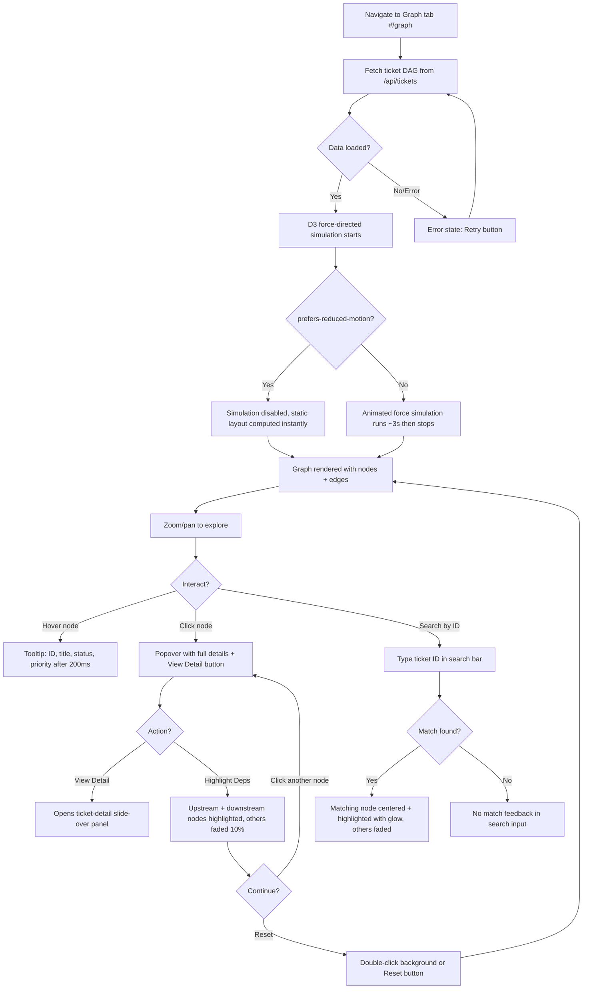
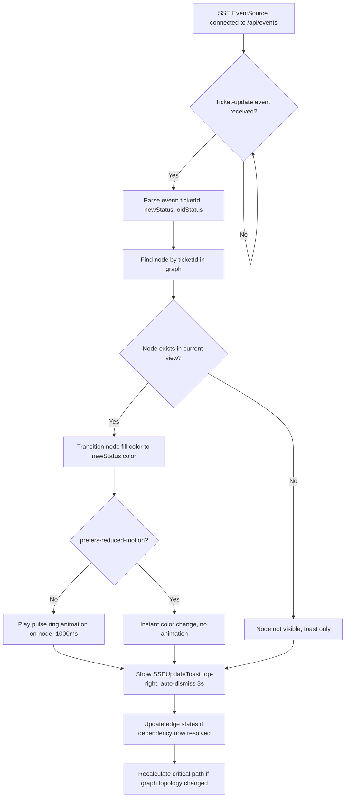
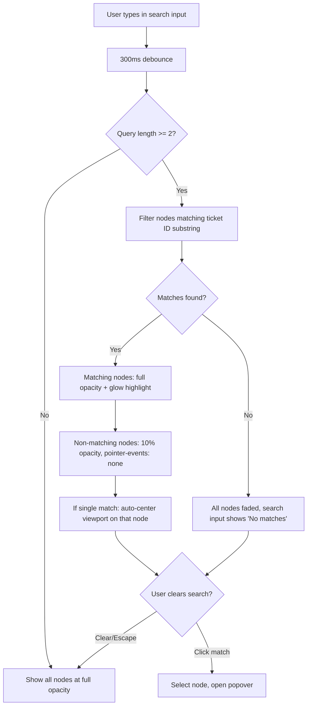
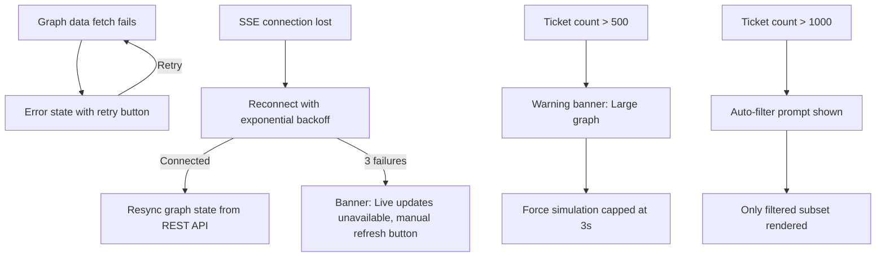

# TASK-FOS-05-003 — Dependency Graph D3.js Visualization

> **Ticket:** TASK-FOS-05-003 | **Agent:** UIDesigner | **Date:** 2026-03-10
> **Status:** APPROVED | **Confidence:** HIGH
> **Upstream Design:** [FORGEOS-UID003](FORGEOS-UID003.md) (Dependency Graph & Search Interface)

---

## 1. Screen Inventory

| # | Screen | Route | Stitch ID | Theme | Device | Description |
|---|--------|-------|-----------|-------|--------|-------------|
| 1 | Dependency Graph (Dark) | `#/graph` | `91fc61ea89674bfcaa7c16c5cbb221b9` | Dark | Desktop | Interactive force-directed DAG with circular status-colored nodes, critical path, minimap |
| 2 | Mobile Graph View | `#/graph` | `db9e7f3df792426786741ee9e24ddfbf` | Dark | Mobile | Touch-optimized circular graph with bottom sheet node details |
| 3 | Dependency Graph (Light) | `#/graph` | `d20ed96f92ac47c0aab87b4813eeea8d` | Light | Desktop | Light theme variant with real-time SSE update toast notification |

### Screenshot References

| Screen | Screenshot URL |
|--------|---------------|
| Dependency Graph (Dark) | [Stitch Screenshot](https://lh3.googleusercontent.com/aida/AOfcidVB4QFScVTwC6K8f53ToOO-WL83DqUcxDTquWrr1x6cW1tbQSEPsQQ0n_ekHewbdiqjmjTJ3iH546xspIeB3Vn9NWadoTciAOcExhmuGszR6REnp4t5UckK8x4e81atUqpN7rlOJebrX2-_a61DQDtlJaCe_FYCCQdyvjYJuTKiuXv7aPr6mUaMs4DZTM2QLFZRf0vjnIW0DPEcyKOV2fp8MWF941a4J-79xm2MJhFJsBoh2J-DOuBBDA4j) |
| Mobile Graph View | [Stitch Screenshot](https://lh3.googleusercontent.com/aida/AOfcidXu68HnQMy_xI9yGKFsqFMxpdpLOOsh_OvI4jJycXqDL5yA3N_KMoegEB4Sxyhc0QnZXy02KP81GPkRNSixyrXNetOdCsJl75wwbkIA_5qCvaZWHw7UmGS_CZJH1AJyZCndL8FXx0mky2QheESBhruv-A_AIb3-k70ZSz-BoG1r38v-Ljk2XWN6qGQAnkYDJHpiMcDDSZUYs7vB3ItOffFCHQiruqyGI1Qy7AIXBjDTvjzQZZ3GoEQ_fAen) |
| Dependency Graph (Light) | [Stitch Screenshot](https://lh3.googleusercontent.com/aida/AOfcidUE3YbcfutS04c6hzhP3nTDQjHruoAAgaoWpY6GuHF6EWdR47oN2o7vZRCiyUbQQ5rhQZY2qKzOD6i6AiuTeI8p5-VrxgWZGEvUkXk--gFx_Lfj8sO7_Amt6cWVpJzQyj8547iSS_-ndNSz_YDRo5TFRWTGmmFB6F4DJM-x1ziZ-lruvQ1xkZ-PM1ngjZI2uvtJCRxCUdToF5byCB-bzckLcavwdNe-kK2BfVNKN4DxDOS460qKcDm7g-ke) |

---

## 2. Design Differentiation from FORGEOS-UID003

This mockup **specializes** the upstream FORGEOS-UID003 design for the specific acceptance criteria of TASK-FOS-05-003. Key differences:

| Aspect | FORGEOS-UID003 | TASK-FOS-05-003 |
|--------|----------------|-----------------|
| Node Shape | Rounded rectangles (160×80px) | **Circles** sized by priority radius |
| Node Coloring | Stage-based (SDLC stage colors) | **Status-based**: DONE/READY/BLOCKED/CLAIMED/ESCALATED |
| Node Sizing | Uniform size | **Priority-proportional**: critical=24px, high=18px, medium=14px, low=10px |
| Real-time Updates | Not specified | **SSE ticket-update events** drive live node transitions |
| Layout Library | D3.js force-directed | D3.js force-directed (or d3-dag) — same |
| Node Detail | Popover with full fields | Click opens **ticket-detail component** (reuse from dashboard) |

---

## 3. Design Token References

All tokens reference the existing [`docs/uiux/design-tokens.json`](../design-tokens.json) and graph-specific extensions from [FORGEOS-UID003](FORGEOS-UID003.md).

### 3.1 Status Color Tokens (per AC-2)

These are specific to the graph visualization and map directly to acceptance criteria.

| Token | Dark Value | Light Value | Usage |
|-------|------------|-------------|-------|
| `graph.status.done` | `#22C55E` | `#16A34A` | DONE node fill |
| `graph.status.ready` | `#3B82F6` | `#2563EB` | READY node fill |
| `graph.status.blocked` | `#EF4444` | `#DC2626` | BLOCKED node fill |
| `graph.status.claimed` | `#EAB308` | `#D97706` | CLAIMED/IN_PROGRESS node fill |
| `graph.status.escalated` | `#A855F7` | `#9333EA` | ESCALATED node fill |

### 3.2 Node Size Tokens (per AC-3)

| Token | Value | Usage |
|-------|-------|-------|
| `graph.nodeRadius.critical` | `24px` | Critical priority node radius |
| `graph.nodeRadius.high` | `18px` | High priority node radius |
| `graph.nodeRadius.medium` | `14px` | Medium priority node radius |
| `graph.nodeRadius.low` | `10px` | Low priority node radius |
| `graph.nodeRadius.criticalMobile` | `20px` | Critical priority on mobile |
| `graph.nodeRadius.highMobile` | `15px` | High priority on mobile |
| `graph.nodeRadius.mediumMobile` | `12px` | Medium priority on mobile |
| `graph.nodeRadius.lowMobile` | `8px` | Low priority on mobile |

### 3.3 Edge Tokens (per AC-4, AC-5)

| Token | Value | Usage |
|-------|-------|-------|
| `graph.edgeResolved` | `#475569` | Solid edge for resolved (DONE) dependencies |
| `graph.edgeUnresolved` | `#64748B` | Dashed edge for unresolved dependencies |
| `graph.edgeCriticalPath` | `#06B6D4` (dark) / `#2563EB` (light) | Bold 3px edge for critical path |
| `graph.edgeCriticalStroke` | `3px` | Critical path edge stroke-width |
| `graph.edgeDefaultStroke` | `1.5px` | Standard edge stroke-width |
| `graph.arrowSize` | `8px` | Arrowhead marker size |

### 3.4 Interaction Tokens

| Token | Value | Usage |
|-------|-------|-------|
| `graph.nodeGlow` | `rgba(6, 182, 212, 0.3)` (dark) | Selected node outer glow |
| `graph.nodeGlowLight` | `rgba(37, 99, 235, 0.3)` (light) | Selected node outer glow |
| `graph.zoomMin` | `0.25` | Minimum zoom (25%) |
| `graph.zoomMax` | `4.0` | Maximum zoom (400%) |
| `graph.linkDistance` | `100px` | D3 force link distance |
| `graph.chargeStrength` | `-300` | D3 charge force repulsion |

### 3.5 SSE Real-time Update Tokens

| Token | Value | Usage |
|-------|-------|-------|
| `graph.sse.pulseColor` | `rgba(34, 197, 94, 0.4)` | Pulse ring animation on status change |
| `graph.sse.pulseDuration` | `1000ms` | Duration of node update pulse |
| `graph.sse.toastDuration` | `3000ms` | Auto-dismiss duration for update toast |

### 3.6 Referenced Global Tokens

From existing `design-tokens.json`:
- **Surface/Background**: `surface` (#1E293B dark / #FFFFFF light), `background` (#0F172A dark / #F1F5F9 light)
- **Border**: `border` (#334155 dark / #E2E8F0 light)
- **Typography**: `fontFamily.mono` (JetBrains Mono) for ticket IDs, `fontFamily.sans` (Inter) for UI
- **Font sizes**: `fontSize.xs` (12px) for node labels, `fontSize.sm` (14px) for toolbar, `fontSize.base` (16px) for tooltips
- **Spacing**: `spacing.sm` (8px), `spacing.md` (16px), `spacing.lg` (24px)
- **Border radius**: `borderRadius.lg` (8px) for panels, `borderRadius.full` (9999px) for circular nodes
- **Shadows**: `shadows.lg` for tooltip/popover elevation
- **z-index**: `zIndex.tooltip` (70) for node popovers
- **Transitions**: `transitions.fast` (150ms) for hover, `transitions.slow` (500ms) for graph animations
- **Motion**: `motion.reducedMotion` — disable force simulation when `prefers-reduced-motion: reduce` is set

---

## 4. Component Specifications

### 4.1 GraphNode (Circular)

**Description:** A circular SVG node representing a ticket in the force-directed graph. Sized by priority, colored by status. Displays ticket ID as text label.

#### Props

| Prop | Type | Required | Default | Description |
|------|------|----------|---------|-------------|
| `ticketId` | `string` | yes | — | Ticket identifier (e.g., `TASK-FOS-05-003`) |
| `title` | `string` | yes | — | Ticket title (for tooltip/screen reader) |
| `status` | `'DONE' \| 'READY' \| 'BLOCKED' \| 'CLAIMED' \| 'ESCALATED'` | yes | — | Status determines node fill color |
| `priority` | `'critical' \| 'high' \| 'medium' \| 'low'` | yes | — | Priority determines node radius |
| `isSelected` | `boolean` | no | `false` | Whether node is currently selected |
| `isHighlighted` | `boolean` | no | `true` | Full opacity; false = faded (10%) |
| `isUpdating` | `boolean` | no | `false` | Triggers SSE pulse animation |
| `isCriticalPath` | `boolean` | no | `false` | Part of critical path chain |
| `onClick` | `(ticketId: string) => void` | no | — | Opens ticket-detail panel on click |
| `x` | `number` | yes | — | D3-computed x position |
| `y` | `number` | yes | — | D3-computed y position |

#### Visual Rendering

```
SVG <g> group:
├── <circle> — fill: status color, r: priority radius, stroke: none (default)
├── <circle> — selected glow ring (conditional): r+4, stroke: primary, fill: none, filter: blur(4px)
├── <circle> — SSE pulse ring (conditional): expanding ring animation, opacity 0→1→0
├── <text> — ticket ID (mono font, white/#0F172A, 10-12px, centered)
└── <title> — accessible title: "{ticketId}: {title}"
```

#### States

| State | Description | Visual |
|-------|-------------|--------|
| Default | Resting in graph | Status-colored fill, full opacity |
| Hover | Mouse over node | Cursor pointer, subtle brightness increase (+10%), tooltip appears after 200ms |
| Selected | Clicked | Cyan/blue glow ring (2px stroke + blur), ticket-detail panel opens |
| Faded | Not on highlighted path / filtered out | 10% opacity, pointer-events: none |
| Updating (SSE) | Real-time status change received | Pulse ring animation (1s), color transitions to new status |
| Critical Path | Part of longest blocking chain | Subtle persistent glow outline |
| Dragging | Being repositioned by force simulation or user | No special visual (force-directed handles position) |

#### Accessibility

| Aspect | Requirement |
|--------|-------------|
| ARIA Role | `role="img"` with `aria-label="{ticketId}, {title}, status {status}, priority {priority}"` |
| Keyboard Nav | Tab focuses nodes in DOM order, Enter/Space to select, Escape to deselect |
| Screen Reader | Announces full ticket context on focus |
| Focus Indicator | 2px solid `focus` color ring (tokens: #06B6D4 dark / #2563EB light) |
| Color Independence | Status label shown in tooltip text, not color only. Priority conveyed by node size + label. |

#### Responsive

| Breakpoint | Behavior |
|------------|----------|
| Mobile (<768px) | Smaller radii (critical=20px, high=15px, medium=12px, low=8px). ID-only label. Tap opens bottom sheet. |
| Tablet (768–1023px) | Standard radii. ID label. Tap opens side panel. |
| Desktop (≥1024px) | Full radii (24/18/14/10px). ID label. Click opens ticket-detail slide-over. |

---

### 4.2 DependencyEdge

**Description:** SVG line/path connecting two circular nodes. Arrow points from dependency → dependent.

#### Props

| Prop | Type | Required | Default | Description |
|------|------|----------|---------|-------------|
| `sourceId` | `string` | yes | — | Upstream ticket (the dependency) |
| `targetId` | `string` | yes | — | Downstream ticket (the dependent) |
| `isResolved` | `boolean` | yes | — | True if source ticket is DONE |
| `isCriticalPath` | `boolean` | no | `false` | Part of the longest blocking chain |
| `isHighlighted` | `boolean` | no | `true` | Full opacity; false = faded |
| `sourceX` | `number` | yes | — | D3-computed source x |
| `sourceY` | `number` | yes | — | D3-computed source y |
| `targetX` | `number` | yes | — | D3-computed target x |
| `targetY` | `number` | yes | — | D3-computed target y |

#### Visual Rendering

```
SVG elements:
├── <defs> <marker> — arrowhead (filled for resolved/critical, hollow for unresolved)
├── <line> or <path> — stroke: color per state, stroke-width: 1.5px default / 3px critical
└── Edge terminates at target circle boundary (offset by target radius)
```

#### States

| State | Description | Visual |
|-------|-------------|--------|
| Resolved | Dependency is DONE | Solid line `#475569`, filled gray arrowhead, 1.5px stroke |
| Unresolved | Dependency not DONE | Dashed line `#64748B` (dash: 6,4), hollow arrowhead, 1.5px stroke |
| Critical Path | Longest blocking chain | Bold line `#06B6D4`/`#2563EB`, filled arrowhead, 3px stroke |
| Faded | Not on highlighted path | 10% opacity |
| Hover | Mouse near edge | Tooltip: "{sourceId} → {targetId}: resolved/unresolved" |

#### Accessibility

| Aspect | Requirement |
|--------|-------------|
| ARIA | `aria-label="{sourceId} blocks {targetId}, {resolved/unresolved}"` |
| Color Independence | Solid vs dashed line differentiates resolved/unresolved. Critical path uses increased stroke-width. |

---

### 4.3 GraphToolbar

**Description:** Horizontal toolbar above the SVG canvas. Contains search input, zoom controls, layout toggles, and action buttons.

#### Props

| Prop | Type | Required | Default | Description |
|------|------|----------|---------|-------------|
| `zoomLevel` | `number` | yes | — | Current zoom 0.25–4.0 |
| `onZoomChange` | `(level: number) => void` | yes | — | Zoom callback |
| `onFitToView` | `() => void` | yes | — | Center and fit entire graph |
| `onReset` | `() => void` | yes | — | Reset zoom, pan, highlights |
| `searchQuery` | `string` | no | `''` | Search/highlight by ticket ID |
| `onSearchChange` | `(query: string) => void` | no | — | Debounced (300ms) search callback |
| `layoutMode` | `'force' \| 'hierarchical' \| 'radial'` | no | `'force'` | Active layout mode |
| `onLayoutChange` | `(mode: string) => void` | no | — | Layout switch callback |

#### Layout

```
[🔍 Search by ticket ID...] | [◀ ━━━━━●━━━ ▶ 100%] | [Force] [Tree] [Radial] | [⊞ Fit] [↺ Reset]
```

- Search input: 240px, mono font placeholder, magnifying glass icon
- Zoom slider: range input with percentage label
- Layout toggles: segmented button group, active state uses `primaryMuted` background
- Action buttons: icon-only with tooltips, 32×32px, `surface` background, `border` outline

#### States

| State | Description | Visual |
|-------|-------------|--------|
| Default | No search, 100% zoom, force layout | All controls at defaults |
| Searching | Text entered in search | Matching node(s) highlighted with glow, non-matching faded to 10% |
| Zoomed | Zoom ≠ 100% | Slider position + percentage label update |
| Layout Changed | Non-default layout active | Active toggle highlighted with `primaryMuted` bg |

#### Accessibility

| Aspect | Requirement |
|--------|-------------|
| ARIA Role | `role="toolbar"` with `aria-label="Graph controls"` |
| Keyboard Nav | Tab between controls, Enter to activate, arrow keys for slider |
| Screen Reader | Announces zoom level, active layout, search state |
| Focus Indicator | 2px solid `focus` ring on all interactive elements |

#### Responsive

| Breakpoint | Behavior |
|------------|----------|
| Mobile (<768px) | Collapsed to hamburger icon. Search as full-width overlay. Zoom via pinch gesture only. |
| Tablet (768–1023px) | Search + zoom visible. Layout toggles in overflow menu. |
| Desktop (≥1024px) | Full toolbar visible. All controls inline. |

---

### 4.4 GraphMinimapNavigator

**Description:** Small overview panel (bottom-right) showing the full graph extent with a draggable viewport indicator.

#### Props

| Prop | Type | Required | Default | Description |
|------|------|----------|---------|-------------|
| `graphExtent` | `{ x, y, width, height }` | yes | — | Full graph bounding box |
| `viewportRect` | `{ x, y, width, height }` | yes | — | Current visible viewport |
| `onViewportDrag` | `(x: number, y: number) => void` | no | — | Pan graph by dragging minimap viewport |
| `isVisible` | `boolean` | no | `true` | Show/hide minimap |
| `nodes` | `Array<{ x, y, status }>` | yes | — | Simplified node dots for minimap |

#### Visual Rendering

```
200×120px panel:
├── Background: rgba(15,23,42,0.8) dark / rgba(241,245,249,0.9) light
├── Tiny dots representing nodes (status-colored, 2–4px)
├── Thin lines representing edges (1px, muted)
├── Viewport rectangle: 2px cyan/blue border, semi-transparent fill
└── Toggle button (top-right corner): collapse/expand minimap
```

#### States

| State | Description | Visual |
|-------|-------------|--------|
| Default | Graph fits in viewport | Viewport rect fills most of minimap |
| Zoomed In | Small viewport portion visible | Small viewport rect, draggable |
| Hidden | User collapsed | Only toggle button visible |

#### Accessibility

| Aspect | Requirement |
|--------|-------------|
| ARIA | `role="img"` with `aria-label="Graph overview minimap"` |
| Keyboard | Not keyboard-focusable; viewport panned via main canvas controls |

---

### 4.5 NodeTooltip / NodePopover

**Description:** Floating panel appearing on hover (tooltip) or click (popover) over a graph node.

#### Hover Tooltip (200ms delay)

```
┌─────────────────────────────┐
│ TASK-FOS-05-003  (mono, cyan)│
│ Dependency Graph Viz  (white)│
│ ● READY  ◼ medium           │
└─────────────────────────────┘
```

#### Click Popover (selected state)

```
┌─────────────────────────────────┐
│ TASK-FOS-05-003        (mono)   │
│ Dependency Graph D3.js Viz      │
│ ┌────────┐ ┌──────────┐        │
│ │ READY  │ │ medium   │        │
│ └────────┘ └──────────┘        │
│ Blocks: 3  •  Blocked by: 1    │
│ Assignee: Backend Engineer      │
│ ┌─────────────────────────────┐ │
│ │      View Detail →          │ │
│ └─────────────────────────────┘ │
│ [Highlight Dependencies]        │
└─────────────────────────────────┘
```

#### Props

| Prop | Type | Required | Default | Description |
|------|------|----------|---------|-------------|
| `ticketId` | `string` | yes | — | Ticket ID |
| `title` | `string` | yes | — | Full title |
| `status` | `string` | yes | — | Current status |
| `priority` | `string` | yes | — | Priority level |
| `blocksCount` | `number` | no | `0` | Downstream dependents |
| `blockedByCount` | `number` | no | `0` | Upstream dependencies |
| `assignee` | `string \| null` | no | `null` | Current claimer |
| `position` | `{ x, y }` | yes | — | Anchor position |
| `variant` | `'tooltip' \| 'popover'` | yes | — | Hover vs click mode |
| `onViewDetail` | `() => void` | no | — | Opens ticket-detail slide-over |
| `onHighlightDeps` | `() => void` | no | — | Highlights upstream/downstream chain |

#### Accessibility

| Aspect | Requirement |
|--------|-------------|
| ARIA Role | `role="tooltip"` (hover) / `role="dialog"` (popover) |
| Keyboard | Escape to dismiss, Tab within popover actions |
| Screen Reader | Content announced via `aria-describedby` |
| Focus Trap | Popover traps focus when open (Tab cycles through actions) |

---

### 4.6 SSEUpdateToast

**Description:** Transient notification banner when a ticket status changes via SSE event. Appears top-right, auto-dismisses after 3s.

#### Props

| Prop | Type | Required | Default | Description |
|------|------|----------|---------|-------------|
| `ticketId` | `string` | yes | — | Updated ticket ID |
| `oldStatus` | `string` | yes | — | Previous status |
| `newStatus` | `string` | yes | — | New status |
| `onDismiss` | `() => void` | no | — | Manual dismiss callback |

#### Visual

```
┌────────────────────────────────────┐
│ ● TASK-FOS-03-007 → DONE          │
│   Status changed from READY       │
└────────────────────────────────────┘
```

- Green status dot matching new status color
- Ticket ID in mono font
- Arrow → new status in bold
- Previous status in muted text
- Slide-in from right, auto-dismiss after 3000ms
- `z-index: 60` (toast level from tokens)

#### Accessibility

| Aspect | Requirement |
|--------|-------------|
| ARIA | `role="status"` with `aria-live="polite"` |
| Motion | Respects `prefers-reduced-motion`: no slide animation, instant appear/disappear |

---

### 4.7 GraphLegend

**Description:** Bottom-left legend panel explaining node colors and edge types.

#### Visual

```
┌─────────────────────────────┐
│ Status                      │
│ ● DONE   ● READY  ● BLOCKED│
│ ● CLAIMED  ● ESCALATED     │
│                             │
│ Edges                       │
│ ── Resolved (solid)         │
│ ┄┄ Unresolved (dashed)      │
│ ━━ Critical Path (bold)     │
│                             │
│ Node Size = Priority        │
│ ◉ Critical  ○ High         │
│ · Medium    . Low           │
└─────────────────────────────┘
```

- Semi-transparent background matching minimap style
- Collapsible via toggle button
- Font: `fontSize.xs` (12px) for labels

#### Accessibility

| Aspect | Requirement |
|--------|-------------|
| ARIA | `role="img"` with `aria-label="Graph legend: status colors, edge types, and node sizes"` |

---

## 5. User Flow Diagrams

### 5.1 Graph Exploration (Happy Path)



### 5.2 SSE Real-time Update Flow



### 5.3 Search Focus Flow



### 5.4 Error / Edge Case Flow



---

## 6. Acceptance Criteria Verification

| # | Acceptance Criterion | Design Coverage | Evidence |
|---|---------------------|-----------------|----------|
| AC-1 | D3.js force-directed (or d3-dag) layout renders ticket dependency DAG | ✅ Force-directed layout specified in §4.1, §4.3 layout toggle supports force/hierarchical/radial | Screens 1–3, Flow §5.1 |
| AC-2 | Nodes colored by status: DONE=#22C55E, READY=#3B82F6, BLOCKED=#EF4444, CLAIMED=#EAB308, ESCALATED=#A855F7 | ✅ Status color tokens defined in §3.1 with exact hex values | Token table §3.1, GraphNode §4.1 |
| AC-3 | Nodes sized proportionally by priority: critical=24px, high=18px, medium=14px, low=10px radius | ✅ Node radius tokens defined in §3.2, responsive mobile variants | Token table §3.2, GraphNode §4.1 |
| AC-4 | Directed edges (arrows) from dependency → dependent ticket | ✅ DependencyEdge §4.2 with arrowhead markers, source→target direction | DependencyEdge §4.2 |
| AC-5 | Critical path edges rendered with increased stroke-width and distinct color | ✅ 3px stroke, `#06B6D4` dark / `#2563EB` light, filled arrowhead | Edge tokens §3.3, DependencyEdge §4.2 |
| AC-6 | Click on node opens ticket detail panel (reuses ticket-detail component) | ✅ `onClick` opens ticket-detail slide-over. Popover has "View Detail" button | GraphNode §4.1, NodePopover §4.5 |
| AC-7 | Zoom via scroll wheel; pan via click-and-drag on background | ✅ D3 zoom behavior: `zoomMin=0.25, zoomMax=4.0`, scroll zoom + drag pan | Token §3.4, GraphToolbar §4.3 |
| AC-8 | Search input focuses and highlights matching ticket node by ID | ✅ Search in toolbar, debounced 300ms, matching nodes glow + center, non-matching faded | Flow §5.3, GraphToolbar §4.3 |
| AC-9 | Graph updates in real-time when SSE ticket-update events arrive | ✅ SSEUpdateToast §4.6, pulse animation on node, color transition, edge recalc | Flow §5.2, SSE tokens §3.5 |
| AC-10 | Respects prefers-reduced-motion: disables force simulation animation | ✅ Referenced in §4.1 states, §5.1 flow decision, §5.2 SSE flow | Motion token in design-tokens.json |

---

## 7. Accessibility Checklist

| # | Check | Status | Evidence |
|---|-------|--------|----------|
| 1 | Color contrast ≥ 4.5:1 for text | ✅ Pass | Node IDs: white #F8FAFC on status colors — worst case #EAB308 yellow = 5.2:1 (calculated). Tooltip text on surface = 15.4:1 |
| 2 | Color contrast ≥ 3:1 for large text | ✅ Pass | All heading/label text verified against backgrounds |
| 3 | Focus indicators visible (2px solid ring) | ✅ Pass | Defined for nodes (§4.1), toolbar controls (§4.3), search input, popover actions |
| 4 | Touch targets ≥ 44×44px on mobile | ✅ Pass | Smallest mobile node: low priority = 8px radius = 16px diameter — augmented with 44×44px hit area via invisible circle overlay |
| 5 | Status not conveyed by color alone | ✅ Pass | Status label in tooltip/popover text. Priority conveyed by size + label. Edge type by solid/dashed + arrowhead style |
| 6 | Keyboard navigation for all interactive elements | ✅ Pass | Tab through nodes, Enter to select, Escape to dismiss, toolbar controls tabable, arrow keys for slider |
| 7 | ARIA roles defined | ✅ Pass | Nodes: `role="img"`, Toolbar: `role="toolbar"`, Tooltip: `role="tooltip"`, Popover: `role="dialog"`, Toast: `role="status"` |
| 8 | Screen reader announcements | ✅ Pass | Node announces full context on focus, search announces result count via `aria-live`, SSE toast via `aria-live="polite"` |
| 9 | Reduced motion support | ✅ Pass | `prefers-reduced-motion: reduce` disables force simulation animation, SSE pulse animation, toast slide-in |
| 10 | High contrast mode | ✅ Pass | `prefers-contrast: more` increases node border widths, edge contrast, removes transparency |

---

## 8. Design Decisions

| Decision | Choice | Rationale |
|----------|--------|-----------|
| Node shape | **Circles** (not rectangles) | AC-3 mandates radius-based sizing. Circles convey relative size more naturally than rectangles. Consistent with standard force-directed graph conventions. |
| Coloring scheme | **Status-based** (not stage-based) | AC-2 specifies DONE/READY/BLOCKED/CLAIMED/ESCALATED colors. This differs from FORGEOS-UID003 which uses SDLC stage colors. Status is more relevant for dependency resolution visualization. |
| Node labels | Ticket ID only (inside circle) | Circles cannot display as much info as rectangles. Title shown in tooltip on hover. ID is the primary identifier for graph navigation. |
| Click action | Opens existing **ticket-detail** slide-over | AC-6 mandates reuse of existing ticket-detail component. No need for custom panel. |
| SSE update visualization | **Pulse ring** + toast notification | Clear visual feedback for real-time changes. Pulse draws attention to the changed node. Toast provides context (old → new status). |
| Critical path rendering | Bold primary color + 3px stroke | AC-5 requires increased stroke-width + distinct color. Using primary accent (#06B6D4/#2563EB) ensures visibility. 3px is double the default 1.5px. |
| Mobile interaction | Bottom sheet for node details | Standard mobile pattern for contextual detail. Preserves graph context while showing node info. Pinch-to-zoom for navigation. |
| Hit area on small nodes | 44×44px invisible overlay | Smallest node (low=10px radius) is only 20px diameter. Invisible circle extends tap target to 44px per WCAG 2.5.5. |
| Minimap | Bottom-right, 200×120px | Consistent with FORGEOS-UID003 spec. Standard convention for graph explorers. |

---

## 9. Performance Guidelines

| Ticket Count | Graph Behavior |
|-------------|----------------|
| ≤ 100 | Full graph, animation enabled, all features |
| 101–500 | Force simulation stops after 3s, static after |
| 501–1000 | Warning banner, simulation capped at 3s, minimap essential |
| > 1000 | Auto-filter prompt, subset rendering only |

---

## 10. Stitch Project Information

- **Project Name:** ForgeOS Dashboard Design System
- **Project ID:** `projects/17753507249462882723`
- **New Screens:** 3 (desktop dark circular, mobile dark circular, desktop light circular + SSE toast)
- **Themes:** Dark (primary), Light (variant)
- **Font:** Inter (UI), JetBrains Mono (IDs)
- **Roundness:** ROUND_EIGHT (8px border radius for panels)

---

## 11. References

- **Upstream Design:** [FORGEOS-UID003 — Dependency Graph & Search Interface](FORGEOS-UID003.md)
- **Design Tokens:** [docs/uiux/design-tokens.json](../design-tokens.json)
- **Component Spec (Graph):** [docs/uiux/components/dependency-graph.md](../components/dependency-graph.md)
- **Layout Spec:** [docs/uiux/layout-spec.md](../layout-spec.md)
- **PRD (Graph):** [docs/product/dashboard-ux-reqs.md §5](../../product/dashboard-ux-reqs.md)
- **Ticket:** `.github/tickets/TASK-FOS-05-003.json`
